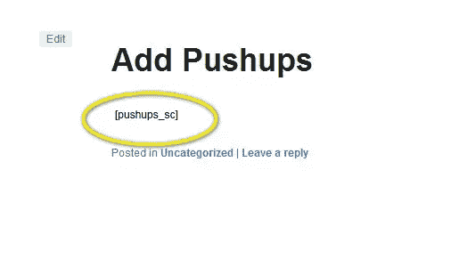
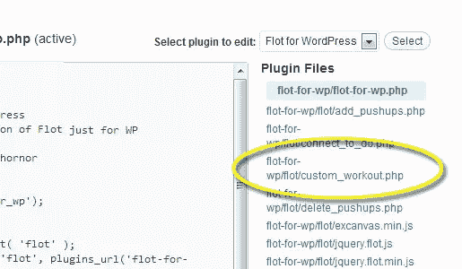
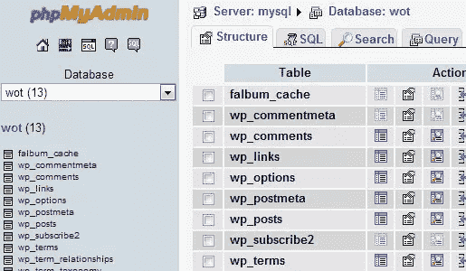
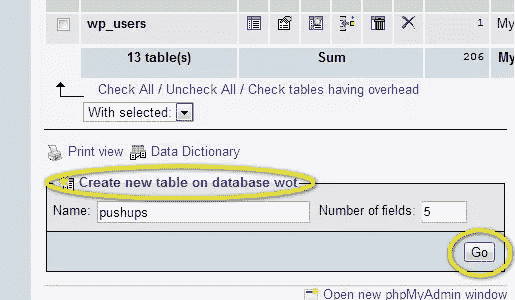
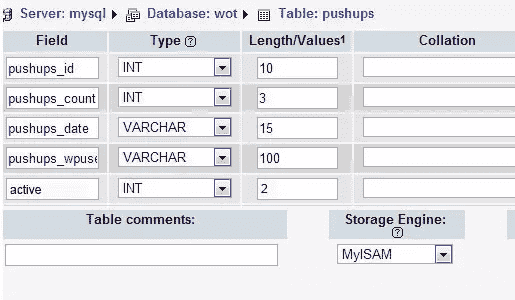
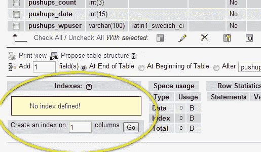
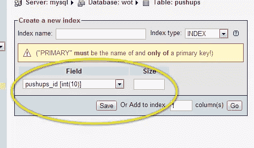

# 在 WordPress 中构建响应性的实时图表:功能和数据

> 原文：<https://www.sitepoint.com/build-responsive-real-time-graphs-in-wordpress-functions-and-data/>

在本系列的第一部分中，我们介绍了设置定制 WordPress 功能的基础知识。如果您跳过了前面的步骤，下面是这些步骤的快速回顾:

1.  我们为 WordPress 插件安装了 [Flot](http://wordpress.org/extend/plugins/flot-for-wp/)
2.  我们将 custom-workout.php 上传到插件文件夹
3.  我们通过使用 include()告诉 WordPress 在哪里可以找到 custom-workout.php 文件；呼叫

继续这一部分，我们将分三节讲述这些步骤:

1.  创建带有占位符短代码的空白帖子
2.  告诉 WordPress 你的短代码
3.  创建用于收集数据的数据库表

对于你们中的一些人来说，这将是一个非常具有挑战性的教程——数据库表通常是新手害怕和厌恶的一个重要方面。但是，别担心。我将带你了解如何为这些数据创建一个新的表格，这样你就不必担心破坏你当前的 WordPress 站点。话虽如此，让我们开始吧！

### 步骤 1:创建空白帖子

现在，这个过程中最简单的步骤之一！转到你的“帖子”>“添加新的”，然后创建一个名为“俯卧撑”或任何你喜欢的帖子。在正文中，仅添加以下代码:

```
[pushups_sc] 
```

您刚刚在帖子中添加了一个短代码，我们稍后将调用并定义它。当您点击“发布”并查看帖子时，它会将这个短代码显示为确切的文本“[pushoups _ sc]”。那是可以预料的。



这看起来没什么，但这是一个很大的进步，如果他们从未使用过短代码，这将会让很多人感到不舒服。现在，我们将为短代码创建功能，这样它实际上会做一些事情。

### 步骤 2:创建一个函数和短代码

这一步更像是积累经验，但如果您以后需要排除故障，这一步很重要。在“插件”>“编辑器”区域打开空白 custom-workout.php 文件。我们将创建我们的第一个函数并注册一个短代码，这样你就可以看到这个过程是如何工作的。



打开空白的 custom-workout.php 文件，粘贴以下代码:

```
 <?php
function pushups (){
echo ‘<h1>Pushups</h1>’;
};
add_shortcode( ‘pushups_sc’, ‘pushups’ );
?> 
```

保存它(或者上传到你的 WP-content/plugins/flot-for-WP/flot 文件夹，替换我们之前添加的空白文件)。现在，去刷新我们创建的“添加俯卧撑”帖子。你会看到“[pushops _ sc]”已经被替换为我们放入函数中的

# pushops

代码！

如果它仍然只显示[pushoups _ sc]短代码，那么您需要检查您的代码和文件路径。你可能还需要在你的 WordPress 仪表盘的“设置”下禁用你的 WP 缓存。最后，您可能需要对页面进行 Shift +刷新。

让我向您介绍一下我们刚刚完成的任务:

1.  我们创造了一个叫做俯卧撑的功能。
2.  然后，我们添加了一些代码来执行这个函数，即在标题标签中打印出“**俯卧撑**”。
3.  关闭这个功能后，我们告诉 WordPress 我们创建了一个短代码。第一个属性是短代码的名称，后面是它调用的函数。

### 步骤 3:在你的 WordPress 数据库中创建一个俯卧撑表格

登录 phpMyAdmin，您将看到一个如下所示的屏幕:



在左边，我们有一个标准 WordPress 安装中的表格列表。在右边，我们有各种管理工具。我正在使用一个名为 WOT 的数据库——代表锻炼追踪。您的数据库名称可能会有所不同。

现在，我希望您向下滚动到屏幕底部的“创建新表…”字段。对于名称，请使用“俯卧撑”，对于字段数，请使用 5，然后按“Go”



现在我们准备告诉您的数据库预期的数据类型。使用以下名称、类型、长度/值和额外设置来设置五行数据:

| 田 | 类型 | 长度/值 | 额外的 | 默认 |
| 俯卧撑 _id | （同 Internationalorganizations）国际组织 | Ten | 自动递增 | (留空) |
| 俯卧撑 _ 计数 | （同 Internationalorganizations）国际组织 | three | (留空) | (留空) |
| 俯卧撑 _ 日期 | 可变长字符串 | Fifteen | (留空) | (留空) |
| 俯卧撑 _wpuser | 可变长字符串 | One hundred | (留空) | (留空) |
| 活跃的 | （同 Internationalorganizations）国际组织 | Two | (留空) | one |

为了清楚起见，这里有一个设置的屏幕截图:



为了学习，我们退一步讲。以 pushups _ id 行为例，我们已经告诉数据库期望一个值最多为 10 个字符的数字(INT ),并自动递增每一行。这是我们记录的每个俯卧撑得分的唯一 id。pushups _ wpuser 将是登录 WordPress 站点的用户的用户名——所以你的用户必须注册你的站点才能使用它，但这是一件好事！

您可以在这里存储一些其他独特的字段，例如电子邮件地址。那也可以。但是，在本教程中，我想教你如何使用一些更高级的功能，而不仅仅是简单地在表单字段中添加电子邮件。

点击“保存”添加这些字段，您就差不多完成了这个阶段。

你可能会注意到，在页面的底部有一个红色的小方框，里面有一些红色的警告文字。单击此区域中的“Go”按钮，因为我们需要快速定义一个索引。



在“字段”下拉列表中，选择 pushups _ id 选项，并将大小留空。点击“保存”,您就可以开始添加数据了！



(*快速提示:*我知道有经验的数据库人员会因为我没有仔细检查最佳实践的详细列表而对我大吼大叫。事实上，他们是对的，但是本文的目标是让您走出舒适区，进入开发陷阱。如果我把太多的信息放入一个指令集，初学者会不知所措。)

因此，我决定保持这个数据库设置简单明了。随着您对如何设置表和其他数据库问题了解得越来越多，您将会学到更多关于数据库设计和维护的细节。但是现在，让我们来看看更有趣的东西，比如使用表单向这些新表添加数据。

### 概述

哇！我们在这里走了很长一段路。在短代码和数据库表格之间，你在 WordPress 中做了一些真正高级的东西。你已经完成了一些最艰难的工作。剩下的只是构建我们的功能。

在下一部分中，我们将创建一种方法，通过赋予我们的短代码一些功能来开始将数据加载到我们的数据库中。您将使用新的数据库表，所以现在还不要关闭 phpMyAdmin。

坚持住！你越来越接近了！

## 分享这篇文章