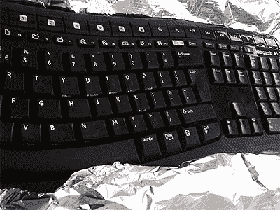

# 微脉冲:互联网安全的新威胁？

> 原文：<https://www.sitepoint.com/micropulses-internet-security-threat/>

英国斯肯索普大学最近的研究发现了一个问题，这个问题可能会危及我们网上购物和银行业务所依赖的安全性。计算机研究和高级协议部已经展示了身份信息覆盖技术。该技术分析你的活动而不是数据包来揭示密码，访问过的网站和其他敏感的个人信息。

项目负责人朱佩教授解释道:

现代设备拥有持久的互联网连接。即使您没有主动使用设备，它也会获取信息、检查软件更新或处理其他进程，从而产生稳定的数据传输流。二进制被转换成电子信号，通过网络传输。

二进制数据通常表示为干净的电压尖峰。实际上，信号会受到电磁干扰的影响，这种干扰会导致微小的波动，称为“微脉冲”。虽然微脉冲很少会导致数据丢失，但它们会穿过有线和无线通信层。当通过光纤桥传输时，它们甚至会导致微小的延迟和突发。

微脉冲最大的原因是用户；当使用输入设备(如键盘)时，人体充当一个传输器。本质上，你连接的数据流变成了可以分析的微脉冲信息的载波。不管您的连接使用 HTTP 还是 HTTPS，实际数据都可以忽略，但您的活动会暴露出来。

技术正在不断完善，微脉冲分析的成功率每年都呈指数级增长。如果你离目标很近，比如在同一个 wifi 连接上，这种技术会更有效。然而，研究小组已经成功地尝试了数百英里的分析，随着微脉冲检测的改进，地理位置不太可能成为限制因素。

## 微脉冲保护

微脉冲分析技术是实验性的，但威胁是真实的。幸运的是，有许多低技术含量的解决方案可以显著降低身份侵犯的风险。

**1。使用屏幕键盘**
触摸屏和屏幕键盘并不能完全免疫，但微脉冲分析却变得困难得多。朱佩教授建议在输入密码等敏感信息时，在屏幕键盘和真实键盘之间切换。

 ** 2。保护你的输入设备**
用铝箔包裹键盘等设备——有光泽的一面朝内，以反射脉冲。如果你使用笔记本电脑，在以太网电缆周围使用一小块箔片，或者在 wifi 下，定期移动设备以修改微脉冲，使它们更难分析。

**3。减少电磁干扰**
由于你的身体传导微脉冲信息，设备屏蔽可能还不够。工作时戴上手套和橡胶靴可以减少这种影响。

即使您小心保护密码，您的帐户是否也遭到破坏？知道你在线活动或服务细节的人找过你吗？微脉冲可能是罪魁祸首吗？

## 分享这篇文章