# 在 Photoshop 中创建丰富多彩、生动活泼的复古文本效果

> 原文：<https://www.sitepoint.com/create-a-colorful-lively-retro-text-effect-in-photoshop/>

简单的字体不足以在你的信息中达到你想要的强度和区别。大多数设计师根据他们的设计量身定制字体，并带有强烈的内涵。文字效果很惊艳；你真的可以尝试各种风格和技巧，把任何无聊的东西变成艺术品。所以，今天我将向你展示如何在 Photoshop 中创建一个有趣的复古文字效果。我们将学习如何使用一些有趣的技巧来达到预期的效果。我们将使用不同的模式和混合选项。所以，让我们开始吧！

**最终结果:([下载完成的分层文件](https://www.sitepoint.com/wp-content/uploads/2013/03/Retro-Text.zip)。)** 

### 第一步

打开 Photoshop，新建一个宽 700 像素、高 500 像素的文件。

[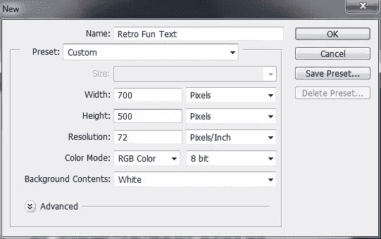](https://www.sitepoint.com/wp-content/uploads/2013/03/Step-114.jpg)

### 第二步

选择油漆桶工具，用颜色#ffe9c7 填充背景。

[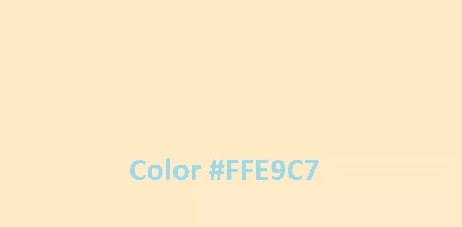](https://www.sitepoint.com/wp-content/uploads/2013/03/Step-24.jpg)

### 第三步

点击“图层”>“图层样式”，使用以下设置添加渐变叠加。

[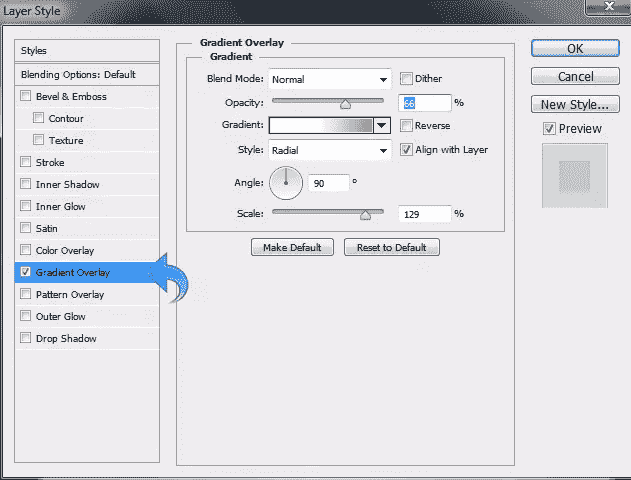](https://www.sitepoint.com/wp-content/uploads/2013/03/Step-32.jpg)

### 第四步

同样，点击“图层样式”来添加一个模式覆盖使用下面显示的设置。

[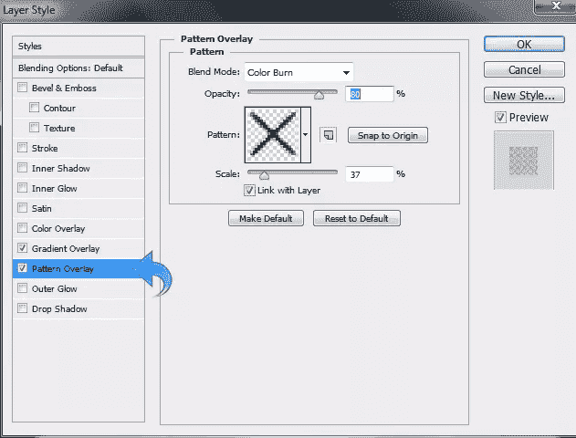](https://www.sitepoint.com/wp-content/uploads/2013/03/Step-42.jpg)

### 第五步

创建一个新层(“层”>“新建”>“层”)并选择钢笔工具创建一个条纹使用颜色#ff7f66。

[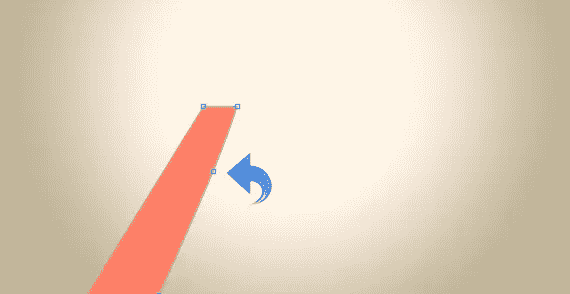](https://www.sitepoint.com/wp-content/uploads/2013/03/Step-52.jpg)

### 第六步

现在，点击“图层样式”添加一个图案和阴影。使用以下设置。

[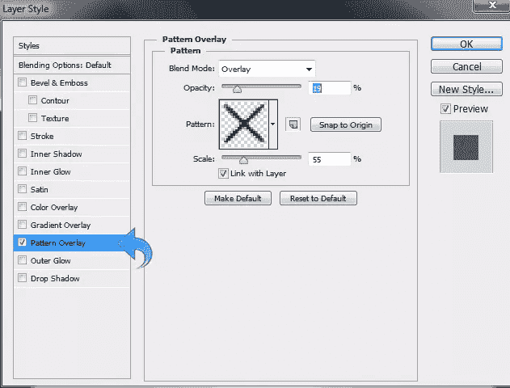](https://www.sitepoint.com/wp-content/uploads/2013/03/Step-6a.jpg)

### 第七步

现在，使用颜色#fff6e5 和#7ecefd 再创建两个条纹。

[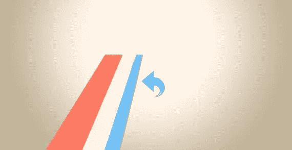](https://www.sitepoint.com/wp-content/uploads/2013/03/Step-73.jpg)

### 第八步

重复同样的过程，从顶部向下创建更多的条纹。

### 第九步

选择钢笔工具，使用颜色#fd6a6b 创建一个粗略的形状。您也可以使用硬圆衬套或椭圆工具来完成此操作。

[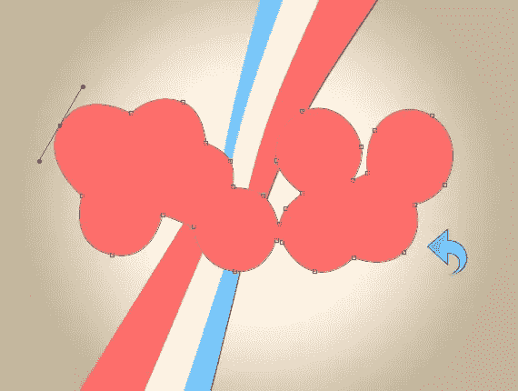](https://www.sitepoint.com/wp-content/uploads/2013/03/Step-92.jpg)

### 第十步

现在，点击“图层样式”并添加一些斜面和浮雕。

[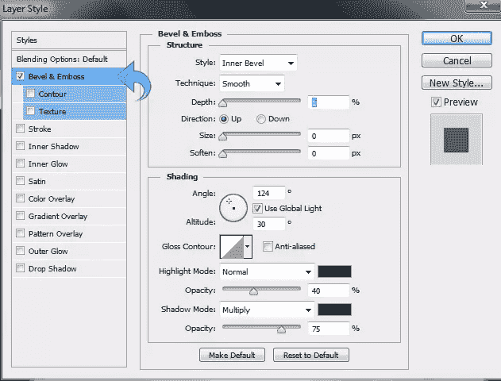](https://www.sitepoint.com/wp-content/uploads/2013/03/Step-102.jpg)

### 步骤 11

重复同样的过程，创建更多的圆圈，这一次使用颜色#fed891。

### 步骤 12

现在，点击“图层样式”给上面的圆圈添加一个图案和阴影。使用下列值。

[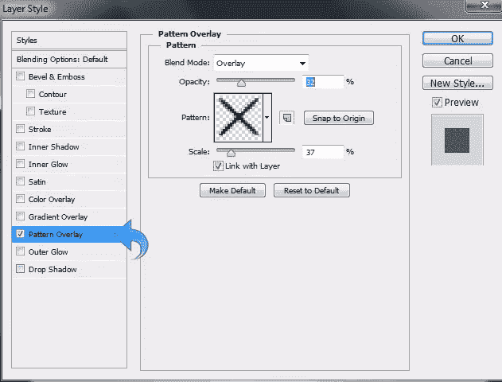](https://www.sitepoint.com/wp-content/uploads/2013/03/Step-122.jpg)

[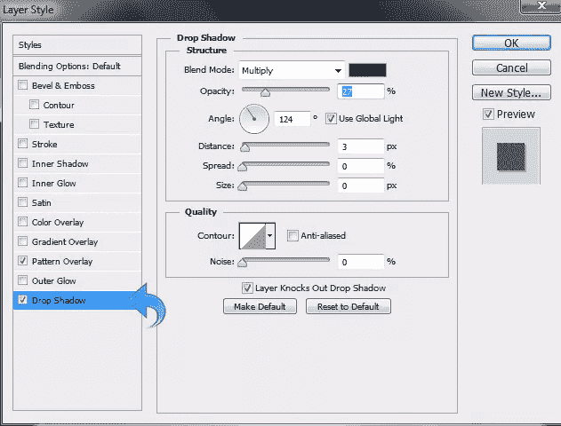](https://www.sitepoint.com/wp-content/uploads/2013/03/Step-12b.jpg)

### 第十三步

再次，创建更多的圆圈，这一次使用硬圆刷和颜色#a2ddff 和#fff6e5。现在，添加与上面相同的图层样式。

[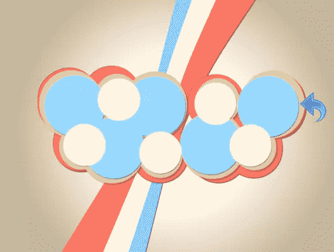](https://www.sitepoint.com/wp-content/uploads/2013/03/Step-132.jpg)

### 步骤 14

现在，让我们从文字开始，选择文字工具，使用颜色#ff7f66 添加一些文字。然后，点击“图层样式”,使用下面的设置添加一些阴影。

[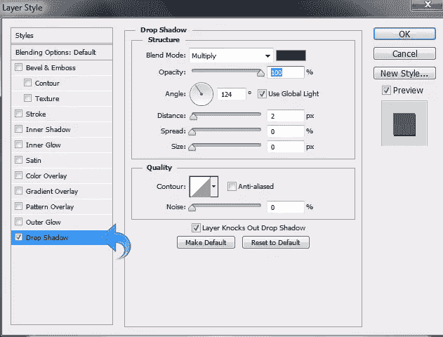](https://www.sitepoint.com/wp-content/uploads/2013/03/Step-142.jpg)

### 第十五步

复制上面的文字层(右键点击层，选择“复制层”)并将其向左移动一点。现在，将重复文本的颜色改为#7ecefd。

[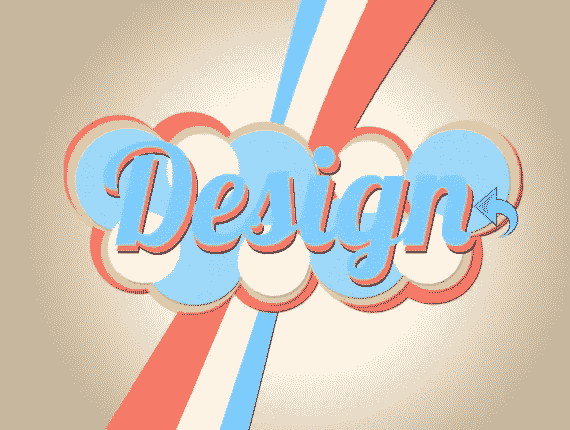](https://www.sitepoint.com/wp-content/uploads/2013/03/Step-151.jpg)

### 第十六步

现在，点击“图层样式”添加一个图案和阴影。使用下列值。

[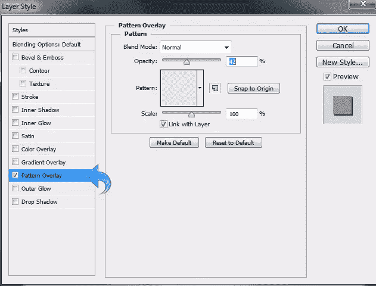](https://www.sitepoint.com/wp-content/uploads/2013/03/Step-16a.jpg)

[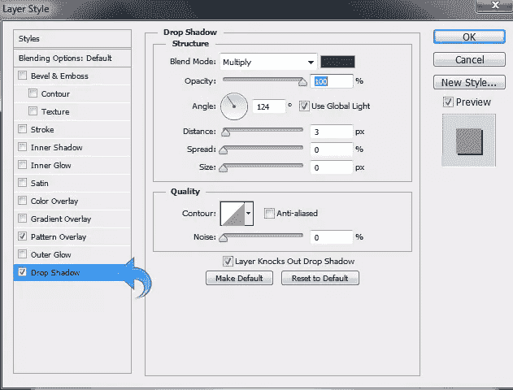](https://www.sitepoint.com/wp-content/uploads/2013/03/Step-16b.jpg)

### 步骤 17

再次，复制文本层，并将复制的颜色改为#f46a6a。现在，点击“图层样式”添加一个笔触，图案和阴影。

[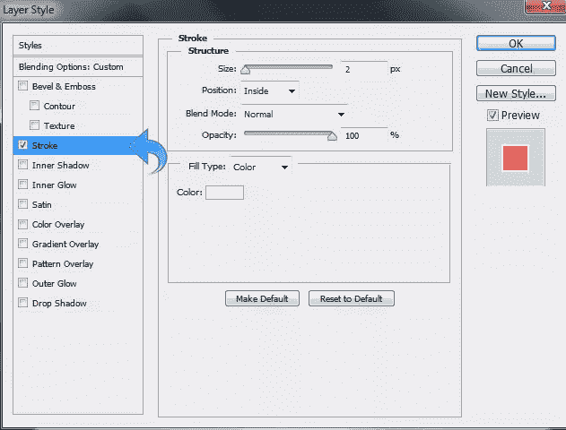](https://www.sitepoint.com/wp-content/uploads/2013/03/Step-17a1.jpg)

[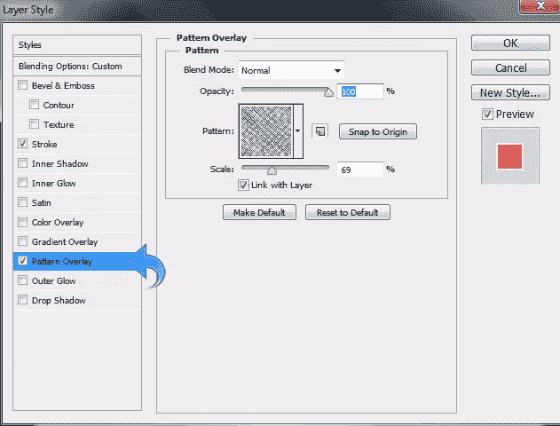](https://www.sitepoint.com/wp-content/uploads/2013/03/Step-17b1.jpg)

[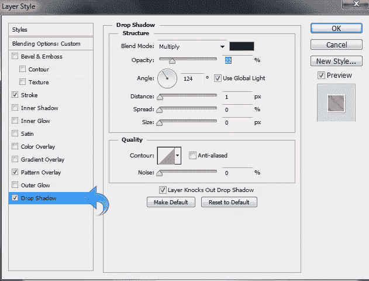](https://www.sitepoint.com/wp-content/uploads/2013/03/Step-17c.jpg)

就是这样！我希望你喜欢这个教程，并且学到了一些有趣的东西。我很快会带更多回来。保重！

## 分享这篇文章