# 设计一个吸引人的、有效的“即将推出”页面

> 原文：<https://www.sitepoint.com/design-an-appealing-and-effective-coming-soon-page/>

无论你是在做一个新网站还是重新设计一个旧网站，一个时尚的“即将推出”页面都是让你的忠实追随者了解信息的好方法。如果没有这样一个页面，访问者可能会认为你的网站已经损坏、瘫痪、未完成，甚至永远消失了。让人们知道你没有忽视你的网站，事实上，你投入了更多的时间和精力。设计一个包含你未来计划信息的临时页面(包括一个让你按计划进行的倒计时)是区分一个休眠的、不活跃的网站和一个有很多计划的非常活跃的网站的完美方法。

当然，如果你想让你的“即将发布”页面给你的访问者留下深刻的印象，那么你的设计必须是有思想的和吸引人的。所以，今天我们要创建一个吸引人的、有效的“即将推出”页面。在本教程中，我们将使用各种有趣的模式和混合选项来获得想要的结果。

在我们开始之前，让我们看看我们的最终设计。([下载完成的分层设计文件](https://www.sitepoint.com/wp-content/uploads/2013/02/coming-soon-design.zip)。)

[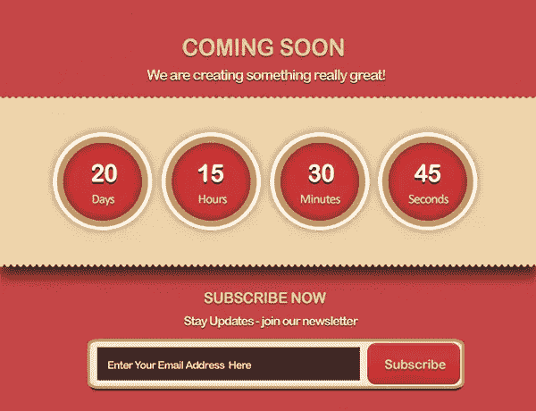](https://www.sitepoint.com/wp-content/uploads/2013/02/Final-result21.jpg)

### 第一步

打开 Photoshop，新建一个宽 750 像素、高 575 像素的文件。

[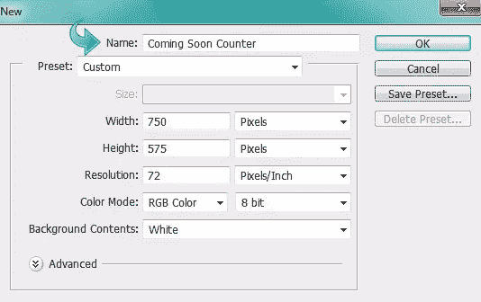](https://www.sitepoint.com/wp-content/uploads/2013/02/Step-110.jpg)

### 第二步

创建一个新层，使用油漆桶工具填充颜色#a61c1c。

### 第三步

点击“图层样式”>“图案叠加”，给背景图层添加一个图案

[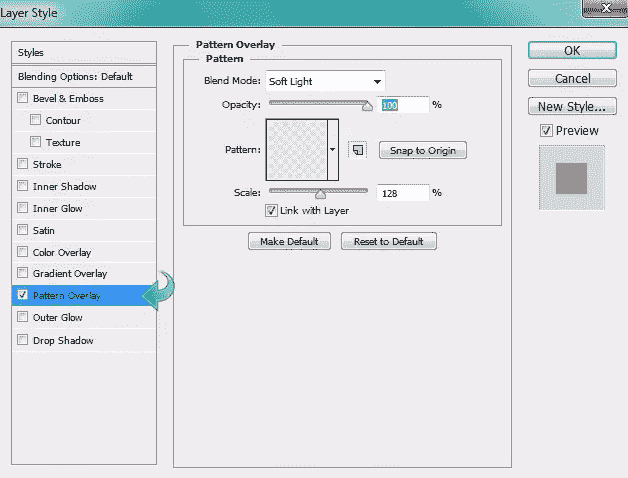](https://www.sitepoint.com/wp-content/uploads/2013/02/Step-33.jpg)

### 第四步

创建一个新层，并选择一个矩形区域使用矩形选框工具。用颜色#eed29b 填充。

[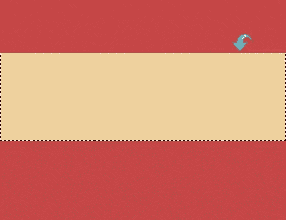](https://www.sitepoint.com/wp-content/uploads/2013/02/Step-43.jpg)

### 第五步

选择一个硬的圆形笔刷，使用下面的设置在笔刷面板中调整设置。然后，在上面的矩形上使用笔刷在边上创建一个图案。

[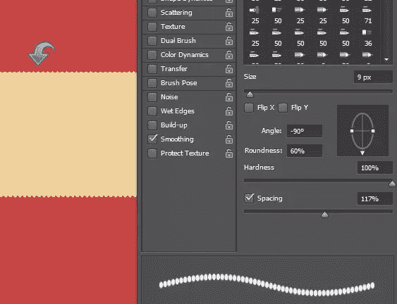](https://www.sitepoint.com/wp-content/uploads/2013/02/Step-53.jpg)

### 第六步

现在，点击“图层样式”,使用以下设置添加图案和阴影。

[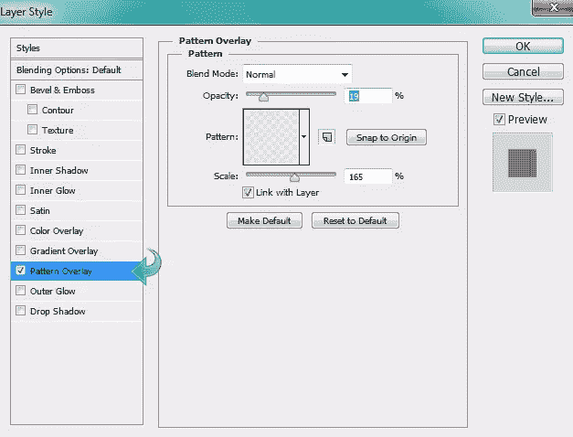](https://www.sitepoint.com/wp-content/uploads/2013/02/Step-6a.jpg)

[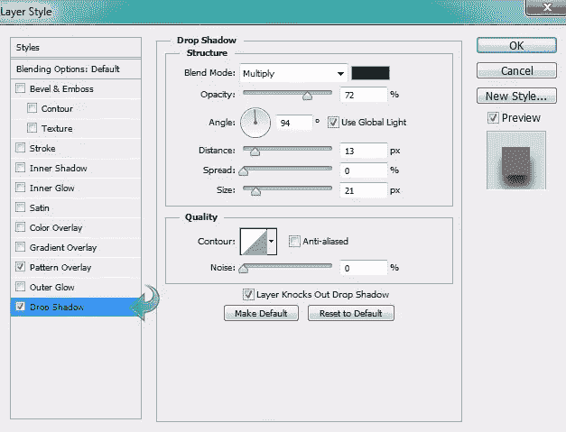](https://www.sitepoint.com/wp-content/uploads/2013/02/Step-6b.jpg)

### 第七步

选择文字工具添加所需的标题文本。然后，点击“图层样式”,用下面的值添加一个阴影。

[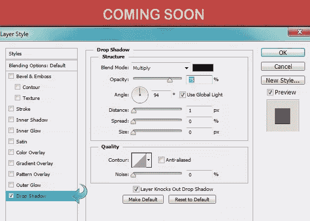](https://www.sitepoint.com/wp-content/uploads/2013/02/Step-72.jpg)

### 第八步

重复相同的过程，并添加一些额外的文本。

[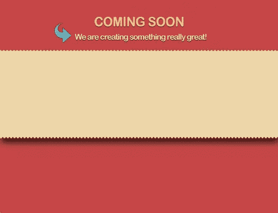](https://www.sitepoint.com/wp-content/uploads/2013/02/Step-821.jpg)

### 第九步

现在，让我们从倒计时开始。选择椭圆工具，使用颜色#d03737 创建一个小圆。

[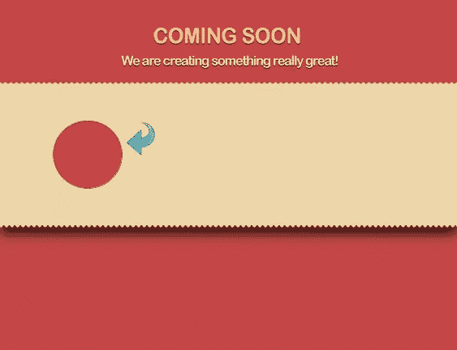](https://www.sitepoint.com/wp-content/uploads/2013/02/Step-921.jpg)

### 第十步

点击“图层样式”，给上面的圆圈添加一个描边和一个内阴影。使用下面的设置。

[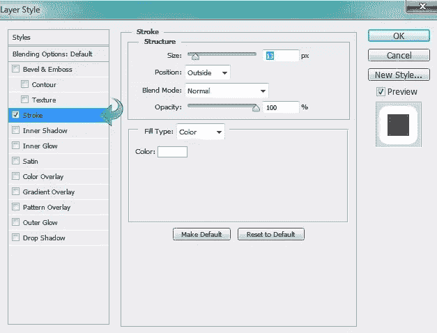](https://www.sitepoint.com/wp-content/uploads/2013/02/Step-10a1.jpg)

[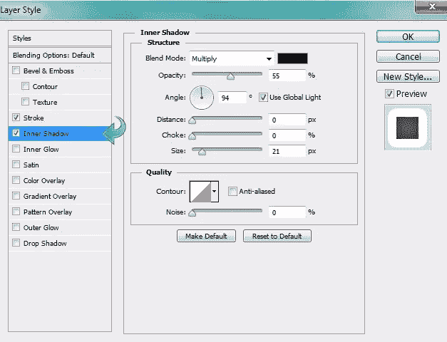](https://www.sitepoint.com/wp-content/uploads/2013/02/Step-10b1.jpg)

### 步骤 11

选择 9px 大小的硬圆笔刷，设置前景色为#bf9f63。现在，点击椭圆工具，改变工具模式为“路径”然后创建一个小圆，右击它，选择“笔画路径。”

### 步骤 12

现在，点击“图层样式”,用下面的值给圆形添加阴影。

[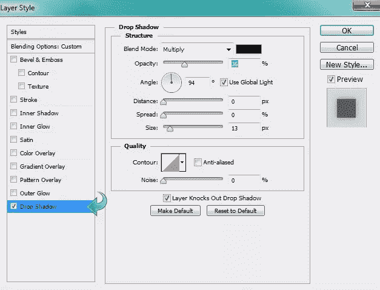](https://www.sitepoint.com/wp-content/uploads/2013/02/Step-123.jpg)

### 第十三步

选择文字工具，使用颜色#ffffff 和#f7cf83 添加倒计时文本。然后，点击“图层样式”,给文本添加阴影。

[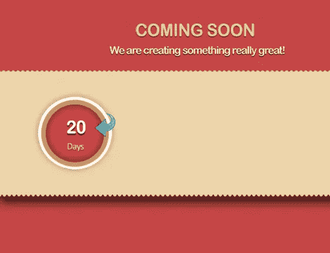](https://www.sitepoint.com/wp-content/uploads/2013/02/Step-1321.jpg)

### 步骤 14

重复相同的过程，完成其他三个计数器。根据需要更改下一个。

### 第十五步

现在，让我们转到“即将推出”页面设计的订阅部分。首先，选择文字工具，使用与标题相同的方法添加一些文本。

### 第十六步

现在，选择圆角矩形工具，使用#f2e6ce 颜色创建一个矩形。

### 步骤 17

使用以下设置为新矩形添加一个描边和阴影。

[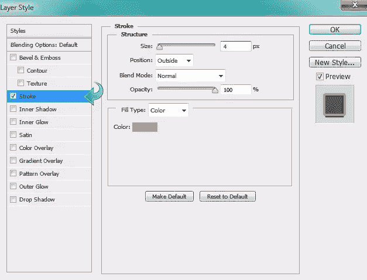](https://www.sitepoint.com/wp-content/uploads/2013/02/Step-17a.jpg)

[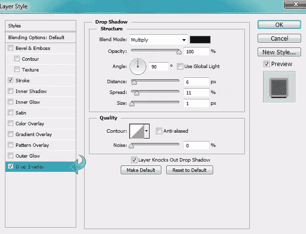](https://www.sitepoint.com/wp-content/uploads/2013/02/Step-17b.jpg)

### 步骤 18

对于电子邮件字段，选择矩形工具使用颜色#36302e 创建一个矩形。然后，使用以下设置添加笔划。

[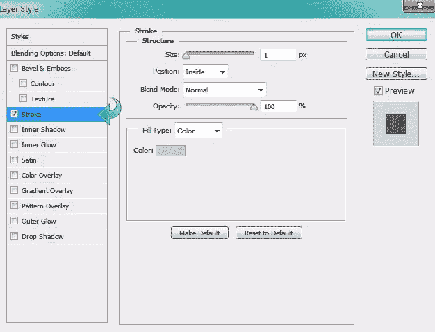](https://www.sitepoint.com/wp-content/uploads/2013/02/Step-182.jpg)

### 步骤 19

对于按钮，选择圆角矩形工具，使用颜色#d03737 创建一个小矩形。现在，点击“图层样式”添加斜面&浮雕和渐变。使用下面的设置。

[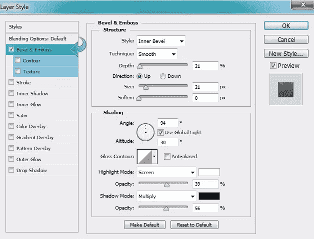](https://www.sitepoint.com/wp-content/uploads/2013/02/Step-19a.jpg)

[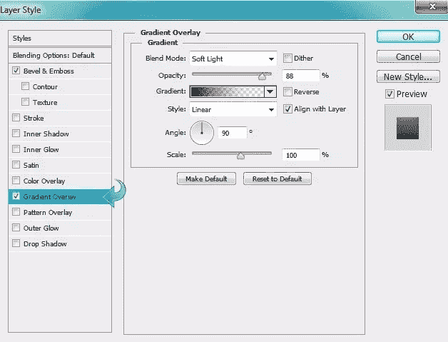](https://www.sitepoint.com/wp-content/uploads/2013/02/Step-19b.jpg)

### 步骤 20

选择文字工具，将您想要的文本添加到我们的表单域和提交按钮。

我们的“即将推出”页面设计已经就绪。我希望你们都喜欢这个教程。让我们知道你的想法！

## 分享这篇文章