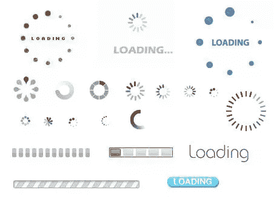

# 仅使用 CSS3 创建“加载”动画

> 原文：<https://www.sitepoint.com/creating-loading-animations-using-only-css3/>

如果你在网上花了很多时间，你肯定会看到一些小动画，显示网页、图片或其他网页元素正在被加载或处理。你可以很容易地在很多情况下遇到这些，比如贝宝交易、脸书导航、登录、表单提交和更多的网络环境。

这些动画不仅好看，而且给人一种后端复杂处理的感觉。更重要的是，这些动画告诉用户“轮子在转动”，他们的请求正在被处理。没有它们，用户经常被蒙在鼓里，不知道是否真的发生了什么。

大多数情况下，使用的图像是 GIF 文件，它会持续运行，直到另一个事件发生。一般来说，创建加载图形图像需要对 Photoshop、CorelDraw 或类似的照片编辑软件有很好的了解，这可能涉及复杂的程序和调整。GIF 图像也可能很大，在前端加载需要时间。


*加载 gif 的例子*

对于这种笨重的图形图像，最好的替代方法是使用 CSS3 方法来替换它们。仅使用像`span`这样的基本 HTML 元素和像 3D transform 这样的 CSS3 属性，你就可以创建漂亮且非常轻便的动画。

与 GIF 图像相比，使用 CSS 技术的一个主要优势是它们不需要花费太多时间来加载。它们要快得多，并且在我们需要的时候随时可用。

*注意:如果你不熟悉 CSS3 的变换属性，那么我强烈推荐你阅读“* [*高级 CSS3 2D 和 3D 变换技术*](https://www.sitepoint.com/advanced-css3-2d-and-3d-transform-techniques/) *”，我在其中谈到了这个主题。*

在这篇文章中，我将向你展示如何只用 CSS3 和 HTML 创建漂亮的加载动画。

让我们首先从设计使用 HTML 加载动画的结构开始。

## 结构使用 HTML

我们将创建一个分类为`loadingdiv`的容器 div，然后插入五个 span 元素。遵循以下示例:

```
<div class="loadingdiv">

            <span></span>

            <span></span>

            <span></span>

            <span></span>

            <span></span>

</div>
```

我将要创建的加载动画将由五个圆圈组成，如下图所示:


上面 HTML 中的每个 span 都将被设计成圆圈的形式，每个都有不同的颜色，但共享相同的 CSS 属性，我们很快就会看到。

## 基本的 CSS

```
.loadingdiv span{

   display: inline-block;

    vertical-align: middle;

    width: 10px;

    height: 10px;

    margin: 50px auto;

    background: #174C4F;

    border-radius: 5px;

    -webkit-animation: loading 0.9s infinite alternate;

    -moz-animation: loading 0.9s infinite alternate;

    box-shadow:1px 1px 1px #444444;

}
```

我们已经将 span 的 display 属性设置为`inline-block`,这样每个圆圈就正好浮动在前一个 span 的旁边。

现在，你可能会想，“他为什么不干脆`float:left`？”

主要原因是，当我们以连续的方式改变每个跨度的高度时，它们会变得无序，并使动画看起来错误。使用 inline-block 可以防止前一个 span 的高度降低时，span 元素相互重叠。

我们还将`vertical-align`属性设置为`middle`，这样当圆的形状改变时，它会保持在垂直线的中间。当我们将 CSS3 转换应用到上面的跨度时，这一点会更清楚。

我们还将名为`loading`的动画绑定到了 span 元素。我们将很快使用关键帧定义`loading`动画。为了安全起见，我们使用了供应商定义的动画，预计它可以在几乎所有现代浏览器上工作。

现在，如果你打开浏览器查看网页，你会看到五个颜色相同的静态圆圈。

我们的下一个目标是改变每个圆圈的颜色。

让我们来看看怎么做:

```
.loadingdiv span:nth-of-type(2) {

    background: #207178;

    -webkit-animation-delay: 0.2s;

    -moz-animation-delay: 0.2s;

}

.loadingdiv span:nth-of-type(3) {

    background: #FF9666;

    -webkit-animation-delay: 0.4s;

    -moz-animation-delay: 0.4s;

}

.loadingdiv span:nth-of-type(4) {

    background: #FFE184;

    -webkit-animation-delay: 0.6s;

    -moz-animation-delay: 0.6s;

}

.loadingdiv span:nth-of-type(5) {

    background: #F5E9BE;

    -webkit-animation-delay: 0.8s;

    -moz-animation-delay: 0.8s;

}
```

我们已经使用了`nth-of-type`伪类来设置每个相邻圆的颜色。您可以看到，我还在动画属性中为每个跨度提供了 0.2s 的延迟。这允许量程在前一个量程生效 0.2 秒后采取行动。这样，跨度将以连续的方式显示动画。

现在让我们使用 CSS3 变换和关键帧来定义动画。开始了。

```
@-webkit-keyframes loading {

  0% {

    width: 10px;

    height: 10px;

    -webkit-transform: translateZ(0);

  }

  100% {

    width: 24px;

    height: 24px;

    -webkit-transform: translateZ(-21px);

  }

}

@-moz-keyframes loading {

  0% {

    width: 10px;

    height: 10px;

    -moz-transform: translateZ(0);

  }

  100% {

    width: 24px;

    height: 24px;

    -moz-transform: translateZ(-21px);

  }

}
```

如您所见，我们再次优先考虑供应商特定的关键帧定义。您必须在 0%时间和 100%时间(即完成时间)定义每个跨度的属性。

我们将圆的宽度和高度分别设置为 0%的 10px 和 100%的 24px。这样每个圈一个接一个的重复生长。

为了让它们看起来更时尚，我们使用了`translateZ`，它被设置为 0% 0px 和 100% 21px。这将给圆圈一个提升的效果，移出屏幕。


这里是演示链接。

现在让我们做一点实验！

1)尝试将变换属性从`transformZ`更改为`transformY`。你会得到一个不同的效果，因为圆圈会垂直移动。


2)从每个跨度中移除背景属性，并使它们共享相同的颜色。假设我们会选择`#888888`。同样在 0%变换时添加`opacity:0.1`，在 100%变换时添加 `opacity:1`。我们将得到如下所示的结果:


这样你就可以创建无限的独特和时尚的加载动画，而不必通过麻烦的 Photoshop 方法。

当然，你可以利用你的 CSS3 创造力来制作更多的装饰对象，而不仅仅是我出于解释目的使用的圆形。

我希望你喜欢这篇文章和这个小小的 CSS 技巧。如果您有任何疑问，请在下面的讨论区留言。

以为自己懂 CSS？在这里测试你的技能。

## 分享这篇文章