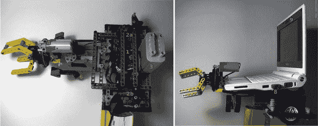

# Ruby + Arduino + LEGO = RuBot

> 原文：<https://www.sitepoint.com/ruby-arduino-lego-rubot/>

不久前，我度过了一个漫长的周末，并且有心情进行一些只是为了好玩的黑客活动。天气预报说会很糟糕，我记得我一直想造一个机器人。当然，几年前我已经建造了简单的直线跟随机器人之类的东西，但这次我的目标更高。我的想法是建造一个 Linux 控制的机器人，拥有一个红宝石大脑，能够为操作员提供实时视频流。至少这是我的第一个里程碑。一个人工智能模块和一个末日武器需要暂时搁置。

起初，我想为这项任务找一些乐高头脑风暴，但后来我很快想起了几件事:

1.  乐高头脑风暴仍然相当昂贵，即使他们是一个很酷的玩具。
2.  NXT 是用一种奇怪的 [LabView](http://en.wikipedia.org/wiki/LabVIEW) 风格的语言编写的。
3.  我有一个未使用的 Arduino 和几个乐高电动马达，还有一些普通的乐高技术。这应该能行。

## 五金器具

我做了每个理智的修补匠都会做的事情，从[阿达果](http://www.adafruit.com)订购了一个[电机驱动防护罩](http://www.adafruit.com/products/81)。这个漂亮的小盾牌的规格说服我只是把它作为一个成品和测试产品，而不是自己开始焊接 L293D 芯片。毕竟我大部分是软件开发人员，不是电子工程师。

在我等待送货的时候，我开始摆弄一些乐高积木来建造一个足够坚固的机箱，以便携带一台小型笔记本电脑和 Arduino。我用的是我那台值得信赖的旧笔记本电脑华硕 eee PC 701 T1，我把它放在身边主要是为了黑客目的，也是作为备用电脑。这个古怪的小家伙会坐在上面，做所有 CPU 方面的繁重工作:运行 Ruby，提供实时视频数据(640×480 像素)，WIFI 连接。尽管它的重量只有 922 克(约 2 磅)，尺寸为 225×165 毫米(约 8.86×6.5 英寸)，但用乐高建造一个足够坚固的东西来支撑它，而不看起来像一个巨大的积木，这不是一个简单的任务。优雅的编程与优雅的机械工程如此相似，这有点可笑。[【干】](http://en.wikipedia.org/wiki/Don%27t_repeat_yourself)或者[【YAGNI】](http://en.wikipedia.org/wiki/You_ain't_gonna_need_it)之类的基本原理都可以应用，还有“少即是多”的高级精髓。

为了变得活蹦乱跳，机器人的大脑将通过 USB 与 Arduino 对话，Arduino 将配备 Adafruits 电机驱动盾。连接到马达驱动器屏蔽将是乐高电源功能马达。



[大版](https://i.imgur.com/6ybvr.jpg)

1.  [Arduino](http://www.arduino.cc) 配备 [Adafruit 电机驱动罩](http://www.adafruit.com/products/81)。
2.  两个[乐高动力功能 M 电机](http://lego.wikia.com/wiki/8883_Power_Functions_M-Motor)驱动。
3.  稍作修改[乐高电源功能电池盒](http://lego.wikia.com/wiki/8881_Power_Functions_Battery_Box)连接到用作外部电源的电机驱动罩(仅来自 USB 端口的功率不足以驱动 9V 电机)。
4.  [乐高电动功能 M 电机](http://lego.wikia.com/wiki/8883_Power_Functions_M-Motor)用于转动手爪。
5.  [红色乐高微型马达](http://www.peeron.com/inv/parts/2986)用于打开和关闭手爪。
6.  脚轮可以 360 度旋转。
7.  修改后的 [LEGO Power Functions 电线](http://lego.wikia.com/wiki/8886_Power_Functions_Extension_Wire)连接到电机驱动器护罩，为电机提供连接器。
8.  Arduino 的 USB 连接。
9.  相机(640×480 像素，30 fps)。

完全不需要焊接。虽然我做了一点焊接，以创造一个更小，更细的 USB 电缆，以实现一个杂乱的外观。

## 软件

我知道我不需要一个花哨的前端，而且这个应用程序总的来说会很小，所以我决定使用 [Sinatra](http://www.sinatrarb.com) 作为基础框架，附带一小组 Gems 和库:

*   [辛纳特拉](http://www.sinatrarb.com/)
*   [Sinatra-Websocket](https://github.com/simulacre/sinatra-websocket)
*   [瘦网络服务器](http://code.macournoyer.com/thin/)
*   [红宝石串口](https://github.com/hparra/ruby-serialport)
*   [哈默尔](http://haml.info/)
*   [JQuery](http://jquery.com/)
*   [紫外线捕获](http://staticwave.ca/source/uvccapture)(已修改..继续阅读)

我一直在寻找一个很好的理由来玩 websockets，终于有机会使用它来减少机器人控制的延迟。我可以告诉你，在这种情况下，与 Ajax 调用相比，websocket 连接确实给了你额外的敏捷。所有的魔法都是由奇妙的 Sinatra-Websocket Gem 完成的，在 Sinatra 中你所要做的就是这样:

```
get '/' do
if request.websocket?
request.websocket do |ws|
ws.onopen do
ws.send("CONNECTED #{Time.now}")
settings.websockets << ws
end
ws.onmessage do |msg|
handle_commands(msg)
EM.next_tick { settings.websockets.each{|s| s.send(msg) } }
end
ws.onclose do
settings.websockets.delete(ws)
end
end
else
haml :index
end
end
```

这里，我们将 websocket 安装在“/”下，处理 websocket 请求和索引页面的普通 GET。三个回调函数`onopen`、`onmessage`和`onclose`用于处理所有与 websockets 相关的事件。

`handle_commands`方法接收 websocket 消息，在本例中是一个 JSON 字符串，并通过 Ruby-Serialport Gem 将有效命令代理给 Arduino。我写了一个很薄的包装器，使得注册几个电机并分别将它们与一个名称和端口(在电机驱动程序屏蔽上)相关联变得稍微容易一些。它还允许您为模型中的每个马达定义“向前”或“向后”的方向。

```
$arduino = Arduino.new
$motordriver = MotorDriver.new(
$arduino,
{ :left => Motor.new(2, $arduino, { :forward => Motor::BACKWARD, :backward => Motor::FORWARD }),
:right => Motor.new(1, $arduino, { :forward => Motor::BACKWARD, :backward => Motor::FORWARD }),
:gripper => Motor.new(3, $arduino, { :forward => Motor::FORWARD, :backward => Motor::BACKWARD }),
:rotator => Motor.new(4, $arduino, { :forward => Motor::FORWARD, :backward => Motor::BACKWARD }),
}
)

def handle_commands(params={})
params = (JSON.parse(params) unless params.class == Hash rescue {})
Thread.new{`espeak '#{params['speak'].tr(''','')}' 2< /dev/null`} if params['speak']
$motordriver.left(*params['left']) if params['left']
$motordriver.right(*params['right']) if params['right']
$motordriver.gripper(*params['gripper']) if params['gripper']
$motordriver.rotator(*params['rotator']) if params['rotator']
rescue
p $!
end
```

注意到利用 [eSpeak](http://espeak.sourceforge.net/) 的线路了吗？这是一个原始的实现，但令人难以置信的有趣的噱头，增加了机器人的语音输出！其他参数用于实际控制，由`$motordriver`处理。它只是将所有的电机命令翻译成 3 字节长的消息发送给 Arduino，符合我创建的非常简单的二进制协议。第一个字节定义电机(1-4)，第二个字节定义方向(向前= 1，向后= 2，制动= 3，释放= 4)，第三个字节定义速度(0-255)。完整的 Arduino 草图(一个*草图*是 Arduino-speak 中的一个程序)看起来像这样:

```
#include <AFMotor.h> // Adafruit Motor shield library

AF_DCMotor motors[] = {AF_DCMotor(1), AF_DCMotor(2), AF_DCMotor(3), AF_DCMotor(4)};
int i = 0;

void setup() {
Serial.begin(9600);
Serial.println("Motor test!n");
for(i=0;i<4;i++){ motors[i].run(RELEASE); }
}

void loop() {
uint8_t motor;
uint8_t direction;
uint8_t speed;
while (Serial.available() > 2) {
motor = Serial.read();
direction = Serial.read();
speed = Serial.read();
if(motor > 0 && motor < 5) {
if(direction < 1 || direction > 4){ direction = 4; }
motors[motor-1].setSpeed(speed);
motors[motor-1].run(direction);
}
}
}
```

对于视频连接，我想使用真正的音频/视频流和一些花哨的编解码器，如 [H.263](http://en.wikipedia.org/wiki/H.263) ，但在几次尝试后放弃了使用 [VLC](http://www.videolan.org/vlc/index.html) 、 [FFMPEG](http://ffmpeg.org/) 和 [MPlayer](http://www.mplayerhq.hu/design7/info.html) 作为流媒体。我只是不能让延迟低于 3-4 秒。我知道这听起来不多，但当你操作一个几乎立即执行你的命令但延迟传送图像的远程机器人时，[你会有一段糟糕的时间](http://knowyourmeme.com/memes/super-cool-ski-instructor)并经常撞到物体。我决定尝试简单的 [Motion JPEG streaming](http://en.wikipedia.org/wiki/Motion_JPEG) ，它基本上只是将 [JPEG](http://en.wikipedia.org/wiki/JPEG) 图像发送到浏览器，而不关闭连接。不知何故，尽管使用了更大的带宽，延迟缩减到半秒左右。我的理论是，华硕 EeePC 701 对于更好的编解码器来说有点太慢了。但是，如果你们中有人在 Red5 之外的“真正”低延迟流方面取得了成功(因为我并不寻求闪存解决方案)，请随时发表评论，为我指明正确的方向。

我处理 M-JPEG 流的代码有点混乱，但毕竟它是一个黑客；)

```
get '/mjpgstream' do
fps = (params['fps'] || 10).to_i
ms = (1000 / fps.to_f).to_i
headers('Cache-Control' => 'no-cache, private', 'Pragma' => 'no-cache',
'Content-type' => 'multipart/x-mixed-replace; boundary={{{NEXT}}}')
stream(:keep_open) do |out|
if !$mjpg_stream || $mjpg_stream.closed?
puts "starting mjpg stream with #{fps} fps. #{ms} ms between frames."
$mjpg_stream = IO.popen "./uvccapture/uvccapture -oSTDOUT -m -t#{ms} -DMJPG -x640 -y480 2> /dev/null"
end
settings.video_connections << out
out.callback {
settings.video_connections.delete(out)
if settings.video_connections.empty?
puts 'closing mjpg stream'
$mjpg_stream.close
end
}
buffer = ''
buffer << $mjpg_stream.read(1) while !buffer.end_with?("{{{NEXT}}}n")
while !$mjpg_stream.closed?
begin
out << $mjpg_stream.read(512)
rescue
end
end
end
end
```

基本上我修改/扩展了 Uvccapture 程序以…

*   …允许-o 选项使用“标准输出”
*   …对-t 选项使用毫秒而不是秒
*   …使用-D 选项指定分隔符，或者当-D 为“MJPEG”时使用`"nn--{{{NEXT}}}nnContent-type: image/jpegnn"`

并通过一个`IO.popen`调用利用它为我提供了一个易于处理的 M-JPEG 流，它可以通过 Sinatra 的内置流功能传输到浏览器(据我所知，需要瘦的 web 服务器)。Uvccapture 流被缓冲并重用，以防多个客户端请求资源，并且还可以根据需要打开和关闭。我知道这可能不是最优雅的解决方案，但在这种情况下，它对我来说足够好了。

机器人的 web 前端非常简单，以两个小 Haml 模板的形式存在于主文件中:

[haml]
@@布局
！！！5
% html {:lang =>' en ' }
% head
% meta {:charset =>' utf-8 ' }
% link {:rel =>'快捷图标'，:type= > 'image/gif '，:href =>' favicon . gif ' }
% title RuBot
% body {:style =>' background-color:black；文本对齐:居中；}
= yield(:layout)
% script {:src =>' jquery . js ' }
% script {:src =>' app . js ' }

@ @ index
% div
% img {:src =>'/mjpgstream ' }
% p {:style =>' color:# 555 ' }
帮助:
使用箭头键驱动，
q/w 打开/关闭夹持器
a/s 向左/右转动夹持器
慢速模式保持换档，
空格发言
[/haml]

所有的前端魔法都发生在“app.js”中，机器人控制被简单地映射到[键盘](https://www.sitepoint.com/best-mechanical-keyboards/)事件。事后看来这有点不幸，因为通过手机浏览器控制机器人变得更加困难，但我希望你能原谅我。在这几行 Haml 代码中值得注意的另一件事是第`%img{:src=>'/mjpgstream'}`行。这就是显示 M-JPEG 流的全部内容。content-type `multipart/x-mixed-replace; boundary={{{NEXT}}}`足以让浏览器知道该做什么，并自己处理图像标签中图像的替换。如果你问我，我会觉得很酷。

你可以在[这个库](https://github.com/RubySource/rubot)中找到包括修改后的 Uvccapture 版本在内的所有代码。

一如既往，我希望你喜欢这个小项目，如果是的话，请随时告诉你的朋友:)

## 分享这篇文章