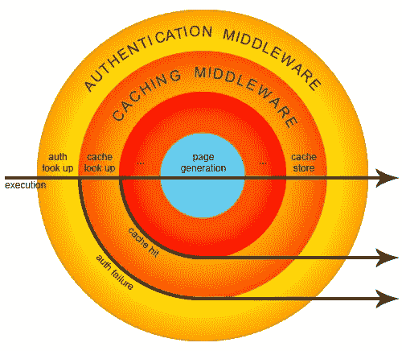

# 使用 Slim 中间件

> 原文：<https://www.sitepoint.com/working-with-slim-middleware/>

Slim 是一个微框架，它提供了路由功能，可以轻松创建小型 PHP 应用程序。但是一个有趣且强大的特性是它的中间件概念。Slim 实现了 Rack 协议，这是许多 Ruby 框架通用的流水线架构。因此，可以编写中间件来包装应用程序，并以链式方式访问和影响应用程序的环境以及请求和响应对象。

我发现中间件是在一个瘦应用程序中实现各种类似过滤器的服务的有力解决方案，比如认证和缓存。在本文中，我将解释中间件是如何工作的，并与您分享一个简单的缓存示例，该示例强调了如何实现您自己的定制中间件。

## 了解 Slim 中间件

[Slim 文档](http://docs.slimframework.com/pages/middleware-overview/ "Middleware - Slim Framework Documentation")将 Slim 应用程序比作洋葱，洋葱的每一层都是中间件。这是一个恰当的比喻。为了更好地理解它，让我们假设我们正在编写一个利用身份验证和缓存的应用程序。我们的架构可能如下图所示:



负责生成页面内容的代码被包装在几层中间件中，最重要的是身份验证逻辑和缓存逻辑。

执行流通过每一层，要么被允许流向下一层，要么被转移。首先，进行检查以确保用户通过了身份验证。如果没有，流程被中断，并返回一个 HTTP 401 状态。则进行检查以查看该内容的缓存副本是否可用。如果是，流程会中断，并返回页面的缓存副本。在流最终到达负责生成页面的逻辑之前，中间件的其他层可能会存在。

当我们的中间件方法返回时，执行流通过它们返回。例如，缓存中间件的其余逻辑将缓存页面的内容供以后查找。

## 实现中间件

为了了解如何实现定制中间件，让我们看看可以作为上面提到的缓存中间件的代码。

实现任何基本的瘦中间件组件的要求实际上是很少的。我们只需要写一个扩展 SlimMiddleware 并覆盖`call()`方法的类。中间件的入口点是这个`call()`方法，我们可以从它返回(从而中断执行流)或者调用下一层。

```
<?php
namespace MyMiddleware;

class Cache extends SlimMiddleware
{
    protected $db;

    public function __construct(PDO $db)
    {
        $this->db = $db;
    }

    public function call()
    {
        $key = $this->app->request()->getResourceUri();
        $rsp = $this->app->response();

        $data = $this->fetch($key);
        if ($data) {
            // cache hit... return the cached content
            $rsp["Content-Type"] = $data["content_type"];
            $rsp->body($data["body"]);
            return;
        }

        // cache miss... continue on to generate the page
        $this->next->call();

        if ($rsp->status() == 200) {
            // cache result for future look up
            $this->save($key, $rsp["Content-Type"], $rsp->body());
        }
    }

    protected function fetch($key)
    {
        $query = "SELECT content_type, body FROM cache
            WHERE key = " . $this->db->quote($key);
        $result = $this->db->query($query);
        $row = $result->fetch(PDO::FETCH_ASSOC);
        $result->closeCursor();
        return $row;
    }

    protected function save($key, $contentType, $body)
    {
        $query = sprintf("INSERT INTO cache (key, content_type, body)
            VALUES (%s, %s, %s)",
            $this->db->quote($key),
            $this->db->quote($contentType),
            $this->db->quote($body)
        );
        $this->db->query($query);
    }

}
```

`call()`方法首先检查内容在缓存中是否可用。如果是，它将设置响应的内容类型头和正文，然后返回，从而缩短管道。如果有缓存未命中，那么调用`$this->next->call()`来调用下一个中间件层。当流程从其他中间件调用返回到这一点时，将对请求状态进行快速检查，并缓存相关数据以备将来查询。

因为该类扩展了 Slim 的`Middleware`类，所以它可以通过`$this->app`访问 Slim 应用程序的实例，从而间接访问响应和请求对象。我们可以通过将响应视为一个数组来影响它的头部，并通过它的`body()`方法来影响响应的主体。

`fetch()`和`save()`方法是受保护的助手，它们简单地包装数据库查询来查找和保存内容。我在这里包括它们只是为了完成这个例子。它假设存在一个表`cache`，其中包含列`key`、`content_type`和`body`。根据您的需要，您的持久化机制可能会有所不同。此外，这里没有显示(为了简单起见)缓存过期，尽管自行合并它是微不足道的。

## 注册和配置中间件

注册中间件是用 Slim 的`add()`方法完成的。

```
<?php
require_once "../vendor/autoload.php";

$app = new SlimSlim();
$app->add(new MyMiddlewareCache($db));
```

当然，通过对`add()`的后续调用，可以注册多个中间件。因为新的中间件围绕着任何以前添加的中间件，这意味着它们必须以它们被调用的相反顺序添加。

```
<?php
$app = new SlimSlim();
$app->add(new MyMiddlewareCache($db));
$app->add(new MyMiddlewareAuth($db));
// ...
```

在上面的例子中，缓存中间件包装 Slim app，然后 Auth 中间件包装缓存。当调用`$app->run()`时，执行流程将类似于上图所示，首先进入认证中间件，然后一直到路由。

配置中间件通常通过服务的构造器来完成。在我们的示例中，我只是传递了一个活动的数据库连接，这样它就可以访问缓存表，但是您可以编写自己的类来接受任何您可能需要的信息，以定制它的行为。例如，组件可以被重写以接受一个公开了`fetch()`和`save()`方法的处理程序对象；这将允许我们删除示例方法(或者使用它们作为默认的后备)，最终用户开发人员将根据他们的需求提供功能，作为组件配置的一部分。

## 结论

我发现中间件是实现瘦应用程序各个方面的有力解决方案。在本文中，我解释了中间件架构是如何工作的，以及实现自己的中间件需要什么。有一个额外的小仓库，里面有一些基本的中间件例子，比如 CSRF 保护和 HTTP 认证。我在这里重构了这个例子，[提交了一个拉请求](https://github.com/codeguy/Slim-Extras/pull/63 "Basic Caching Middleware by tboronczyk - Pull Request #63 - codeguy/Slim-Extras")，所以如果你写了一个有用的中间件服务，为什么不考虑把它提交给项目，这样其他人也能受益呢？

<small>图片 via[Fotolia](http://us.fotolia.com/?utm_source=sitepoint&utm_medium=website_link&utm=campaign=sitepoint "Royalty Free Stock Photos at Fotolia.com")</small>

## 分享这篇文章