# 在 Photoshop 中设计产品包装原型

> 原文：<https://www.sitepoint.com/design-a-product-package-prototype-in-photoshop/>

当涉及到设计时，原型是必不可少的。多亏了 Blender、Photoshop 和许多其他软件，我们可以构建高度详细、易于编辑的设计概念，而不需要在构建有形模型时所涉及的成本和承诺。

原型化包装设计不仅允许您探索各种设计可能性，还允许您在设计过程的早期收集有意义的反馈。这是公司为其产品确定最佳品牌选择和设计的一种方式。如果你曾经想尝试包装设计，你很幸运。今天，我们将使用基本的工具和技巧在 Photoshop 中创建我们自己的食品包装设计。

## 构建容器

在大多数情况下，在创建包装或产品标签之前，会使用像 Cinema 4D 或 Blender 这样的软件来创建所需包装形状的线框和 3D 模型。我们将在 Photoshop 中创建自己的 3D 模型，而不是使用这些程序之一；这将让那些不熟悉 3D 软件的人也能跟上。

### 步骤 1:新建文件

像往常一样，你想从一个新的 PSD 文件开始。创建一个新的 a 画布，大小为 1000 像素乘以 700 像素，然后点击“确定”

[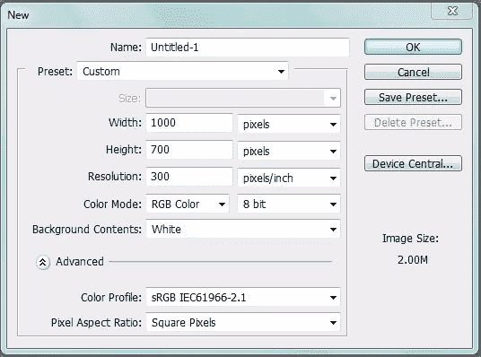](https://www.sitepoint.com/wp-content/uploads/2013/01/1.png)

### 第二步:背景

切换默认的前景和背景设置，使前景变为白色，背景变为黑色。选择径向渐变工具，并将其应用到一个新的层。不透明度降低到 25%。

### 第三步:正面和侧面

选择一种颜色，并创建一个高矩形。这将是我们包裹的正面。

[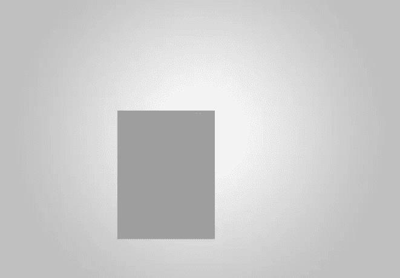](https://www.sitepoint.com/wp-content/uploads/2013/01/3.png)

复制前面，把你的新复制品拉到边上，按住 shift 键使它们对齐。把颜色调暗，这样你就能分辨出两个形状的不同。这将是我们包装的一面。

[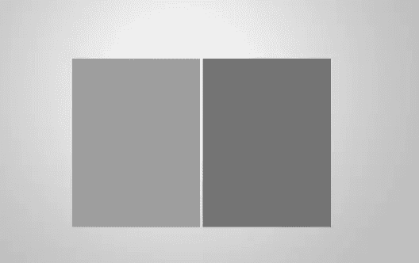](https://www.sitepoint.com/wp-content/uploads/2013/01/3-1.png)

### 扭曲

扭曲较暗的矩形来创建你的包的一面。确保包装正面的边缘与包装侧面的边缘相接触。

[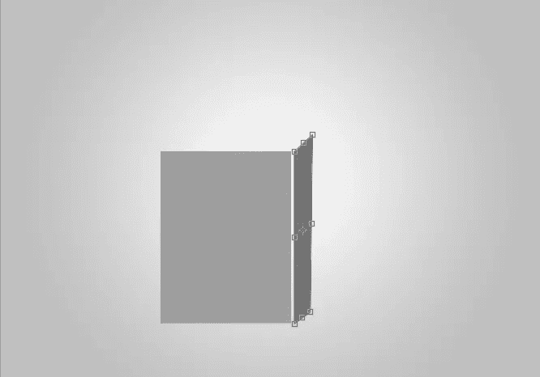](https://www.sitepoint.com/wp-content/uploads/2013/01/4.png)

### 第五步:顶部

制作一个高度为前面矩形四分之一的矩形。更改颜色并将其放在包装正面的上方。请注意，矩形与前面的宽度相同。这将是我们的包装顶部。

[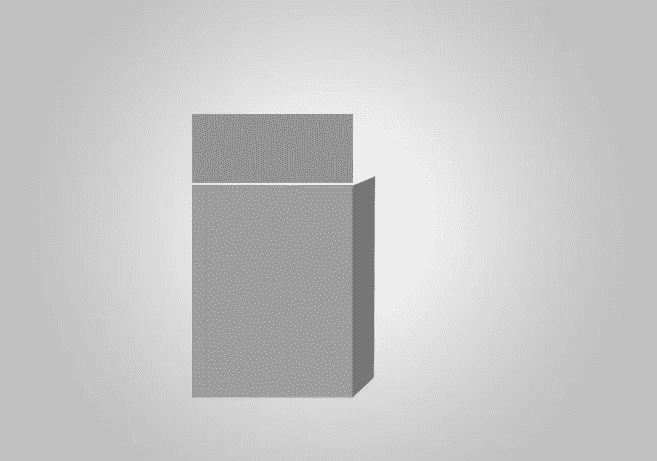](https://www.sitepoint.com/wp-content/uploads/2013/01/5.png)

### 第六步:复制

复制新创建的层，把它放在其他层的下面。加深颜色以示区别。请看下面的指导。

[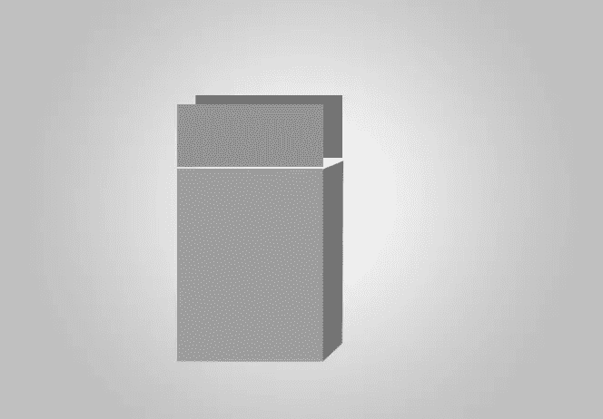](https://www.sitepoint.com/wp-content/uploads/2013/01/6.png)

### 扭曲顶部

要操作我们包装的顶部，您需要通过将顶部的角拉向彼此来扭曲它。

### 第八步:联系

将同样的技术应用到复制的图层上，将两个顶部放在一起，就好像你正在创建一个房子的屋顶一样。

[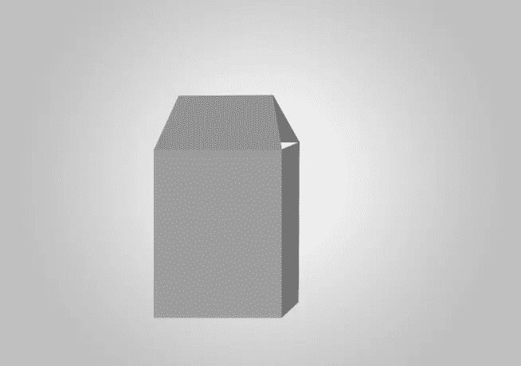](https://www.sitepoint.com/wp-content/uploads/2013/01/8.png)

### 第九步:迷你三角

你会注意到包装“屋顶”的两侧是开放的。创建一个不同颜色的小三角形来填充这个缺失的部分。

[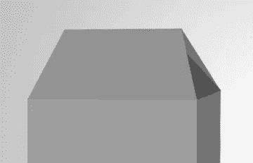](https://www.sitepoint.com/wp-content/uploads/2013/01/9.png)

## 设计包装

现在我们的容器已经完全构建好了，我们可以继续讨论包装器本身了。我建议您创建自己的包装设计，而不是创建与我完全相同的包装设计。这会让你养成创造性地构建原型的习惯。我将向你展示我是如何开始我的设计的。

### 第十步:给你的包装纸上色

用# 8bdadd 颜色，我创建了我的包装器模板。要做到这一点，你需要让包装纸的宽度与正面和侧面的宽度相等。换句话说，复制包裹的正面和侧面，并把它们并排放置。高度将保持不变。为了清楚起见，请看下面。

[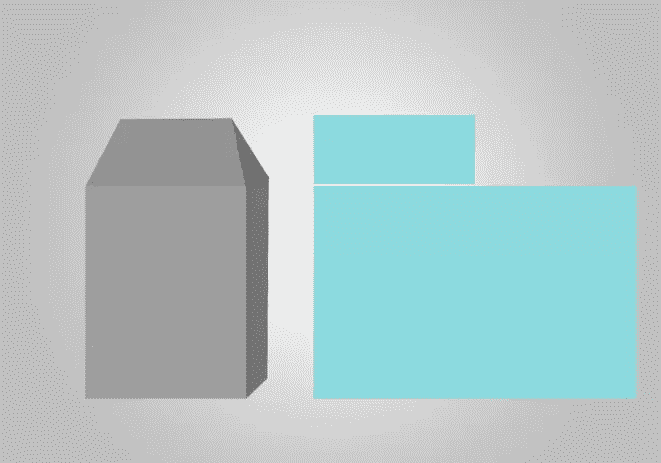](https://www.sitepoint.com/wp-content/uploads/2013/01/10.png)

### 步骤 11:应用逼真的渐变

继续之前，请确保您的前景是# 8bdadd，背景是#8c8c8c。打开“混合选项”面板，进入“渐变编辑器”，位于“渐变叠加”更改预设，使其反映您的前景和背景颜色。具体设置请看下文。

[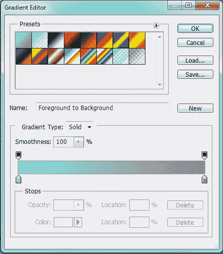](https://www.sitepoint.com/wp-content/uploads/2013/01/11.png)

对于正面和侧面，按如下所示更改设置。

[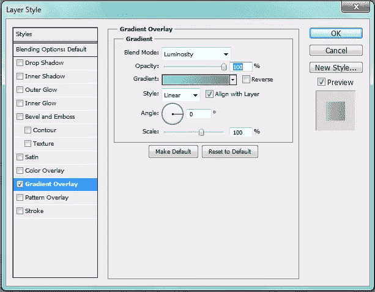](https://www.sitepoint.com/wp-content/uploads/2013/01/11-1.png)

对于顶部，更改如下图所示。

[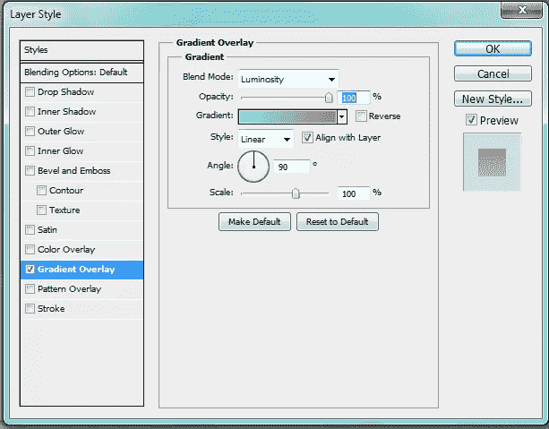](https://www.sitepoint.com/wp-content/uploads/2013/01/11-2.png)

[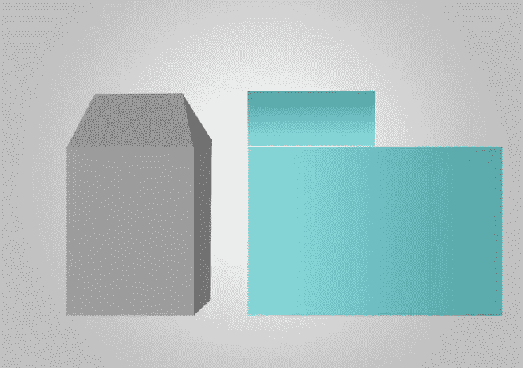](https://www.sitepoint.com/wp-content/uploads/2013/01/11-3.png)

### 第十二步:设计细节

使用圆形选框工具在包装纸的正面创建一个圆形。给这个新创建的圆添加一个 10 像素的纯白描边。

[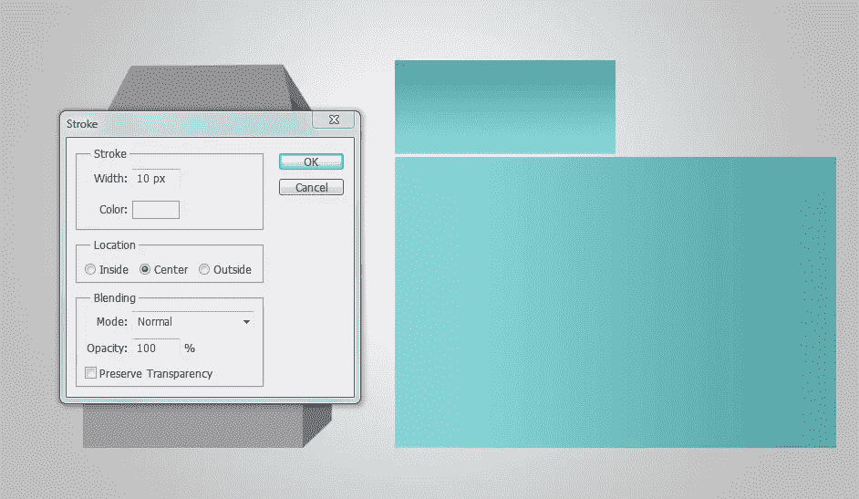](https://www.sitepoint.com/wp-content/uploads/2013/01/12.png)

添加一个细长的矩形横幅，如下所示。

[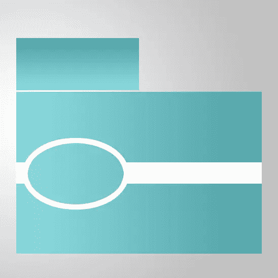](https://www.sitepoint.com/wp-content/uploads/2013/01/12-1.png)

### 第十三步:标志设计

发挥创意，在圈子内创造一个 logo 设计。我创造了一个简单的村庄轮廓。

[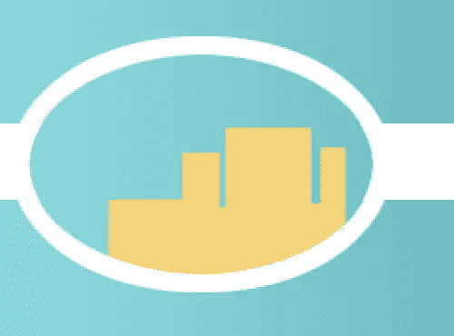](https://www.sitepoint.com/wp-content/uploads/2013/01/13.png)

[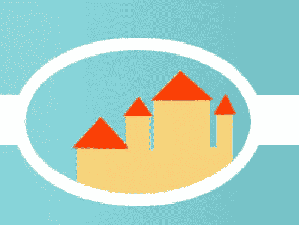](https://www.sitepoint.com/wp-content/uploads/2013/01/13-1.png)

[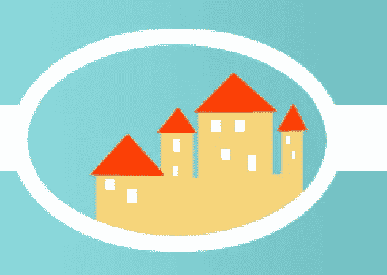](https://www.sitepoint.com/wp-content/uploads/2013/01/13-2.png)

### 步骤 14:完成你的包装设计

通过添加一些细节、效果和图形增强来完成包装设计。这是我设计的最终结果。

### 第十五步:组合容器和包装

选择将作为包装正面的包装纸区域。如果你不确定，只需选择你的容器模型的正面并复制它。把它放在你的包装纸上，你会看到你需要选择多少包装纸。

[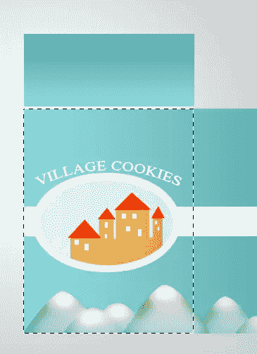](https://www.sitepoint.com/wp-content/uploads/2013/01/15.png)

拖动您的选择，并将其放置在所需的区域。为了清楚起见，请看下面。

[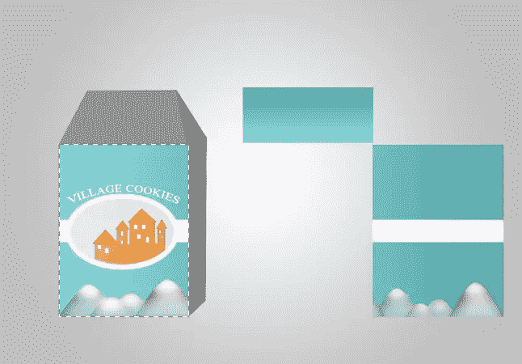](https://www.sitepoint.com/wp-content/uploads/2013/01/15-1.png)

将侧面包装设计移动到容器模型上，并使用“倾斜”变换工具来正确定位它。暂时降低包装的不透明度，以便在精确放置侧面设计时可以看到容器。

[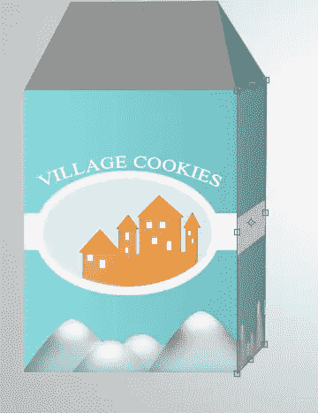](https://www.sitepoint.com/wp-content/uploads/2013/01/15-2.png)

继续把你的不同部分放到你的包模型上，直到你完成。请注意，一旦所有部件都就位，您就可以去掉包装。

[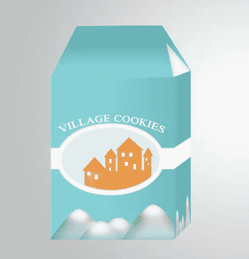](https://www.sitepoint.com/wp-content/uploads/2013/01/15-3.png)

**第十六步:添加包盖**

要为您的包裹添加翻盖，只需使用套索工具创建形状。

[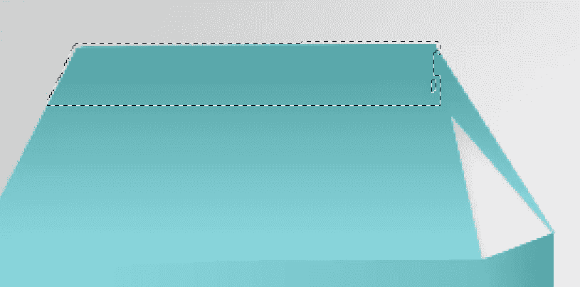](https://www.sitepoint.com/wp-content/uploads/2013/01/16.png)

填写这个包标签，并添加一些现实的阴影。

[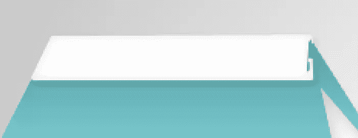](https://www.sitepoint.com/wp-content/uploads/2013/01/16-1.png)

### 第十七步:收尾

通过添加最终的设计增强来完成您的设计，例如阴影和包装设计的其他颜色变化。这是成品。

[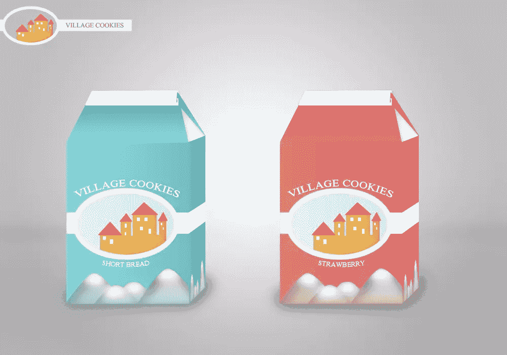](https://www.sitepoint.com/wp-content/uploads/2013/01/pkgdsn.jpg)

### 结论

包有各种不同的形状和大小，原型制作又快又容易，所以不要害怕试验和尝试非常不同的方法或设计。您可能会发现，您不需要创建 3D 容器模型或有形的原型来评估您的设计。当制作产品包装的原型时，不要忘记考虑颜色的变化，因为你可能会发现你更喜欢我们的颜色选择。

你有什么包装设计可以分享吗？你为过去的客户设计过产品包装吗？

## 分享这篇文章