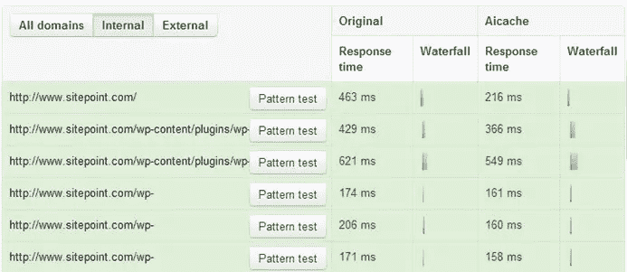
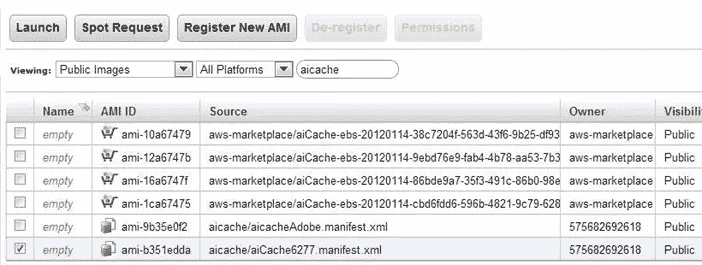
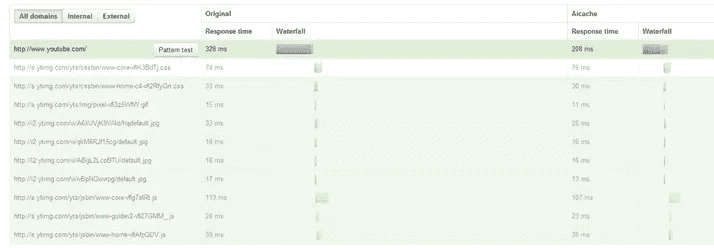

# 云中的优化:aiCache

> 原文：<https://www.sitepoint.com/optimization-in-the-cloud-aicache-2/>

有很多方法可以优化你的网站，让它运行得更快，并减少你的服务器负载。这通常需要对你的代码和数据库进行大量的调整，当你想加速一个动态的网站，比如一个电子商务网站时，这可能是一个相当大的挑战。

aiCache 为此提供了一条捷径，并承诺它可以在 10 分钟内将您的网站速度提高 10 倍。让我们看看这是不是真的。

## 什么是 aiCache？

顾名思义，aiCache 是为您的网站提供的缓存解决方案。你把它放在你自己的服务器前，通过你的 aiCache 服务器路由你的流量。

考虑到云的构建，您可以将其部署为 Amazon EC2 AMI 实例，这允许您在流量增加时进行扩展。

它允许你在不改变代码的情况下缓存一个动态站点。

它声称在 one(！)配置良好的服务器您可以提供高达 160 兆注册/小时的服务。aiCache 还为移动访问者优化了您的站点，并使您能够将其设置为 DDoS 防火墙。

## 它是如何工作的？

aiCache 充当一个代理，它将像任何客户端一样加载站点，然后在配置中指定的所有内容将被加载到实例的 RAM 中。这就是主要的页面负载改进的来源，这减轻了原始服务器的负担。

站点收到的每个请求都会从这个缓存中加载，当您更改内容时，这个缓存会更新(基于内容的 TTL)。它只会缓存你的网站本身的内容。外部加载的资源(例如跟踪脚本)仍将从其原始服务器加载。

您可以在负载平衡配置中使用 aiCache 来实现冗余。您还可以将 aiCache 实例用于您自己的全球分发网络，使用它们的合作伙伴 Dyn。您只需在每个需要的区域部署一个实例，并设置流量分配规则。通过这种方式，你基本上可以构建自己的智能 CDN，不仅可以用于静态文件，也可以用于动态页面。

## 加速 SitePoint.com

现在让我们来看看你能期待什么样的速度提升。aiCache 为此提供了一个很好的工具。以 SitePoint.com 为例，以下是目前的结果:

aiCache 服务器托管在:美国东–北弗吉尼亚和美国西–北加利福尼亚。原版在美国东部。

| 测试位置 | 原始网站 | 爱卡什美国东部 | % | 爱卡什美国西部 | % |
| 旧金山 | 4.861 秒 | 3.834 秒 | – 21% | 3.782 秒 | – 22% |
| 新加坡 | 8.85 秒 | 6.44 秒 | – 27% | 6.426 秒 | – 27% |
| 都柏林 | 5.958 秒 | 4.274 秒 | – 28% | 4.546 秒 | – 24% |
| 华盛顿哥伦比亚特区 | 4.589 秒 | 4.078 秒 | – 11% | 3.422 秒 | – 25% |

*注:aiCache 在这个测试中使用了亚马逊 AWS。加载时间由 Neustar 测量。*

正如您所看到的，即使在 aiCache 的标准设置上，也应该很容易实现 25%的加载时间改进。您可以进一步调整它来改善这些结果。除了减少加载时间，它也大大降低了你的服务器负载，这样你就可以降低你的托管费用。

由于这看起来很有希望，是时候为自己建立一个 aiCache，看看它是否真的那么容易。

## 设置 aiCache EC2 实例

在你做任何事情之前，你需要一个工作亚马逊 AWS 帐户。你可以从他们自己的网站上启动 aiCache，或者在 AWS Marketplace 上搜索。您必须首先订阅，之后您将从 EC2 仪表板部署 EC2 实例。

你确切需要填写的内容在他们的 Wiki 中有描述，但是你基本上必须做一个配置文件来指定你正在启动哪个站点。为了方便起见，你可以把它存放在亚马逊的 S3 里。完成后，您将前往 AWS 的 EC2 部门。

从左边的导航中，你可以打开 AMI 屏幕，在公共 AMI 中搜索 aiCache。

选择正确的 AMI 后，您就可以启动您的实例了。

在我的例子中，我使用了小实例。选择它之后，您必须通过 EC2 例程来配置您的实例。这也是你必须填写你在 S3 制作的配置文件的链接的部分。

然后启动，并等待实例变得活跃起来。你可以通过在浏览器中填写你的公共域名来检查它是否工作。如果假定的网站正在加载，你没事。

仅此而已。设置它只需几分钟。在启动实例后等待它变得活跃比配置它需要更长的时间。一旦你满意了，你只需要在你的 DNS 设置中改变你的 A 记录，你就设置好了。

## 试验结果

在部署我自己的实例之后，我再次对加载时间做了一些测试:

[Sitepoint.com](https://www.sitepoint.com)

| 测试位置 | 原始网站 | 爱卡什美国东部 | % | 爱卡什美国西部 | % |
| 旧金山 | 4.92 秒 | 4.71 秒 | – 4% | 4.72 秒 | – 4% |
| 新加坡 | 11.7 秒 | 7.65 秒 | – 35% | 8.08 秒 | – 31% |
| 都柏林 | 6.88 秒 | 8.03 秒 | + 17% | 7.68 秒 | + 12% |
| 华盛顿哥伦比亚特区 | 5.52 秒 | 4.06 秒 | – 26% | 3.49 秒 | – 37% |

*注意:所有测试都进行多次，以排除故障*

有一些有趣的发现:

*   优化站点和非优化站点在旧金山的加载时间是一样的。这在每次装载时都是一致的。
*   新加坡需要一个本地托管的实例才能真正受益:即使减少的幅度很大，加载时间仍然太高。
*   都柏林赢不了多少，这也需要一个本地实例。
*   华盛顿 DC 的结果是惊人的。aiCache 站点的性能是一致的，而原始站点在加载时会上下跳动。
*   最初的测试和我的测试是在不同的日期和时间进行的。

即使 Sitepoint.com 被很好的缓存，它仍然是一个很重的网站。它还加载了很多 aiCache 无法缓存的外部请求(大部分是广告)。但是至少对西海岸来说，还有足够的空间去改善。

这些只是原始数据:由于缓存，网站的大部分可视化加载只需几十毫秒。这意味着访问者会以极快的速度体验你的网站，因为大部分内容在完全加载之前就已经显示出来了。此外，还有降低服务器负载的好处，甚至只减少了 4%的加载时间(比如在旧金山)。这意味着削减一些前端服务器，从而降低你的账单。

现在来看看其他一些例子，看看 aiCache 在哪些方面受益最大。

WebtoolsReview.com:我自己的网站之一，目前正在开发中。仅使用来自 WordPress.org 的基本的 2011 主题，没有外部资源，只有样本内容。

| 测试位置 | 原始网站 | 爱卡什美国东部 | % | 爱卡什美国西部 | % |
| 旧金山 | 2.049 秒 | 0.806 秒 | – 61% | 0.968 秒 | – 53% |
| 新加坡 | 5.111 秒 | 2.226 秒 | – 56% | 2.285 秒 | – 55% |
| 都柏林 | 1.94 秒 | 0.854 秒 | – 56% | 1.239 秒 | – 36% |
| 华盛顿哥伦比亚特区 | 1.368 秒 | 0.754 秒 | – 45% | 0.779 秒 | – 43% |

正如你所看到的，最初的装载时间已经很慢了。缓存仍然可以节省大约 50%的加载时间。

让我们看看 AiCache 能为周围一些最大的(也是优化最好的)站点做些什么。

| 测试位置 | 原始网站 | 原始网站 | 爱卡什美国西部 | % |
| 旧金山 | [Google.com](http://www.google.com) | 1.52 秒 | 0.968 秒 | – 36% |
| 华盛顿哥伦比亚特区 | [Google.com](http://www.google.com) | 1.475 秒 | 0.798 秒 | – 46% |
| 旧金山 | [Youtube.com](http://www.youtube.com) | 2.565 秒 | 2.349 秒 | – 8% |
| 华盛顿哥伦比亚特区 | [Youtube.com](http://www.youtube.com) | 2.863 秒 | 2.072 秒 | – 28% |
| 旧金山 | [Yahoo.com](http://www.yahoo.com) | 3.349 秒 | 1.264 秒 | – 62% |
| 华盛顿哥伦比亚特区 | [Yahoo.com](http://www.yahoo.com) | 3.414 秒 | 0.896 秒 | – 74% |

在这次测试中，我只使用了美国服务器的结果。

正如你所看到的，即使是 Google.com，一个非常简单的网站，也可以从缓存中受益。另一方面，Youtube.com 不会受益这么多。正如你在下面的瀑布中看到的，他们的主页加载了大量的图片和小图片。js 文件，已经光速送达。

Yahoo.com 可以真正受益于爱车。这是一个资源密集型网站，无论你的 CDN 有多好，从内存中下载都会更快。

*Youtube 瀑布。*

## 定价

说实话，爱车是有代价的。

亚马逊目前正在部署一种新的开发者支付模式，但“最便宜”的选择是通过使用 aiCache 网站上的链接进行订购([订购 aiCache](http://aicache.com/cloud_amazon.html) )。他们希望保持简单的定价:aiCache 实例的成本是基本实例的两倍。对于一个小型实例来说，这可以归结为每小时 0.13 美元，而对于一个基本实例来说，您通常每小时要支付 0.065 美元。还有每月 15 美元的支持费用。运行一个实例每月花费 108.60 美元。

这看起来很多，但是为了达到收支平衡，这意味着取消两个小的(非 aiCache)实例，或者一个标准(不考虑每月的支持费用)。这是假设您运行三个或更多实例，因为您总是需要您的原始服务器。

## 结论

aiCache 看起来是个很棒的产品，如果你需要的话。它可能并不总是给你带来真正的速度提升，但是它确实减轻了服务器的负荷，这是一个额外的好处。

当您只运行一个服务器时，这是一个昂贵的解决方案，但当您有多个实例为您工作时，这可能是一个节省成本的方法。请记住，在这篇评论中，我只谈到了他们的缓存功能，但也有移动优化和 DDoS 保护。

我自己的经历证实了他们有一个非常棒的支持团队，他们在我的研究问题上给了我很多帮助。

如果你想知道你是否也能提高自己网站的速度，这里有一个工具可以帮你:[http://aicache.com/deploy](http://aicache.com/deploy)。

## 分享这篇文章