# 在 Photoshop 中设计一个自定义的脸书时间轴封面

> 原文：<https://www.sitepoint.com/design-a-custom-facebook-timeline-cover-in-photoshop/>

拥有超过 10 亿用户的脸书是目前最受欢迎的社交网站。除了其明显的个人用途，它还提供了大量的机会来促进你的业务。你可以接触到数百万的潜在客户，但也可能有数不清的竞争对手，所以如果你想赢得更多的业务，你需要脱颖而出。创建一个能抓住访问者注意力的品牌简介是展示创造力和技能的好方法，而脸书时间轴封面提供了一个很好的开始方式。

在本教程中，我将带你在 Photoshop 中设计一个有趣的脸书时间轴封面的过程。在这个过程中，你将通过几个简单的步骤学习如何制作华丽的木材纹理。您还将学习制作不同大小和尺寸的相框。所以，让我们开始吧！

**资源:**

彼得·贾沃罗夫斯基拍摄的图片

[指甲的图案](https://www.sitepoint.com/wp-content/uploads/2013/01/pattern-for-nails.zip)

**最终结果:([下载完成的，分层的 PSD 文件](https://www.dropbox.com/s/1ljnwip4c2pj6cd/Facebook%20Timeline%20Cover.zip)。)** 

### 第一步

在 Photoshop 中创建一个宽度为 851 像素、高度为 315 像素的新文档。

[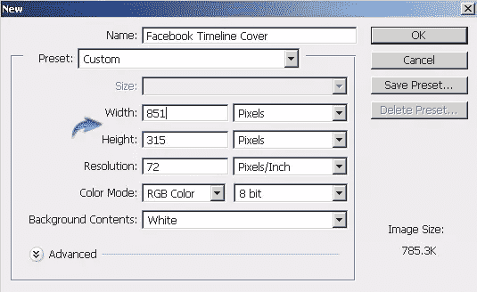](https://www.sitepoint.com/wp-content/uploads/2013/01/114.jpg)

### 第二步

接下来，我们将定义用于放置脸书个人资料图标的剪切空间。它的宽度应该是 168px，高度应该是 103px。此外，剪切空间应该位于画布左边缘的 24px 处。首先，我们将从左边界放置一个 24px 的参考线。因此，请转到“查看”>“新指南”使用以下数值进行完美定位。现在，选择矩形工具并点击文档。使用下面的参考线描绘出矩形的精确尺寸，并将其放在如下所示的参考线上。

[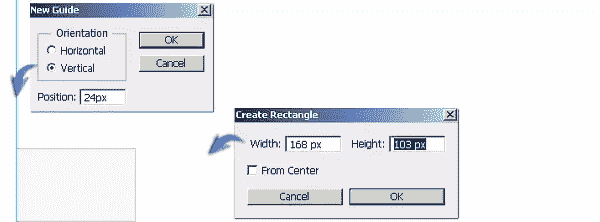](https://www.sitepoint.com/wp-content/uploads/2013/01/29.jpg)

### 第三步

接下来，我们将定义配置文件图标的空间，它应该有 160 像素的宽度和 160 像素的高度。因此，画一个 160 乘 160 像素的矩形，并将其放置在如下所示的剪切空间内。我们已经定义了剪裁和轮廓图标空间；现在，我们可以根据这些约束来设计时间线封面。任何设计元素不应该出现在这个矩形内，因为一旦你上传了设计，它将被一个脸书图标所覆盖。

### 第四步

让我们从背景开始实际的设计工作。我们将创建一个微妙的木材纹理。设置#d0a360 为前景色，#bd8530 为背景色。在背景上新建一层，用油漆桶工具填充前景色。现在，去“过滤器”>“渲染”>“纤维”在此应用以下设置。

[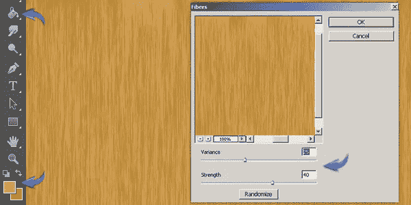](https://www.sitepoint.com/wp-content/uploads/2013/01/45.jpg)

### 第五步

双击木材纹理层打开“图层样式”窗口，应用下面的设置为内部发光和渐变叠加。

[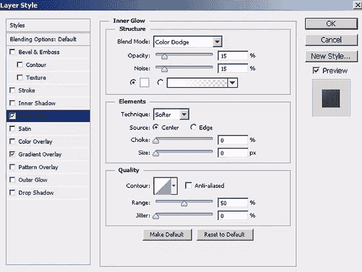](https://www.sitepoint.com/wp-content/uploads/2013/01/56.jpg)

[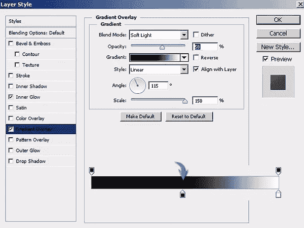](https://www.sitepoint.com/wp-content/uploads/2013/01/5b1.jpg)

[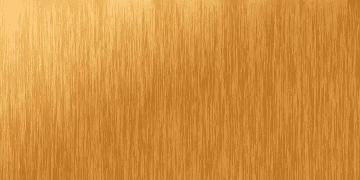](https://www.sitepoint.com/wp-content/uploads/2013/01/5c.jpg)

### 第六步

我们已经完成了背景；现在我们要做一个漂亮的木制框架。将#412d1d 设置为前景色，将#2f1e0e 设置为背景色。然后，选择矩形选框工具，使矩形选区如下所示。用前景色填充它，并应用下面的纤维设置来制作更深的木头纹理。

[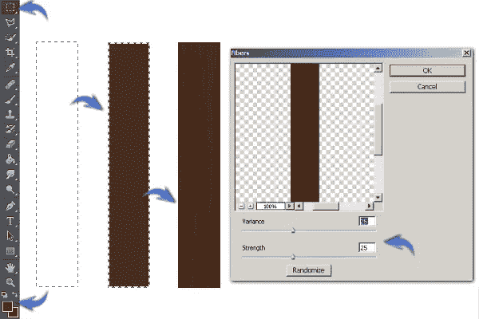](https://www.sitepoint.com/wp-content/uploads/2013/01/64.jpg)

### 第七步

接下来，我们将在木板的边缘创建微小的裂缝。复制新创建的木制面板层以保留原始层。隐藏原始图层；我们以后会用到它。点击复制层，选择多边形套索工具，并选择一个薄的三角形补丁的边缘，如下所示。现在转到“编辑”>“清除”来删除这个小选择。用同样的方法多做几个裂缝。现在按 Ctrl + "T "激活自由变换工具，并稍微减少面板的宽度。

[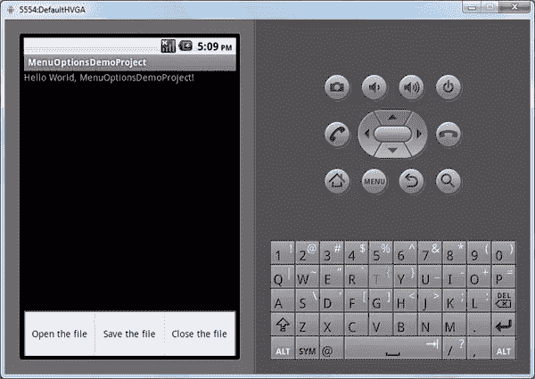](https://www.sitepoint.com/wp-content/uploads/2013/01/74.jpg)

### 第八步

现在我们给这个木板一个 3D 的外观。设置#220d00 为前景色，按 Ctrl + <click on="" the="" panel="" layer="">选择。然后，在面板图层下面新建一个图层，按 Alt + Backspace 用前景色填充选区。之后，使用键盘上的箭头键将选区向左下移动一步，再一次按 Alt + Backspace 用前景色填充。重复这个过程 2 到 3 次，直到你得到一个可接受的面板厚度。将此图层标记为 3D。在此步骤中，不应选择移动工具(“V”)；如果是这样，您将无法获得理想的 3D 外观。</click>

[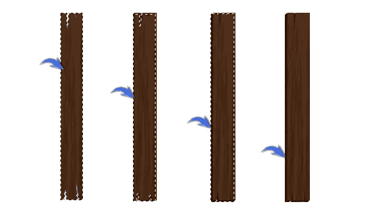](https://www.sitepoint.com/wp-content/uploads/2013/01/84.jpg)

### 第九步

收集木制面板和 3D 图层到一个组中，复制它，并向右拖动这个副本来制作木制框架的右边框。复制它两次，选择两层，然后到“编辑”>“变换”>“旋转 90⁰.”对齐这些新图层以完成框架。

[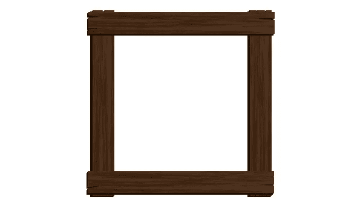](https://www.sitepoint.com/wp-content/uploads/2013/01/93.jpg)

### 第十步

选择一个前面板层，并应用以下图层样式设置。

[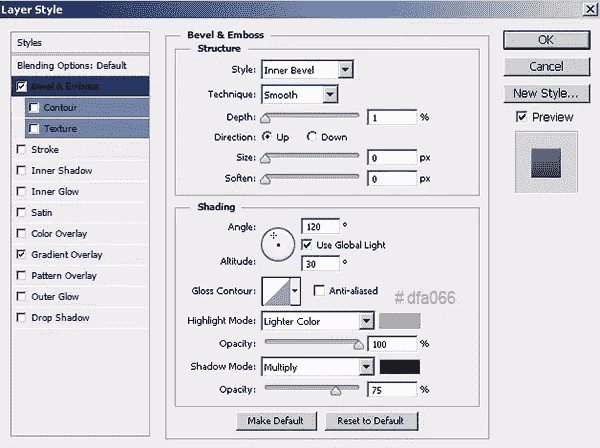](https://www.sitepoint.com/wp-content/uploads/2013/01/103.jpg)

[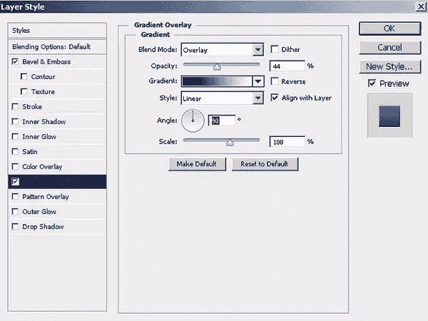](https://www.sitepoint.com/wp-content/uploads/2013/01/10b1.jpg)

一旦你完成了，右键点击这一层，并选择“复制图层样式”然后右键单击其余的面板层一个接一个，并选择“粘贴图层样式”应用相同的效果。

[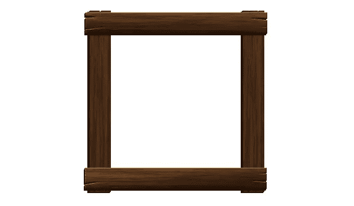](https://www.sitepoint.com/wp-content/uploads/2013/01/10c.jpg)

### 步骤 11

接下来，我们将在框架的四个角上钉钉子。使用椭圆工具(使用颜色#eaeaea)画一个小圆，应用下面的图层样式设置。你可以从开头列出的资源中下载用于指甲的图案。

[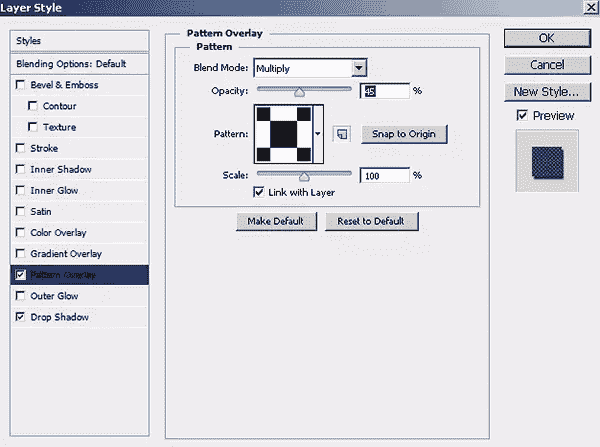](https://www.sitepoint.com/wp-content/uploads/2013/01/115.jpg)

[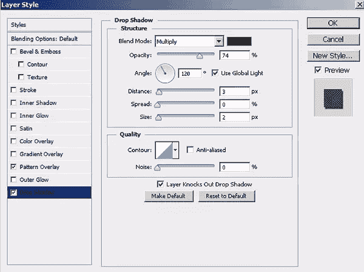](https://www.sitepoint.com/wp-content/uploads/2013/01/11b1.jpg)

将钉子复制三次，然后将这些复制品放在框架的角上。

[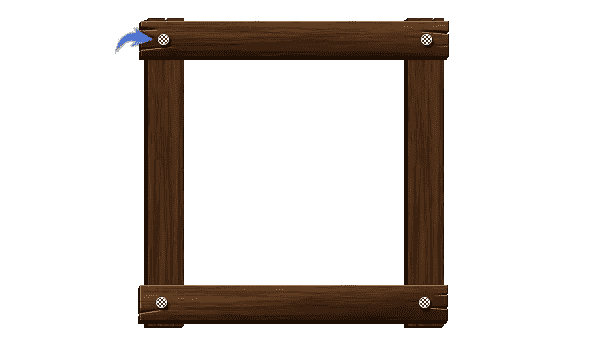](https://www.sitepoint.com/wp-content/uploads/2013/01/11c.jpg)

### 步骤 12

将构成此框架的所有图层收集成一组。复制它，并用自由变形工具增加左右边框的高度。相应地放置其余层，以获得不同尺寸的框架。您可以使用相同的技术制作多个框架。我做了以下三种类型，我将用于时间线封面。

[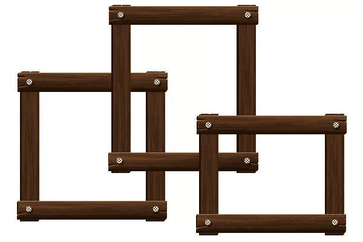](https://www.sitepoint.com/wp-content/uploads/2013/01/123.jpg)

### 第十三步

现在右键单击框架组，选择“转换为智能对象”选项将所有框架转换为智能对象，并对它们应用以下投影设置。

[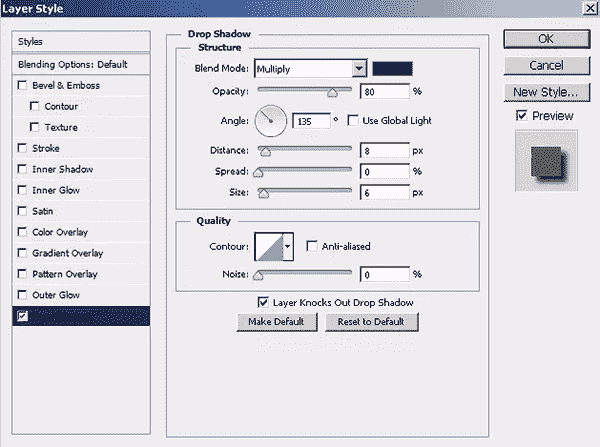](https://www.sitepoint.com/wp-content/uploads/2013/01/134.jpg)

将这些框架随意排列在背景层之上。

### 步骤 14

接下来，我们将把图像放到画布中。进入“文件”>“位置”，选择第一张图片。根据所选框架调整其大小，并将其放在特定框架的正下方。对所有图像重复该过程。这是放置这些图像后的样子。

[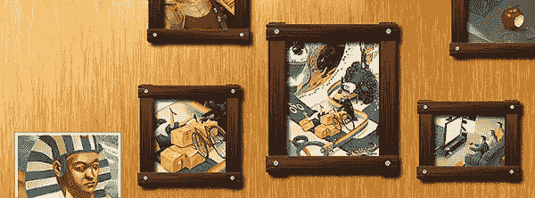](https://www.sitepoint.com/wp-content/uploads/2013/01/143.jpg)

### 第十五步

现在，我们将制作另一个简单的框架来显示一些个人资料细节。

[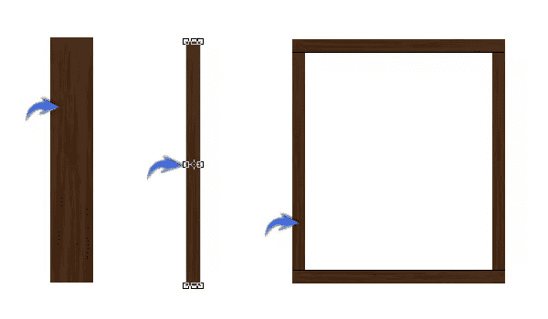](https://www.sitepoint.com/wp-content/uploads/2013/01/153.jpg)

将步骤 13 中使用的相同投影设置应用到此帧。

[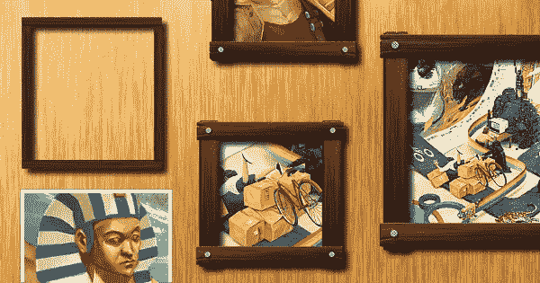](https://www.sitepoint.com/wp-content/uploads/2013/01/15b.jpg)

### 第十六步

用#ebe9e4 颜色在这个新的框架层下面画一个矩形，做卡片纸。

[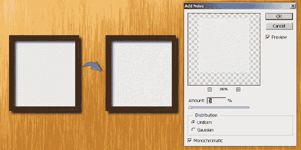](https://www.sitepoint.com/wp-content/uploads/2013/01/163.jpg)

### 步骤 17

将以下设置应用于卡片纸层的渐变叠加。

[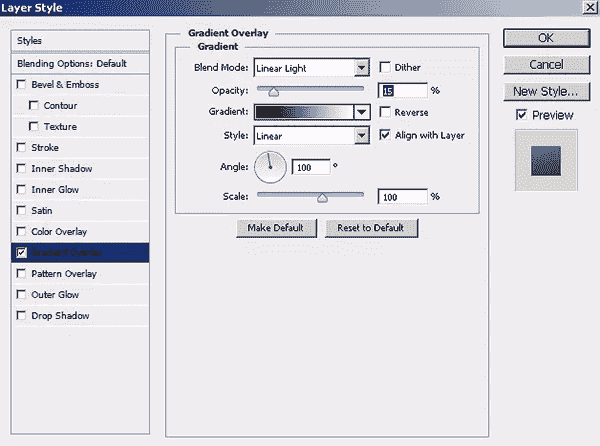](https://www.sitepoint.com/wp-content/uploads/2013/01/173.jpg)

[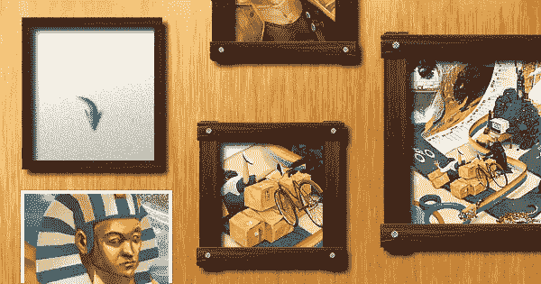](https://www.sitepoint.com/wp-content/uploads/2013/01/17b1.jpg)

### 步骤 18

接下来，我们将添加一些个人资料详细信息。设置#363636 为前景色。选择文字工具并添加所需的标题。我在这里使用了“牛腿”字体。

[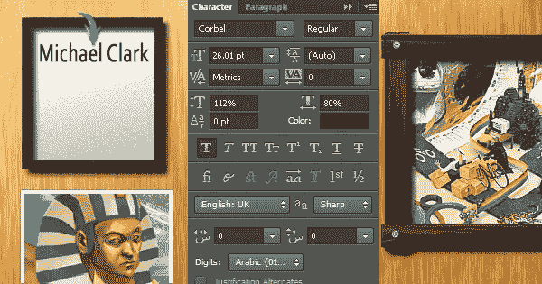](https://www.sitepoint.com/wp-content/uploads/2013/01/184.jpg)

### 步骤 19

使用“Arial”字体添加其余细节。您可以添加相关图标，使内容更具吸引力。

[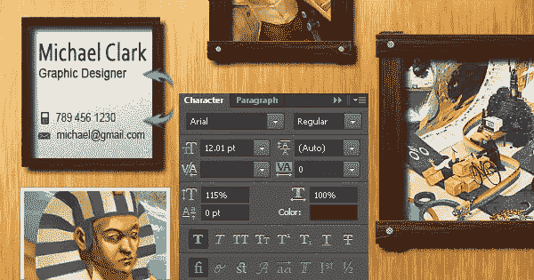](https://www.sitepoint.com/wp-content/uploads/2013/01/192.jpg)

### 步骤 20

最后，我把字幕的颜色改为#754b0a。这是最后的结局。

**全视图:**

**放大 100%时的视图:**

[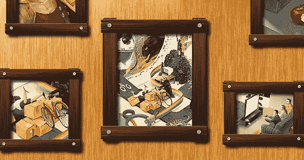](https://www.sitepoint.com/wp-content/uploads/2013/01/Final-result31.jpg)

就是这样。希望你们喜欢这个教程，并学到一些有趣的东西。请分享你的想法！

## 分享这篇文章