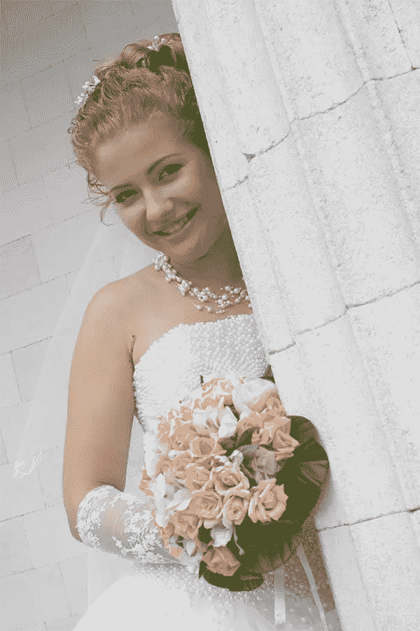
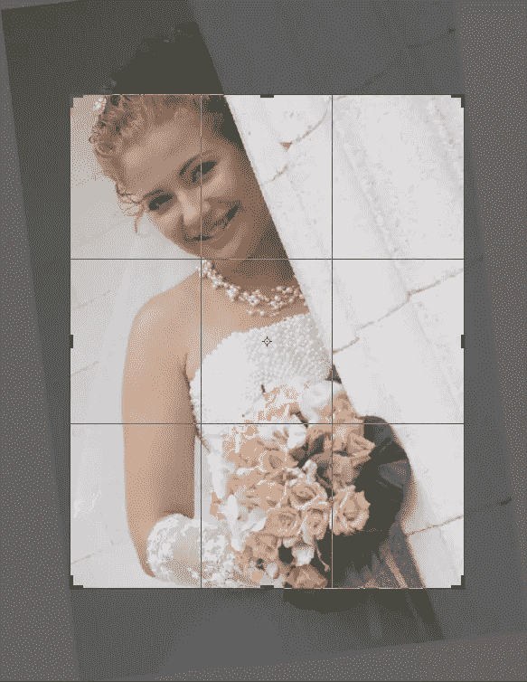
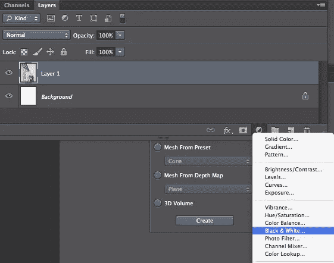
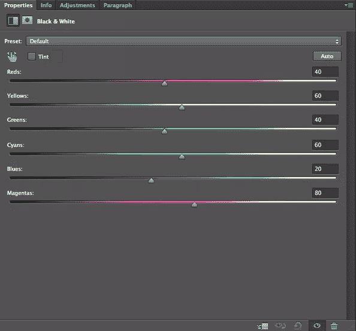
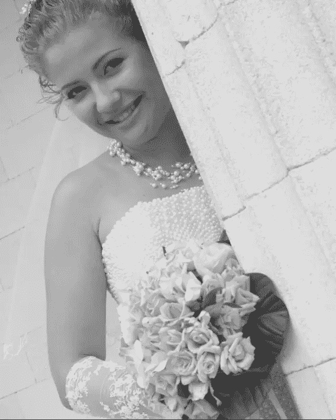
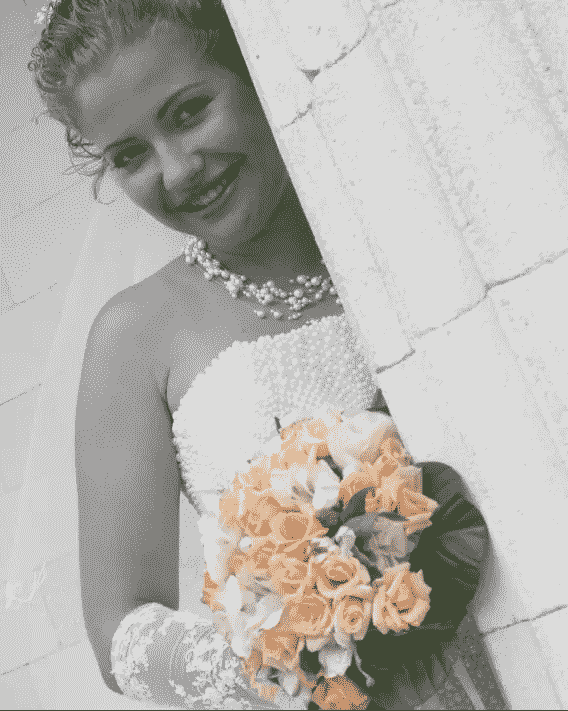
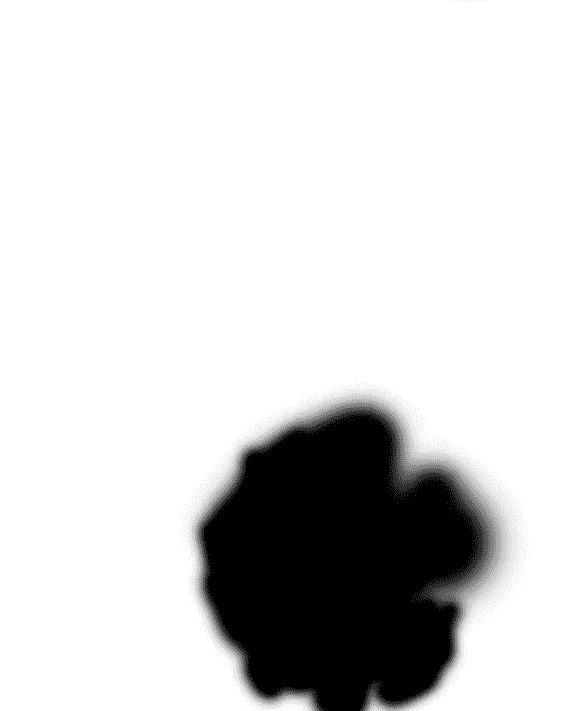
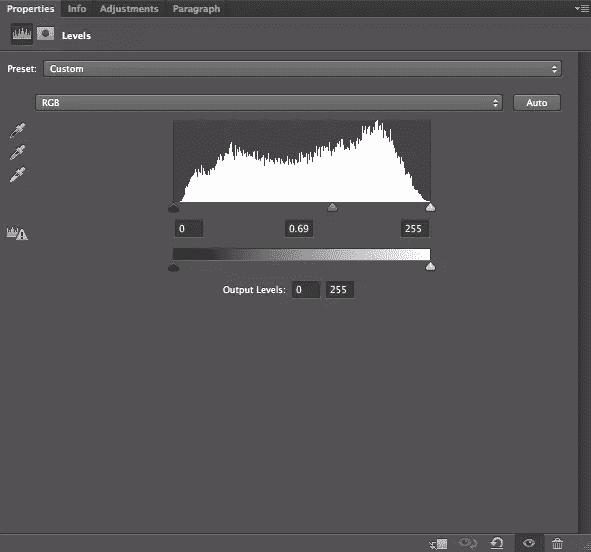
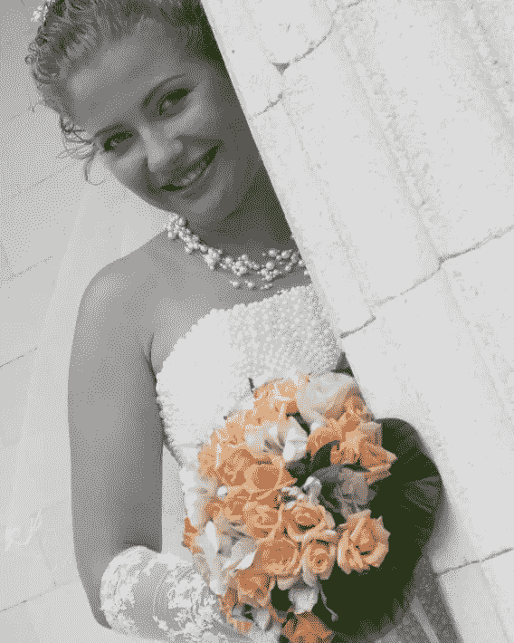
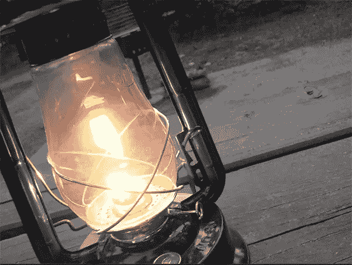

# 在黑白照片中创建彩色高光

> 原文：<https://www.sitepoint.com/create-colorful-highlights-within-a-black-and-white-photograph/>

有人说一张图片胜过千言万语。这张照片的影响力越大，它要说的就越多。正确的图像可以用来吸引注意力，并通过仔细的修改来讲述一个经过深思熟虑的故事。这就是为什么图像增强在设计和摄影中起着如此重要的作用。借助 Photoshop，我们可以增强图像以强调任何元素。一种强调图像的技术是通过向图像的关键元素添加颜色来创建一个大胆、多彩的焦点，从而将图像变成选择性的彩色图像。以下技巧用于创意广告、戏剧性的公益广告，尤其是婚礼摄影。

### 选择合适的照片

将效果应用到你的图像上是很好的，但是选择正确的图像是创造一张好照片的关键的第一步。你需要考虑照片的应用和背景。

选择合适的格式和大小也很重要。例如，如果你正在处理一张结婚照，它很可能会被打印出来。所有的结婚照都应该不低于 300 dpi，或者每英寸点数。这可以确保打印出来的图像清晰美观。如果您提供打印服务，那么您会希望将图像裁剪为标准的照片尺寸，例如 8 英寸 x 10 英寸的大肖像。婚纱照很特别，所以在这种情况下你希望它们尽可能大，因为一些夫妇会订购海报大小的图像来纪念这一时刻。下图被裁剪为一张 8 英寸 x 10 英寸的照片。你可以在这里下载样图[。](http://www.sxc.hu/browse.phtml?f=download&id=875319)

**原图**

**裁剪后的照片**

要使用像选择性彩色图像技术这样的效果，选择正确的构图也很重要。上面四条线的交点被认为是焦点。因为图像已经开始倾斜，所以我在裁剪过程中稍微旋转了图像，这样脸就会落在左上焦点附近，花束就会与右下焦点对齐。这是构成任何图像或设计的一个关键因素。

总是试图将重要的事情与这些领域中的一个联系起来。请注意，当我旋转时，我停留在图像的边界内，以避免复制背景或使用 Photoshop 的内容感知填充。

接下来，点击“新建调整图层”图标，选择“黑白”创建一个新的调整层比使用“图像”>“模式”>“调整”方法将它应用到您的图像要好得多。在处理任何照片时，您都希望尽可能做到无损，尤其是选择性彩色图像。使用这种方法将你的效果放置在一个新的图层上，并预先制作好图层蒙版。

这项技术的另一个优点是它是无限可编辑的。如果您需要返回并进行调整，只需双击调整图层并在属性面板中编辑值。

黑白对于选择性彩色图像效果如此有效的原因是，您可以使用每个滑块来控制图像的色调。这对于黑白来说非常好，因为您可以通过增加和减少滑块的值来选择性地增加对比度。你可以在下面看到，新娘的皮肤和石柱没有足够的对比。她倾向于融入人群，这不是我们想要的。当添加颜色时，我们希望焦点首先放在花束上，然后是她，最后才是环境。

这张图片是一个很好的效果，因为通过简单地将红色滑块的值降低到-15，我们使她更加突出，如果你关闭黑白图层，你会看到她的花是桃红色的，其中有很多红色，所以我们最终同时增加了花的对比度。这将消失，当我们掩盖了花，并添加颜色信息回来。

在图层面板中，点击黑白图层上的蒙版图标。选择黑色作为前景色。选择一个软边笔刷，在蒙版上你想要恢复颜色的区域涂上黑色。我建议把花和叶子遮回去。结果如下所示:

**图像**

**面具**

现在，如果你决定花束可以在图像的灰色区域使用一点额外的对比度，你可以创建一个层次调整层。移动灰色滑块(中间那个)，使其值大约为 0.69。为了清晰起见，我在下面添加了一张图片。

你不想将此应用到整个图像，所以按住 Option/Alt，并从黑白调整层单击图层蒙版，并将其拖动(同时仍按住 Alt/Option)到色阶调整层。这将复制图层蒙版，并把它放在你的级别调整层。alt/Option-单击图层蒙版图标并按 Command/Ctrl+“I”来反转图层蒙版，隐藏图像其余部分的色阶调整，同时保留花束的效果。你可以在下图中看到不同之处。

### 选择性彩色图像的其他例子

你可以用它们来美化一张暗淡的照片。例如下面的图片，在这里找到的[，是一辆生锈的老雪佛兰，旁边是一片尘土飞扬的平原上的一堆木头。图像的整体色调是棕色，棕色，和更多的棕色。您可以保存此图像，并通过使其成为选择性颜色图像来添加一点戏剧性。我使用了上面同样的技术，将雪佛兰重新着色。](http://www.sxc.hu/browse.phtml?f=download&id=1395643)

使用这种技术可以在图像的色调对比上增加戏剧感或对比感。它增加了一种小小的震撼感，并立即将你的目光吸引到图像中的那个点上。

下面的图像是一个灯笼，原始图像还不错，但如果你在我们将它转换成选择性颜色图像后再看，后者真的会引起你的注意。金色的光芒与黑色和白色形成了鲜明的对比，使灯笼更加突出。

### 结论

在黑白图像中创建彩色高光是一种很好的方式，可以为您的图像增加额外的关注度，使它们脱颖而出。添加的戏剧设置了强烈的情绪，并确立了图像的基调。色彩的飞溅为精心选择的图像部分增加了大量的强调，就像我们对花束所做的那样。当你将这一点与关键元素在图像焦点上的排列结合起来时，你会得到一个强有力的图像，它唤起了许多情感，并增加了意想不到的元素。

你曾经选择性地给你的图像上色吗？你的客户对这些照片有什么反应？请在下面的评论区分享你的经历。

## 分享这篇文章