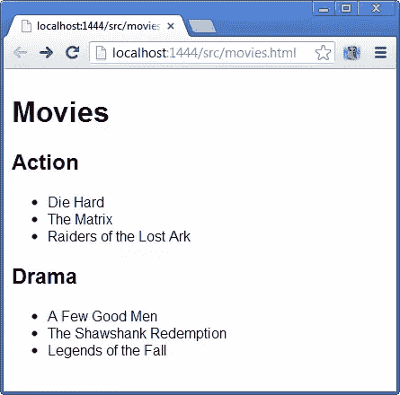
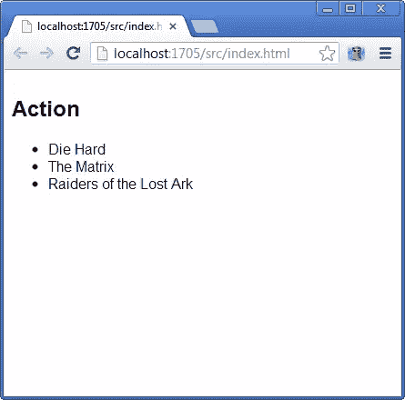

# 选择从 jQuery Ajax 响应字符串返回的元素的秘诀

> 原文：<https://www.sitepoint.com/secrets-selecting-elements-returned-jquery-ajax-response-strings/>

jQuery 选择引擎快速而灵活，允许您针对 DOM 元素以及内存中的标记字符串进行选择。当您将这种功能与从整个站点的页面获取完整 HTML 标记的能力结合起来时，您可以想出一些有趣的方法来重用 web 应用程序中的内容。

**概念**

考虑一个应用程序，它在一个页面上包含您想要在另一个页面上显示的内容。采用这种方法的原因各不相同，但常见的情况包括使用遗留或“黑盒”系统，在这些系统中，您无法控制服务器实现，或者您使用静态内容。最终，“黑盒”和静态内容环境都不会让您有机会将服务器上的数据准备成典型的 Ajax 响应消息(即 JSON 或 XML)。

本文中演示的示例从静态 HTML 文件中获取内容片段，并将其显示在站点的另一个页面上。**图 1** 显示了一个静态 HTML 页面，其中列出了系统中多个类别的电影。



**图 1:完整电影页面**

虽然电影页面包含系统中的所有电影，但主页只会向用户显示电影的一个子集。**图 2** 展示了主页如何只渲染页面上的动作片。



图 2:只显示动作片的主页。(index.html)

为了让这个场景工作，需要一个针对静态 HTML 页面的 Ajax 调用。一旦浏览器识别出 Ajax 调用的响应，就通过对静态页面返回的标记使用 jQuery 选择器，从完整的响应中提取页面的一部分。jQuery 选择引擎足够灵活，可以处理 DOM 元素，也可以根据内存中的标记字符串进行选择——但是有一个问题。

Ajax 调用的响应包括页面的**完整 HTML 的标记，其中包括文档的*文档类型*元素以及根 *HTML* 元素。具有两个根级元素的响应不能立即选择，因为 jQuery 选择引擎要求查询目标必须具有一个根元素。这个问题可以通过手动添加一个根元素到响应字符串来解决，方法是将它包装在一个逻辑容器中，比如一个 *DIV* 元素。**

**代码**

电影页面的代码可以在**清单 1** 中找到，它显示了每一类电影是如何逻辑地包含在一个具有相应的 *ID* 值的*部分*元素中的。

**清单 1:电影页面(movies.html)**

```
 # 电影

## 行动

*   死硬

*   黑客帝国

*   夺宝奇兵

## 戏剧

*   几个好人

*   肖申克的救赎

*   秋天的传说 
```

主页由清单 2 中的代码组成，默认情况下，它只包含一个在 *DIV* 标签中的结构元素，该标签充当页面上呈现的内容的外壳。

### 清单 2:主页(index.html)

```
$(function () {
$.get('movies.html', function (response) {
var source = $('
' + response + '
');
$('#movies').html(source.find('#action-container').html());
});
});
```

该页面上的 JavaScript 从注册 jQuery 加载处理程序开始。一旦页面加载，调用 [*$。get*T3 API 获取 movies.html*T5 页面。对此请求的响应是*movies.html*页面的完整 HTML 标记(包括 *DOCTYPE* )。因为原始标记最初是不可选择的，所以字符串用根 *DIV* 元素包装，然后实例化为一个 jQuery 对象，为选择引擎的处理做好准备。*](http://api.jquery.com/jQuery.get/)

为了在电影页面中定位所需的 HTML 片段，使用 [*find*](http://api.jquery.com/find/) API 来查询完整标记的后代，并仅返回主页所需的元素(即，具有*动作容器*的 *ID* 的元素)。一旦找到该片段，就通过使用 jQuery [*html*](http://api.jquery.com/html/) 函数对 *DIV* 使用 *ID* of *movies* 将其注入到内容主机元素的 *innerHTML* 中。

最后，**清单 3** 包含了每个页面中使用的常见样式，以便对页面应用一些最小的样式。

### 清单 3:样式表(styles.css)

```
body, html
{
padding:4px;
margin:0px;
}

body
{
font-family:Arial, Helvetica, sans-serif;
font-size:1em;
}
```

**结论**

虽然使用这种方法的情况相对较少，但是您可能会遇到这样的情况:希望对站点上的现有页面进行 Ajax 调用，并且只呈现页面上元素的目标部分。使用这种方法的秘诀是将响应字符串包装在一个逻辑根元素中，然后使用 jQuery *find* API 只提取出宿主页面所需的标记。

**BIO:**

克雷格·舒梅克( [Twitter](http://twitter.com/craigshoemaker) | [Google+](http://profiles.google.com/craigshoemaker) )是一名软件开发人员，[播客](http://polymorphicpodcast.com/)，基础设施[的作家和技术布道者](http://infragistics.com/)。作为[多态播客](http://polymorphicpodcast.com/)的主持人，克雷格做着他最喜欢的事情——为社区做贡献，从行业名人身上汲取精华。

Craig 是[微软 ASP.NET MVP](https://mvp.support.microsoft.com/default.aspx/profile=48611EFD-1AD4-4E30-878D-DEEBC7D3F6A2)、 [ASP Insider](http://aspinsiders.com/) 以及各种开发者用户组和贸易展的演讲嘉宾。Craig 是 Wrox 书籍“【ASP.NET 2.0 AJAX 开始，[开始 ASP.NET AJAX](http://www.amazon.com/gp/redirect.html?link_code=ur2&tag=drazz75-20&camp=1789&creative=9325&location=http%3A%2F%2Fwww.amazon.com%2Fgp%2Fproduct%2F047178544X%2F)”和[代码杂志](http://code-magazine.com/)和 [Pluralsight](http://pluralsight.com/) 作者的合著者。

在业余时间，克雷格喜欢寻找一个干草堆来隐藏他的收藏。

## 分享这篇文章