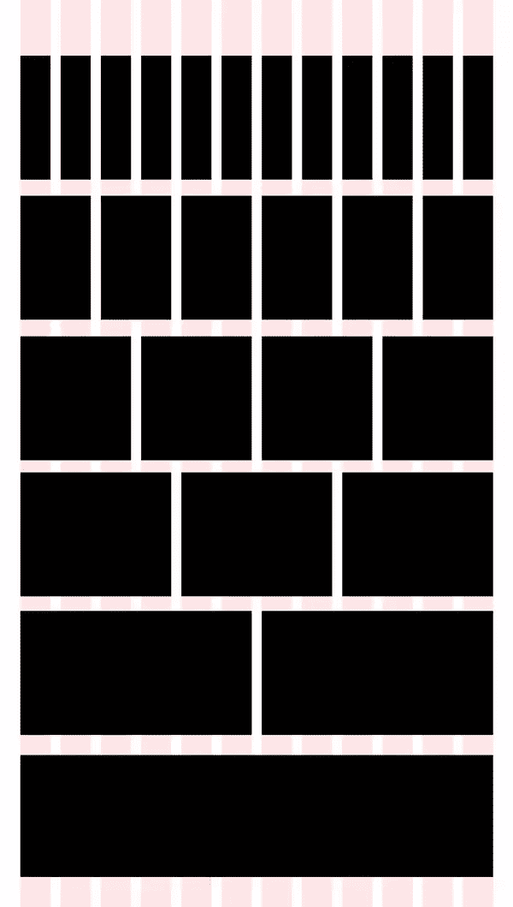
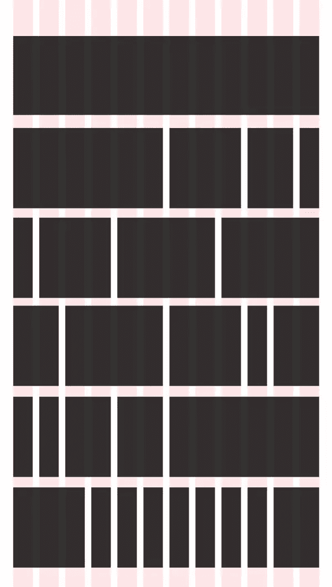
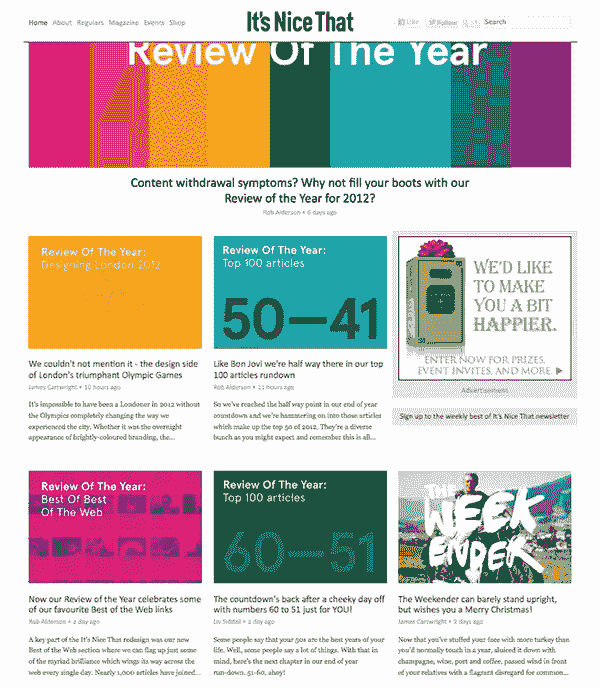
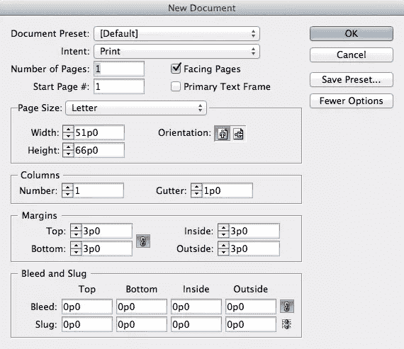
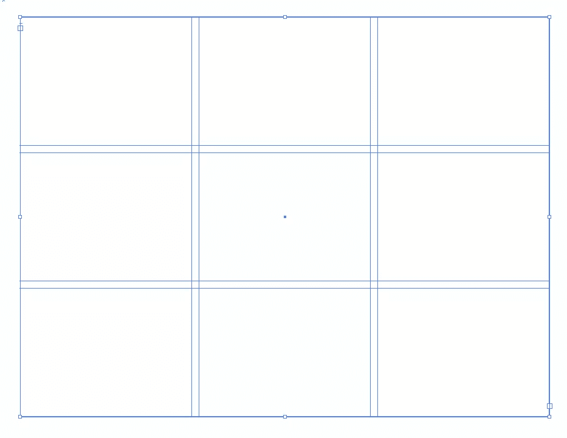
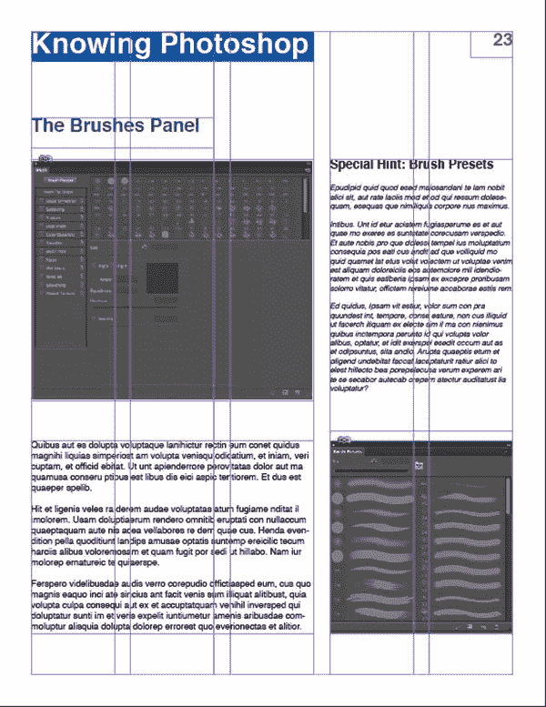

# 基于网格的布局 101

> 原文：<https://www.sitepoint.com/grid-based-layouts-101/>

学习和理解如何构建布局是视觉设计中最难掌握的一个方面。许多设计师很难理解对齐的概念，以及如何使用网格来使他们的设计平衡和有原则。网格工作得如此之好的原因是因为它们帮助您将内容分成离散的、可管理的模块。这使得你的内容更加灵活和有条理。它还使您的内容更容易查看和体验。我们将看看网格，以及如何使用它们来帮助布局更快地建立和更愉快地观看。

### 网格的类型

许多设计师使用网格作为他们每一个设计的基础。有些人会使用 12 列的网格，有些人会使用 16 列的网格，有些人会使用 24 列的网格，还有一些人会使用介于两者之间的网格。重点不在于你使用的网格类型，而在于你使用网格的事实。网格在网页设计中非常普遍，随着[响应式网页设计](https://www.sitepoint.com/forget-mobile-sites-time-for-a-responsive-web/ "Forget Mobile Sites! Time for a Responsive Web: 11 Responsive Design Resources")的实施，网格变得比以往更加重要。

当使用网格时，我更喜欢使用 12 列的布局。每列的宽度取决于介质(如*打印*或*网页*)，以及我所设计的整体宽度。如果我正在设计一些有很多小元素的东西，我可能会切换到一个 24 列的网格。装订线宽度由内容本身以及每个设计元素之间可能需要的空间大小决定。如果我正在构建一个砖石类型的布局，那么我可能只有 1-2px 的檐槽宽度。这实际上取决于应用程序。

我喜欢 12 或 24 列网格的原因是因为它们为你的布局提供了很多不同的选择。您可以选择 1 个 24 列宽的内容块、2 个 12 列宽的内容块、3 个 8 列内容块、4 个 6 列内容块等等。您可以在上面的例子中看到这种灵活性。这使得你的设计很有可塑性，因为你也可以混合搭配不同的组合。你不仅仅局限于使用均匀对称的布局。看下面的例子；您可以混合搭配不同的元素，打造更加动感的外观，同时保持良好的结构。

从上面的例子可以看出，选项是无穷无尽的。一些设计师害怕使用网格，因为他们认为网格会被限制在某种僵硬的整体结构中，但实际上有无限的选择和组合。下面的例子显示了一个正在使用的网格。导航跨越整个宽度，而主要内容滑块大约是宽度的 60%。侧边栏占 40%左右。在下一行，3 篇文章被平均分解。连续的每一行被分成 3 个均匀的列，使得每篇文章易于处理，并且装订线为划分内容提供了充足的空间。

下面的网站遵循一个简单的 3 列网格。这为图片提供了足够的空间，并将段落和文章分成易于管理的小块。这也使得在布局中插入广告变得很容易。

### InDesign 中的网格

网格起源于印刷设计，它们在印刷媒体中仍然很有用。为印刷设计设置结构化网格很简单，通常在 InDesign 中完成，但您也可以在 Illustrator 中设置网格。在 InDesign 中，您可以在最初设置文档时确定网格。只需在 InDesign 中创建新文档，对话框就会出现各种选项。

您将像往常一样设置您的文档，但是请注意，您可以更改一些关键设置来设置多栏网格。默认的度量单位是 *picas* ，但是如果您更喜欢使用英寸，您可以在 InDesign 的首选项中更改度量单位。在初始设置菜单中，将列数更改为适合您的布局的数量。一些设计师喜欢 5 列网格，其他设计师使用不同的变化。装订线是每列之间的空间，应该足够宽，但不要过大。页边距是内容周围的空间。你永远不要让文本太靠近边缘。在打印过程中，它可能会被完全从文档中切掉。

### Illustrator 中的网格

在 Illustrator 中，网格设置过程略有不同。在最初的文档创建阶段，您并没有创建网格。在 Illustrator 中，您可以像往常一样创建文档，选择文本工具，并通过单击和拖动创建文本框来绘制文本区域。这种方法的不同之处在于，您需要设置参考线来确定文档的页边距。然后，您可以简单地将文本框与那些精心放置的参考线对齐。

然后，转到顶部菜单中的“类型”并选择“区域类型选项”这将弹出一个类似于 InDesign 中的对话框。有几个不同之处，例如创建行和列的能力，因此您可以创建垂直网格、水平网格或双向网格。你也要注意装订线的设置。在 Illustrator 中，您可以通过预览来检查并查看您的网格在构建时的外观，这非常有帮助。请注意，在“选项”下，您可以确定文本框之间的文本流向是垂直还是水平。从上面的设置得到的网格如下所示。

下面是我们正在使用的 InDesign 网格的一个例子。使用 5 列布局，我们有 3 列用于主要内容，两列用于次要内容。注意主图片上方的标题。虽然这一部分的主要结构是三栏布局，但标题只有两栏，这完全没问题。网格是作为*指南*而制作的，并不需要在每一个实例中都严格遵守。页码 23 并不能填满一整列。

### 结论

在你的设计中使用网格是给你的作品带来逻辑结构的好方法。使用框架是组织信息和将重要元素组合在一起的好方法，这样可以使你的内容更容易体验和理解。作为设计师，我们工作的目的是尽可能以最容易接受和最有创意的方式传达信息，让浏览我们设计的人都能记住这一信息。网格是指导我们设计元素的一个很好的方式，但是我们不需要总是 100%地坚持网格。知道什么时候打破网格结构是创造视觉兴趣和将注意力吸引到设计的某些部分的好方法。

你在设计工作中使用网格吗？如果是，你最喜欢哪种类型的网格？你有一个通用的网格结构，可以在许多不同的应用程序中很好地工作吗？如果是这样，请在下面的评论部分分享你的技巧。

## 分享这篇文章