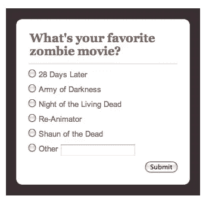
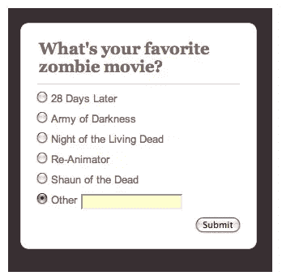
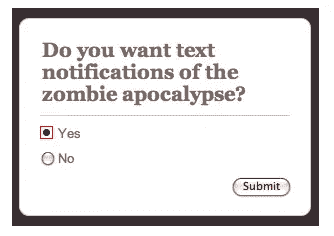
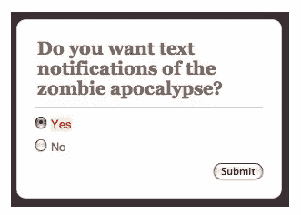
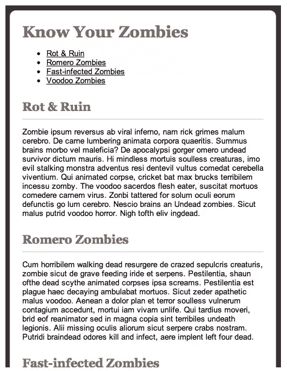
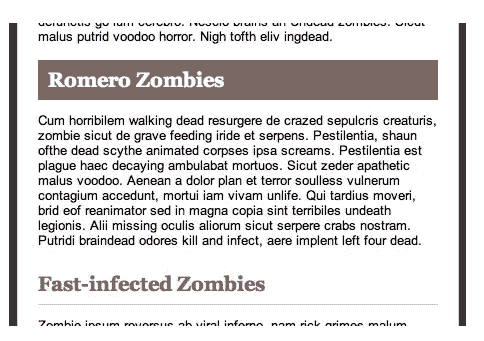

# 了解 CSS3 选择器:其他伪类

> 原文：<https://www.sitepoint.com/getting-to-know-css3-selectors-other-pseudo-classes/>

在这个由两部分组成的系列文章的第一篇[中，我介绍了新的](https://www.sitepoint.com/getting-to-know-css3-selectors-structural-pseudo-classes/) [CSS3 结构伪类](https://www.w3.org/TR/css3-selectors/#structural-pseudos)，它根据元素在文档树中的位置或者它们与其他元素的关系来定位元素。在本文中，我将回顾 CSS3 中引入的其余伪类:基于状态的伪类、目标伪类和否定伪类。

## UI 元素状态伪类

虽然结构化伪类依赖于元素的相对位置，但是基于状态的伪类根据元素的状态来定位元素，例如元素是活动的还是聚焦的。您应该已经熟悉了状态伪类的概念(如`:link`、`:visited`、`:hover`和`:active`，它们是在 CSS1 中为锚(`<a>`)元素引入的。

在 CSS2.1 中，引入了`:focus`伪类，它将基于状态的选择器扩展到超链接之外，以形成像 input 和 textarea 这样的元素。CSS3 带来了另外三个伪类，可以用来定位表单元素的 UI 状态:`:disabled`、`:enabled`和`:checked`。

## 语法复习

所有伪类的语法都很简单。每个伪类名都以冒号开头:

`:pseudo-class {}`

您的选择器可以只包括伪类，就像前面的示例一样，它将针对所有相关的元素，或者您可以更具体地将伪类附加到元素(`e`)、类或 id 选择器，如下所示:

```
e:pseudo-class {}

    .class:pseudo-class {}

#id:pseudo-class {}
```

对于基于状态的伪类，只有当 UI 中指定的状态为真时，浏览器才会应用选择器。在下面的示例中，只有当用户将鼠标悬停在链接上时，指定的样式才会呈现在屏幕上。所有其他链接状态不会呈现这些样式。

```
a:hover {

    background-color: #ccc;

    text-decoration: none;

}
```

## :已禁用

[:disabled](https://www.w3.org/TR/css3-selectors/#enableddisabled) 伪类的目标是具有 disabled 属性的输入元素，这使得输入元素不可点击和不可用:

`<input type="text" name="name" disabled />`

此示例使用 HTML5 中的布尔禁用属性，但您也可以在以前版本的 HTML 中声明此属性:

`<input type="text" name="name" disabled="disabled" />`

对于这两种方法，大多数浏览器对禁用的输入使用默认表示，其中与启用的输入相比，字段边框略微呈灰色，如下所示。


但是，您可以使用`:disabled`伪类来覆盖这个默认样式，并获得这里显示的结果。

```
input:disabled {

    background-color: #ccc;

    border: 0;

    padding: 3px 2px;

}
```


如果您没有使用布尔禁用属性，也可以使用[属性选择器](http://msdn.microsoft.com/en-us/magazine/gg619394.aspx)来实现这种效果:

```
input[disabled="disabled"] {

    background-color: #ccc;

    border: 0;

    padding: 3px 2px;

}
```

您使用哪个选择器最终取决于您的项目。

## :已启用

[:enabled](https://www.w3.org/TR/css3-selectors/#enableddisabled) 伪类的目标是输入的默认启用状态:

```
input:enabled {

    background-color: rgb(255, 255, 255);

    border: 1px solid rgb(125,104,99);

}
```

因为表单元素的默认状态是启用的，所以我不确定何时需要使用这个选择器。根据项目的不同，元素选择器也同样适用，甚至可能更好。但是出于演示的目的，考虑一个带有单选按钮的简短表单，它包含另一个选项，允许用户在文本输入中输入自己的值。这个表单的 HTML 如下所示，下面是表单。

```
<form>

    <legend>What's your favorite zombie movie?</legend>

    <input type="radio" name="FavMovie" id="28Days" />

    <label for="28Days">28 Days Later</label>

    <input type="radio" name="FavMovie" id="Army" />

    <label for="Army">Army of Darkness</label>

    <input type="radio" name="FavMovie" id="Night" />

    <label for="Night">Night of the Living Dead</label>

    <input type="radio" name="FavMovie" id="Reanim" />

    <label for="Reanim">Re-Animator</label>

    <input type="radio" name="FavMovie" id="Shaun" />

    <label for="Shaun">Shaun of the Dead</label>

    <input type="radio" name="FavMovie" id="Other" />

    <label for="Other">Other</label>

    <input type="text" id="OtherEntry" disabled />

    <input type="submit" />

</form>
```



在 HTML 中，其他选项的文本输入被设置为 disabled，我保留了默认的浏览器样式。但是当用户选择另一个单选按钮时，我希望启用禁用的输入。禁用的属性可以用[一点点 JavaScript](http://api.jquery.com/removeAttr/) 移除，样式可以稍微改变，如此处所示，以帮助通知用户输入字段可以接受输入。现在，该表单显示为进一步向下显示。

```
input:enabled {

    background-color: rgb(255, 255, 204);

}
```



## :已检查

[:选中](https://www.w3.org/TR/css3-selectors/#checked)伪类目标单选，复选框输入被选中。这允许您对开发人员通过 checked 属性预先选择的元素或用户在 UI 中选择的元素进行样式化。在单选按钮(或复选框)的矩阵或长列表中，`:checked`伪类可能很有用，用户可能很难确定选择哪个选项。为了简洁起见，让我们看看如何将`:checked`应用于一个简单的选择退出表单，在这个表单上预先选择了一个单选按钮(参见图 6)。

此示例的 HTML 包括一个具有布尔复选属性的单选按钮:

```
<form>

    <legend>Do you want text notifications of the zombie apocalypse?</legend>

    <input type="radio" name="notify" id="yes" checked /><label for="yes">Yes</label>

    <input type="radio" name="notify" id="no" /><label for="no">No</label>

    <input type="submit" />

</form>
```

下面是指向所选单选按钮的 CSS:

```
input:checked {

    border: 1px solid rgb(255, 0, 0);

}
```

考虑到其他选择器可以与这些伪类一起使用，我可以更具体地结合使用:checked with an attribute selector:

```
input[type="radio"]:checked {

    border: 1px solid rgb(255, 0, 0);

}
```



不幸的是，大多数浏览器限制单选按钮和复选框输入的样式。在这些情况下，用`:checked`选择器指定的样式根本不会显示。在我使用的浏览器中，只有 Opera/OS X 提供了显示的结果，坦率地说，它很难看，可能会让用户感到困惑。但是，您可以使用`:checked`伪类和[相邻兄弟组合符](https://www.w3.org/TR/css3-selectors/#adjacent-sibling-combinators)来设计选中单选按钮的标签文本。这是 CSS。你可以在下面看到结果。

```
input:checked + label {

    background-color: rgb(255, 255, 204);

    color: rgb(255, 0, 0);

}
```



## :目标伪类

CSS3 还包括一些新的伪类，它们不是结构化的，也不是基于状态的。 [:target](https://www.w3.org/TR/css3-selectors/#target-pseudo) 伪类选择一个元素，该元素的 id 通过使用片段标识符来链接。片段标识符出现在 URL 的末尾，用一个散列符号(`#`)后跟一个锚(`<a>` ) `name`或元素`id`来表示。

例如，在一篇长文章中，我可能希望包含一个链接到文章主要部分的目录。为此，我需要分配`id`作为我想要定位的内容的片段标识符(在本例中是标题):

```
<h2 id="rotnruin">Rot &amp; Ruin</h2>

<p>Zombie ipsum reversus ab viral inferno, nam rick grimes malum cerebro. De carne lumbering animata corpora quaeritis. Summus brains morbo vel maleficia? De apocalypsi gorger omero undead survivor dictum mauris...</p>

<h2 id="romero">Romero Zombies</h2>

<p>Cum horribilem walking dead resurgere de crazed sepulcris creaturis, zombie sicut de grave feeding iride et serpens. Pestilentia, shaun ofthe dead scythe ...<p>
```

然后我需要链接到这些 id:

```
<ul>

    <li><a href="#rotnruin">Rot &amp; Ruin</a></li>

    <li><a href="#romero">Romero Zombies</a></li>

    ...

</ul>
```



有了 HTML 结构之后，当用户通过内容链接表跳转到某个部分时，我可以将`h2`元素设计成不同的外观。这是 CSS，结果如下所示。

```
h2:target {

    background: rgb(125,104,99);

    border: 0;

    color: rgb(255, 255, 255);

    padding-left: 10px;

}
```



## 否定伪类

被称为否定伪类， [:not(x)](https://www.w3.org/TR/css3-selectors/#negation) 目标元素与圆括号中指定的选择器(`x`)不匹配。`:not(x)`的语法允许指定几乎所有类型的选择器，从简单元素、`id`或`class`选择器到组合子和其他伪类。

例如，您可以为不是 section 元素子元素的所有链接、没有分配的所有段落或不是提交按钮的输入元素指定样式:

```
:not(section) a {}

p:not(.intro) {}

input:not([type="submit"]) {}
```

## 为什么要使用伪类？

很容易看到这些伪类(以及那些在第 1 部分中提到的类),并且想知道为什么你会使用它们而不是更简单的选择器。答案取决于你正在做的项目。

有时，CMS 会限制对标记的访问，这意味着你不能添加`id`或`class` es。一些遗留系统也是如此。有时会出现一些特殊的情况，这些伪类是有意义的。

理解这些选择器的目的，至少对我来说，不是选择一个并独占使用它。相反，它是关于建立一个你可以用于任何情况或项目的选择库。

## 浏览器支持和处理

正如我在[第 1 部分](https://www.sitepoint.com/getting-to-know-css3-selectors-structural-pseudo-classes/)中所详述的，所有现代浏览器，包括 Internet Explorer 10 和 9、[都支持 CSS3 伪类](http://caniuse.com/#feat=css-sel3)。如果你的目标是提供有限或错误的 CSS3 选择器支持的旧版本浏览器，你将需要使用像 [Selectivizr](http://selectivizr.com/) 这样的聚合填充。同样值得一提的是，与其他选择器相比，CSS3 选择器的浏览器处理效率相对较低。同样，你所使用的应该始终归结到你的项目。如果您需要评估选择器性能的帮助，请查看 [CSS Lint](http://csslint.net/) 和 [CSS 测试创建器](http://stevesouders.com/efws/css-selectors/csscreate.php)。

## 额外资源

这个由两部分组成的系列涵盖了 CSS3 伪类的基础知识，但是还有更多的内容可以尝试。我推荐以下在线资源，为您提供更多关于可能性的想法:

*   [逆向理解 CSS 结构伪类](http://www.youtube.com/watch?v=nuCoBOdY2Qk)
*   [CSS3 伪类和 HTML5 表单](http://html5doctor.com/css3-pseudo-classes-and-html5-forms/)
*   [开:目标](http://css-tricks.com/on-target/)
*   [使用 CSS3 否定伪类的元素过滤](http://blog.vogtjosh.com/post/12237994218/element-filtering-using-css3-negation-pseudo-class)
*   [负接近度](http://meyerweb.com/eric/thoughts/2012/03/07/negative-proximity/)

此外，我非常强烈地推荐佐伊·吉伦沃特的[惊人的 CSS3](http://www.stunningcss3.com/) 。在这本书里，你可以看到很多伪类的实际例子，以及大量其他精彩的 CSS3 信息和资源。

另见 SitePoint 的 [CSS 参考](https://reference.sitepoint.com/css)和 [CSS 书籍](https://products.sitepoint.com/?tag=&filters%5Btag%5D%5B%5D=css&filters%5Bdifficulty%5D=&simpleform_submit_marker=showme)。

## 分享这篇文章