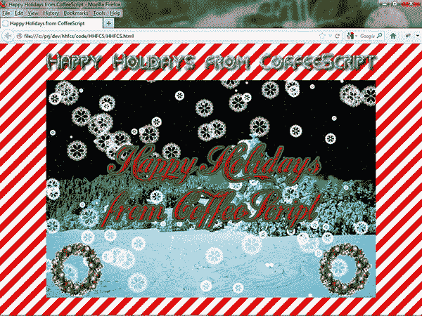

# 来自 CoffeeScript 的节日快乐

> 原文：<https://www.sitepoint.com/happy-holidays-from-coffeescript/>

假期就要到了。为了帮助你进入状态，我创建了一个 HTML5/CoffeeScript 应用程序，它呈现了一个喜庆的动画场景(带有背景音乐)。虽然这个应用程序很无聊，但是它演示了 HTML5 和 CoffeeScript 概念，您可能会发现这些概念在其他项目中很有用。

本文首先向您介绍这个应用程序，展示它的组件，并向您展示如何将它的 CoffeeScript 源文件对编译成等价的 JavaScript 源文件。接下来，本文将向您展示如何在 web 页面中嵌入这个应用程序。链接的 zip 文件包含源代码和一个伴随的 PDF 文件，它将带您浏览每个 CoffeeScript 文件的代码。

**注意:**本文已经在 Chrome 23.0.1271.95 m、Firefox 17.0.1、Internet Explorer 9.0.8112.16421、Opera 12.02 和 Safari 5.1.5 桌面浏览器上进行了测试。

## HHFCS 简介

CoffeeScript 的 happy Holidays(HHFCS)是一个 HTML5/CoffeeScript 应用程序，它使用 HTML5 Canvas API 来呈现夜晚的冬季森林场景。雪花在飘落，一对花环在前景闪烁着它们的灯光。此外，由于 HTML5 音频 API，当《铃儿响叮当》音乐播放时，居中的消息逐渐消失。场景截图如图 1 所示。

[](https://www.sitepoint.com/wp-content/uploads/2013/03/figure1.jpg)

HHFCS 由几个文件组成，这些文件被组织到一个`HHFCS`目录及其`audio`和`images`子目录中。以下列表显示了这些文件:

*   `HHFCS/audio/jb.mp3`以 MP3 格式存储铃儿响叮当音乐。除了支持 [Ogg](http://en.wikipedia.org/wiki/Ogg) 格式的 Firefox 和 Opera 之外，所有浏览器都使用这个文件。
*   `HHFCS/audio/jb.ogg`以 Ogg 格式存储铃儿响叮当音乐。这个文件被 Firefox 和 Opera 使用。
*   存储应用程序主类的 CoffeeScript 代码。
*   `HHFCS/HHFCS.html`存储启动 HTML 代码和运行 HHFCS 的三行 JavaScript。
*   `HHFCS/HHFCS.js`存储相当于`HHFCS.coffee`的 JavaScript 代码。
*   `HHFimg/message.png`储存淡出视图的信息。
*   `HHFimg/scene.png`存储冬季森林场景，这是位于[这里](http://www.bestphotos.us/photo/wo8368-winter-forest-5986.php)的公共域图像的修改版本。
*   `HHFimg/wreath0.png`存储三帧花环动画的第一帧。所有三个相框都是由[免费圣诞礼物](http://www.fg-a.com/christmas.htm)赠送的。
*   `HHFimg/wreath1.png`存储三帧花环动画的第二帧。
*   `HHFimg/wreath2.png`存储三帧花环动画的第三帧。
*   `HHFCS/Snowflake.coffee`存储应用程序的`Snowflake`类的 CoffeeScript 代码。
*   `HHFCS/Snowflake.js`存储相当于`Snowflake.coffee`的 JavaScript 代码。
*   `HHFCS/stripes.png`存储糖果棒图案，用作网页的背景图像。
*   将网页标题存储在 ice 模式中。这张图片是在学术许可下通过在线[标志设计和名称生成器](http://www.flamingtext.com/)创建的。

因为浏览器不识别 CoffeeScript，所以必须将两个 CoffeeScript 源文件翻译成等价的 JavaScript。CoffeeScript 的说明告诉你如何下载和安装 CoffeeScript 编译器。以下命令行使用该编译器来翻译这些文件:

```
coffee --compile --bare HHFCS
coffee --compile --bare Snowflake
```

在编译这些源文件时，必须指定`coffee`的`--compile`和`--bare`选项。`--compile`选项将 CoffeeScript 源文件编译成同名的 JavaScript 源文件，`--bare`选项省略了[顶层函数安全包装器](http://coffeescript.org/#lexical_scope)。

## 在网页中嵌入 HHFCS

HHFCS 必须嵌入到网页中，以便可以运行。我创建了一个小的`HHFCS.html` HTML 文件来完成这项任务。清单 1 展示了这个文件的内容。

```
<!DOCTYPE html PUBLIC "-//W3C//DTD HTML 4.01//EN" "https://www.w3.org/TR/html4/strict.dtd">

<html>
   <head>
      <title>
         Happy Holidays from CoffeeScript
      </title>

      <meta http-equiv="Content-Type" content="text/html; charset=ISO-8859-1">

      <script src="HHFCS.js">
      </script>

      <script src="Snowflake.js">
      </script>
   </head>

   <body style="text-align: center; background-image: url('stripes.png');
                background-repeat: repeat">
      

      <script>
         var DELAY = 40;
         HHFCS.init(DELAY);
         setInterval("HHFCS.draw()", DELAY);
      </script>
   </body>
</html>
```

**清单 1:** 通过`HHFCS.html`文件在网页中嵌入 HHFCS

清单 1 首先给出了一个`声明，告诉浏览器页面的目标 HTML 版本。此声明用于防止 Internet Explorer 在尝试获取画布上下文时生成“对象不支持属性或方法' getContext '”错误消息。`

 `稍后，清单 1 给出了标签。这个标签将页面的内容类型标识为 [ISO-8859-1](http://en.wikipedia.org/wiki/ISO/IEC_8859-1) ，以防止 Firefox 抱怨未声明的字符编码。

接下来，清单 1 展示了用于加载`HHFCS.js`和`Snowflake.js`的`