# 在 Photoshop 中制作一个木制奖杯陈列柜

> 原文：<https://www.sitepoint.com/build-a-wooden-trophy-case-in-photoshop/>

虚拟奖杯案件是一个伟大的方式来展示你的产品，书籍，奖项，等等。突出展示你公司(或你个人)的成就可以快速简洁地建立信誉，而不必让任何人厌烦你的简历、职业历史或履历。

今天，我将指导你在 Photoshop 中创建一个木制奖杯案例的过程。您将学习如何制作令人惊叹的木材纹理，并练习许多简便的技巧。所以，让我们开始吧！

 ****资源:**

[书籍封面](http://bookcoverarchive.com/ "Book covers")

**最终结果:([在这里](https://www.sitepoint.com/wp-content/uploads/2012/11/trophy-case-mockup.psd_.zip)下载完成的、分层的 Photoshop 文件。)** 

### 第一步

在 Photoshop 中创建一个宽度为 600 像素、高度为 800 像素的新文档。

[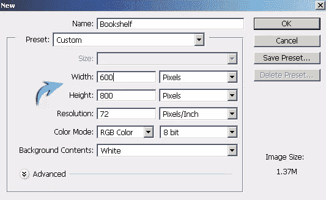](https://www.sitepoint.com/wp-content/uploads/2012/11/110.jpg)

### 第二步

首先，我们将从头开始制作一个漂亮的木头纹理。选择“图层”>“新建图层”，新建一个图层使用油漆桶工具填充任意颜色。设置#ab540f 为你的前景，设置#dc8a24 为背景色。现在转到“过滤器”>“渲染”>“纤维”使用下列值。

[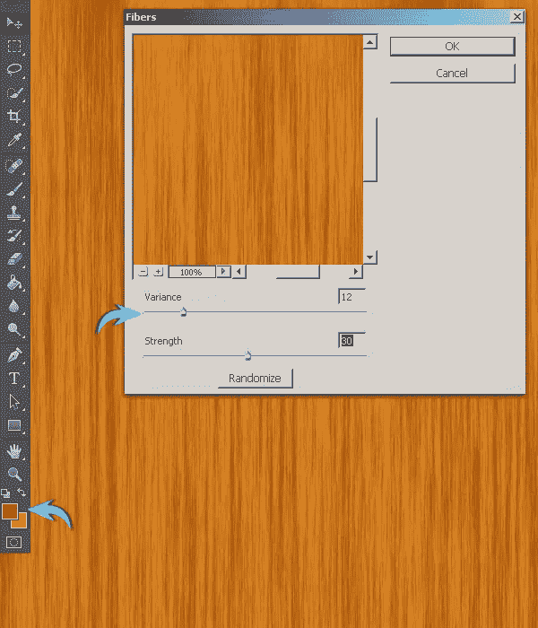](https://www.sitepoint.com/wp-content/uploads/2012/11/22.jpg)

### 第三步

现在，按 Ctrl + "T "激活自由变换工具。将顶部属性栏中的宽度值设置为 50%,并将纹理拖向画布的左半部分。

[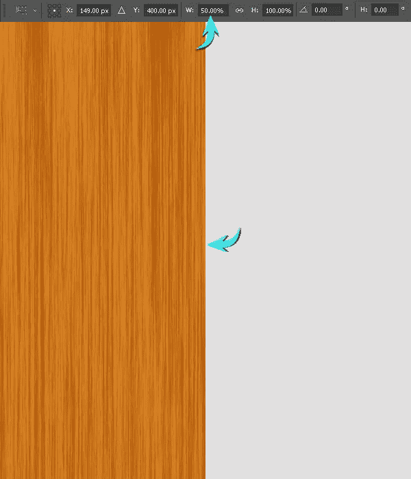](https://www.sitepoint.com/wp-content/uploads/2012/11/32.jpg)

复制纹理层，将其放置在画布的右半部分，垂直翻转以获得各种效果。要做到这一点，点击复制层，然后进入“编辑”>“变换”>“垂直翻转”

选择两个纹理层，右键单击层，并选择合并层的选项。将这个新合并的图层命名为“木头纹理”

### 第四步

接下来，添加噪声到纹理，进入“过滤器”>“噪声”>“添加噪声”在此使用以下值。

[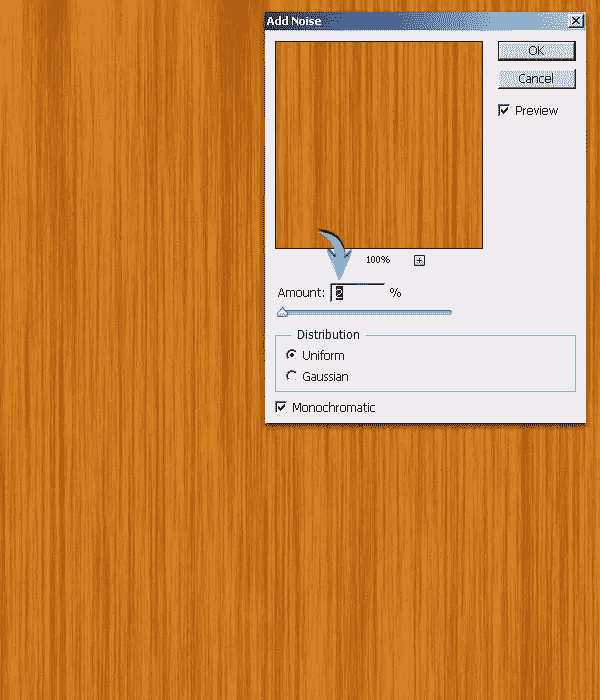](https://www.sitepoint.com/wp-content/uploads/2012/11/41.jpg)

### 第五步

现在，进入“过滤”>“液化”使用如下设置的正向扭曲工具，在纹理的不同点随机应用。

[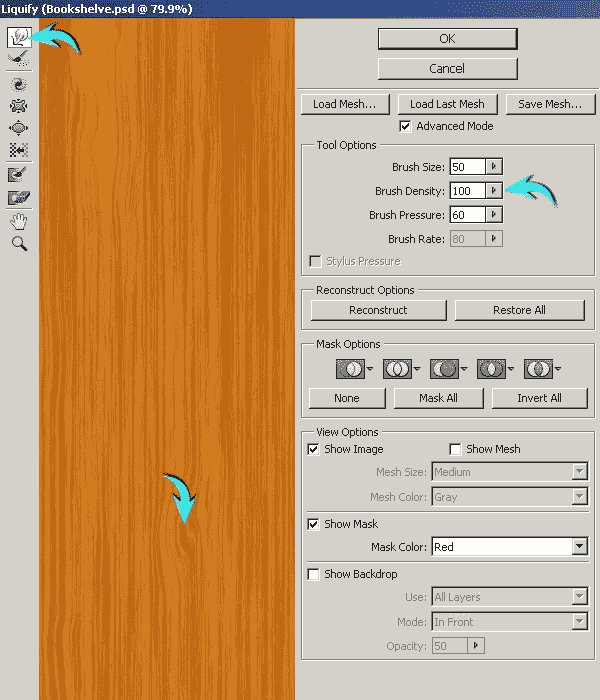](https://www.sitepoint.com/wp-content/uploads/2012/11/52.jpg)

### 第六步

我们完成了木材纹理。现在，使用自由变换工具(Ctrl+ "T ")调整它的大小，宽度使用 560 像素，高度使用 760 像素。

[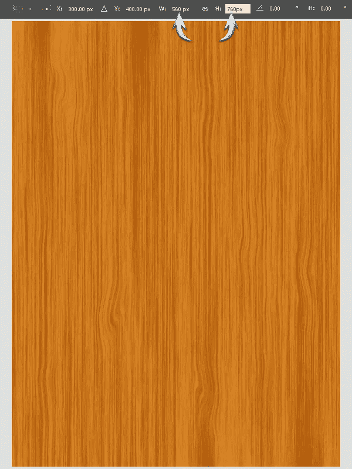](https://www.sitepoint.com/wp-content/uploads/2012/11/62.jpg)

### 第七步

接下来，我们将制作搁板侧面。首先，我们必须为此放置一些参考线，按 Ctrl + "R "使标尺可见。选择矩形工具绘制一个矩形，如下图所示。将此矩形放置在纹理的左侧，拖动垂直参考线，并将其放置在矩形旁边。现在，将矩形放在纹理的右边，沿着它的边界放置另一条引导线。

[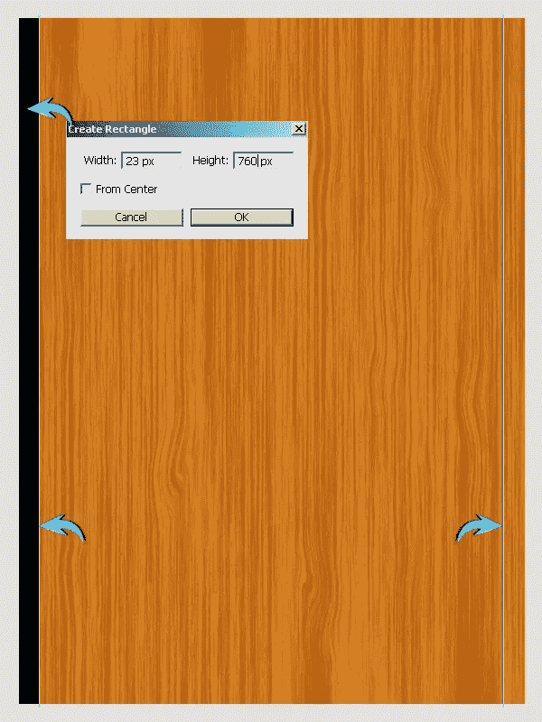](https://www.sitepoint.com/wp-content/uploads/2012/11/72.jpg)

### 第八步

接下来，制作架子侧面的内部部分；沿着引导线的内侧放置矩形。现在，稍微增加矩形的宽度。

现在，按 Ctrl+ <click on="" the="" rectangle="" layer="">在它周围做一个选区，点击木材纹理层，按 Ctrl+“C”复制纹理上的选区，按 Ctrl+“V”粘贴到一个新层上。将该图层标记为“内部左侧边框”</click>

[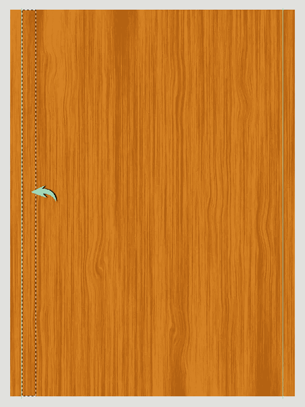](https://www.sitepoint.com/wp-content/uploads/2012/11/8b.jpg)

### 第九步

双击“左边界内”层打开图层样式窗口，使用以下设置进行颜色叠加。

[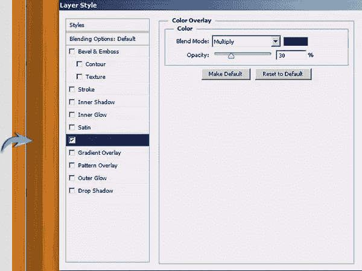](https://www.sitepoint.com/wp-content/uploads/2012/11/91.jpg)

### 第十步

接下来，要形成它的阴影，按 Ctrl + <click on="" the="" border="" inside="" layer="">在它周围做一个选区，在下面新建一个层，用纯黑色填充选区。现在按 Ctrl + "D "取消选择它，并前往"过滤器" > "模糊" > "高斯模糊。"在这里使用 2px 的值，并向外拖动该层一点，使其可见。</click>

[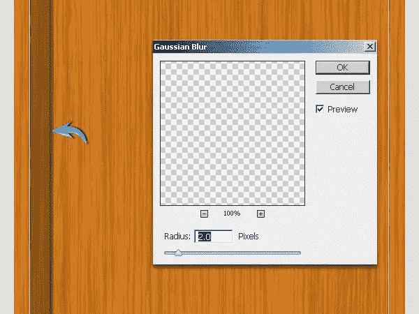](https://www.sitepoint.com/wp-content/uploads/2012/11/102.jpg)

### 步骤 11

收集“左边框内”层和它的阴影在一个单一的组，复制该组，并将其水平翻转。将其放置在右侧导轨内，形成对面的搁板。

[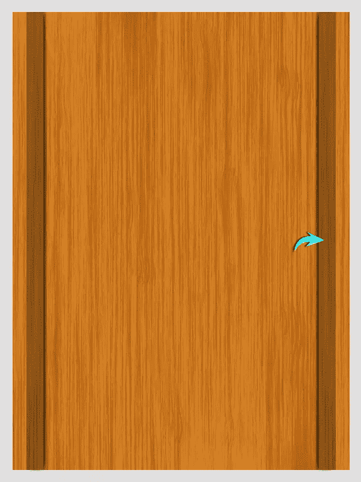](https://www.sitepoint.com/wp-content/uploads/2012/11/111.jpg)

### 步骤 12

如下图画一个矩形。

[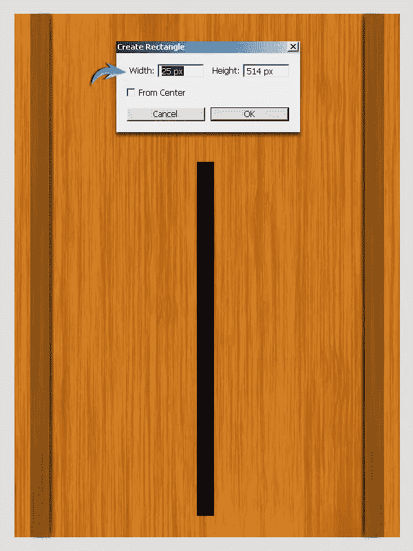](https://www.sitepoint.com/wp-content/uploads/2012/11/123.jpg)

现在，按 Ctrl + <click on="" the="" rectangle="" layer="">。现在，点击木制纹理，按 Ctrl + "C "复制，按 Ctrl + "V "粘贴选定的纹理到一个新的层。之后，进入“编辑”>“变换”>“旋转 90⁰CW.”将其放置在纹理的底部，如下所示。将该层标记为“货架正面”然后，隐藏或删除矩形。</click>

[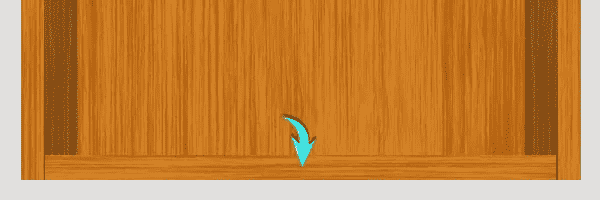](https://www.sitepoint.com/wp-content/uploads/2012/11/12b.jpg)

### 第十三步

应用下面的渐变叠加设置在“货架前”层。

[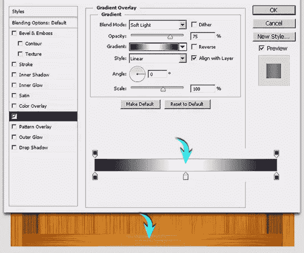](https://www.sitepoint.com/wp-content/uploads/2012/11/131.jpg)

### 步骤 14

复制“货架前”层，将其标记为“货架顶部”，将其放置在原始层的顶部，然后进入“编辑”>“变换”>“扭曲”如下图所示，用这个工具把它的角带进去。

[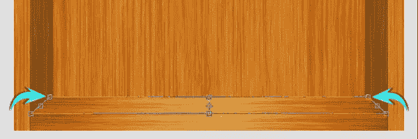](https://www.sitepoint.com/wp-content/uploads/2012/11/141.jpg)

### 第十五步

应用下面的图层样式设置在“货架顶部”层。

[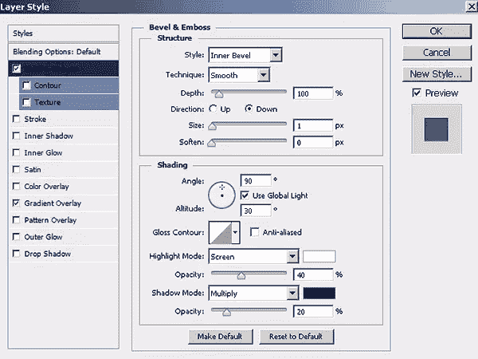](https://www.sitepoint.com/wp-content/uploads/2012/11/152.jpg)

[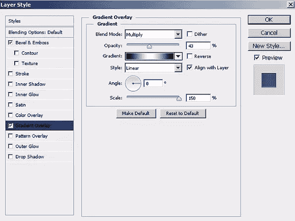](https://www.sitepoint.com/wp-content/uploads/2012/11/15b.jpg)

[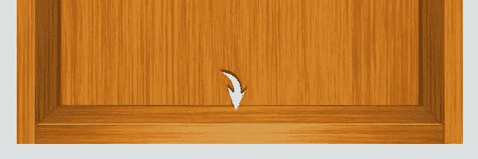](https://www.sitepoint.com/wp-content/uploads/2012/11/15c.jpg)

### 第十六步

按照步骤 10 中所解释的方法制作“书架顶”层的阴影。

[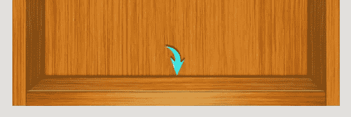](https://www.sitepoint.com/wp-content/uploads/2012/11/161.jpg)

将构成底部搁板的所有层收集到一个组中，并将其标记为“底部搁板”

### 步骤 17

现在，我们将使用更多的参考线来定义中间搁板的位置。如下图画一个矩形。

[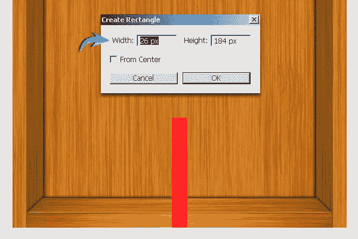](https://www.sitepoint.com/wp-content/uploads/2012/11/172.jpg)

拖动导轨形成水平搁板，如下图所示。

[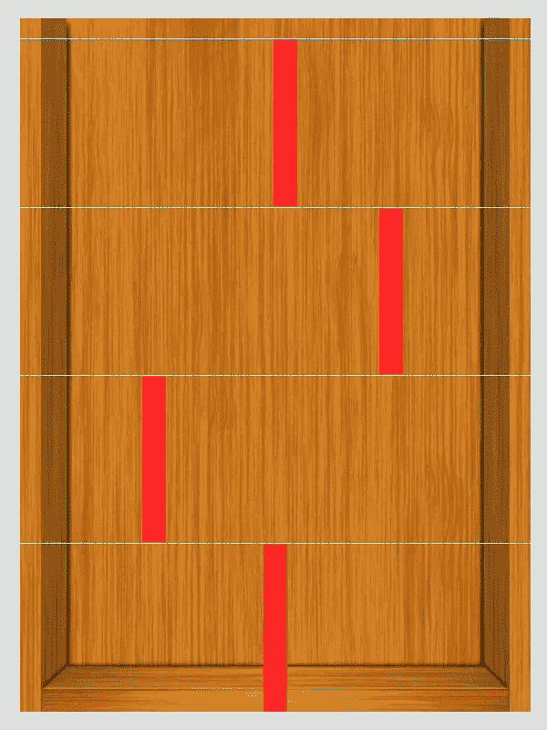](https://www.sitepoint.com/wp-content/uploads/2012/11/17b.jpg)

### 步骤 18

复制“底架”层，如下图所示放置。

[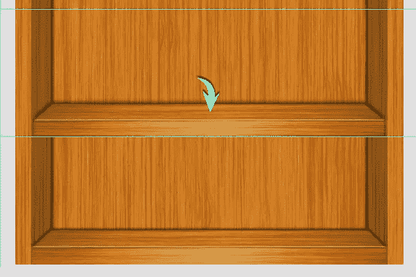](https://www.sitepoint.com/wp-content/uploads/2012/11/181.jpg)

要制作它的阴影，画一个矩形如下，并应用 7px 高斯模糊过滤器。

[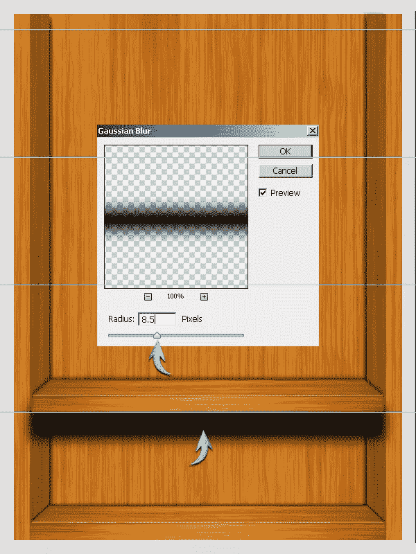](https://www.sitepoint.com/wp-content/uploads/2012/11/18b.jpg)

### 步骤 19

现在，使用多边形套索工具在阴影层选择一个三角形区域。

[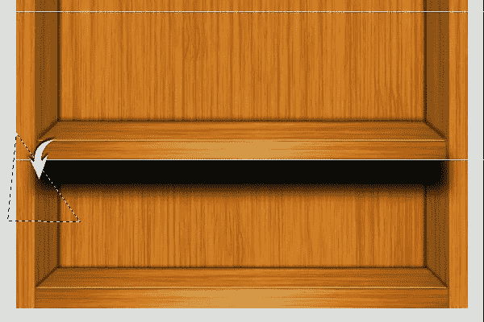](https://www.sitepoint.com/wp-content/uploads/2012/11/191.jpg)

之后，进入“编辑”>“清除”对阴影的右边做同样的操作，将阴影层的不透明度降低到 50%。

[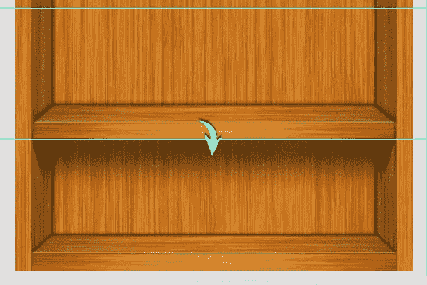](https://www.sitepoint.com/wp-content/uploads/2012/11/19b.jpg)

### 步骤 20

将该组标为“中间搁板”，重复几次，并将搁板放置在每个水平导轨上，如下图所示。

[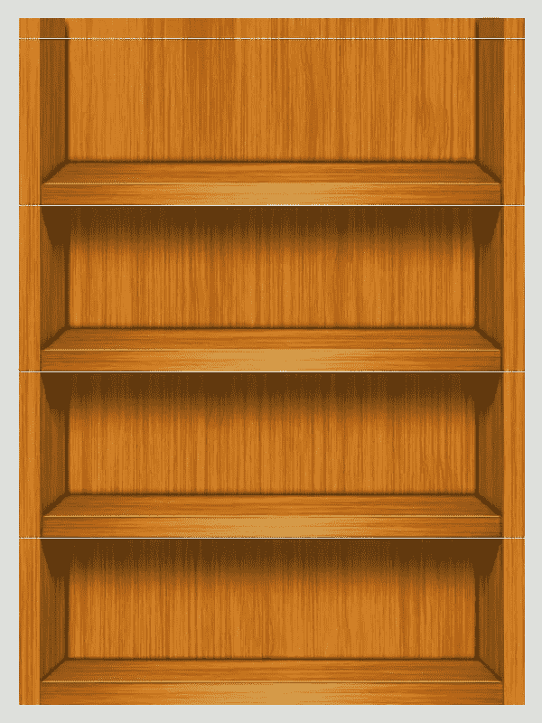](https://www.sitepoint.com/wp-content/uploads/2012/11/202.jpg)

### 步骤 21

要制作顶部边框，请在顶部参考线上方放置一个中间搁板的副本，并从该组中擦除搁板顶层，包括其阴影。

[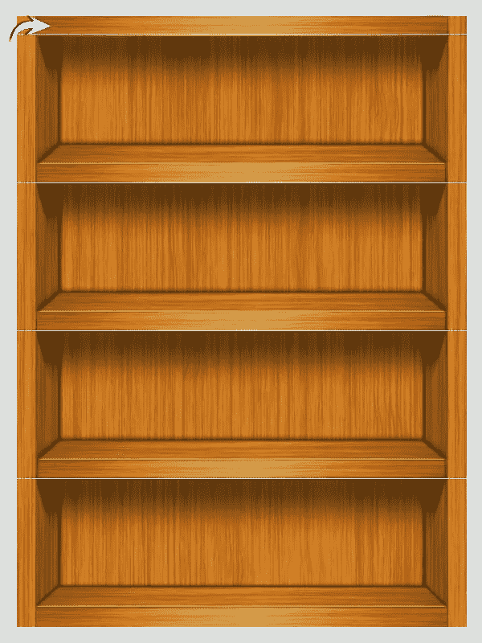](https://www.sitepoint.com/wp-content/uploads/2012/11/211.jpg)

### 步骤 22

我们的木制奖杯陈列柜差不多准备好了。您可以使用与创建中间搁板阴影相同的技术来创建它的阴影。然而，这次做一个更薄的矩形。

[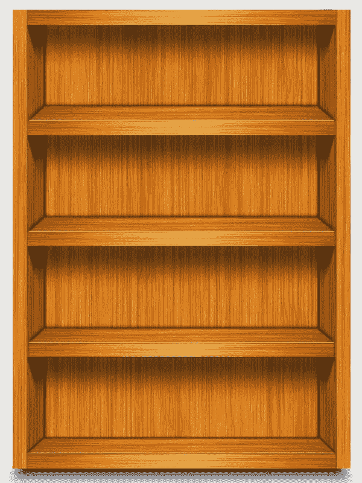](https://www.sitepoint.com/wp-content/uploads/2012/11/221.jpg)

这是展示书籍后的样子。

[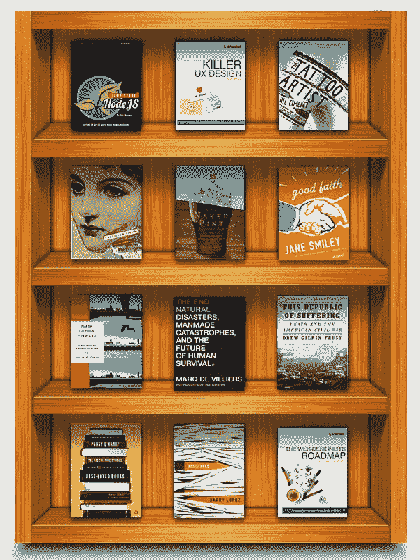](https://www.sitepoint.com/wp-content/uploads/2012/11/Final-result2.jpg)

就是这样。我希望你们喜欢这个教程，并学到一些新东西。请分享你的想法！** 

## **分享这篇文章**