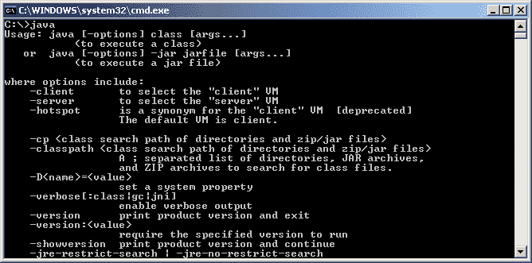
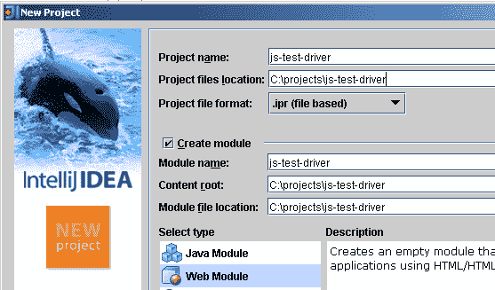
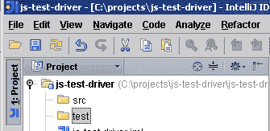
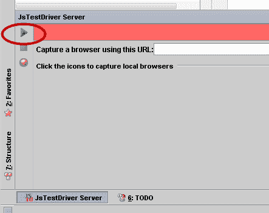
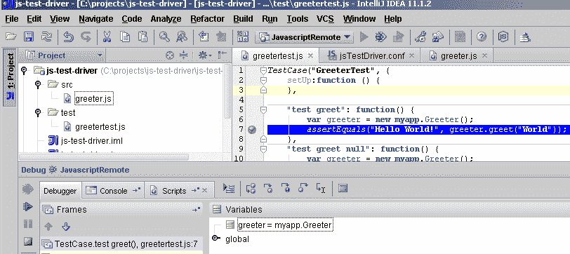

# 使用 js-test-driver 调试单元测试

> 原文：<https://www.sitepoint.com/debugging-unit-tests-using-js-test-driver/>

单元测试和测试驱动开发(TDD)是当今常见的范例。如果你是一名 JavaScript 开发人员，Google 已经创建并开源了一个名为 [js-test-driver](http://code.google.com/p/js-test-driver/) 的伟大工具来帮助单元测试。js-test-driver 是一个秉承 [JUnit](http://junit.sourceforge.net/) 精神的 JavaScript 单元测试运行器，将 TDD 引入 JavaScript。

## 单元测试概述

如果您以前从未做过任何单元测试，也没有进入过 TDD 的世界，您可能会问自己有什么好处。关于这个问题有许多详细的讨论，但我将谈几个更重要的问题。

*   单元测试在回归测试中很有用。您可以在进行代码更改后运行单元测试，并确保一切都像以前一样工作。这在动态语言中尤其重要，比如 JavaScript，它不会给你编译错误。
*   项目越复杂/越大，单元测试给你带来的投资回报就越多
*   一套全面的单元测试几乎和文档一样好。有了一套好的单元测试，开发人员可以打开一个项目并开始运行/调试单元测试，以更好地理解系统。这对新团队成员的入职非常有帮助。
*   JUnit 是一个流行的 Java 测试框架，它在测试驱动开发中至关重要。许多现有的测试框架遵循 JUnit 的命名约定和习惯用法。

## 配置您的系统

本教程将教您如何在集成开发环境(IDE)中设置断点和调试单元测试。我们将关注智能集成开发环境。本教程使用 Microsoft Windows 环境，但是通过调整环境变量应该可以在大多数操作系统上工作。您还需要遵循以下说明:

1.  下载并安装 IntelliJ。你可以从 JetBrains 网站下载 IntelliJ。
2.  如果您还没有这样做，请下载并安装 [Java 开发工具包(JDK)](http://www.oracle.com/technetwork/java/javase/downloads/index.html) 。
3.  在 IntelliJ 中，确保已经安装了 js-test-driver 插件。如果你不知道怎么做，请参考 [JetBrains 安装插件的说明](http://www.jetbrains.com/idea/webhelp/updating-installing-and-uninstalling-plugins-from-a-repository.html)。
4.  下载最新的 [js-test-driver.jar](http://code.google.com/p/js-test-driver/downloads) 。在撰写本文时，最新版本是 1.3.5。出于本教程的目的，将 jar 保存到`C:devtoolswebjsjs-test-driver1.3.5js-test-driver-1.3.5.jar`。
5.  Add the following environment variables so that the Java runtime can be invoked from the command line.

    ```
    JAVA_HOME=C:Program FilesJavajdk1.7.0_7 (or the location of your java install)
    PATH=%JAVA_HOME%bin;%PATH%

    ```

    您可以通过打开命令提示符并键入`java`来验证安装。如果 Java 安装正确，您应该会看到类似下面截图所示的输出。

    
6.  Create a new project in IntelliJ by going to the top menu and clicking `File | New Project`. I have created an IntelliJ project with a Web Module at `C:projectsjs-test-driver`. The IntelliJ settings are shown in the figure below.
7.  In TDD and unit testing, it is always a good idea to have a clean, concise separation between your production code and your test code. Create the directories `src` and `test` in the IntelliJ project root. After creating these directories, your project should look like the following screenshot.

## 入门指南

1.  我们将添加 js-test-driver 项目中的“greeter”示例。在`src`目录下创建一个名为`greeter.js`的新 JavaScript 文件，并添加以下代码。

    ```
    myapp = {};
    myapp.Greeter = function() {};
    myapp.Greeter.prototype.greet = function(name) {
      return "Hello " + name + "!";
    };
    ```

2.  现在我们将创建单元测试。在`test`目录下创建相应的 JavaScript 测试文件`greetertest.js`，并添加以下代码。

    ```
    TestCase("GreeterTest", {
      setUp:function () {
      },
      "test greet": function() {
        var greeter = new myapp.Greeter();
        assertEquals("Hello World!", greeter.greet("World"));
      },
      "test greet null": function() {
        var greeter = new myapp.Greeter();
        assertNull(greeter.greet(null));
      }
    });
    ```

3.  In `greetertest.js`, IntelliJ will not understand the `TestCase` class, and will highlight it in red. Click `TestCase` and you will be prompted for the JetBrains suggested intention. Next, click `Add JsTestDriver assertion framework support`, as shown in the following figure. Doing this will add IntelliJ IDE support for js-test-driver.
4.  Create a file named `js-test-driver.conf` in the root of your project. For the purposes of this tutorial, the full path would be `C:projectsjs-test-driverjs-test-driver.conf`. Add the information shown in the following image to `js-test-driver.conf`.
5.  现在让我们用断点来设置调试项目。在`testgreet()`函数内的文件`greetertest.js`中设置一个断点。您可以在 IntelliJ 中通过单击左边来设置断点。
6.  Create a new IntelliJ Run/Debug configuration of type `JavaScript Debug | JavaScript` as shown below.
7.  更改以下值:
    *   要打开的网址:`http://localhost:9876/capture`
    *   展开目录`test`并输入`http://localhost:9876/test/test`作为远程 URL
8.  As we have seen so far, IntelliJ provides excellent js-test-driver integration. To start the js-test-driver server from directly within IntelliJ, expand the `JsTestDriver Server` menu item and click the green play button, as shown below.
9.  Now let’s debug our JavaScript from within IntelliJ! Start the Debug Configuration we created earlier called `JavascriptRemote`. You can do so by selecting `Run | Debug` from the menu. A new browser window will open with the js-test-driver remote console runner loaded as shown below.
10.  接下来，打开一个新的命令提示符。`cd`到 IntelliJ 项目的根。出于这个项目的目的，该目录是`C:projectsjs-test-driver`。输入以下命令:

    ```
    java -jar C:devtoolswebjsjs-test-driver1.3.5js-test-driver-1.3.5.jar --tests all
    ```

11.  After a few moments, IntelliJ should be suspended at the breakpoint we set earlier. Local variables, watch expressions, and other debug goodness will now be available to us. Note: in IntelliJ, intelligent code completion is available in watch expressions!

## 结论

本文已经教你用 js-test-driver 调试 JavaScript 单元测试。现在，您应该能够在 IntelliJ 开发环境中设置断点了。最终，我希望这将帮助你为你当前和未来的项目开发出测试良好的软件。

*   下载本文示例的[源代码](https://github.com/jsprodotcom/source/blob/master/debugging-unit-tests-using-js-test-driver.zip "Debugging Unit Tests Using js-test-driver Source Code")！

## 分享这篇文章