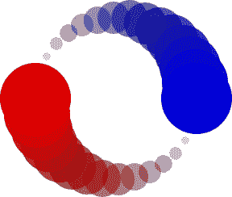
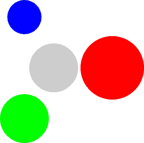

# 如何使用 CSS3 盒阴影复制元素

> 原文：<https://www.sitepoint.com/css3-box-shadow-elements/>

看看以下 [**在火狐、Chrome、Safari、Opera、IE9 或 IE10 中的**](https://blogs.sitepointstatic.com/examples/tech/css3-shadow-repeat/index.html) 演示页面:

[](https://blogs.sitepointstatic.com/examples/tech/css3-shadow-repeat/index.html)

圆圈是使用 DOM 元素创建的，而不是 canvas、SVG、Flash 或其他替代工具。

问题:*不看源代码，需要多少个 DOM 元素？*

看了这篇文章的标题，答案应该是显而易见的。仅使用一个元件；在这种情况下，它是一个 ID 为“element”的单个`DIV`。它实际上是一个看不见的圆圈，因为它的颜色与背景相匹配。

其他的圆是在 CSS 中使用`box-shadow`属性的一个鲜为人知的特性定义的。它允许你在任何位置、任何尺寸、任何颜色、任何次数地复制任何元素的形状。该属性有六个参数:

1.  **插入** : *(可选)*如果定义，阴影将出现在元素内部
2.  **水平**:距离元素的 x 距离
3.  **垂直**:离元素的 y 距离
4.  **模糊** : *(可选)*模糊半径，即 0 表示无模糊
5.  **扩散** : *(可选)*阴影扩散的距离，即 1px 向所有方向延伸阴影 1 个像素，因此它比父元素宽和高 2px
6.  **颜色**:阴影颜色

我们可以使用水平和垂直距离进行相对定位。扩展可以是正的或负的，以使阴影大于或小于父元素。由于可以定义多个阴影，我们可以多次复制原始形状，例如

```
#element
{
	width: 100px;
	height: 100px;
	background-color: #ccc;
	border-radius: 50px;
	box-shadow: 120px    0px 0  15px #f00,
				-60px  104px 0   0px #0f0,
				-60px -104px 0 -15px #00f;
}
```



记住你的形状也可以有:before 和:after 伪元素，它们有自己的阴影框。

下一个问题:*这个有用吗？*

这个问题比较难回答，但是在开发具有重复形状的页面时，可以考虑这个选项。这当然可以帮助[减轻页面重量](https://www.sitepoint.com/web-page-weight-2012/)。

显然，有可能将这种技术发挥到极致，使用框阴影创建完整的可缩放图形，例如

*   [像素忍者](http://codepen.io/HugoGiraudel/pen/dIDEx)
*   [蒙娜丽莎](http://cssdeck.com/labs/mona-lisa-with-pure-css)

然而，这是毫无意义的，因为 PNG 或 SVG 可能更有效，也更容易创建。但是让我知道你是否对任何有趣的东西使用重复的盒子阴影技术…

## 分享这篇文章