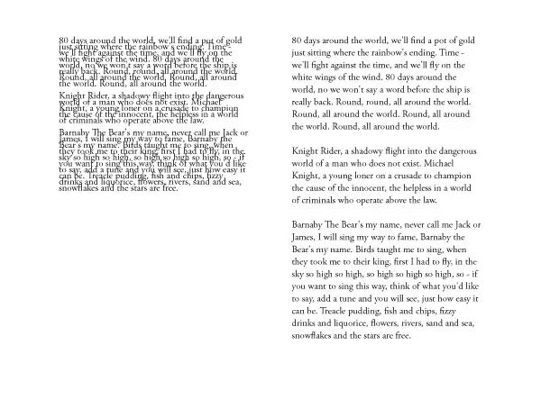
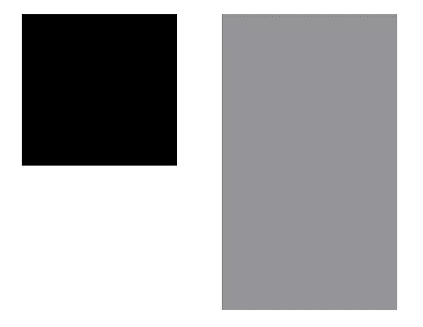
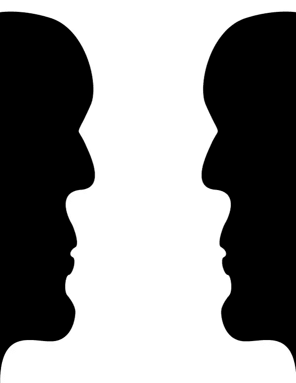
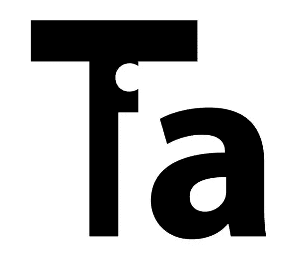
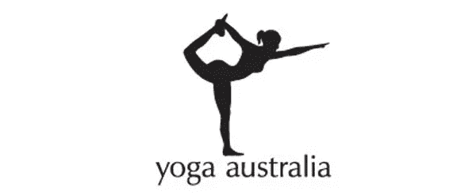
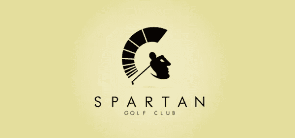

# 对负空间的深刻理解

> 原文：<https://www.sitepoint.com/a-solid-understanding-of-negative-space/>

你有没有看过一个设计，意识到你喜欢它或不喜欢它，但你不知道为什么？你喜欢它的什么？你不喜欢什么？你能把你的手指放在上面吗？最有可能的是，你喜欢或不喜欢它的原因是因为它有大量的负面空间。

### 负空间定义

负空间是定义它的对象周围的空白或开放空间。通俗地说，就是主体周围的呼吸空间决定了它看起来有多吸引人。大多数人不喜欢设计过于拥挤。给你的主体和其他物体足够的负空间会给它们更多的清晰度。设计元素不会在视觉上融合成一个大块。相反，元素被分解成几个部分，使得它们更容易处理离散块中的信息。这比试图一次处理整个设计及其所有部分要容易得多。让我们看几个例子。

### 为什么负空间如此有效

玩负空间，并利用它为你的优势是一个很好的方式来获得大量的设计作品的关注。当有人看到一个设计有良好的负空间的作品时，观众可以毫不费力地评价和欣赏这个设计。关键因素是他们不用太辛苦。巨大的负空间和阴谋之间的健康平衡会吸引观众花额外的时间看你的设计。

负空间的设计通常非常简单，但观众可以看出这件作品有更多的内容。一个创造性的负空间设计对观者来说更有价值；他们有一种被包容的感觉，因为他们发现了一个微妙的隐藏信息或图像。人们天生喜欢被包容和被告知的感觉。他们喜欢感觉自己是内部信息的秘密，所以当他们看到标志或设计中的负空间的创造性使用时，它会在他们的脑海中出现。这是给你的设计增加吸引力的非常有效的方法。

### 负空间与构成

负空间对构图以及你的作品在视觉上被接受的方式有着巨大的影响。当一个设计没有足够的负空间时，这个设计即使可能很简单，也会显得拥挤和复杂。下面的例子使用了一个女人的图像和一个标题作为设计，但是很少有负面的空间。很难把注意力集中在重要的事情上，因为图像占据了大部分的视觉存在。文字必须与图像竞争注意力，整个布局看起来比实际更复杂。

下面是一个更好地利用负空间的例子。这位女士的照片更符合构图，她的肖像和右边的字体之间有足够的空间。logo 放在右下角，给每个元素足够的空间。字体得到了更多的关注，焦点更多地集中在信息上，而不是图像上。图像应该是一个辅助元素，而不是主要焦点。

### 类型中的负空格

负空间不仅仅用于完整的构图；它也可以增强字体。如果你了解印刷术，每行文本之间的负空间叫做行距。行距使字体更加清晰。当阅读两段文字时，一段几乎没有引导，一段没有，很容易理解为什么引导如此重要。

正如你在上面的图片中看到的，每行之间的空格(前导)使得文本更容易阅读。当文本行之间没有足够的行距时，你的眼睛很难确定下一行文本在哪里，所以你会经常重读或跳过一行文本。这可能会令人沮丧，甚至导致有人突然停止阅读文本，这是任何设计师都不希望看到的。

负空间的类型，也结合重量，创造了一个页面上的视觉纹理。仅从字体来看，这可能很难理解，但是如果你眯着眼睛，你会看到负空间创建的整体关系，这是由于你所看到的空间比例以及字母和单词是如何关联的。眯着眼睛看时，即使字体大小和粗细相同，低行距也会使左侧的文本区域看起来更暗，因为它更密集。因为右边的文字更分散，所以不会引起太多的注意。记住这一点可以让你的标题更加突出，这是它们应该做的。

### 图形/背景(当正负空间竞争时)

这就是乐趣的开始。很多时候，设计师会创建一个设计，使用竞争的积极和消极的空间来放置隐藏的图像。这种效果的关键通常是保持简单的形状。下面是一个竞争空间的主要例子。白色区域看起来像花瓶或雕像。黑色区域看起来像两张互相凝视的脸。

负空间也用在其他方面。格式塔原则是定义我们如何感知不同设计技术的基本法则。其中一个格式塔原则叫做完成。在这里，图像信息可能不会全部呈现或者用线来定义，但是我们的眼睛为我们完成了形状。下面的例子是“Tia”，因为我们的眼睛自己完成了“I”的形状，而字母的右侧没有被勾勒出来。

负空间最常见的创造性用途是创建一个巧妙的标志。重点是用正空间作为文字或者一个图像，而[负空间形成另一个图像](https://www.sitepoint.com/embracing-negative-space-in-your-designs-white-space-tips-to-consider-and-examples-to-admire/ "Embracing Negative Space in Your Designs: White Space Tips to Consider and Examples to Admire")。这是为了创造一个与名字相关联的心理形象。从品牌的角度来看，这可能是一个强大的工具，让一个标志持久的力量。持久力指的是能够在任何人的脑海中留下深刻印象。下面是一些创造性使用负空间的明星标志的例子。

NBC 的孔雀是负空间的一个很好的例子。简单的彩色形状形成了孔雀的羽毛。羽毛周围的负空间赋予它们更多的清晰度和对称性，使羽毛易于加工。负空间也形成了孔雀的身体和头部。延续的格式塔原理迫使我们的眼睛自己完成形状。

澳大利亚瑜伽标志是一个别出心裁的标志，它使用正面的形状来创造做瑜伽的人，她的手臂和腿内的负面空间形成了澳大利亚本身的形状。这个标志很简单，但是很有视觉冲击力。

这大概是我见过的印象最深刻的负空间 logos 之一。积极的形状创造了一个高尔夫球手，并显示了他的挥杆弧线，而消极和积极的空间相结合，创造了斯巴达士兵的脸和头盔。

### 结论

负空间是每个设计的一个重要方面。负空间可以改变设计的焦点、设计的整体外观、设计的易读性以及我们对设计表现的整体感知。你可以创造性地利用负空间，鼓励观众在你作品的负空间中找到隐藏的图像，从而为你的设计获得更多的关注和保留。通过使用创造性的图像，你的观众更有可能记住设计的意图信息。

你知道创造性的负面空间引起你注意的时候吗？你有没有以一种创造性的方式创造出一个利用负空间的设计？它让你的客户的生意更成功了吗？在下面的评论区分享你的想法。

## 分享这篇文章