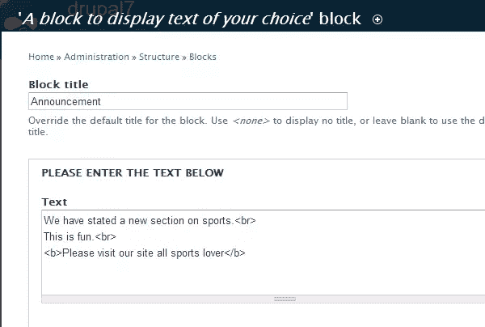
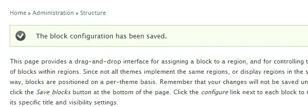

# 在 Drupal 中创建 Textblock 模块

> 原文：<https://www.sitepoint.com/creating-a-textblock-module-in-drupal/>

Drupal 是一个内容管理系统，为创建网站提供了一个灵活且非常强大的平台。

它还提供了一个非常灵活的框架，可以通过添加更多功能来扩展 Drupal 本身。这可以通过模块来实现。Drupal 模块只是挂接到所提供的钩子上，并将它们自己的功能添加到系统中。

Drupal 允许您定义块模块，您可以从管理中定义这些模块，包括您希望块在站点上显示的位置。在这篇文章中，我们将创建一个块模块，您可以在其中定义一些文本，如公告，并将其显示在您的网站上。

## 创建 textblock 模块

为了创建我们的模块，让我们首先在 **sitesallmodulescustom** 中创建一个名为 **textblock** 的目录。在 **textblock** 目录中，我们将创建一个名为`textblock.info`的文件。在这个文件中，我们指定了模块的名称、描述以及模块的文件。这个文件告诉 Drupal 系统我们的模块存在，并显示在模块列表中。

现在让我们用以下内容创建两个文件`textblock.info`:

```
;$Id$
name = textblock
description = A module to display a block of text
core = 7.x
files[] = textblock.module
```

这会创建一个名为 **textblock** 的模块，然后创建一个名为`textblock.module`的空文件。这将是一个文件，我们将把代码放在这个文件中，以挂钩到 Drupal 提供的不同挂钩中，我们将需要为 textblock 模块编写这些代码。

一旦我们完成了这些，如果一切都是正确的，我们应该能够在 Drupal admin 的模块列表中看到我们的模块名称，如图所示。您可以启用文本块模块。

******

## 将帮助链接添加到 to textblock 模块

一旦我们启用了我们的模块，它什么也不做，因为我们没有向我们的`textblock.module`文件添加任何东西。让我们给我们的模块添加一些功能。

我们添加到模块中的第一件事是帮助链接。我们将挂钩 Drupal 提供的帮助挂钩。我们必须在模块中编写一个名为`function textblock_help($path, $arg)`的函数，如下所示:

```
function textblock_help($path, $arg) {
    switch ($path) {
        case "admin/help#textblock":
            return '<p>'.  ("This is a simple block module to display some text on screen") .'</p>';
            break;
    }
}
```

要为我们的模块添加帮助，我们必须在帮助挂钩中的路径为`admin/help#textblock`时返回帮助文本。

一旦我们添加了 help 挂钩的代码，我们应该能够在模块名称旁边看到一个 help 链接，如下所示。


单击帮助链接后，帮助将打开，并显示我们提供的文本，如下所示:


你可以在[http://API . Drupal . org/API/Drupal/modules % 21 help % 21 help . API . PHP/function/hook _ help/7](http://api.drupal.org/api/drupal/modules%21help%21help.api.php/function/hook_help/7)阅读更多关于帮助挂钩的信息

## 添加文本块的块

在一个模块中，Drupal 允许我们为您的模块定义一个或多个块。这是在`block_info`钩的帮助下完成的。在这个钩子中，我们的模块必须返回一个关联数组，其中数组键是块的唯一标识符。为了实现`block_info`钩子，在`textblock.module`文件中编写以下函数。

```
function textblock_block_info() {
    $blocks = array();
    $blocks['text_block'] = array(
    'info' => t('A block to display text of your choice'),
'cache' => DRUPAL_NO_CACHE,
    );
    return $blocks;
}
```

添加上述功能后，您将能够在您的阻止列表中看到该阻止，如下所示。


想了解更多关于`block_info`钩子的信息，你可以访问[http://api.drupal.org/api/drupal/modules!阻挡！block.api.php/function/hook_block_info/7](http://api.drupal.org/api/drupal/modules!block!block.api.php/function/hook_block_info/7)

## 为文本块添加配置

添加了块信息后，我们将了解如何配置块。对于我们的 textblock，我们希望从管理员那里获取要在网站上显示的文本。为了配置模块，我们必须连接到`hook_block_configure hook`。这个钩子作为我们给块的唯一标识符被传递，并且这个钩子必须返回一个表单，以防我们在配置中需要额外的字段。

我们的钩子的实现如下:

```
function textblock_block_configure($delta = '') {
    $form = array();
    if ($delta == 'text_block') {

    $form['text_block'] = array(
    '#type' => 'fieldset',
    '#title' => t('Please enter the text below'),
    );

    $form['text_block']['text_block_full_text'] = array(
    '#type' => 'textarea',
    '#title' => t('Text'),
    '#default_value' => variable_get('text_block_full_text', ''),
    );

}

return $form;
}
```

在这种情况下，我们检查唯一标识符是否是我们块的唯一标识符。如果是这种情况，我们创建一个表单，其中一个字段集只显示下面输入的文本，另一个字段集作为文本区域，用户可以在其中添加他希望在网站上显示的文本。

一旦我们添加了表格并点击块**配置**按钮，将出现以下内容，我们可以在其中添加块标题和文本。



想了解更多关于`block_configure`的信息，你可以去参观[http://api.drupal.org/api/drupal/modules!阻挡！block.api.php/function/hook_block_configure/7](http://api.drupal.org/api/drupal/modules!block!block.api.php/function/hook_block_configure/7)

## 保存文本块的配置

一旦我们添加了表单来配置块，我们必须确保一旦用户输入值并保存，它就保存文本的值。为了保存该值，我们必须挂钩到`hook_block_save`，获取文本区域的值，并将其保存到 Drupal 数据库，以便以后可以检索。

我们模块的`hook_block_save`代码如下:

```
function textblock_block_save($delta = '', $edit = array()) {
    if ($delta == 'text_block') {
        variable_set('text_block_full_text', $edit['text_block_full_text']);
    }
}
```

在这个函数中，我们只需获取文本区域的值，然后使用 Drupal 函数`variable_set`将其存储在一个名为`text_block_full_text`的变量中。现在，一旦用户输入文本并单击保存配置，文本将被保存，并将显示以下消息。



## 显示前端的文本

一旦我们使用块配置保存了要在前端显示的文本，我们将看看如何显示它。要显示内容，我们必须连接到`hook_block_view`。

这个挂钩的代码如下:

```
function textblock_block_view($delta = '') {
    if ($delta == 'text_block') {
        $content = variable_get('text_block_full_text', '');
        $block = array(
        'content' => $content,
        );
        return $block;
    }
}
```

在上面的函数中，如果块的唯一标识符是`text_block`，那么我们使用函数`variable_get`获取保存在数据库中的文本。然后我们返回该块内容。

一旦我们完成了这个挂钩，我们将能够在网站上看到我们的文本，如下所示。


## 结论

Drupal 提供了一个灵活的框架，可以在基本的 Drupal 平台上扩展和创建站点。Drupal 的钩子机制使得模块开发人员可以很容易地钩入系统并创建更多的功能。

在本文中，我们创建了一个 block 模块，帮助用户使用 Drupal 的不同钩子轻松地在站点上显示文本。让我知道你的进展。

## 分享这篇文章