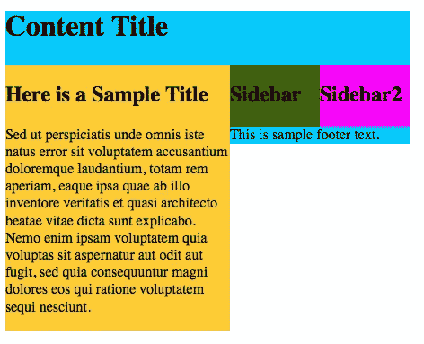
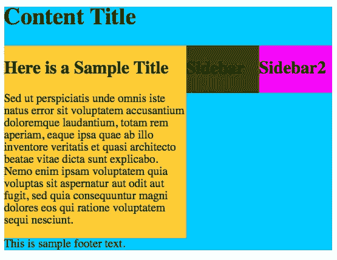
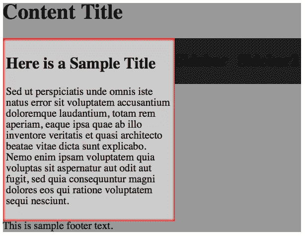
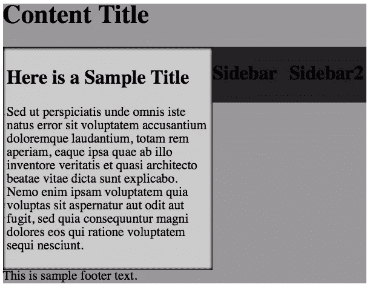
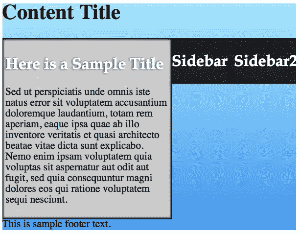
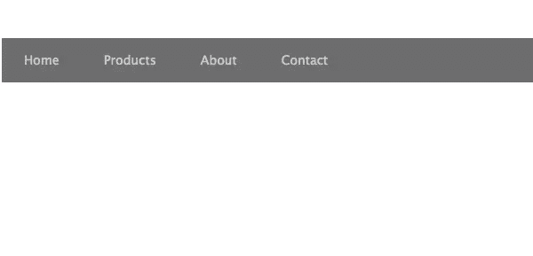
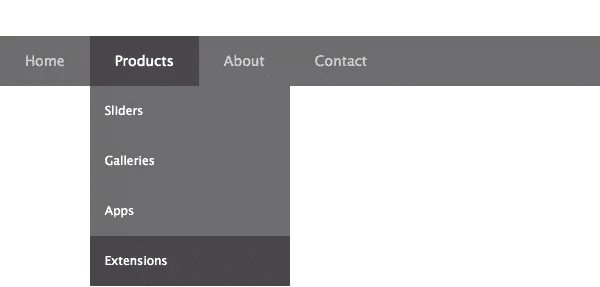
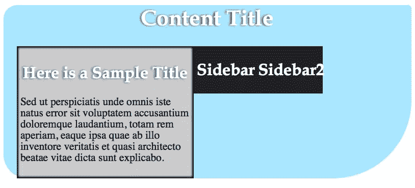

# 让设计师满意的 5 个 CSS 属性

> 原文：<https://www.sitepoint.com/5-css-properties-that-give-designers-fits/>

在很大程度上，用 CSS 样式化一个站点是相当简单的。只要您已经在语义上标记了 HTML，并以合理的方式设计了 div 和类，设计过程应该非常容易。然而，有一些 CSS 属性是大多数设计者所不知道的，我们中的许多人都被那些更麻烦的 CSS 属性所困扰。它们并不简单，需要稍加解释才能理解它们是如何工作的。下面是五个比较笨拙的 CSS 属性，以及将它们重新控制在你的控制之下的最佳方法。

### 清楚的

所以让我们假设你正在建立一个网站，并用 CSS 来设计它的样式。您有一个容器 div。在其中，您使用了“float”属性，并且还有两个 div——一个用于您的内容，一个用于您的侧边栏。完成后，您会注意到您的容器没有一直向下扩展到两个 div 容器之外。它最终会把周围的一切都弄得乱七八糟，看起来不太对劲。以下是 HTML 代码:

```
<div id="container">
<h1>Content Title</h1>
<div id="content">
<h2>Here is a Sample Title</h2>
<p>Sed ut perspiciatis unde omnis iste natus error sit voluptatem accusantium doloremque laudantium, totam rem aperiam, eaque ipsa quae ab illo inventore veritatis et quasi architecto beatae vitae dicta sunt explicabo. Nemo enim ipsam voluptatem quia voluptas sit aspernatur aut odit aut fugit, sed quia consequuntur magni dolores eos qui ratione voluptatem sequi nesciunt.</p>
</div>
<div id="sidebar">
<h2>Sidebar</h2>
</div>
<div id="sidebar2">
<h2>Sidebar2</h2>
</div>
<div id="footer">This is sample footer text.</div>
</div>
```

我们这里有一个容器，所有东西都以一定的宽度存放，内容在容器内流动。我们有一个内容区和两个侧边栏。它们都向左浮动，所以它们在一条直线上。然后，在它下面有一个页脚。让我们来看看你对这些 div 的 CSS 期望是什么样的:

```
#container{
background:#0CF;
width:450px;
}
#content{
background:#FC3;
width:250px;
float:left;
}
#sidebar{
float:left;
background:#360;
width:100px;
}
#sidebar2{
float:left;
background:#F0F;
width:100px;
}
#footer{
}
```

[](https://www.sitepoint.com/wp-content/uploads/2012/10/Screen-shot-2012-10-24-at-10.54.20-AM.png)

以上结果出乎意料。内容列比侧栏内容长，容器 div 没有一直延伸到内容之外，将页脚挤入了可用空间。只用一行 CSS 就可以解决所有这些问题，你不会相信这有多简单。在页脚中，您可以放置下面一行 CSS:

```
#footer{
clear:both;
}
```

就是这样！现在你应该有一个包含 H2 标题的容器 div 了。在那之下，在一行中，你将有内容 div 和 2 个侧边栏 div。下面是页脚 div，它没有背景，所以它是容器 div 的蓝色。容器 div 一直向下扩展，现在包含了您的内容。

[](https://www.sitepoint.com/wp-content/uploads/2012/10/Screen-shot-2012-10-24-at-11.10.49-AM.png)

### 方框阴影

我不知道为什么这给设计师带来这么多麻烦。一旦你分解了它是如何工作的，它就会变得相当简单。让我们看看上一个例子中的 HTML 和 CSS 样本。这一次，在内容 div 上，我将在这个 div 中创建一个内部阴影，使它看起来像是凹进去的。下面的 CSS 将创建一个红色的插入阴影:

```
#content{
background:#ccc;
width:250px;
float:left;
padding:5px;
-webkit-box-shadow: inset 0px 0px 2px 2px #f00;
box-shadow: inset 0px 0px 2px 2px #f00;
```

我确实对我们的 HTML 做了一些小改动。现在每个边栏的宽度是 95px，我添加了 5px 的填充，这样文字就不会在边缘。记住包括供应商前缀是很重要的，这样你的效果可以在大多数浏览器上显示。分解 CSS 的工作原理非常简单。“inset”的第一个值告诉浏览器将阴影放置在框内。默认情况下，关闭此声明会将其放置在外部。前两个像素值将决定阴影的水平和垂直位置。将它设置为零会使它在所有边上都相等。正数表示阴影向右或向下，负数表示阴影向左或向上。第三个值决定了阴影的模糊半径，这将使它看起来更柔和。第四个值是扩散，这使阴影更向内，使它成为更突出的阴影。您可以使用 RGBA 值或十六进制值来确定阴影的颜色。十六进制值的 RGBA 替代值类似于:

```
rgba(200, 0, 0, .5);
```

代码分为红色、绿色、蓝色，然后是 alpha/透明。数值为 1-255，不同的组合会产生不同的颜色。Alpha 是从 0.1 到 1 的十进制值。0.1 是 10%，0.5 是 50%，以此类推。结果如下所示:

[](https://www.sitepoint.com/wp-content/uploads/2012/10/Screen-shot-2012-10-25-at-2.50.44-PM.png)

显然你会想要黑色或灰色作为阴影颜色，但我用红色只是为了演示颜色系统是如何工作的。这里是同一个盒子，有一个黑色的嵌入阴影(#000，或 rgba(0，0，0，.. 5)；

[](https://www.sitepoint.com/wp-content/uploads/2012/10/Screen-shot-2012-10-25-at-2.57.39-PM.png)

文本阴影以同样的方式工作，但是没有扩散值，它只是水平距离、垂直距离和模糊量，颜色在最后。

```
h2{
Font-family:"Palatino Linotype", "Book Antiqua", Palatino, serif;
color:#fff;
text-shadow: -2px 0px 3px #003366;
}
```

上面，CSS 说字体将是 Palatino Linotype，它将是白色的。还说会有文字阴影向左 2px，向上或向下 0px，模糊 3px。阴影将是蓝色的。

### CSS 渐变

CSS 渐变很好看，但是绝对给设计师带来很多麻烦。这个概念不难理解，实现 CSS 渐变也不难。难的是让它们出现在所有的浏览器上。凭记忆实现所有的变通方法和 CSS 技巧几乎是不可能的。要创建从浅蓝色到中蓝色的渐变，可以使用下面的 CSS:

```
#container{
background: #a8e7ff; /* Old browsers */
background: -moz-linear-gradient(top,  #a8e7ff 0%, #4096ee 100%); /* FF3.6+ */
background: -webkit-gradient(linear, left top, left bottom, color-stop(0%,#a8e7ff), color-stop(100%,#4096ee)); /* Chrome,Safari4+ */
background: -webkit-linear-gradient(top,  #a8e7ff 0%,#4096ee 100%); /* Chrome10+,Safari5.1+ */
background: -o-linear-gradient(top,  #a8e7ff 0%,#4096ee 100%); /* Opera 11.10+ */
background: -ms-linear-gradient(top,  #a8e7ff 0%,#4096ee 100%); /* IE10+ */
background: linear-gradient(to bottom,  #a8e7ff 0%,#4096ee 100%); /* W3C */
filter: progid:DXImageTransform.Microsoft.gradient( startColorstr='#a8e7ff', endColorstr='#4096ee',GradientType=0 ); /* IE6-9 */
}
```

结果将如下所示:

[](https://www.sitepoint.com/wp-content/uploads/2012/10/Screen-shot-2012-10-25-at-3.29.18-PM.png)

这是一个很好的渐变，没有图像…完全用 CSS 完成。这之所以如此困难，是因为你需要八行 CSS 代码才能正确显示。最糟糕的是，它们都有自己的厂商前缀。每条线都不一样。没有所有附加功能的实际 CSS 是相当容易的。让我们看看实际的基本 CSS:

```
(top,  #a8e7ff 0%,#4096ee 100%)
```

所有这些实际上是说，你从顶部开始，从#a8e7ff 渐变到#4096ee，颜色停止是 0，下一个颜色是#4096ee，它停止在 100%，这意味着它没有重复。序列中的最后一种颜色决定了序列重复的次数。

### 下拉菜单

每个人都喜欢在他们的网站上有一个漂亮的下拉菜单。大多数人可以设计一个单层菜单，显示他们的主页面，但是当他们添加第二层页面时，事情会变得粗略。您尝试使用“显示:无；样式来隐藏子菜单，直到有人将鼠标悬停在菜单上，但这并不可靠。下面是常见的问题:

#### HTML

```
<div>
<ul>
<li><a href="#" >Home</a></li>
<li><a href="#" id="current">Products</a>
<ul> <li><a href="#">Sliders</a></li>
<li><a href="#">Galleries</a></li>
<li><a href="#">Apps</a></li>
<li><a href="#">Extensions</a></li>
</ul>
</li>
<li><a href="/about.html">About</a> <ul>
<li><a href="#">Company History</a></li>
<li><a href="#">Address</a></li>
<li><a href="#">Customer Service</a></li>
</li> <li><a href="/contact/contact.php">Contact</a></li>
</ul>
</div>
```

#### CSS

```
.menubar{
border:none;
border:0px;
margin:0px;
padding:0px;
font: 67.5% "Lucida Sans Unicode", "Bitstream Vera Sans", "Trebuchet Unicode MS", "Lucida Grande", Verdana, Helvetica, sans-serif;
font-size:14px;
font-weight:bold;
}
.menubar ul{
background: rgb(109,109,109);
height:50px;
list-style:none;
margin:0;
padding:0;
}
.menubar li{
float:left;
padding:0px;
}
.menubar li a{
background: rgb(109,109,109);
color:#cccccc;
display:block;
font-weight:normal;
line-height:50px;
margin:0px;
padding:0px 25px;
text-align:center;
text-decoration:none;
}
.menubar li a:hover, .menubar ul li:hover a{
background: rgb(71,71,71);
color:#FFFFFF;
text-decoration:none;
}
.menubar li ul{
background: rgb(109,109,109);
display:none;
height:auto;
padding:0px;
margin:0px;
border:0px;
position:absolute;
width:200px;
z-index:200;
/*top:1em;
/*left:0;*/
}
.menubar li:hover ul{
display:block;
}
.menubar li li {
background: rgb(109,109,109);
display:block;
float:none;
margin:0px;
padding:0px;
width:200px;
}
.menubar li:hover li a{
background:none;
}
.menubar li ul a{
display:block;
height:50px;
font-size:12px;
font-style:normal;
margin:0px;
padding:0px 10px 0px 15px;
text-align:left;
}
.menubar li ul a:hover, .menubar li ul li:hover a{
background: rgb(71,71,71);
border:0px;
color:#ffffff;
text-decoration:none;
}
.menubar p{
clear:left;
}
```

菜单通常应该是这样的:

[](https://www.sitepoint.com/wp-content/uploads/2012/10/Screen-shot-2012-10-25-at-4.30.22-PM.png)

当您将鼠标悬停在其中一个菜单项和子菜单上时，它应该如下所示:

[](https://www.sitepoint.com/wp-content/uploads/2012/10/Screen-shot-2012-10-25-at-4.31.21-PM.png)

当你将鼠标悬停在下拉菜单上时，CSS 会让你感到困惑。有一个 CSS 样式必须出现在你的下拉列表中，并且当你悬停在它上面时颜色会改变。请务必寻找:

```
.menubar li:hover ul{
display:block;
}
```

这就是子菜单出现的原因。如果不存在，您的子菜单项将根本不会显示。在这个样式之前的 CSS 样式中，我们告诉列表项下的所有无序列表都不应该显示。然后，当鼠标悬停在列表项下的无序列表上时，它将会显示。

### 边框半径

使用我们前面的相同示例，让我们对容器 div 应用边界半径。有些人可能不知道，你可以为每个角确定不同的半径。这就是你如何用 CSS 创建不同的形状。下面是我们的容器 div 的 CSS。

```
#container{
background: #a8e7ff; /* Old browsers */
width:600px;
-webkit-border-radius: 20px 5px 115px 35px;
border-radius: 20px 5px 115px 35px;
}
```

上面的代码从容器的左上角开始，围绕 div 按顺时针方向列出每个值，所以它说，左上-20px，右上是 5px，右下是 115px，左下是 35px。它的设置就像填充或边距一样，使用相同的语法。

[](https://www.sitepoint.com/wp-content/uploads/2012/10/Screen-shot-2012-10-25-at-4.49.54-PM.png)

注意带有填充的内容 div 是如何进入左下角的，破坏了设计。使用边界半径时，请记住这一点。

### 结论

这些 CSS 属性没有一个是不可能的，只是需要一些基本的知识和理解 CSS 是如何影响你的设计布局和外观的。这些都是在设计你的下一个网站时需要知道的有用的东西。其中一些可能会很麻烦，但是只要稍加练习，你的 CSS 很快就会变得简单了。

哪个 CSS 属性给你带来的问题最多？你遇到过什么你觉得很难掌握的事情吗？如果是这样，请在下面的评论中发表。

## 分享这篇文章