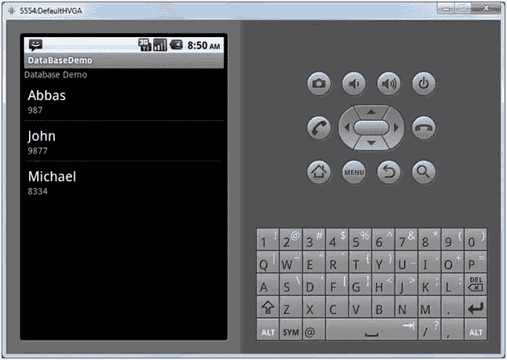

# 掌握 Android 中的数据库存储和检索

> 原文：<https://www.sitepoint.com/using-database-in-android/>

数据一直是任何移动应用最重要的部分。开发人员需要以一种有组织的方式存储大量数据，以便他们的应用程序对用户真正有价值。在 Android 中，你可以用很多不同的方法存储你的数据，既可以存储在活动内存中，也可以存储在书面文件中。许多应用程序还有一个远程 web 服务，为相关应用程序提供数据。Android 还支持在本地数据库中存储数据，操作系统为存储和检索数据提供了良好的基础设施。在大多数情况下，获取和保存用户数据的最简单直接的方法是通过 SQLite 数据库。

 **### SQLite

SQLite 是一种关系数据库技术，当开发人员需要小型系统中的嵌入式数据库时，最常使用这种技术。SQLite 包含在 Android 系统中，可以很容易地在您的 Android 应用程序中使用。关于 SQLite 的更多细节，你可以访问[http://www.sqlite.org](http://www.sqlite.org/)和[http://en.wikipedia.org/wiki/SQLite](http://en.wikipedia.org/wiki/SQLite)

### 在 Android 中创建数据库

为了将数据写入数据库，我们需要首先创建数据库。要在 Android 的 SQLite 中创建数据库，需要创建 SQLiteOpenHelper 类的子类。该类提供创建数据库的功能，并调用可由派生类重写的函数。SQLiteOpenHelper 构造函数接受四个参数，它们是

1.  **上下文**–这是将用于创建数据库的上下文。(这里可以传递活动对象。)
2.  **名称**–新数据库文件的名称。
3.  **工厂**–一个光标工厂(通常可以将其作为 null 传递)
4.  **版本**–数据库的版本。该编号用于标识数据库是否升级或降级。

下面，我已经创建了一个类(MyDatabaseHelper ),它将从 SQLiteOpenHelper 派生:

```
public class MyDatabaseHelper extends SQLiteOpenHelper{

private static final String DATABASE_NAME="MyFriendsDatabase";

public MyDatabaseHelper(Context context) {

super(context, DATABASE_NAME, null, 1);

}

@Override

public void onCreate(SQLiteDatabase database) {

database.execSQL("CREATE TABLE friends (_id INTEGER PRIMARY KEY AUTOINCREMENT, name TEXT, phonenumber INTEGER);");

}

@Override

public void onUpgrade(SQLiteDatabase db, int oldVersion, int newVersion) {

db.execSQL("DROP TABLE IF EXISTS friends");

onCreate(db);

}

}
```

在上面的构造函数中，我们传递了我们想要创建的名为“MyFriendsDatabase”的数据库名称我们还覆盖了以下方法:

#### onCreate

这个方法在我们创建数据库时被调用。它被传递了 SQLiteDatabase 引用，我们可以用它来对数据库执行各种操作。在这个方法中，我们使用函数 execSQL 执行一个 SQL 查询来创建一个名为“friends”的表，该表有三列。第一列(_id)是为每一列生成唯一 id 所必需的。如果您要使用像 SimpleCursorAdapter 这样的类，这是很有必要的(本文后面会详细介绍)。第二和第三列(姓名和电话号码)是我们实际想要存储的数据字段。

#### onUpgrade

每当数据库升级时，都会调用此方法。在此方法中，传递 SQLiteDatabase 以及旧版本号和新版本号。

在这个函数中，我们只需删除“friends”表(如果它存在)并创建一个新表，但是根据您在数据库中创建的表以及您希望在升级时发生的情况，可能会有更复杂的逻辑。

### 在数据库中添加值

一旦创建了数据库，现在让我们看看如何向数据库添加值。我们将在 SQLiteDatabase 类上使用 insert 函数。insert 函数有三个参数:要插入值的表的名称、表中某一列的名称以及对 ContentValues 的引用

在下面的 MyDatabaseHelper 类中，我们将编写一个将值插入数据库的函数。

```
public void addFriend(String name,int phonenumber)

{

ContentValues values=new ContentValues(2);

values.put("name", name);

values.put("phonenumber", phonenumber);

getWritableDatabase().insert("friends", "name", values);

}
```

在这个函数中，我们将输入参数作为*姓名*和*电话号码*。然后，我们创建一个新的 ContentValues 对象，我们将*姓名*和*电话号码*的值放在这个新对象中。一旦我们完成了这些，我们就可以使用 getWritableDatabase 函数获得 SQLiteDatabase 引用，该函数是 SQLiteOpenHelper 的一个成员。一旦我们有了 SQLiteDatabase 的引用，我们就调用 *insert* 函数，它将参数作为表名、表的一列和内容值。这将在您的朋友数据库表中输入一个新行。

如果我想使用 MyDatabaseHelper 创建一个数据库并添加一些数据值，代码如下:

```
public void onCreate(Bundle savedInstanceState) {

super.onCreate(savedInstanceState);

setContentView(R.layout.main);

databaseHelper = new MyDatabaseHelper(this);

databaseHelper.addFriend("Abbas", 987);

databaseHelper.addFriend("John", 9877);

databaseHelper.addFriend("Michael", 8334);

}
```

在我们的活动中，我们创建一个新对象(MyDatabaseHelper)，然后通过调用函数 *addFriend* 在表中添加一些值。

### 在数据库上运行原始查询

一旦我们将数据添加到数据库中，我们现在将看到如何检索数据。要检索数据，有两种可能的方法。

**运行原始 SQL 查询**

我们可以直接运行一个 SQL 查询，比如 SELECTto，从数据库中检索记录。

要运行一个原始 SQL 查询，您需要一个函数 rawQuery，它将 SQL 语句作为第一个参数，将选择参数作为第二个参数。因此，如果我们必须在 MyDatabaseHelper 中编写一个函数来从表 friends 中检索所有记录，它将如下所示:

```
public Cursor getFriends()

{

Cursor cursor = getReadableDatabase().rawQuery("select * from friends", null);

return cursor;

}
```

#### 对数据库运行查询

我们还可以使用 SQLiteDatabase 上的函数 *query* 在数据库上运行查询。*查询*函数让您可以在一个表上进行查询，还可以指定一些选择和排序标准。查询函数有几个参数:表名、要检索的表的列名、选择标准、选择标准的参数、group by 子句、having 子句、order by 子句和限制。

如果我们必须编写上面的相同函数来使用*查询*检索所有朋友，将如下所示:

```
public Cursor getFriends()

{

Cursor cursor = getReadableDatabase().query("friends",

new String[] { "_id", "name", "phonenumber"},

null, null, null, null, null);

return cursor;

}
```

### 数据库光标

查询的结果以一个 *Cursor* 对象的形式返回，它主要通过以一种有效的方式缓存查询的结果并提供访问数据的函数来提供帮助。

如果我们想从 getFriends 函数返回的*光标*中获取所有朋友的数据，我们将编写以下代码:

```
Cursor AllFriends = databaseHelper.getFriends();

AllFriends.moveToFirst();

while (!AllFriends.isAfterLast()) {

String Name = AllFriends.getString(1);

int number = AllFriends.getInt(2);

AllFriends.moveToNext();

}
```

光标有 *moveToFirst* 等功能，将光标移动到第一条记录， *moveToNext* 将光标移动到下一条记录， *isAfterLast* 检查*光标*是否已经移动通过最后一条记录。

光标还有 *getInt* 、 *getString* 等功能。，它获取列的索引并返回值。

### 从数据库中删除值

要从数据库中删除值，可以运行 raw query 或使用 SQLiteDatabase 上的 *delete* 函数。 *delete* 函数有三个参数:表名、where 子句和 where 子句参数。从数据库中删除所有值的功能如下:

```
public void deleteAll()

{

getWritableDatabase().delete("friends", null, null);

}
```

### 使用游标适配器显示数据值。

Android 为我们提供了光标适配器，让我们可以将光标与 ListView 关联起来。类 *SimpleCursorAdapter* 就是这些适配器中的一个，它非常有用。如果我们想在列表视图中显示朋友列表，代码如下:

```
Cursor AllFriends = databaseHelper.getFriends();

String[] from = { "name", "phonenumber" };

int[] to = { android.R.id.text1, android.R.id.text2 };

ListAdapter adapter=new SimpleCursorAdapter(this,android.R.layout.simple_list_item_2,

AllFriends

, from,

to);

ListView myList=(ListView)findViewById(android.R.id.list);

myList.setAdapter(adapter);
```

一旦我们这样做了，朋友列表就会出现在 Android 设备上，如下所示。



### 结论

数据是当今竞争应用中最重要的部分。一个构建良好的应用程序必须高效、轻松地存储和检索数据，这样它才能顺利运行并取悦用户。Android 为你的 Android 应用程序在数据库中存储数据提供了多种形式的良好支持。它提供了创建和更新 SQLite 数据库和数据库表的所有功能。确保在设计下一个 Android 应用程序时充分利用它！** 

## **分享这篇文章**