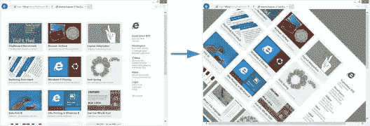
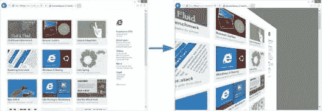
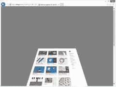
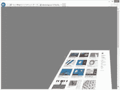
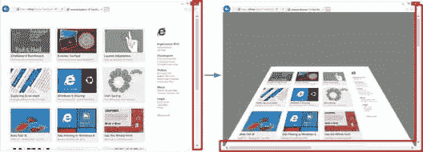
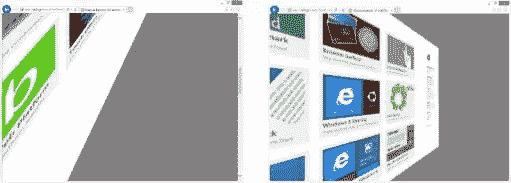

# 如何使用 CSS 创建整页动画

> 原文：<https://www.sitepoint.com/how-to-create-full-page-animations-using-css/>

像 Internet Explorer 10 这样的现代浏览器支持 [CSS 3D 和 2D 变换](https://www.w3.org/TR/2009/WD-css3-3d-transforms-20090320/)和 [CSS 动画](https://www.w3.org/TR/css3-animations/)。通过[挖掘你的 GPU](http://blogs.msdn.com/b/ie/archive/2011/04/26/understanding-differences-in-hardware-acceleration-through-paintball.aspx) 的能力，并从常规 JavaScript 异步运行，这些技术为传统的基于脚本的网页内容动画提供了一个更高性能和更灵活的替代方案。

我已经在以前的文章中讨论过如何使用 [CSS 3D 变换](http://blogs.msdn.com/b/ie/archive/2012/02/02/css3-3d-transforms-in-ie10.aspx)以及 [CSS 动画和过渡](http://blogs.msdn.com/b/ie/archive/2011/11/21/adding-personality-with-css3-transitions-and-animations.aspx)来构建。在本文中，我将通过描述“全页面动画”的概念来介绍这些技术的一个更加“非常规”的用例，在导航过程中可以使用“全页面动画”来增加浏览的流畅性和连续性。我们的目标是实现无缝的浏览体验，当用户访问一个页面时，内容平滑地出现在视图中，当用户单击一个链接或执行一个相关操作时，内容平滑地离开视图。

这些效果可以通过使用 CSS 动画转换 HTML `<body>`元素来实现。然而，这个用例提出了一些我们认为值得讨论的考虑因素，例如布局和大小对转换`<body>`的影响，以及如何恰当地安排页面导航的时间，以便它们与我们的动画适当地配合。

本文中的代码示例使用 IE10 发布预览版支持的无前缀 CSS 标记；其他浏览器可能要求使用 CSS 动画和 CSS 转换属性的供应商前缀。

## **转换页面的全部内容**

CSS 转换是根据 HTML DOM 元素的样式属性定义的。例如，将元素沿 Z 轴旋转 45 度的标记如下所示:

```
#element {
    transform: rotateZ(45deg);
}
```

将转换附加到 HTML 文档的`<body>`元素的工作方式完全相同。因此，为了声明性地将相同的效果添加到文档的`<body>`中，您可以这样做:

```
body {
    transform: rotateZ(45deg);
}
```

让我们看一下对`body`元素应用变换时页面的前后截图:


*对文档的`body`元素应用`rotateZ(45deg)`变换。*

对于三维转换，CSS 转换规范定义了透视属性，可以在我们转换的元素的父元素上指定该属性。当转换内容的`<body>`元素时，必须将其应用于 DOM 层次结构中位于它之上的`<html>`元素。这样做很简单:

```
html {
    perspective: 500px;
}
```

将此与对`<body>`元素的`rotateY(45deg)`变换相结合，会产生以下结果:

* * *
在`<html>`上设置`perspective: 500px`的情况下，对`<body>`应用`rotate(45deg)`变换。*

我们可以操作`body`元素上的`transform-origin`属性来获得有趣的结果。让我们看几个例子:

```
body {
    transform-origin: 50% 100%;
    transform: rotateX(45deg);
}
```

上面的标记为`body`元素设置了一个沿 X 的旋转，同时使用`transform-origin`将旋转的原点移动到元素的底部。这样可以有效地将文档内容旋转到屏幕中，如下所示:

**

我们还可以操作文档的根元素上的`perspective-origin`属性来实现离轴投影效果。将`<html>`的样式更改为:

```
html {
    perspective: 500px;
    perspective-origin: 90% 50%;
}
```

我们的页面现在看起来像这样:

*
*

通过使用 CSS 转换，我们可以轻松地处理页面内容的整体视觉外观。由于通常的布局和大小规则仍然适用，对`body`元素的一些转换(特别是那些使用百分比值或依赖于`transform-origin`属性的转换)可能会根据页面内容产生不同的视觉效果。回想一下我们之前的`rotateX(45deg)`例子，其中`transform-origin`设置为`50% 100%`。

下面你可以看到应用变换前后的结果。



请注意，内容实际上并不在窗口的底部旋转，而是在视窗之外的某个位置旋转。这是 CSS 转换的预期行为:`<body>`正常布局，然后沿着屏幕外的底边旋转。您还会注意到，为了容纳转换后的内容(我们使用透视投影的事实使这种效果更加明显)，内容的实际覆盖区域已经扩大(请看“之后”图片中的滚动条)。

那么，当对我们的`body`元素应用变换时，我们如何处理任意大小的内容呢？定制裁剪所有内容以确保正文的尺寸不会扩展超过一定量可能是不现实的。相反，我们可以使用一个简单的 HTML/CSS 模式，允许我们将`body`元素的大小固定为浏览器窗口的大小，并将内容添加到一个包装器`<div>`中。下面的标记实现了这一点:

```
html, body {
    width: 100%;
    height: 100%;
    min-width: 100%;
    max-width: 100%;
    padding: 0;
    margin: 0;
    overflow: hidden;
}

#Wrapper {
    position: absolute;
    width: 100%;
    height: 100%;
    overflow: scroll;
}
```

下图显示了当页面垂直滚动，我们直接对文档的`<body>`元素应用`rotateY(45deg)`转换(左)并使用包装模式(右)时会发生什么:



由于离轴投影，变换的直接应用导致扭曲的视觉结果(因为我们不再看`body`元素的“中心”)。使用包装器模式确保了`<html>`元素的`perspective-origin`属性(默认为`50% 50%`)总是正确地相对于`<body>`元素居中，给我们一个愉快的视觉效果。

通过利用上面的模式并尽可能设置带有百分比值的 CSS 转换，我们可以以一致的方式影响我们的`<body>`元素，而不管其内容的大小。

## **从变换到动画**

理清了将 CSS 变换应用到`<body>`元素的复杂性之后，下一步就是 CSS 动画了。通过遵循上述原则，我们可以创建动画，以有趣的方式将我们的 Web 内容带入视图(或从视图中移除)。

考虑这个基本的`@keyframes`规则:

```
@keyframes rotateInLeft {
from {
     transform-origin: 0% 0%;
     transform: rotateY(180deg);
     }
to {
   transform-origin: 0% 0%;
   transform: rotateY(0deg);
   }
   }
```

当应用到一个元素时，这个动画会使它在左边旋转。当应用于使用我们的包装模式的`<body>`元素时，视觉效果会更有趣。文档实际上将从浏览器窗口可见区域的外的**开始旋转，并进入全视图:**


类似地，我们可以创作动画，流畅地从视图中移除我们的 Web 内容。例如，如果我们希望我们的页面在旋转时消失在远处，我们可以像这样使用:

```
@keyframes whirlOut {
to {
    transform: scale(0) rotateZ(1260deg);
   }
}
```

视觉效果是:


因为我们可以使用 CSS 动画的全部力量来影响我们的 Web 内容的整体，所以我们在生成这些页面效果方面有很大的灵活性(我们当然不仅限于使用 CSS 转换)。但是一旦我们完成了想要应用于内容的效果，我们如何在页面导航过程中触发它们呢？

## **将动画附加到`<body>`**

我们的目标是在浏览器体验期间的关键时刻使用触发动画，以便在页面加载时呈现内容过渡到视图中的外观，而在用户单击链接时呈现内容过渡到视图之外的外观。

向`body`元素添加动画的第一个直观位置是`onload` JavaScript 事件。然而，事实证明，在`onload`开火时添加动画实际上为时已晚。当我们页面中的全部内容(包括任何图像或其他带宽密集型资源)完成加载时，实际上会触发该事件。将动画附加到带宽密集型页面上的`onload`会导致我们的内容“正常”显示，随后动画触发并重新显示内容。这不是我们想要的效果。

或者，我们可以利用当浏览器完成解析内容的 DOM 结构时触发的`DOMContentLoaded`事件(但可能在资源完成加载之前)。IE 试驾 [DOMContentLoaded 演示](http://ie.microsoft.com/testdrive/HTML5/DOMContentLoaded/Default.html)说明了这两个事件之间的区别。然而，对于复杂的 Web 内容，现代浏览器可能会选择执行“渐进式”呈现，在加载完整个 DOM 树之前显示页面。在这些情况下，视觉结果将类似于`onload`场景。

设置动画来转换视图中页面内容的最佳位置是在`<body>`元素的顶部。这确保了动画将在内容呈现时开始(并且内容的开始位置将是我们所选动画的`from`关键帧的位置)。这种方法的一个令人愉快的副作用是，动画可能实际上掩盖了复杂内容可能发生的任何渐进呈现、重新布局或资源加载。

设置动画将我们的内容转换到视图之外也很有趣。人们可以假设我们可以将一个`onclick`处理程序附加到我们内容中所有感兴趣的元素(例如所有的`<a>`标签)上，并设置相关的动画属性`(animation-name`、`animation-duration`等。)中的`callback`功能。然而，如果我们实际上不**延迟**导航的发生，我们将看不到我们预期的流体转换。

这是利用 CSS 动画规范中描述的[动画事件](http://dev.w3.org/csswg/css3-animations/#AnimationEvent-types)的好机会。特别是，我们可以使用`animationend`事件来检测动画何时完成，然后触发导航(例如，通过设置`window.location.href`)。因此，我们的`onclick`将触发“从视图中移除”动画，并为`<body>`上的`animationend`注册一个处理程序，这将确保导航事件发生。

## **提供现场演示**

我们已经制作了一个演示和教程，介绍如何用 CSS 变换&动画让页面生动起来，这些动画提供了我们无法在此展示的深度和示例。该教程本身在页面导航过程中使用了完整的页面动画，可以在 Windows 8 上的 [Internet Explorer 10 以及最新版本的 Chrome 和 Firefox 中使用。](http://preview.windows.com/)

要简单地欣赏页面到页面的动画，请使用每页右下角的“继续…”链接浏览教程页面。

在教程的最后，我们提供了一些额外的指导和示例代码，说明如何将这些动画与您自己的 Web 内容结合起来。

## **包装完毕**

CSS 转换和 CSS 动画是两个强大的功能集，可以实现更丰富、更身临其境的 Web 体验。只需很少的努力，你就可以创建网页(即使是静态的),提供流畅的、几乎像应用程序一样的导航体验。

如果你喜欢读这篇文章，你会喜欢[可学的](https://learnable.com/)；向大师们学习新技能和技术的地方。会员可以即时访问 SitePoint 的所有电子书和互动在线课程，如[实用 CSS](https://learnable.com/courses/practical-css-198) 。

## 分享这篇文章