# 使用 HTML5 构建 Windows 8 应用程序–第 1 部分

> 原文：<https://www.sitepoint.com/building-a-windows-8-app-with-html5-completing-our-small-rss-reader/>

本文是第二部分:[用 HTML5 构建 Windows 8 应用:如何创建一个小型 RSS 阅读器](https://www.sitepoint.com/building-a-windows-8-app-with-html5-how-to-create-a-small-rss-reader/)。如果你没看过，先看看吧。

我们现在来看看如何显示每篇文章的细节。我们将使用一个**过渡动画**，我们将使用**模拟器**，我们将继续探索混合使用 **CSS3 多列**等。

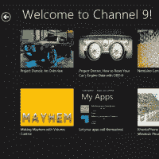

在本文中，我们将看到:

–第一步:使用模拟器
–第二步:显示文章的细节
–第三步:使用 Blend
完成细节视图的设计–第四步:下载源代码并得出结论

## 步骤 1:使用模拟器

了解您的应用在触摸设备以及未来 Windows 8 平板电脑和 PC 的各种分辨率下的表现非常重要。

我们提供了一个很酷的工具，可以帮助你做你的第一次测试:模拟器。

例如，如果您像上一篇文章结尾那样打开项目，我们可以通过这个按钮启动模拟器来模拟一些触摸交互:

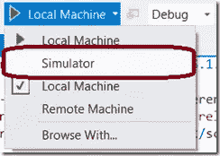

然后模拟器将被启动。这或多或少是在自己身上模拟 RDP 会议。下面是您应该得到的输出:

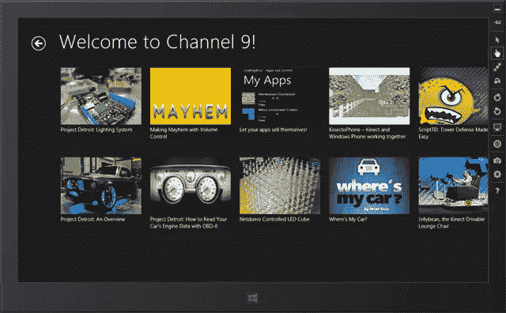

你现在可以点击这个图标:


它将模拟触摸。尝试在虚拟显示器上滑动虚拟手指。然后你会发现一些惯性和弹跳效果已经为你实现了。同样，如果你触摸一个元素并向下滑动，你将选择它。这和用鼠标右键点击它是一样的。您在这里可以看到使用本机 WinJS 控件的好处，这些控件为您实现了所有这类逻辑。

另一个有用的按钮是处理各种分辨率的按钮:

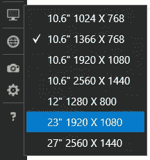

例如，尝试模拟分辨率为 1920×1080 的 23 英寸显示器。您现在应该会看到这种布局:

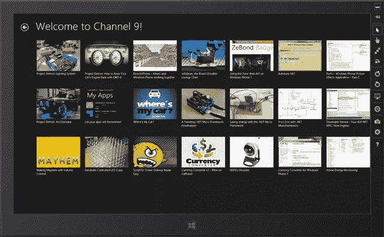

你可能已经注意到，在 1080 年，我们从两行元素切换到三行元素，从五个可见列切换到七个。ListView 控件还为您处理各种形状因素。

所以即使 WinJS 在 HTML5 Windows Store 项目内部不是强制的，也不要小看它可能免费带给你的所有好处！

## 步骤 2:显示文章的详细信息

为了显示文章的内容，我们需要另一段 HTML。导航到“*default.html*”页面并插入以下内容:

```
<div id="articlecontent"></div>
```

我们将按代码插入文章内容。打开`default.js`。就在装订上面。列表实例化，插入以下代码:

```
var articlelistElement = document.getElementById("articlelist");
articlelistElement.addEventListener("iteminvoked", itemInvoked);
backbutton.addEventListener("click", backButtonClick);
```

我们的目标是 DOM 中的`articlelist`元素，由于执行了`processAll`函数，它现在必须是一个 WinJS `ListView`控件。这一个现在暴露了一个名为`iteminvoked`的事件。当您单击/触摸列表中的一个元素时，它会被引发。此外，我们正在订阅`back`按钮的`click`事件，以便能够简单地返回到欢迎屏幕。

我们现在需要创建相关的事件处理程序。他们在这里:

```
function backButtonClick(e) {
    articlecontent.style.display = "none";
    articlelist.style.display = "";
}

function itemInvoked(e) {
    var currentArticle = articlesList.getAt(e.detail.itemIndex);
    WinJS.Utilities.setInnerHTMLUnsafe(articlecontent, currentArticle.content);
    articlelist.style.display = "none";
    articlecontent.style.display = "";
}
```

这里的概念真的很简单。当用户点击其中一个元素时，我们将在集合中检索适当的对象及其索引(`e.detail.itemIndex`)。我们通过`setInnerHTMLUnsage()`函数将 HTML 内容注入到刚刚插入到主页中的 div 节点的`innerHTML`属性中。但是为什么我们需要使用这个特殊的函数呢？

## 关于 WinRT 应用程序安全上下文的一些快速说明

Windows 应用商店 HTML5 应用程序的安全上下文不同于传统的网页。在我们的例子中，试图直接访问 innerHTML 属性会受到保护/扫描。

例如，如果您试图插入一些从公共 web 空间下载的 HTML，默认情况下会引发一个安全异常来保护您。我敢肯定，你不想让一些脚本注入控制你的应用程序。默认情况下，我们会阻止这种情况。

但是如果你真的知道你在做什么，你可以选择通过调用`setInnerHTMLUnsafe()`函数来“绕过”这个自动检查。

链接到安全上下文，例如，在应用程序中插入一个`<iframe>`稍微有些不同。如果你对细节感兴趣，这里有一些文章可以阅读:

–[HTML、CSS 和 JavaScript 的特性和差异](http://msdn.microsoft.com/en-us/library/windows/apps/hh465380.aspx)
–[特性和上下文限制](http://msdn.microsoft.com/en-us/library/windows/apps/hh465373.aspx)
–[让 HTML 更安全:toStaticHTML 的详细信息](http://msdn.microsoft.com/en-us/library/windows/apps/hh465388.aspx)

好了，回到我们的主要话题。

我们展示文章内容的方式非常简单。我们通过将元素列表的`display`切换到`none`来隐藏元素列表，并显示`articlecontent` div。当按下`back`按钮时，我们做的正好相反。

好的，按 F5，点击其中一个项目后，您应该会看到类似这样的内容:

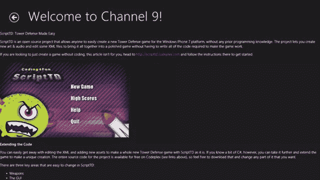

你会注意到这个布局一点也不酷，但是我们会用 Blend 来处理它。

与此同时，我想把重点放在当前版本中真正令人讨厌的东西上。文章内部的导航和返回到欢迎屏幕的导航都很好。但是用户体验并不是最优的。文章的细节没有任何变化。

然后，我们来到了新的 Windows 8 用户界面的重要一点:快速的 T2 流畅的体验。你需要向你的用户建议性能，并告诉他们你的应用程序是真正有活力的。要做到这一点，简单地添加一些轻微的过渡动画可以完全改变这种感觉。从技术上讲，您可以用两种方式实现它们。

您可以使用纯 CSS3 过渡/动画来实现它们，以显示您感兴趣的内容。然后由你来寻找合适的动画。如果你想了解 CSS3 的这些新特性是如何工作的，我和 David Catuhe 在这里做了一些介绍文章:

–[CSS3 转场介绍](http://blogs.msdn.com/b/eternalcoding/archive/2011/12/06/css3-transitions.aspx)
–[CSS3 动画介绍](http://blogs.msdn.com/b/davrous/archive/2011/12/06/introduction-to-css3-animations.aspx)

或者，您可以使用 WinJS 库，该库公开了预构建的动画，以帮助遵循新的 Windows 8 用户界面指南。在引擎盖下，你会发现 CSS 变换和过渡的用法。但是对于我们开发人员来说，我们只需要调用一行简单的 JavaScript 代码。

例如，在`itemInvoked()`处理程序中，在函数的末尾插入这行代码:

```
WinJS.UI.Animation.enterPage(articlecontent);
```

请在第二个事件处理程序的末尾插入这个:

```
WinJS.UI.Animation.enterPage(articlelist);
```

按下 F5，当您在应用程序中导航时，您现在应该有一些微妙的转换。相信我们，他们将真正改变用户体验！

## 步骤 3:用混合完成细节视图的设计

切换回混合模式。它将再次要求您重新加载您在 Visual Studio 中所做的所有更改。

今天的问题:**当我们需要通过一个项目选择来模拟一个导航动作时，你将如何设计细节视图？**

好吧，你在上一篇文章中已经有了答案。Blend 5 正在实时运行您的 HTML5 应用程序。但是你可能还缺少一个细节。您可以通过点击此按钮切换到“互动”模式:


应该命名为“**开启交互模式**”。完成后，您应该能够与您的应用程序进行交互，导航到您想要查看的文章内容，并通过单击同一个按钮切换回设计图面。就我而言，我决定以这篇文章为基础:

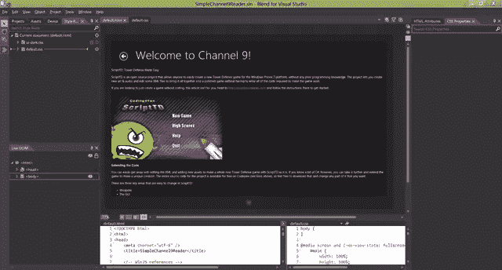

在 style 部分，在适当的 *Media Query* 下，添加一个针对`#articlecontent`的新规则，并立即选择它。

在**尺寸**部分，将**宽度** & **高度**固定为 **100%** 。

在“**布局**部分，放置一个 **120px** 的左**填充**，使内容与标题对齐。

这就提出了一个新问题。我们的`articlecontent` div 的布局不再适合我们屏幕的宽度。

要解决这个问题，修改`width`属性并点击选择一个`custom expression`:

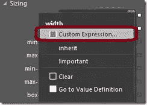

我们将使用 [CSS Calc()操作符](https://www.w3.org/TR/css3-values/#calc0)。输入下面的表达式`calc(100%-120px)`。

这样我们更好地遵循新的 Windows 8 用户界面指南。我们有一个终极任务，要以一种更好的方式来完成它:允许用户水平滑动内容，使其更具可读性。

先说可读性。有一个非常有用的 CSS3 特性，便于安装: **CSS3 Multicolumns** 。

跳转到 ***CSS 属性*** 面板的 ***多列*** 部分。修改布局，创建宽度为 **480px 的列**，列与列之间的间隙为**80px**。

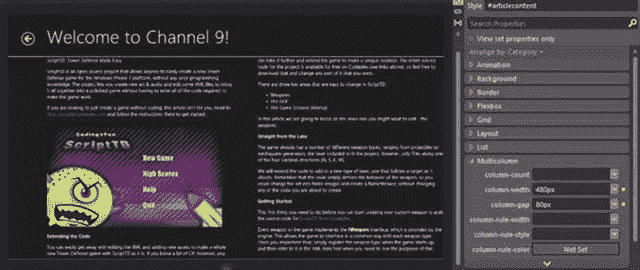

天气开始变好了，不是吗？

最后，我们需要实现水平滑动。进入“ ***搜索属性*** ”文本框，输入`over`。Blend 将过滤所有包含`over`关键字的属性。

将“**溢出-x** ”属性设置为`auto`，将“**溢出-y** ”属性设置为`hidden`。

您可以切换回 Visual Studio，接受更改并按 F5 键来处理最终结果。

## 战士的特殊额外奖励等级

好吧，因为我觉得你还是想玩 Blend，所以让我们添加另一个特性。当我们阅读一篇技术文章时，对我们来说最重要的是什么？当然是源代码啦！

一旦你知道了这一点，不要犹豫以某种方式强调代码，以吸引开发人员的注意。

在 Channel9 的例子中，他们有一个极好的想法，将代码部分插入到`<pre>`标签中。这将简化我们的生活。

添加新的 CSS 规则`#articlecontent pre`。

切换到交互模式，导航到一篇文章，其中一些源代码足够清晰可见。

选择您刚刚添加的最后一条规则，并进入 CSSS 属性的`Background`部分。点按以设定颜色:


然后，您将能够使用这个美妙的颜色编辑器来做出选择:

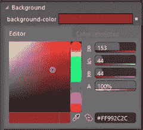

但是如果你像我一样是一个糟糕的开发者，你可能会有选择最糟糕颜色的自然倾向。所以，点击颜色选择图标，选择最接近的混合灰色。很明显是好灰。

最后，在`<pre>`上，将“**溢出-x** 属性设置为`auto`，将“**溢出-y** ”属性设置为`hidden`。

按 F5 键会给你带来这样的体验:

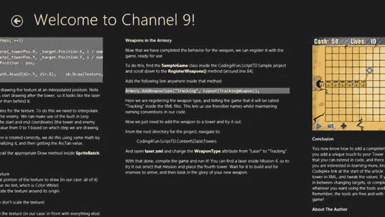

## 步骤 4:下载源代码并得出结论

我希望你现在确信我没有撒谎。如果您足够专注，您应该花 30 分钟来构建这个小应用程序。

下面是下载的源代码:[简单频道 9 阅读器文章 2](https://david.blob.core.windows.net/win8/SimpleChannel9ReaderArticle2.zip "https://david.blob.core.windows.net/win8/SimpleChannel9ReaderArticle2.zip")

感谢阅读！最后，我想提醒你一个特别的问题。这两个教程以简单的方式解释了 WinJS 和 Windows 应用商店的基础。

尽管如此，**它缺乏很多功能，无法成为一款出色的 Windows 8 应用**:

*   –漂亮的**闪屏**和**动态磁贴**
*   –向用户提供一些视觉反馈，告诉他我们正在启动阶段加载数据
*   –一个**快照视图**
*   –更好的 Windows 8 集成，通过**搜索功能**和可选的共享功能进行搜索
*   –使用**导航框架**来显示文章，而不是隐藏/显示我们的 2 个 div
*   –增加了一个**离线模式支持**，能够在不接入网络的情况下使用应用程序，避免每次都重新加载相同的数据

如果您想更进一步，实现其中的一些概念，这里有一些好文章可以阅读:

*   David Catuhe 做的一个很优秀的系列:[如何在一周内用 HTML5、CSS3 和 JavaScript 烹饪出一个完整的 Windows 8 应用](http://blogs.msdn.com/b/eternalcoding/archive/2012/04/16/how-to-cook-a-complete-windows-8-application-with-html5-css3-and-javascript-in-a-week-day-0.aspx "http://blogs.msdn.com/b/eternalcoding/archive/2012/04/16/how-to-cook-a-complete-windows-8-application-with-html5-css3-and-javascript-in-a-week-day-0.aspx")。您将发现如何支持快照视图、搜索合同、导航框架和许多其他很酷的 Windows 8 功能。
*   [使用 JavaScript](http://msdn.microsoft.com/en-us/library/windows/apps/br211385.aspx) 创建你的第一个地铁风格的应用，涵盖相同的主题，是这两篇文章的补充。

最后，如果你想在 WordPress 博客上测试这两个教程，别忘了阅读这篇补充文章:[Windows 8 html 5 WinRT App:RSS reader in 30min——构建你的 WordPress 版本](http://blogs.msdn.com/b/davrous/archive/2012/07/06/windows-8-html5-metro-style-app-rss-reader-in-30min-the-wordpress-version.aspx "http://blogs.msdn.com/b/davrous/archive/2012/07/06/windows-8-html5-metro-style-app-rss-reader-in-30min-the-wordpress-version.aspx")。

## 分享这篇文章