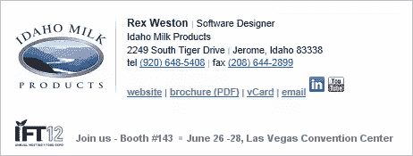
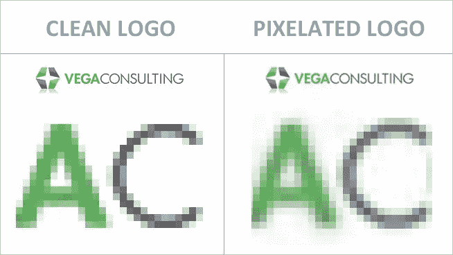

# 设计和标记电子邮件签名的艺术

> 原文：<https://www.sitepoint.com/the-art-of-designing-and-marking-up-email-signatures/>

虽然创建功能丰富的电子邮件签名看起来是一项相对简单的编程任务，但实际上这是一种黑色艺术。在这里，我将分享一些关于设计和构建健壮的电子邮件签名的秘密，这些签名可以在 PC、平板电脑和智能手机上很好地呈现。

## 设计和布局考虑

**智能手机:**在智能手机出现之前，电子邮件签名在水平方向上运行良好，目标是当在桌面上的预览窗格中查看电子邮件时，可以完整地看到它们。然而现在，电子邮件签名需要更窄，方向更垂直——智能手机提供有限的查看区域，过宽的电子邮件签名会导致布局混乱

**Gmail 行距:** Gmail 会将所有换行符显示为回车。下图说明了这个问题:




顶部的图形说明了预期的设计，即此电子邮件签名在 Outlook 中的实际呈现。下图展示了 Gmail 中电子邮件签名的呈现方式。

你会注意到顶部的文本块——电话号码下面是我的名字——在 Gmail 中保持不变。这是使用直线`<br>`格式化的，以创建回车符。然后应用了更精细的间距技术来将间距向下调整到各种超链接，然后再向下调整到 IFT12 标语。Gmail 忽略了这些精炼的技术，只是简单地插入了完整的`<br>`,从而超出了预期的行距。

## HTML 电子邮件签名编码

下图显示了一个功能丰富的电子邮件签名示例:


如果您愿意，您可以为这个签名获取 [HTML 标记。我不打算一行一行地浏览标记，而是将触及一些不太明显但理解起来很重要的东西。](http://www.digitechbranding.com/pages/email-signature-sample-HTML-code.html)

图像像素化:虽然有些标志比其他标志更容易像素化，但最好还是展示一个干净的、非像素化的标志。下图显示了一个干净的和像素化版本的徽标。在这两个版本中，顶部是 Vega Consulting 的完整徽标，以实际大小显示；下面是一个以 1000%的比例显示的徽标片段。



实现最佳显示有三个方面。首先，从一个好的、高分辨率的徽标开始，然后将其缩小到你想要在电子邮件签名中使用的大小。最终尺寸将根据您的徽标和签名设计而有所不同。根据经验，我认为水平方向的徽标，如 Vega Consulting 徽标，宽度为 150 到 250 像素。对于方形、圆形或垂直方向的徽标，我希望高度在 70 到 90 像素之间。确保你创建了一个缩小版的标志，看起来干净利落。

接下来，你要以 100%的比例显示你的徽标——不允许徽标以任何其他尺寸显示；如果你这样做，看起来总是很糟糕。确保在 img 标签的高度和宽度属性中输入值:

```

```

最后，我建议你总是使用 GIF 图形。

**文本间距:**尽管难以置信，但如果您正在设计用于 Microsoft Outlook 的电子邮件签名，您可能无法实现这种性质的间距:

```
Tel: (414) 473-6812          Mobile: (414) 988-3211          Fax: (414) 473-6819
```

你更有可能得到:

```
Tel: (414) 473-6812 Mobile: (414) 988-3211 Fax: (414) 473-6819
```

自然的编程倾向是简单地将一系列不间断的空格(例如，`&nbsp;&nbsp;&nbsp;&nbsp;&nbsp;&nbsp;`)串在一起，以达到你想要的间距。Outlook 的编辑器 Microsoft Word 将去掉所有这些`&nbsp;`中的第一个(注意:使用`&#160;`没有用)。您将只剩下一个，因此您的签名将在文本条目之间呈现一个空格。

一种解决方案是在要分隔的文本之间插入白色或透明的间隔图形。这将很好地工作，但有两个潜在的缺点-一些潜在的增加您的垃圾邮件分数，和更多的图片显示为电子邮件的附件。

最简单的解决方案，也是您肯定遇到过的解决方案，是使用管道(|)来创建所需的分隔:

```
Tel: (414) 473-6812 | Mobile: (414) 988-3211 | Fax: (414) 473-6819
```

从设计的角度来看，大多数平面设计师和营销人员通常都可以接受这种管道。我通常将这些管道的字体颜色设置为浅灰色。

避免白色字体:也许你想简单地将分隔管道涂成白色，从而让它们“消失”？这是可行的，但是将字体颜色设置为白色(或者其他超级亮的颜色)可能会触发垃圾邮件。这不值得冒这个险。

**避免特殊字符:**我已经试验过使用`&#9632;`来创建实心方块作为文本间的分隔符。虽然这样做很好，但我遇到过许多由于这个字符触发俄语字符集警报而导致电子邮件被发送到垃圾邮件文件夹的情况。因此，我学会了在我设计的电子邮件签名中使用任何特殊字符时要非常谨慎。

**行距:**由于渲染问题，Gmail 中无法微调行距。如果你选择完全忽略 Gmail，你可以很好地控制这个参数。然而，你对行距做的微调越多，你在 Gmail 中看到的结果就越差。

我使用的主要方法，也是我尽可能减少的方法是:

```
<span style="line-height: 5px; font-size: 5px;">&nbsp;<br></span>
```

Gmail 在遇到这种标记时总是会呈现完整的`<br>`。大多数其他电子邮件客户端将处理行高和字体大小属性，以提供降低高度的换行符。这是一个谨慎使用的好策略——只有在你无法忍受异性恋的情况下。注意:我不建议使用一个减小的行高参数来收紧将出现在签名中的实际文本行之间的间距。一些智能手机会将这些文本行显示为重叠的，一部分在另一部分之上。

**水平和垂直间距:**在间距战中，你有一个秘密武器可用…用空白填充图像。只需用空白填充图像，您就可以在图像周围(左侧、右侧、顶部或底部)创建精确可靠的间距。只要这种技术对你有帮助，你就应该计划使用它。

**图片作为附件:**没有人希望自己的电子邮件签名成为附件。除非你愿意跳过包含你的标志图形，排除附件 100%的时间无法实现。

然而，有两件事可以在标记级别上帮助您。首先是尽量减少你使用的图片数量。你的标志和一些社交媒体图标很可能是必不可少的。但在大多数情况下，电子邮件签名中不应该包含任何其他图形。

其次，有一个古老的、未记录的属性——`nosend`——在某些情况下可以防止图像作为附件出现。我从 1999 年就开始使用它，在我移除它的少数几个场合中，我收到了越来越多的来自我的客户的关于附加图片的报告。我从未发现它的任何缺点，所以继续在每个图像引用中使用它，如下所示:

```

```

**不要使用图像映射:**图像映射曾经是在电子邮件签名的单个图形中合并多个超链接的一种很好的方式。除了 Outlook 2010 之外，它可以很好地与任何东西配合使用。如果您让用户将签名安装到 Outlook 2010 中，他们的电子邮件签名中内置的图像映射将不起作用。(它看起来似乎很有效，但实际上并没有——不要被愚弄了！)

**在超链接中使用完整的 URL:**一些智能手机平台需要完整的 URL，通常包括“www”，以便当链接被点击时能在浏览器中正确打开页面。

不要使用 TinyURLs: 使用 TinyURLs 会增加你的电子邮件进入垃圾邮件文件夹的可能性。

**字体大小:**为了获得跨设备和电子邮件程序的最佳可靠性，请使用磅值(pt)而不是像素值(px)来设置字体大小。

CSS 样式:所有的 CSS 样式都必须内联完成。虽然这看起来效率很低，并且创建了看起来相当混乱的标记，但是这是确保您的样式能够工作的唯一方法。

*本文评论关闭。有关于电子邮件签名的问题吗？为什么不在我们的[论坛](https://www.sitepoint.com/forums/forumdisplay.php?61-Business-amp-Legal-Issues?utm_source=sitepoint&utm_medium=link&utm_campaign=forumlink)上问呢？*

## 分享这篇文章