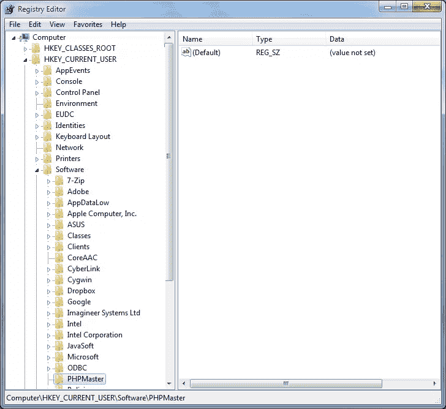
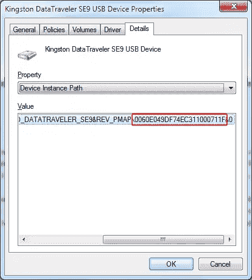

# 用 PHP 访问 Windows 注册表

> 原文：<https://www.sitepoint.com/access-the-windows-registry-from-php/>

你有没有在早上醒来的时候对自己说:“今天我想做一些疯狂的事情？”如果今天是那些早晨中的一个，那么你很幸运。我想给你一点关于使用 PHP 访问 Windows 注册表的介绍。PHP…注册表…疯狂！

Windows 注册表只是一个分层结构的数据库，Windows 操作系统和其他应用程序在其中存储重要的配置信息。所有种类的数据都存储在注册表中:用户配置文件、文件类型关联、硬件信息、序列号等等。通过 win32std 扩展中可用的函数，基于 Windows 的 PHP 应用程序也可以访问注册表。

win32std 扩展可以作为预编译库从 downloads.php.net/pierre/[下载。只需将其放入 PHP 的`ext`文件夹，更新`php.ini`文件，并在必要时重启 Apache。注意，现在你下载的 dll 是 32 位的，所以如果你使用 64 位版本的 WampServer 或类似的软件，你不会成功。您必须将 WampServer 降级为 32 位版本，或者尝试自己编译该库。](http://downloads.php.net/pierre/ "downloads.php.net/pierre")

## 注册表布局

在 Windows 操作系统中，注册表是一个黑暗、危险和可怕的地方。这可能是一种过分夸大的恐惧，但我仍然要重申微软的注册表咒语:“在你修改注册表之前，备份它，并确保你知道如果出现问题如何恢复它。不适当的更改可能会导致严重的问题，可能需要您重新安装操作系统。

那么这个黑暗恐怖的地方看起来像什么？Windows 注册表分为 5 个主要组，称为注册表项:

*HKEY _ 当前 _ 配置*
这个键存储关于计算机硬件的信息，例如显示器分辨率和扬声器设置。你可能会看到这个键缩写为 HKCC。

*HKEY_LOCAL_MACHINE*
此项包含机器的配置信息，如打印机、软件和网络信息。首先加载密钥，然后用户配置文件中的条目覆盖各种值。你会看到这个键缩写为 HKLM。

*HKEY _ 用户*
此键保存机器上本地用户帐户的所有配置文件。用户的屏保选择、主题信息和其他偏好都存储在这里。这个键缩写为 HKU。

*HKEY _ 类 _ 根*
这个键是指向 HKEY _ 本地 _ 机器软件的别名，它存储关于文件关联和 mime 类型的信息。缩写是 HKCR。

*HKEY _ 当前用户*
这个键是一个别名，指向当前登录用户在 HKEY _ 用户中的配置文件。你会看到这个键缩写为 HKCU。

每个键包含子项，子项又包含其他子项和/或配置值。

在 HKEY 当前用户下工作，只需使用几个 CLI 脚本和一个沙箱就足够了。请仅将 HKEY_LOCAL_MACHINE 用于系统范围的应用程序数据，以及适合使用 Microsoft 安全权限的情况。了解什么适合你的情况，知道 PHP 在哪个帐户下运行，并适当地创建你的密钥。

## 制作沙箱

为了安全起见，我建议在脚本中设置一个特殊的密钥，尤其是在开发的时候。犯错是人之常情，我们不想意外地覆盖任何重要的事情。组织是设置指定键的另一个原因。注册表中存储了大量信息，我们希望能够轻松找到自己的值。

注册表编辑器是一个 Microsoft 程序，用于查看和编辑注册表。要创建我们的沙箱，请转到开始，在搜索栏中键入“regedit ”,然后在出现的结果列表中选择`regedit.exe`。

左窗格显示现有键的树形结构，而右窗格显示存储在其中的值。展开 HKEY 当前用户节点，右键单击软件密钥，然后从弹出的上下文菜单中选择新建>密钥。或者，我们也可以使用箭头键遍历树，使软件键突出显示，并从编辑菜单中选择新建>键。为密钥提供一个名称，然后按 enter 键。



现在我们有地方玩了，请允许我向您介绍 win32std 提供的操作注册表项的函数。

## 从注册表中读取

`reg_open_key()`函数打开一个到注册表的连接并返回一个资源。然后，该资源与其他注册表函数一起用于该连接。`reg_close_key()`功能关闭连接。

`reg_open_key()`接受两个参数:第一个是预定义的常量，代表五个主要注册表组之一，然后是所需键的剩余路径。

```
<?php
$keyConst = HKEY_CURRENT_USER;

// backslash is used as an escape so it must be escaped itself
$key = "Software\Intel";

// open the registry key HKCUSoftwareIntel
if (!($reg = @reg_open_key($keyConst, $key))) {
    throw new Exception("Cannot access registry.");
}
...

reg_close_key($reg);
```

现在您已经有了一个打开的连接，您可以使用`reg_enum_key()`、`reg_enum_value()`和`reg_get_value()`函数从注册表中检索信息。

如果只有资源被传递给`reg_enum_key()`，那么它将返回当前键下的一个子键数组。还可以传递一个整数值来检索特定索引处的子项。

```
<?php
// retrieve an array of subkeys under the current key
$subkeys = reg_enum_key($reg);
foreach ($subkeys as $index => $subkey) {
    echo "The subkey at " . $index . " is " . $subkey . "n";
}

// retrieve a specific subkey
$index = 2;
$subkey = reg_enum_key($reg, $index);
echo "The subkey at " . $index . " is " . $subkey . "n";
```

由于`reg_enum_key()`返回键，`reg_enum_value()`返回键的值。该函数接受资源和一个可选的索引。值名可以传递给`reg_get_value()`来检索值的值(是不是有点拗口！).

```
<?php
// retrieve an array of values under a given key
$values = reg_enum_value($reg);
foreach ($values as $index => $value) {
    echo "The value at " . $index . " is " . $value . " and stores ";
    echo reg_get_value($reg, $value) . "n";
}

// retrieve a specific value given the index
$index = 1;
$value = reg_enum_value($reg, $index);
echo "The value at " . $index . " is " . $value . " and stores ";
echo reg_get_value($reg, $value) . "n";
```

## 写入注册表

在读取和写入注册表时，有一些数据类型可供选择。由于 PHP 的动态特性，它们通常没什么影响，但是当你写一个值时，你必须指定类型。大多数情况下，您会发现自己使用 REG_SZ 或 REG_DWORD，但这里列出了扩展公开的数据类型:

*   REG _ DWORD–值存储为 32 位长的整数
*   REG _ SZ–值存储为固定长度的字符串
*   REG _ EXPAND _ SZ–值存储为可变长度字符串
*   REG _ MULTI _ SZ–value 是由分隔符(如空格或逗号)分隔的项目列表
*   REG _ BINARY–值是一个二进制字符串
*   REG _ NONE–值没有关联的特定数据类型

`reg_set_value()`函数用于向注册表写入一个值。如果该值已经存在，那么新值将覆盖它，但是如果它不存在，那么它将创建它。该函数有四个参数:首先是打开的资源，然后是值的名称，然后是表示值的数据类型的预定义常数，最后是数据本身。

```
<?php
$keyConst = HKEY_CURRENT_USER;
$key = "Software\SitePoint";
if (!($reg = @reg_open_key($keyConst, $key))) {
    throw new Exception("Cannot access registry.");
}

$values = array(
    array("dbDriver", REG_SZ,    "mssql"),
    array("dbHost",   REG_SZ,    "localhost"),
    array("dbPort",   REG_DWORD, 1433),
    array("dbSchema", REG_SZ,    "MyAppDB"),
    array("dbUser",   REG_SZ,    "DBUser"),
    array("dbPass",   REG_SZ,    "s3cr3t"));

foreach ($values as $value) {
    reg_set_value($reg, $value[0], $value[1], $value[2]);
}

reg_close_key($reg);
```

## 一个例子–USB 驱动器加密狗

您可能想知道使用注册表是否有实际用途。在基于 web 的应用程序中，您可以将配置信息存储在注册表中。如果您编写了一个桌面应用程序，那么注册表可能是存储从应用程序数据到用户偏好的各种信息的好地方。Windows 本身会将各种有趣的硬件和状态相关信息写入注册表，如果您有足够的创造力，其中一些信息可能会很有用。

假设我们的 PHP 应用程序已经以这样一种方式被许可，即需要将一个 USB 加密狗连接到服务器来运行它。PHP 如何检测加密狗的存在？Windows 上的答案就在注册表里！每个设备都有一个唯一的标识符，因此脚本可以在启动时搜索标识符的相应密钥，以确定加密狗是否插入。

第一步是确定设备的标识符。对于这个例子，我将使用一个商品拇指驱动器。只需将驱动器插入计算机上的 USB 端口，然后进入开始，在搜索栏中键入“设备”，并在出现的结果列表中选择设备管理器。

在设备管理器中找到设备，右键单击条目，并从上下文菜单中选择属性。然后转到“属性”窗口的“详细信息”选项卡，并从下拉列表中选择“设备实例路径”。值末尾的十六进制数字序列是设备 id(用红色标记)。



Windows 在 HKEY _ LOCAL _ MACHINESystemCurrentControlSetServices 的各个子项下记录 USB 设备的存在。像我的拇指驱动器这样的存储媒体将出现在 USBSTOR 下；其他设备可能出现在 usbaudio、usbccgp 和 usbehci 下。此外，请注意，HKEY_LOCAL_MACHINE 只能由特权帐户访问。

所以现在我们可以简单地搜索设备实例的键的 Enum 子键。当驱动器连接时，它将被列出，当它未连接时，它不会被列出。

```
<?php
// device instance ID
$id = "0060E049DF74EC311000711F";

// WARNING: must run with administrative privs to access these keys
$keyConst = HKEY_LOCAL_MACHINE;
$key = "SYSTEM\CurrentControlSet\services\USBSTOR\Enum";

if (!($reg = reg_open_key($keyConst, $key))) {
    throw new Exception("Cannot access registry.");
}

$found = false;
$numDevices = reg_get_value($reg, "Count");
for ($i = 0; $i < $numDevices; $i++) {
    $value = reg_get_value($reg, $i);
    if (strpos($val, $id) !== false) {
        $found = true;
        break;
    }
}    
reg_close_key($reg);

echo "USB drive dongle ", ($found) ? "found" : "not found";
```

这个简单的检查也开启了一些其他有趣的可能性；您可以轻松地编写一个敏感的管理员专用接口，通过检查`$_SERVER["REMOTE_ADDR"]`来验证加密狗和从服务器发送的请求。这种设置需要用户亲自到达指定的服务器*并且*提供某种形式的物理认证。

## 最后

在本文的整个过程中，我们已经了解了什么是 Windows 注册表，以及可以在其中找到什么信息的一个小示例。您可以使用 win32std 扩展提供的功能编写自己的配置数据，也可以回读信息。

顺便说一下，win32std 扩展不仅仅提供对注册表的访问。如果你感兴趣的话，去看看 wildphp.free.fr/wiki/doku.php?id=win32std:index 还有什么。

<small>图片 via[Fotolia](http://us.fotolia.com/?utm_source=sitepoint&utm_medium=website_link&utm=campaign=sitepoint "Royalty Free Stock Photos at Fotolia.com")</small>

## 分享这篇文章