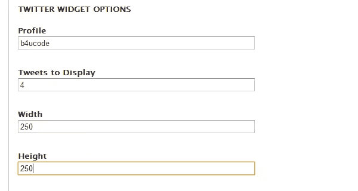
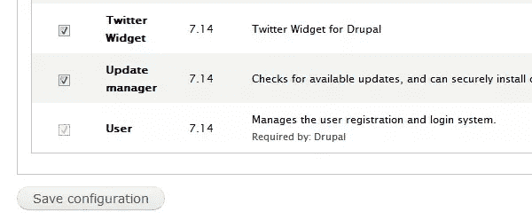

# 如何创建快速的 Drupal 模块

> 原文：<https://www.sitepoint.com/how-to-create-a-quick-drupal-module/>


本教程将演示如何创建一个 Drupal 块模块。我们将讨论将 Twitter 小部件转换成可配置的模块，以及讨论 Drupal 模块开发中的一些基本开发技术。

首先也是最重要的，建议你对 PHP 和 Drupal 有一定的了解。如果你对创建更多的 Drupal 模块感兴趣，我恳请你查看一下 [Drupal API](http://api.drupal.org/api/drupal) 和[文档](http://drupal.org/documentation)页面。然而，我注意到的一件事是，WordPress 和 Drupal 处理事情的方式非常相似，我将指出这一点。

## 设置结构


We begin by creating an area for our module. If you are uploading directly to your Drupal installation, then create a folder called `twitter_widget` in the folder `sites/all/modules/`. However, if you do not have an accessible installation, then simply create the folder on your system. Within this folder we are going to create two files: `twitter_widget.info` and `twitter_widget.module. `Note that the name of the module will be the name used for functions and hooks in the Module file.

## 添加元信息

在这一步中，我们将添加 Drupal 将读取的元信息，以确定我们试图使用的模块的兼容性和核心信息。对于本模块，我们将简单地指定所需的属性名称、描述和核心。尽管添加`files`属性是可选的，但这样做不会有什么坏处。将下面的代码片段复制到您的`twitter_widget.info`文件中。

```
name = Twitter Widget
description = Twitter Widget for Drupal
core = 7.x
files[] = twitter_widget.module
```

## 声明块

现在，我们将直接进入`twitter_widget.module`文件，我们将从使用 Drupal 钩子`hook_block_info`文件开始。这个钩子定义了模块提供的所有块，因为我们的目的只是创建一个块来存放我们的小部件，所以它将是完美的。从开始的 PHP 标记开始，将代码片段复制到文件中。

```
/**
 * Implements hook_block_info().
 */
function twitter_widget_block_info() {

$blocks['twitter_widget'] = array(
      'info' => t('Twitter Widget'),
    );

  return $blocks;
}
```

请注意，`hook_block_info`中的单词“hook”被替换为模块名称`twitter_widget`。这就是 Drupal 实现钩子的方式。我们的钩子刚好有所需的值`info`。根据您的块的性质，您可以添加其他值，如缓存、状态、可见性等。

## 创建块参数



Just like the Joomla Module, we require adding some parameters to change the functionality of our Twitter Widget. The properties that we would like to control are the `Twitter Name`, `Width`, `Height` and `No. of Tweets to display`. In order to complete this parameter section, we use the hook `hook_block_configure`. We implement the hook by naming the function `twitter_widget_block_configure`.

这个钩子有一个变量`$delta`。Drupal 声明“$delta 参数告诉函数正在请求哪个块”——对于本教程，我们将只使用一个块，所以我们的$delta 将是`twitter_widget`。继续将以下代码片段添加到您的文件中。

```
/**
 * Implements hook_block_configure().
 *
 *
 */
function twitter_widget_block_configure($delta = '') {
  $form = array();
  if ($delta == 'twitter_widget') {
$form['twitter_widget'] = array(
  '#type' => 'fieldset',
  '#title' => t('Twitter Widget Options'),
);
    $form['twitter_widget']['twitter_widget_block_profile'] = array(
      '#type' => 'textfield',
      '#title' => t('Profile'),
      '#default_value' => variable_get('twitter_widget_block_profile', 'b4ucode'),
    );
    $form['twitter_widget']['twitter_widget_block_count'] = array(
      '#type' => 'textfield',
      '#title' => t('Tweets to Display'),
      '#default_value' => variable_get('twitter_widget_block_count', 3),
    );
    $form['twitter_widget']['twitter_widget_block_width'] = array(
      '#type' => 'textfield',
      '#title' => t('Width'),
      '#default_value' => variable_get('twitter_widget_block_width', 300),
    );
    $form['twitter_widget']['twitter_widget_block_height'] = array(
      '#type' => 'textfield',
      '#title' => t('Height'),
      '#default_value' => variable_get('twitter_widget_block_height', 300),
    );

  }
  return $form;
}
```

如您所见，我们定义了一个表单数组，并在该数组中创建了一个包含字段集的数组，该字段集将保存我们的其他字段。在我们的数组中，我们使用`type`来定义表单字段，`title`来定义名称，`default_value`。对于我们的默认值，调用函数`variable_get($name, $default = NULL)`，它使用参数

*   $name:要返回的变量的名称
*   $default:如果从未设置该变量，则使用默认值

所以我们的函数实际上说的是:显示一个包含个人资料、要显示的推文、宽度和高度的文本字段的字段集。

### 保存参数

类似于 WordPress 函数`add_option`，我们将使用`variable_set`保存我们的模块选项。这个简单的函数使用 if 语句来检查我们正在查看的块，然后保存为我们定义的每个选项。

```
/**
 * Implements hook_block_save().
 *
 *
 */
function twitter_widget_block_save($delta = '', $edit = array()) {
  if ($delta == 'twitter_widget') {
    variable_set('twitter_widget_block_count', $edit['twitter_widget_block_count']);
    variable_set('twitter_widget_block_profile', $edit['twitter_widget_block_profile']);
    variable_set('twitter_widget_block_width', $edit['twitter_widget_block_width']);
    variable_set('twitter_widget_block_height', $edit['twitter_widget_block_height']);
  }
}
```

## 生成内容

最后，我们到达了`hook_block_view`。这将在 Drupal 站点上呈现我们的块。在这个钩子中，为了方便使用，我们将参数定义为变量。我们使用`variable_get`函数获取参数，该函数接受值和默认值的函数参数。一旦定义了变量，我们将从 [Twitter](https://twitter.com/about/resources/widgets/widget_profile) 获取嵌入代码，并将其呈现在我们的网站上。`subject`的数组键是块的默认标题，而`content`将定义屏幕上显示的实际内容。

我们将把 Twitter 代码添加到数组中，并用参数变量替换属性。请注意，我们没有为颜色和背景色创建参数。也许你可以把它作为你的项目！

```
 * Implements hook_block_view().
 *
 * Prepares the contents of the block.
 */
function twitter_widget_block_view($delta = '') {
 $block = array();
  switch($delta) {
    case 'twitter_widget' :
      $block['subject'] = t('Twitter');

	//Assign Configuration to Variables
      $profile = variable_get('twitter_widget_block_profile', 'b4ucode');
      $width = variable_get('twitter_widget_block_width', 300);
      $height = variable_get('twitter_widget_block_height', 250);
      $count = variable_get('twitter_widget_block_count', 4);

	$html='';
	$html.='<script charset="utf-8" src="http://widgets.twimg.com/j/2/widget.js"></script>';
	$html.="
<script>
new TWTR.Widget({
  version: 2,
  type: 'profile',
  rpp: ".$count.",
  interval: 30000,
  width: ".$width.",
  height: ".$height.",
  theme: {
    shell: {
      background: '#333333',
      color: '#ffffff'
    },
    tweets: {
      background: '#000000',
      color: '#ffffff',
      links: '#4aed05'
    }
  },
  features: {
    scrollbar: false,
    loop: false,
    live: false,
    behavior: 'all'
  }
}).render().setUser('".$profile."').start();
</script>";
      $block['content'] = $html;
}
    return $block;
}
```

## 测试模块



如果到目前为止您已经完成了本教程，那么您可以测试您的新 Drupal 模块了。要测试它，请确保它位于文件夹`sites/all/modules/twitter_widget`中，并从管理区启用它。调整一些参数，保存块，看看魔术展开。

## 结论

本教程是一个很好的蓝图，可以用来创建更多的模块，比如脸书 Like 框、RSS Feed 小部件等等。传播消息，分享你的想法。编码快乐！

## 分享这篇文章