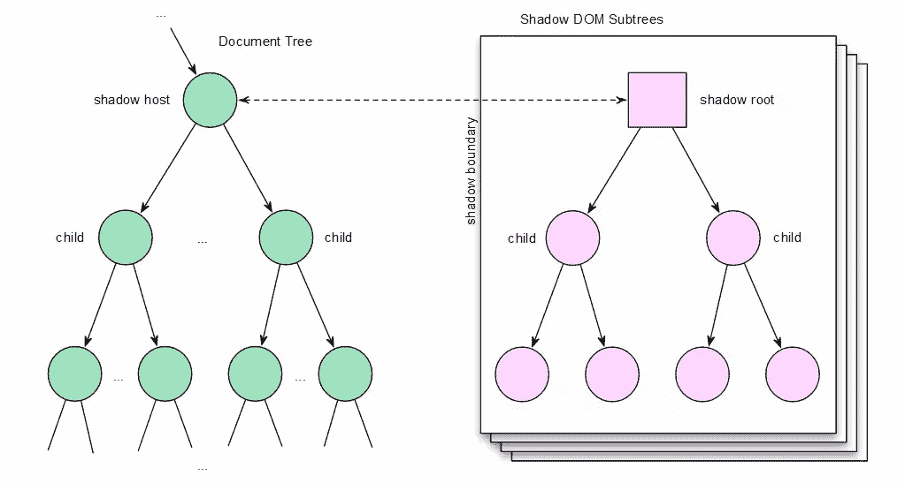
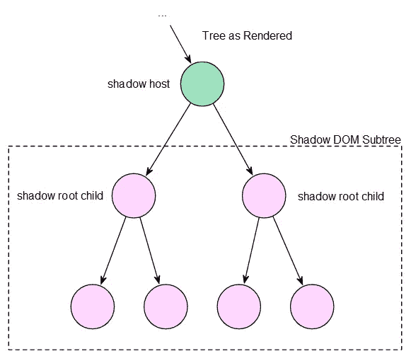

# 影子王国的基础知识

> 原文：<https://www.sitepoint.com/the-basics-of-the-shadow-dom/>

现代网站通常包含来自多个来源的数据和小部件，这些数据和小部件混杂在一个页面上。例如，一个网站可以很容易地包含一个 YouTube 视频播放器，一个脸书“喜欢”按钮，一个 Twitter“推特”按钮，等等。这么多供应商的代码可以共存于一个页面上，这简直是一个小小的奇迹。而且，尽管当前的实现可行，但它们远非理想。例如，给页面添加一个“喜欢”按钮需要使用一个笨拙的<iframe>标签。目前还没有一种优雅的方式来为这些小部件提供封装。</iframe>

封装是面向对象编程语言的一个特性，它允许对象管理自己的数据，并限制对数据的访问。在这种范式下，一个对象向外部世界公开一个接口，该接口可用于与其数据进行交互。通过维护这个接口，对象可以阻止第三方代码任意清除其私有数据。不幸的是，对于 web 开发人员来说，HTML 还没有提供这样的接口。CSS 和 JavaScript 冲突是库和小部件开发人员经常关注的问题。封装将允许开发人员编写他们的代码，并知道它将正常工作，即使存在其他脚本和样式表。W3C 正在用目前正在开发的[影子 DOM 规范](https://www.w3.org/TR/shadow-dom/ "Shadow DOM")解决这个问题。

## 阴影 DOM 子树

DOM 树由许多功能子树组成――一个或多个实现特定功能的 DOM 节点。例如,“Like”按钮功能由一个节点集合实现，而“Tweet”按钮由另一个集合实现。影子 DOM 的目标是为这些子树提供功能封装。这是通过将功能子树与文档树(以及彼此)分开来实现的。阴影 DOM 子树的这种分离被称为*阴影边界*。CSS 规则和 DOM 查询不会跨越阴影边界，因此提供了封装。

文档树中的任何元素都能够托管一个或多个影子 DOM 子树。托管影子 DOM 子树的节点被称为*影子主机*。但是，因为影子 DOM 子树不与普通文档树交互，所以一个节点可能是影子主机，但在文档树中仍然有子节点。

图 1 摘自 W3C 规范，说明了影子 DOM 子树的概念。左边的绿色节点代表典型的文档树。其中一个 DOM 节点被标记为影子主机。从这个节点出来的虚线箭头穿过阴影边界并引用几个阴影 DOM 子树。每个影子 DOM 子树的根是一个*影子根*(在图中用正方形节点表示)。影子根是一种特殊的文档片段 DOM 节点类型，它封装了来自外部世界的其子节点。然而，影子根的子节点只是标准的 DOM 节点。



图一。文档树和几个影子 DOM 子树。

## 渲染阴影 DOM

当呈现页面时，文档树和阴影 DOM 子树被呈现为单个树。文档树会正常呈现。但是，当遇到影子主机时，浏览器会忽略其文档子树，而是呈现节点的影子 DOM 子树。图 2 说明了这个概念。请注意，虽然渲染了影子主机，但没有渲染影子根节点。



图二。阴影 DOM 和文档树呈现为单个树。

## 启用阴影 DOM

虽然 shadow DOM 是一个热门话题，但它目前在 Chrome 中仅作为一个实验性功能受到支持。要在 Chrome 中启用阴影 DOM，首先导航到 URL“Chrome://flags”。接下来，找到“启用阴影 DOM”选项，并单击“启用”。该选项如下面的图 3 所示。最后，Chrome 会自己重启。此时，您可以开始编写利用影子 DOM 的页面了。


图 3。在 Chrome 20 中启用阴影 DOM。

## 一个影子 DOM 例子

本节探索一个示例阴影 DOM 页面。页面的 HTML 源代码如下所示。页面主体包含一个将被用作影子主机的

元素。在的内部是一个子节点，它明确声明它不是影子 DOM 的一部分。当页面完成加载时，事件处理程序将一个影子 DOM 子树附加到影子主机。影子 DOM 子树是通过实例化一个新的 WebKitShadowRoot 对象创建的(一旦影子 DOM 得到完全支持，WebKit 前缀可能会被删除)。影子主机作为唯一的参数传递给 ShadowRoot 构造函数。接下来，名为“shadowChild”的元素被添加到 shadow DOM 子树中。“shadowChild”的文本内容表明它是影子 DOM 的一部分。

```
<!DOCTYPE html>
<html lang="en">
<head>
  <title>Shadow DOM Example</title>
  <meta charset="UTF-8" />
  <style>
    span {
      color: red;
    }

    #shadowHost {
      border: 1px solid black;
    }
  </style>
  <script>
    window.addEventListener("load", function() {
      var shadowHost = document.getElementById("shadowHost");
      var shadowRoot = new WebKitShadowRoot(shadowHost);
      var shadowChild = document.createElement("span");

      shadowChild.textContent = "This is part of the shadow DOM";
      shadowRoot.appendChild(shadowChild);
    }, false);
  </script>
</head>
<body>
  <div id="shadowHost">
    <span id="child">This is not part of the shadow DOM</span>
  </div>
</body>
</html>
```

Chrome 20 显示的示例页面如图 4 所示。该页面有几个值得注意的地方。首先，阴影 DOM 被渲染，而不是文档树。虽然文档树没有显示，但是仍然可以通过脚本访问。第二件要注意的事情是，根据元素的 CSS 规则，阴影不是红色的。这表明影子 DOM 实际上是从文档树封装而来的。


图 4。阴影 DOM 示例页面。

图 5 显示了 Chrome 的元素检查器显示的文档树。文档树不反映影子 DOM 的任何部分。不支持影子 DOM 的浏览器会转而呈现该树。


图 5。阴影 DOM 示例页面 DOM 视图。

## ShadowRoot DOM 方法

因为影子 DOM 节点是从文档树封装的，所以普通的 DOM 相关方法如 getElementById()不能用来访问它们。然而，ShadowRoot 对象提供了许多相同的函数来访问它们的影子 DOM 子树。例如，ShadowRoot 对象支持以下常见的 DOM 查询方法。

*   getElementById()
*   getElementsByClassName()
*   getElementsByTagName()
*   getelemontsbytagnamens_)
*   查询选择器()
*   querySelectorAll()

为了方便起见，ShadowRoot 对象还支持“innerHTML”属性。与普通 DOM 一样，影子 DOM“innerHTML”既可以读取也可以写入。下面显示了一个用法示例。

```
shadowRoot.innerHTML = "<span>innerHTML generated content</span>";
```

## 跨越阴影边界的 CSS

默认情况下，在影子根之外定义的 CSS 规则不会应用于影子 DOM 节点。然而，ShadowRoot 对象可以通过“applyAuthorStyles”布尔属性允许 CSS 规则跨越阴影边界。将此属性设置为 true 会覆盖默认行为。下面显示了一个用法示例。在前面的示例页面中，这将导致阴影 DOM 变成红色。

```
shadowRoot.applyAuthorStyles = true;
```

## 要记住的事情

*   影子 DOM 为 web 开发人员提供了功能封装。
*   影子主机是支持影子 DOM 子树的元素。
*   影子 DOM 子树的根节点称为影子根。
*   在呈现期间，阴影 DOM 子树替换文档树子树。
*   ShadowRoot 对象提供了许多常见的 DOM 相关函数。

## 分享这篇文章