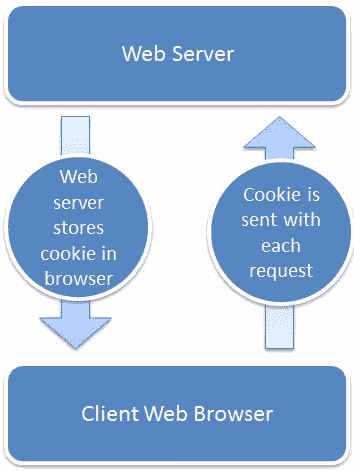

# 用 PHP 烘焙饼干

> 原文：<https://www.sitepoint.com/baking-cookies-in-php/>

你有没有想过，尽管 HTTP 是一个无状态的协议，当你登录一个网站，买东西和结账时，服务器如何能唯一地识别你？你可能想知道 HTTP 是不是无状态的，但是你的状态是通过你的交互来维护的，这不是一个矛盾吗？欢迎来到 cookies 的世界(顺便说一句，不是我们能吃的那种:)，它是维护用户状态和网络浏览器与网络服务器之间交互的主要方式之一。

Cookies 是浏览器存储在用户计算机上的信息。存储在 cookie 中的信息用于唯一地识别用户，并且该信息随着每个请求被发送到服务器，以便服务器可以利用它。Cookies 可以存储各种数据，如您的姓名、上次访问日期、购物车内容等。一个网站存储的 cookie 不能被其他网站访问，这使得 cookie 存储个人信息相对安全。不过，最好不要在其中存储敏感信息，比如密码和信用卡信息。

## Cookie 的生命周期

PHP cookie 的生命周期是这样的，从烘焙到食用:



当浏览器第一次连接到特定服务器时，没有 cookies。当向 PHP 脚本发出请求时，脚本调用`setcookie()`函数。这导致在响应中发送一个`Set-Cookie` HTTP 头，其中包含要设置的 cookie 的名称和值。

当浏览器收到响应时，它会将`Set-Cookie`头的值作为 cookie 存储在本地。当随后向服务器发出多个请求时，浏览器会包含一个包含 cookie 名称和值的`Cookie`头。PHP 拦截它并在`$_COOKIE`数组中创建一个条目，包含 cookie 的名称和值。

## 烘焙 PHP 饼干

PHP 通过名为`setcookie()`的函数和超全局数组`$_COOKIE`提供对 cookies 的访问。`setcookie()`将数据存储在 cookie 中，`$_COOKIE`从 cookie 中检索值。

### 设置 Cookies

函数`setcookie()`用于设置 cookie 的值和可选的到期日期。该函数的语法是:

```
setcookie(*name*, *value*, *expire*, *path*, *domain*, *secure*)
```

下表列出了每个参数的含义以及它是必需的还是可选的，该表改编自 W3Schools 上的一个表:

 parameters")

让我们看一个用 PHP 代码设置 cookie 的例子。

```
<?php
$firstcookie = "my first cookie";
$expiry = time() + (60 * 60 * 8);

// send a cookie that expires in 8 hours
setcookie("FirstCookie", $firstcookie, $expiry);
```

代码在变量`$firstcookie`中设置 cookie 值，在变量`$expiry`中设置到期日期。在对函数`setcookie()`的调用中，cookie 名称被设置为“FirstCookie”。cookie 名称可以是您希望的任何名称。

请注意，cookie 将在 8 小时后过期(超出当前时间的秒×分×小时)。但是，如果您希望 cookie 立即被删除，或者一旦浏览器检索到它的信息，该怎么办呢？您可以将截止日期设置为过去的某个时间。比如可以把`$expiry`设为`time()-3600`。

默认情况下，只为当前目录及其后代设置 Cookies。第四个参数 *path* 将对 cookies 的访问限制在服务器上的给定路径。例如，如果 cookie 设置了“/test/”目录，那么它将只对`test`目录及其子目录中的脚本可用。如果您希望为根目录设置 cookie，则应该使用“/”作为路径参数，如下例所示:

```
<?php
setcookie("FirstCookie", $firstcookie, $expiry, "/");
```

第五个参数*域*将对 cookie 的访问限制到给定的域。例如，如果您希望从两个不同的 web 服务器(如 www.trial.com 和 support.trial.com)访问 cookie，则将 domain 参数设置为. trial.com。这样做将使 cookie 对两个服务器都可用。

```
<?php
setcookie("FirstCookie", $firstcookie, $expiry, "/", ".trial.com");
```

使用 HTTP 协议中的头字段将 Cookies 发送到浏览器。因此，**在向用户发送一行 HTML 或任何其他输出之前，有必要设置 cookies。**如果发送任何输出，将不会设置 Cookies。在这种情况下，`setcookie()`函数将返回 false，PHP 将产生一条错误消息。

### 检索和更新 Cookies

在 PHP 中检索 cookies 相当简单。全局数组`$_COOKIE`用于为后续页面请求检索 cookie 值。例如，如果您想要显示用户访问的次数，那么下面的代码应该可以达到目的:

```
<?php
$visits = 1;
if (isset($_COOKIE["visits"])) {
    $visits = (int)$_COOKIE["visits"];
}
setcookie("visits", $visits + 1, time() + (60 * 60 * 24 * 30));
echo "You have visited this page $visits time(s).";
```

一旦过期，网络浏览器会自动删除 cookie。因此，将`setcookie()`函数的到期参数设置为过去的某个任意时间会删除 cookie。`setcookie()`使用创建 cookie 时指定的相同域名、路径名和 cookiename。只有 value 和 expire 参数需要更改。在此示例中，value 参数设置为 null，expire 参数设置为过去的某个任意时间。

```
<?php
$expiry = time() - 60;
setcookie("FirstCookie", $firstcookie, $expiry, "/", ".trial.com");
```

## 最后的碎屑

有些情况下，用户出于隐私原因可能希望关闭浏览器中的 cookies。因此，在使用 cookie 之前，建议首先测试用户是否在浏览器中启用了 cookie。您可以通过设置一个 cookie，然后重定向到 URL 中带有标志的下一页，并检查 cookie 是否被接收回来。如果没有，则向用户显示一条消息，建议他们启用 cookies。

在需要 cookie 的网站上禁用 cookie 会禁用网站的功能。在这种情况下，我们需要找到其他方法来维护状态。一种替代方法是使用 PHP 会话并在 URL 后面附加一个 sessionID，但是要注意这种方法可能会导致社交攻击。

使用 cookies 时，有几件事您应该记住:

*   一台服务器可以定义多个不同名称的 cookie，但是浏览器限制每台服务器的 cookie 数量(数量因浏览器而异，但一般在 20 个左右)。
*   任何 cookie 的最大大小为 4KB。
*   尽管您在 cookie 上设置了过期时间，但是用户可以随时删除 cookie。
*   Cookies 只能由设置它们的浏览器访问(Firefox 和 IE 不共享)。
*   用户可以在浏览器中关闭 cookies。
*   在 PHP 脚本发送任何其他输出之前，必须设置 Cookies，否则您将收到一个错误。

饼干就这些了。你现在应该能够在你的 PHP 应用程序中使用 cookie 了，所以开始烘焙吧，让我知道你的 cookie 味道如何！

<small>图片 via[Fotolia](http://us.fotolia.com/?utm_source=sitepoint&utm_medium=website_link&utm=campaign=sitepoint "Royalty Free Stock Photos at Fotolia.com")</small>

## 分享这篇文章