# 在 Photoshop 中创建干净时尚的布局

> 原文：<https://www.sitepoint.com/create-a-clean-and-stylish-layout-in-photoshop/>

在这个 Photoshop 布局教程中，我将带你从头开始设计一个干净、现代、时尚的文件夹布局。我们都知道一个独特而时尚的投资组合对每个设计师来说都是必不可少的。但有时当涉及到我们的投资组合时，我们确实会被冲昏头脑。所以我认为对于一个优秀的作品集来说，关键是在风格和秩序之间创造一种平衡。所以今天我们要创造一个既时尚又专业的投资组合布局。

**资源:**

图片:[微博](https://new.microbot.ch/)，[苏哈里姆](http://www.behance.net/sugarrhyme)

图标:[圈社交图标](http://www.designdeck.co.uk/a/1245)

现在，在我们开始之前，让我们好好看看我们今天要设计什么。

[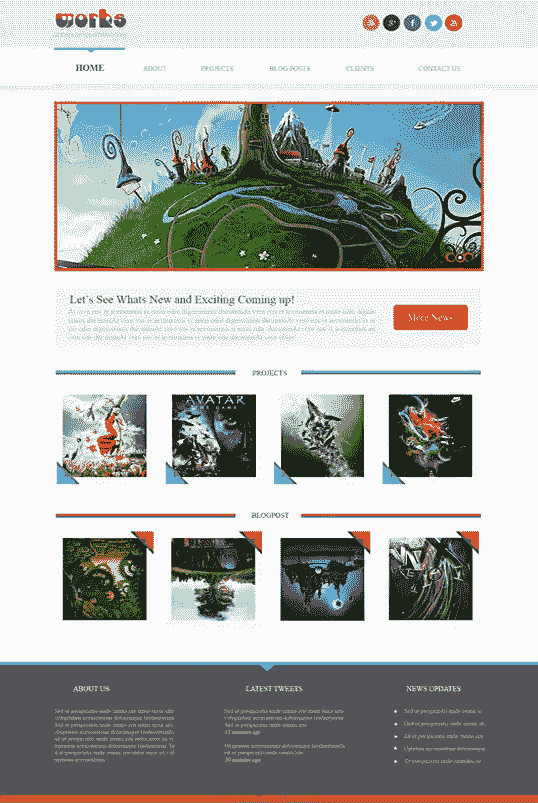](https://www.sitepoint.com/wp-content/uploads/2012/07/Result.jpg)

**第一步:** **创建你的 Photoshop 文档**
打开你的 Photoshop，新建一个宽 1350px，高 1800px 的文件。

[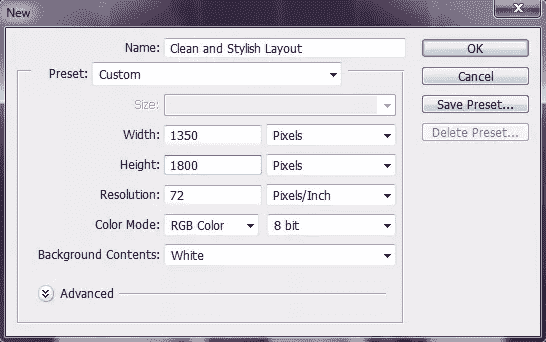](https://www.sitepoint.com/wp-content/uploads/2012/07/Step-1.jpg)

**Step2:** **填充背景** **和顶部区域**
现在用颜色# ffffff 填充背景。然后创建一个新层去图层>新建>图层。然后点击“矩形选框工具”,选择顶部的一些区域。填# eeeeee。

[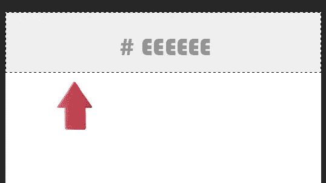](https://www.sitepoint.com/wp-content/uploads/2012/07/Step-2.jpg)

**第三步:** **创建导航区**
现在我们将从我们的导航区开始。因此，创建一个新的层，再次选择使用“矩形选框工具”,并填写# ffffff。

[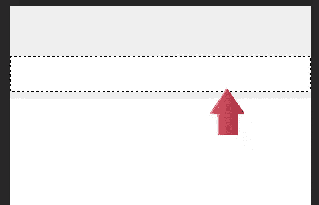](https://www.sitepoint.com/wp-content/uploads/2012/07/Step-3.jpg)

第四步:添加笔触
我们将在这里添加一点笔触，点击图层>图层样式>笔触颜色# e5e5e5。

[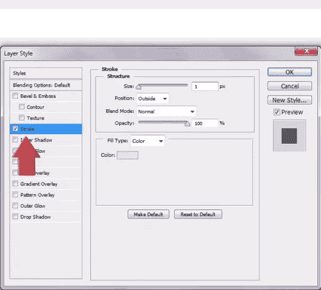](https://www.sitepoint.com/wp-content/uploads/2012/07/Step-4.jpg)

**步骤 5:添加导航文本和分隔线**
现在让我们使用“文本工具”添加导航文本。然后使用 1px 粗细的线条工具和# a8a8a8 颜色在文本之间创建一些小线条。

[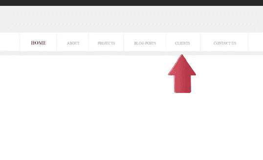](https://www.sitepoint.com/wp-content/uploads/2012/07/Step-5.jpg)

**第六步:创建悬停效果**
再次选择“线条工具”，在首页文字上方使用，粗细 5p，颜色# 1dbfee。现在选择钢笔工具，在线的中间创建一个小三角形，用同样的颜色填充。

**第七步:粘贴您的标志**
现在我们将添加我们的标志和标签行，并将其放在左上角。

[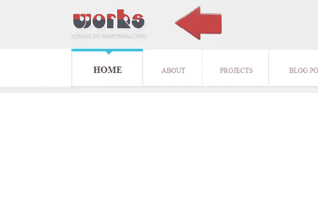](https://www.sitepoint.com/wp-content/uploads/2012/07/Step-7.jpg)

第八步:添加社交媒体图标
现在复制并粘贴一些社交媒体图标到右边。

[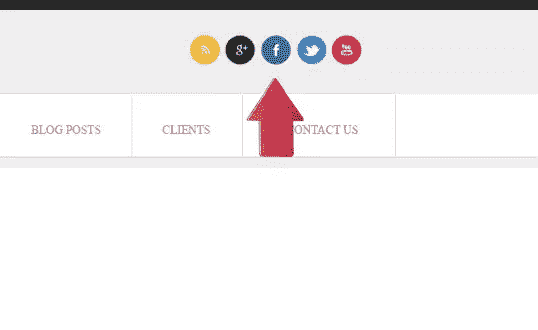](https://www.sitepoint.com/wp-content/uploads/2012/07/Step-8.jpg)

第九步:从滑块
开始现在让我们从滑块开始，简单地粘贴图像并添加一些笔画。转到图层>图层样式>描边。

[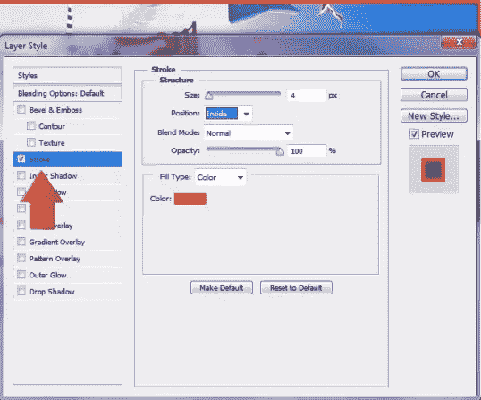](https://www.sitepoint.com/wp-content/uploads/2012/07/Step-9.jpg)

**步骤 10:添加滑块点**
选择“硬圆刷”，在我们的特征图像上添加小的橙色圆圈。现在减小笔刷的尺寸，这次使用深色，我用的是# 222222，然后再次减小尺寸，使用浅色。

[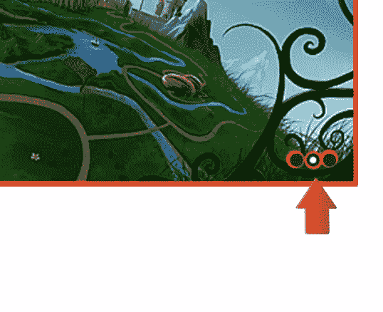](https://www.sitepoint.com/wp-content/uploads/2012/07/Step-10.jpg) 

 **第十一步:新闻框设计
现在我们从新闻框开始。所以首先选择“矩形工具”创建一个矩形，用# dbdbdb 添加一个 1px 的笔画。

[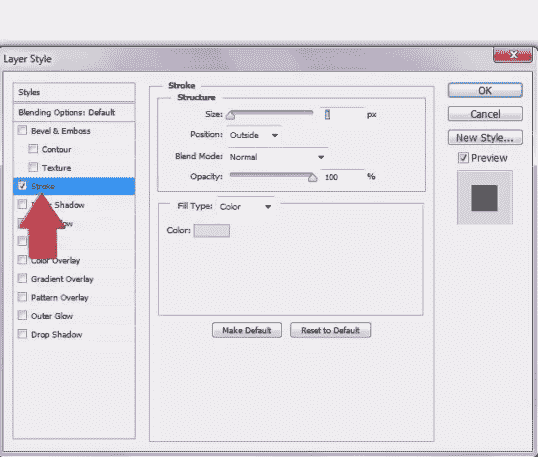](https://www.sitepoint.com/wp-content/uploads/2012/07/Step-11.jpg) 

 ****第 12 步:添加文本和按钮**
添加文本使用“文本工具”你可以给任何标题，然后缩小字体大小，为文本的其余部分选择一种更亮的字体，然后在右边添加一个按钮。

[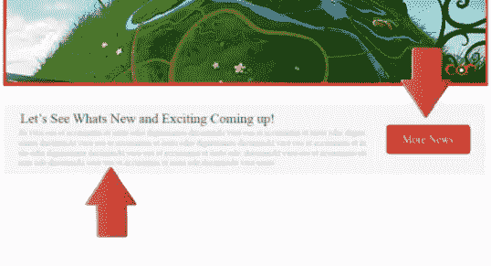](https://www.sitepoint.com/wp-content/uploads/2012/07/Step-12.jpg)

第十三步:项目标题
现在让我们从项目和帖子开始。选择“线条工具”，用 5px 和 3px 的权重画两条线，颜色# 1dbfee 和# ea2900。并在中间加上标题。

**步骤 14:博文标题**
对“博文”重复同样的过程，改变颜色顺序。

[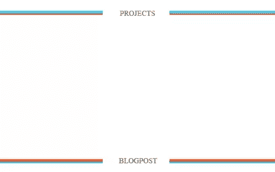](https://www.sitepoint.com/wp-content/uploads/2012/07/Step-14.jpg) 

 ****步骤 15:创建图像框**
现在选择“矩形工具”，用颜色# f9f9f9 创建一个盒子，用颜色# eaeaea 添加 1 像素的笔画。

[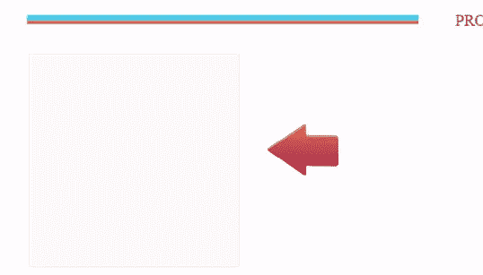](https://www.sitepoint.com/wp-content/uploads/2012/07/Step-15.jpg)

**步骤 16:在角上添加三角形**
现在选择“钢笔工具”，在角上创建一个三角形，用# 4accf1 填充。

[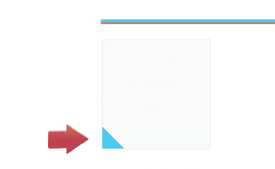](https://www.sitepoint.com/wp-content/uploads/2012/07/Step-16.jpg)

**第十七步:添加暗条**
选择“线条工具”，创建一条 5px 粗细、颜色# 667e85 的小线条。现在创建一个同样颜色的小三角形，就像我们在顶部导航中做的一样。

 

 **步骤 18:添加图像
现在粘贴特征图像，并把它放在我们框架的中心。

[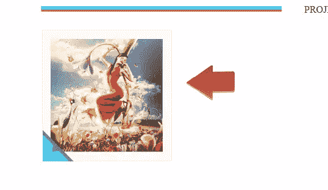](https://www.sitepoint.com/wp-content/uploads/2012/07/Step-18.jpg)

步骤 19:创建更多的项目
重复相同的过程，创建更多的项目。

[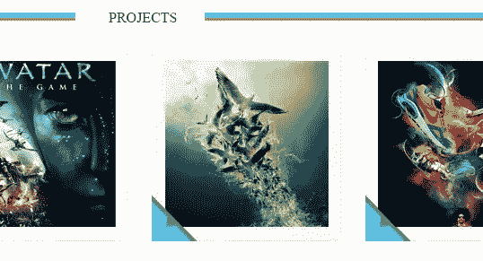](https://www.sitepoint.com/wp-content/uploads/2012/07/Step-19.jpg)

步骤 20:更多的帧和图像
我们将再次重复上面相同的帧，但这次我们将在右上角创建彩色的角，并使用颜色# f15f27。

[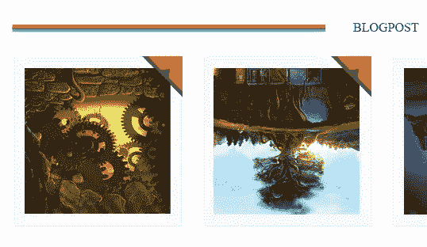](https://www.sitepoint.com/wp-content/uploads/2012/07/Step-20.jpg)

**步骤 21:** **构建页脚**
现在我们将从页脚开始，选择“矩形选框工具”，在底部选择一个小长条，用# f15f27 填充。

[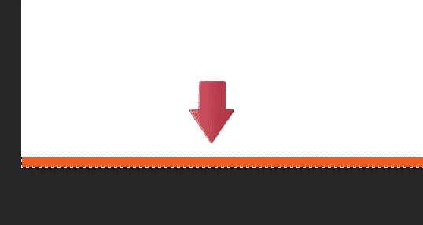](https://www.sitepoint.com/wp-content/uploads/2012/07/Step-21.jpg)

步骤 22:添加橙色条
现在选择余下的页脚区域，填充颜色# 545454。

[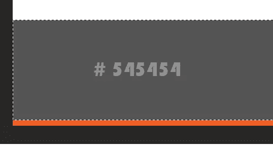](https://www.sitepoint.com/wp-content/uploads/2012/07/Step-22.jpg)

**步骤 23:在顶部创建蓝色条**
选择“线条工具”，在页脚区域顶部创建一条线，重量为 8px，颜色为# 4accf1，然后在中间添加一个同样颜色的三角形。

第 24 步:添加页脚文本
现在选择“文本工具”，添加一些小工具和版权文本，我们就完成了。

[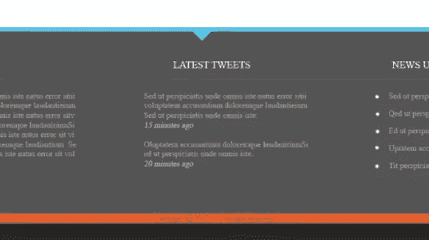](https://www.sitepoint.com/wp-content/uploads/2012/07/Step-24.jpg) 
我们干净时尚的布局完成了，希望你喜欢这个教程，我会带着更多有趣的教程回来，直到那时继续设计。******** 

## ****分享这篇文章****