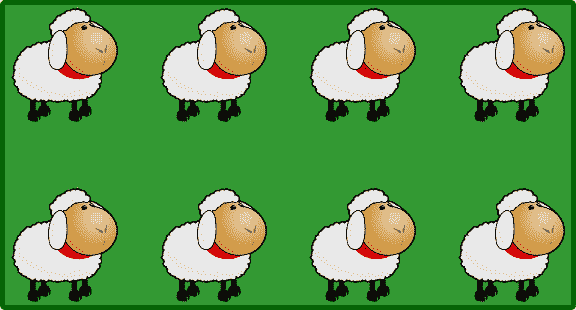
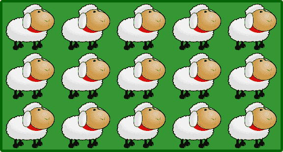

# CSS3 中新的重复背景图像选项

> 原文：<https://www.sitepoint.com/css3-background-repeat-space-round/>

在 CSS2.1 中，`background-repeat`属性有四个选项:`no-repeat`、`repeat`、`repeat-x`和`repeat-y`。虽然这些毫无疑问是有用的，但它们不允许对重复过程进行更好的控制，并且如果它们不能精确地适应容器的次数，瓦片将被修剪。

CSS3 引入了两个新选项:`space`和`round` …

## 背景-重复:空格

`space`选项将在水平和垂直方向重复平铺，而不剪切或调整图像大小，例如

```
 background-repeat: space; 
```



## 背景-重复:圆形

`round`选项将在水平和垂直方向重复平铺，不进行剪裁，但图像可以调整大小，例如

```
 background-repeat: round; 
```



假设我们有一个宽度为 100px 的背景图像(实际大小或使用 CSS3 背景大小属性调整的[)。这包含在具有 520 个水平像素的元素中，因此:](https://www.sitepoint.com/css3-background-size-property/)

```
round(520 / 100) = round(5.2) = 5

```

浏览器将在空间中呈现五幅图像，但将图像宽度调整为 104 像素(520 像素/ 5)。图像变宽以适合容器。

## 不同的水平和垂直重复

`background-repeat`可以传递两个值来改变水平和垂直重复，例如

```
 background-repeat: round space; /* width resizes, height static */
background-repeat: space round; /* width static, height resizes */
background-repeat: space no-repeat; /* fit tiles horizontally only */ 
```

## 更改背景位置

只有当`background-position`设置为 0 0 时，使用`space`或`round`平铺才会如您所愿。你可以自由改变它；图像大小和间距将平铺不变，但左上偏移会相应移动。

## 浏览器兼容性

两种浏览器支持`space`和`round`属性。猜猜是哪些？你错了:是 IE9 和 Opera。在撰写本文时，它们还没有在 Firefox、Chrome 或 Safari 中实现。更糟的是:

*   当火狐遇到`space`或`round`时，它会退回到`repeat`。
*   当 Chrome 或 Safari 遇到`space`或`round`时，它们会退回到`no-repeat`。此外，webkit 浏览器似乎可以识别属性，但不能正确地呈现它们。

太好了。谢谢伙计们。

实现一致性的唯一方法是强制 Firefox 像 webkit 一样呈现，例如

```
 #element
{
	background-repeat: no-repeat;
	background-repeat: space;
} 
```

因此:

*   IE9 和 Opera 将正确地水平和垂直重复一个图块，而无需裁剪或调整图像大小。
*   Firefox 不会识别`space`，返回到`no-repeat`设置并显示单个磁贴。
*   Chrome 和 Safari 可以识别`space`，但会错误地显示一个不重复的标题。

恶心。最好再等几个月，直到 Mozilla 和 Webkit 完全支持 CSS3 `background-repeat`。

[**查看 CSS3 后台-重复演示页面……**](https://blogs.sitepointstatic.com/examples/tech/background-size/repeat.html)

## 分享这篇文章