# Illustrator CS6 的最佳新功能

> 原文：<https://www.sitepoint.com/the-best-new-features-of-illustrator-cs6/>

Adobe 所有的旗舰程序都经历了升级，Illustrator 也不例外。Illustrator CS6 已经超越了它以前的版本，提供了许多长期 Illustrator 用户多年来一直要求的主要功能。虽然 Illustrator CS6 中有无数的增强和升级，但以下是最值得注意的新添加内容。

### 界面

就像 Photoshop 一样，Illustrator 的界面也经历了一次彻底的大修。它更暗，更有戏剧性，让你的插图生动起来。这非常有帮助，因为它让您可以专注于您的工作，而不会让您的 Illustrator 项目的美学受到大量外部杂物的污染。

[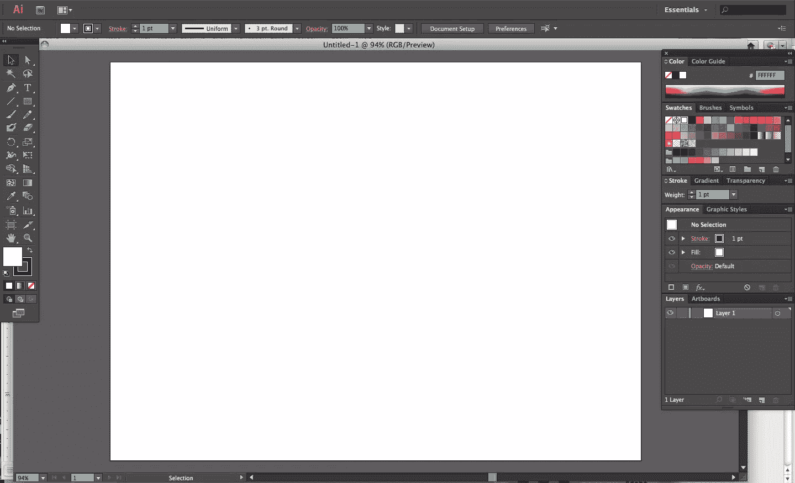](https://www.sitepoint.com/wp-content/uploads/2012/05/Screen-shot-2012-05-11-at-10.30.18-PM1.png)

现在，用户可以在没有对话框的情况下命名图层，并且每个面板都经过优化，以提供最佳的用户体验。此外，图标已经过重新设计，更加直观，每个面板中的菜单位置已经过重新安排，功能定义也更加清晰。

### 笔画上的渐变

这是用户多年来一直要求的功能。它们不仅看起来很棒，工作起来就像渐变填充，而且你还有额外的选项和功能，真正脱颖而出。

[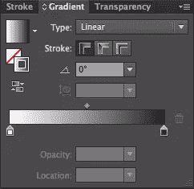](https://www.sitepoint.com/wp-content/uploads/2012/05/Screen-shot-2012-05-11-at-10.36.33-PM2.png)

这些新的笔画渐变选项也很棒。你不会像你想的那样在“描边”面板中找到选项；描边的渐变选项实际上是在渐变面板中找到的。您有三个选项来控制渐变与笔画的关系:

**在笔画内应用渐变**–该选项允许您创建一个渐变，当渐变在预览中显示时，该渐变跨越笔画的区域。

[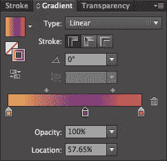](https://www.sitepoint.com/wp-content/uploads/2012/05/Screen-shot-2012-05-11-at-10.38.10-PM2.png)

[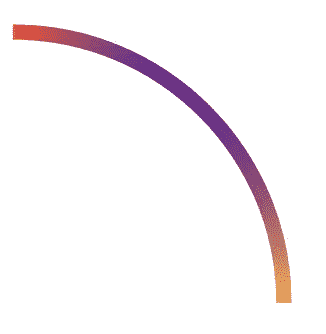](https://www.sitepoint.com/wp-content/uploads/2012/05/Screen-shot-2012-05-11-at-10.38.40-PM.png)

**沿笔画应用渐变**–该选项将渐变环绕在笔画的轮廓周围，允许您在开始时使用一种颜色，并在渐变到达终点时通过任意数量的渐变进行过渡。

[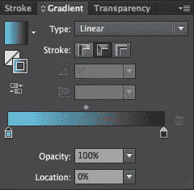](https://www.sitepoint.com/wp-content/uploads/2012/05/Screen-shot-2012-05-13-at-2.11.11-AM.png)

[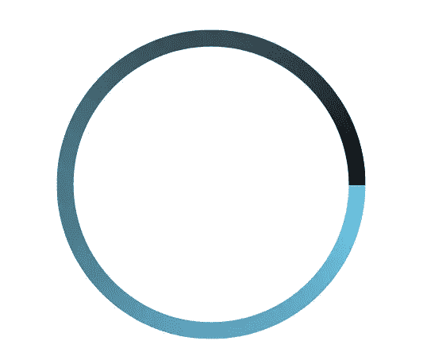](https://www.sitepoint.com/wp-content/uploads/2012/05/Screen-shot-2012-05-13-at-2.02.51-AM.png)

**在笔画上应用渐变**——这是每个人都渴望的惊人功能。渐变穿过笔画并随之弯曲，使其具有立体感。

[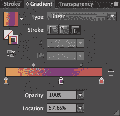](https://www.sitepoint.com/wp-content/uploads/2012/05/Screen-shot-2012-05-11-at-10.39.11-PM.png)

[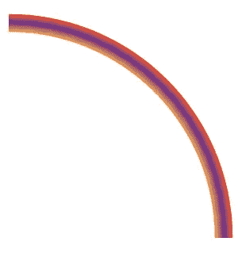](https://www.sitepoint.com/wp-content/uploads/2012/05/Screen-shot-2012-05-11-at-10.39.06-PM.png)

您也可以像对待任何其他渐变一样对待渐变的颜色。这太神奇了，因为你可以控制渐变中每种颜色的不透明度。你可以在 CS6 中更快更容易地创建逼真的玻璃和半透明的物体。结合网格工具，你的矢量插图将看起来更加真实。

[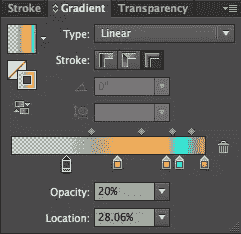](https://www.sitepoint.com/wp-content/uploads/2012/05/Screen-shot-2012-05-11-at-10.41.29-PM.png)

[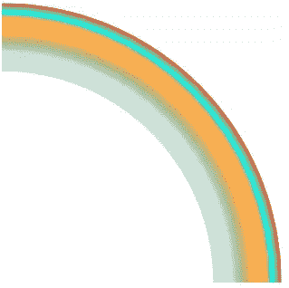](https://www.sitepoint.com/wp-content/uploads/2012/05/Screen-shot-2012-05-11-at-10.41.21-PM.png)

### 模式

有了 Illustrator CS6，制作自定义图案变得前所未有的简单！要找到新的图案选项，请转到“对象”>“图案”>“显示选项”会弹出一个面板，为您提供几个选项来定制重复模式。

[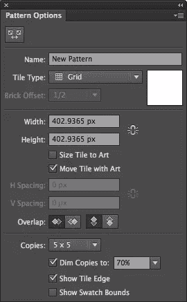](https://www.sitepoint.com/wp-content/uploads/2012/05/Screen-shot-2012-05-11-at-11.58.00-PM.png)

第一步是单击面板顶部的图案平铺工具图标。这将激活一个可视正方形，向您显示用于创建图案的区域的边界。

[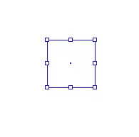](https://www.sitepoint.com/wp-content/uploads/2012/05/Screen-shot-2012-05-12-at-8.35.59-PM.png)

接下来，确保取消选中“随图片移动瓷砖”,因为这在尝试创建您的图案时会非常烦人。如果你选择了这个选项，那么每次你创建一个新的矢量对象时，拼贴都会移动，这对你调整图案没有任何帮助。你在正方形内创造的任何东西都将被重复，并形成无限重复的模式。光是这一点就很好了，但是还有更多模式选项:

[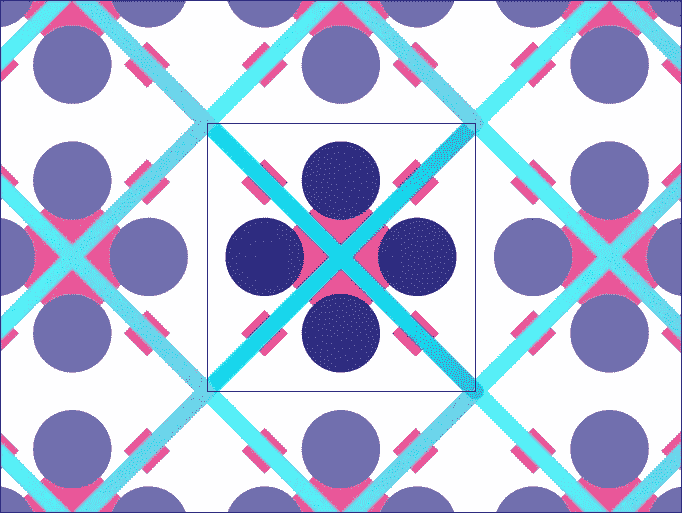](https://www.sitepoint.com/wp-content/uploads/2012/05/Screen-shot-2012-05-12-at-12.21.45-AM1.png)

在“平铺类型”下，可以指定平铺图案的类型。默认是 grid，它可以产生一些非常精细的结果。在对角线上应用轻微的渐变，你可以给你的图案增加一些维度。下一个选择是一排一排地建造，这很难靠你自己来完成，并且需要很多仔细的计划和很多宝贵的时间来让一切都井然有序。

[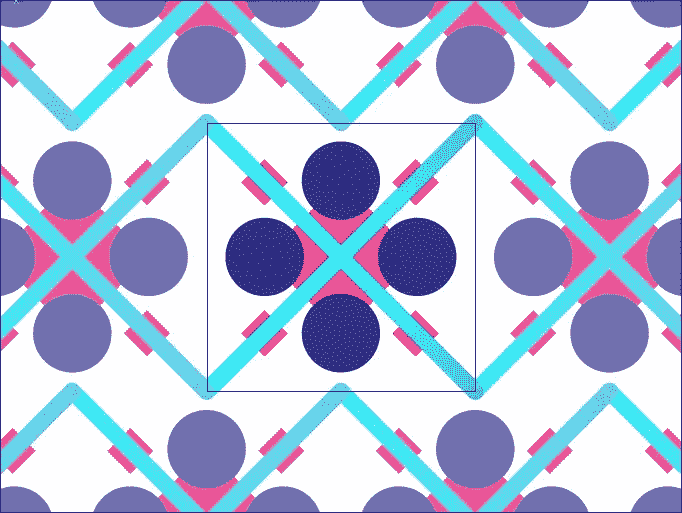](https://www.sitepoint.com/wp-content/uploads/2012/05/Screen-shot-2012-05-12-at-12.23.47-AM1.png)

还有一砖一柱的:

[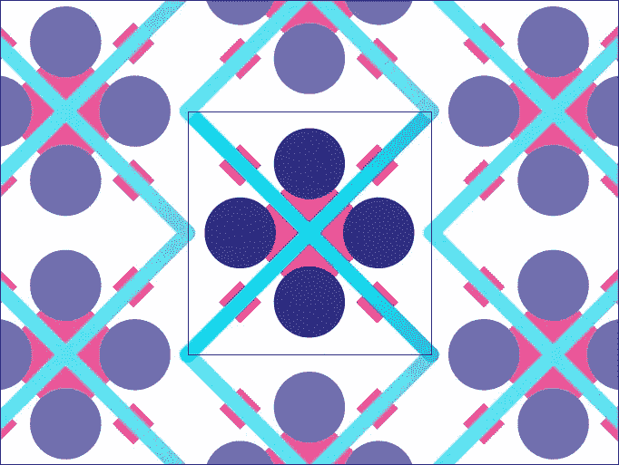](https://www.sitepoint.com/wp-content/uploads/2012/05/Screen-shot-2012-05-12-at-12.25.21-AM1.png)

按列十六进制:

[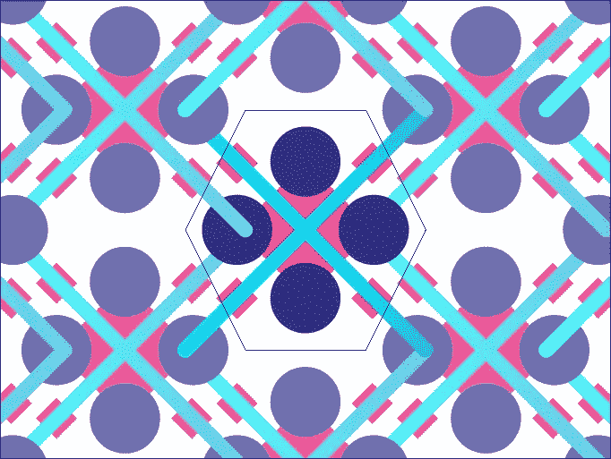](https://www.sitepoint.com/wp-content/uploads/2012/05/Screen-shot-2012-05-12-at-12.25.39-AM1.png)

并且，按行十六进制:

[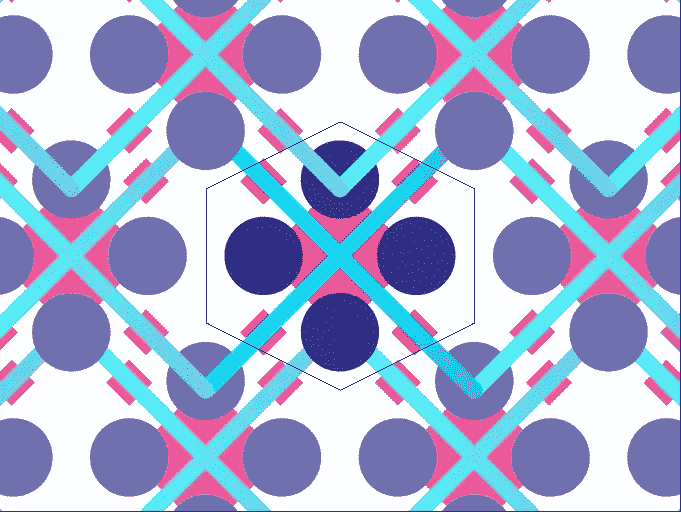](https://www.sitepoint.com/wp-content/uploads/2012/05/Screen-shot-2012-05-12-at-12.25.53-AM.png)

有两个菜单对模式的结果有很大的影响。第一个是砖块偏移。这决定了使用砖块选项时每行或每列的交错方式。相等地偏移每一行，所以如果你正在寻找一个对称的模式，这是正确的选择。所有其他行都将前一行和后一行偏移一个分数，形成一个不太对称的图案。

[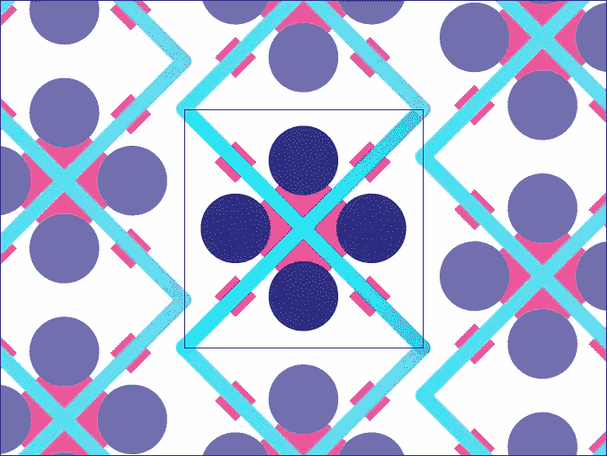](https://www.sitepoint.com/wp-content/uploads/2012/05/Screen-shot-2012-05-12-at-12.35.34-AM.png)

另一个选项是“重叠”选项，它允许您确定组成阵列的零件的堆叠顺序。只需点击一下，就能彻底改变你的图案的外观。请参见下面的示例:

[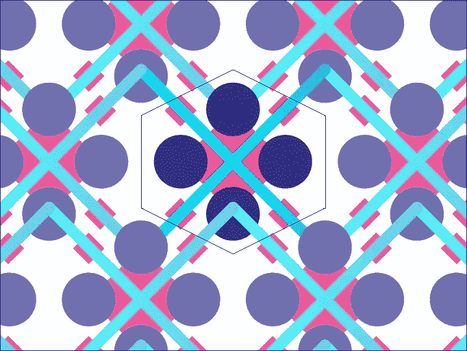](https://www.sitepoint.com/wp-content/uploads/2012/05/Screen-shot-2012-05-12-at-12.45.11-AM.png)

您还可以快速命名和保存您的模式，以供以后使用。图案选项面板是一个神奇的工具，它将使创建无缝和复杂图案的繁琐任务变得快如闪电。

### 实时跟踪

Live trace 已被重命名为 Image Trace，并在以前的版本基础上进行了增强和优化。过去我曾多次使用实时追踪，这个动作在追踪过程中创建了太多的锚点，使得每个矢量变得更加复杂。随着图像跟踪改造，你的矢量跟踪应该更加简化。此外，你的高保真(照片质量)痕迹的平滑度应该好得多。

**原件**

**高保真照片**

从上面的例子可以看出，很难从原始照片和它的矢量描摹中看出区别。它也有自己的面板，允许你调整你的变化和预设之间切换。

### 文本

Photoshop 中有一个已经存在了很长时间的小功能，就是可以用箭头键在你的字体中循环。谢天谢地，他们已经在 Illustrator CS6 中添加了这个功能。要循环显示字体，请高亮显示文稿中的任何文本，然后高亮显示顶部选项栏中或“字符”面板本身中的字体名称。然后，使用向上和向下箭头键循环显示您的字体。这是一个很棒的功能，因为您可以快速找到适合您项目的完美字体。有时你只是想尝试不同的想法，现在你可以在 Illustrator CS6 中快速轻松地做到这一点。

[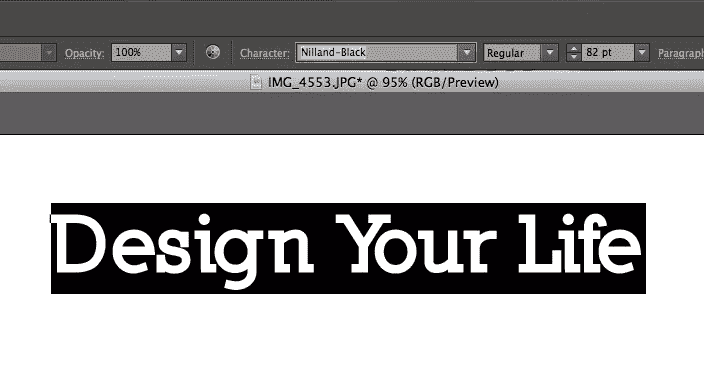](https://www.sitepoint.com/wp-content/uploads/2012/05/Screen-shot-2012-05-13-at-1.50.12-AM.png)

### 结论

有了 Illustrator CS6 中新增的所有功能，您将能够比以往更快、更轻松地创作作品。许多老用户梦寐以求的新功能已经实现。Illustrator 经过了彻底的革新，它被构建得更快、更直观、更精简。

*你有机会探索 Illustrator CS6 吗？你觉得新功能怎么样？*

## 分享这篇文章