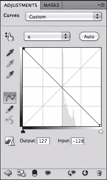
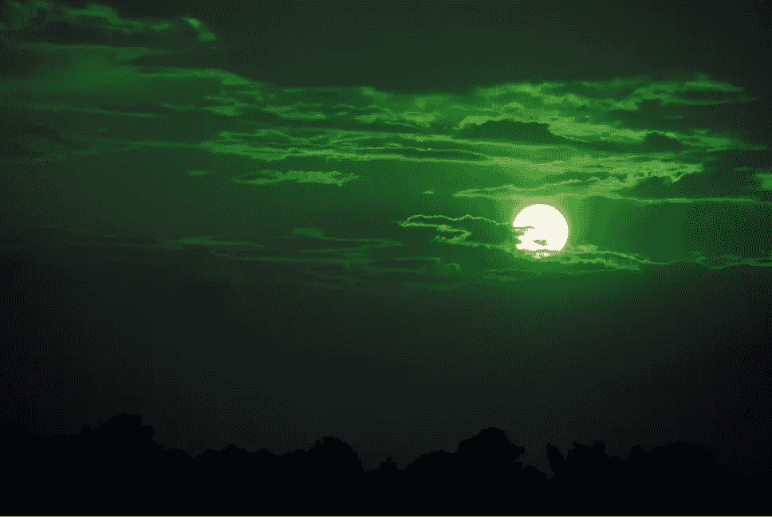
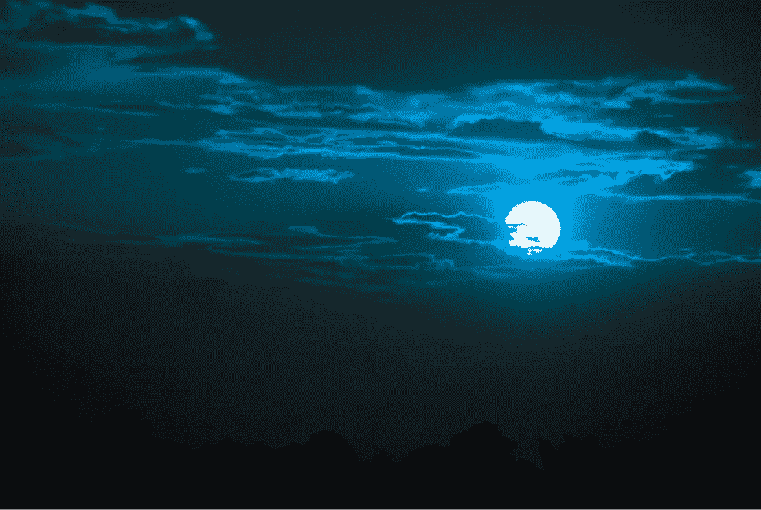
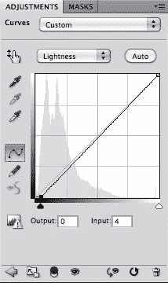
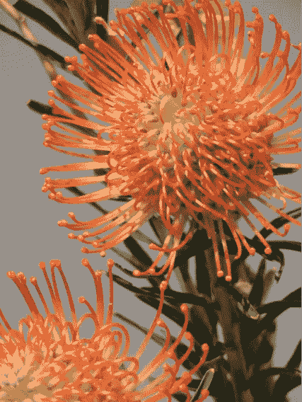
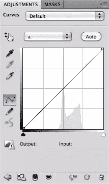
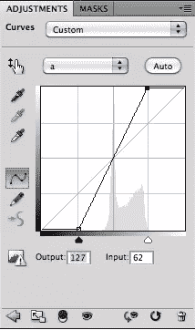
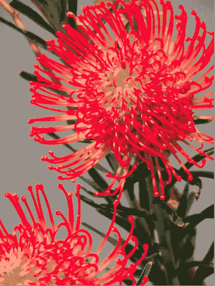
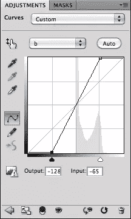
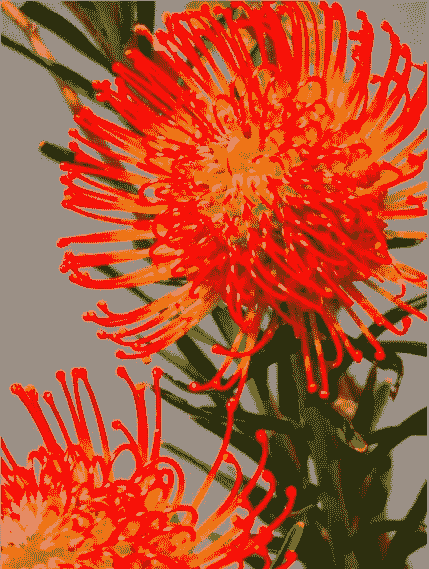

# 使用 Photoshop 的 LAB 模式变换您的图像并创建更大胆、更好的颜色

> 原文：<https://www.sitepoint.com/transform-your-images-and-create-bolder-better-colors-with-photoshops-lab-color-mode/>

Photoshop 显然是一个编辑图像的好工具，但是 Photoshop 丰富的色彩功能往往没有得到充分利用。根据您的目的，Photoshop 中的某些颜色模式可以将您的作品从“经过适当编辑”的图像转换为耀眼、生动、色彩丰富的图像。不管你是平面设计师，网页设计师，还是摄影师；你必须能够控制和修正你的颜色。

有些人选择严格在 CMYK 模式下工作，这是有限制的，因为许多 Photoshop 滤镜在 CMYK 模式下不起作用。还有的选择 RGB 模式工作，做完之后再切换到 CMYK 模式。这很好，但是在切换模式时颜色会有很大的变化。

## 关于 Lab 颜色模式

Lab 颜色模式是 Photoshop 中很少使用(但非常有用)的颜色校正工具。实验室模式由三个通道组成:明度或亮度通道，以及“A”和“B”通道。“A”通道用于从红色到绿色的颜色范围，“B”通道用于从蓝色到黄色的颜色范围。Lab 的工作原理与 CMYK 和 RGB 不同。CMYK 用于打印，RGB 用于显示器等设备，但在不同的显示器上观看时，两种颜色模式都不一致。在处理项目时，您会发现您的图像在一个显示器上看起来是一种方式，而在另一个屏幕上完全不同。实验室模式是不同的，因为无论您在哪个屏幕(或多少个屏幕)上工作，它都是一致的。

Lab 模式使改变图像的颜色变得异常容易，您可以获得通常无法在 CMYK 或 RGB 中产生的效果。您可以反转和更改颜色，强调灯光和阴影，并突出反射。在下面的例子中，我们将通过几个步骤把日落变成夜间的图像。下载日落的样图，在这里找到了。

这张图片提供了一个美丽的日落，有很多橙色和对比鲜明的云。如果你需要把日落改变成月光下的图像，最好的日落图像是一个太阳又圆又好的图像(相对于发出太阳光的图像)。这是因为你通常看不到来自月球的光线。

首先，我们需要将颜色模式转换为 lab。为此，请进入“图像”>“模式”>“实验室颜色”

我们将简单地通过反转图像中的颜色来把日落变成月光下的照片。如果我们处于 RGB 或 CMYK 颜色模式，我们按 Command/Ctrl + "I "来反转颜色，它也会将黑色反转为白色，将白色反转为黑色。这根本不是我们想要的，幸运的是，实验室模式对我们的颜色提供了更好的控制。

要在实验室模式下反转图像的颜色，只需添加一个曲线调整层。在我们的选项中，我们将暂时不考虑亮度。

相反，我们的主要重点将放在“A”和“B”通道上。选择 a 通道，你会看到曲线调整是一条对角线。只需向上拖动低侧(最左边的点)并向下拖动上侧(最右边的点)即可反转红色和绿色色调。

然后，选择“B”通道，做同样的事情，反转图像的黄色和蓝色调。

现在是时候回到你的图像的亮度通道，并调整它给你最好的结果。我实际上没有改变曲线段本身，但我抓住了黑色滑块，并将其稍微向右移动。这使得在我们的月光变换中应该是黑色的区域变暗。

实验室模式非常适合这个目的。RGB 和 CMYK 将浅色、深色、高光和阴影存储在一起，而 lab 模式将颜色和亮度保存在单独的通道中，这意味着您可以在不改变高光和阴影的情况下改变颜色，反之亦然。

## 让色彩更加鲜艳

实验室模式不仅仅适用于剧烈的夜间到白天(或者，在我们的例子中，白天到夜晚)的转换；您还可以执行更微妙的颜色改进，仔细增强现有的颜色。让我们来看看这幅花的图片，让它的颜色更加大胆和充满活力。你可以从[这里](http://www.sxc.hu/browse.phtml?f=download&id=1382822)下载样图开始。

这张图片已经很漂亮了，但是我将向你展示如何让花的颜色更好，这样你就可以看到一些仔细的调整可以带来多大的不同。

在 Photoshop 中打开图像，将颜色模式切换到 lab。然后，点击“新调整层”图标，并选择曲线。

我们将再次离开亮度通道，我们将把注意力放在“A”和“B”通道上。选择“A”通道，不要反转点的位置，而是将它们向内均等移动。您可以通过查看曲线图下方调整图层面板右侧的输入值来判断它们向内移动了多远。你越是把两边往中间靠，颜色就越鲜艳。观察下面我是如何向中心移动这些点的。

对“B”通道重复同样的过程，使两边向内相等，直到你对结果满意为止。

用这种技术，你可以得到一些真正充满活力和惊人的颜色。你必须平均引入这些点的原因是，这样你的颜色就不会彼此冲突，从而在你的图像中产生奇怪的颜色或奇怪的光晕。但是，如果你正在寻找不寻常的颜色或奇异的光晕效果，扭曲实验室模式的颜色通道可以创建一些真正奇妙的效果。

*你试过 lab 色彩模式吗？您主要在 CMYK 或 RGB 模式下工作吗？你有什么喜欢的增强色彩的技巧吗？*

## 分享这篇文章