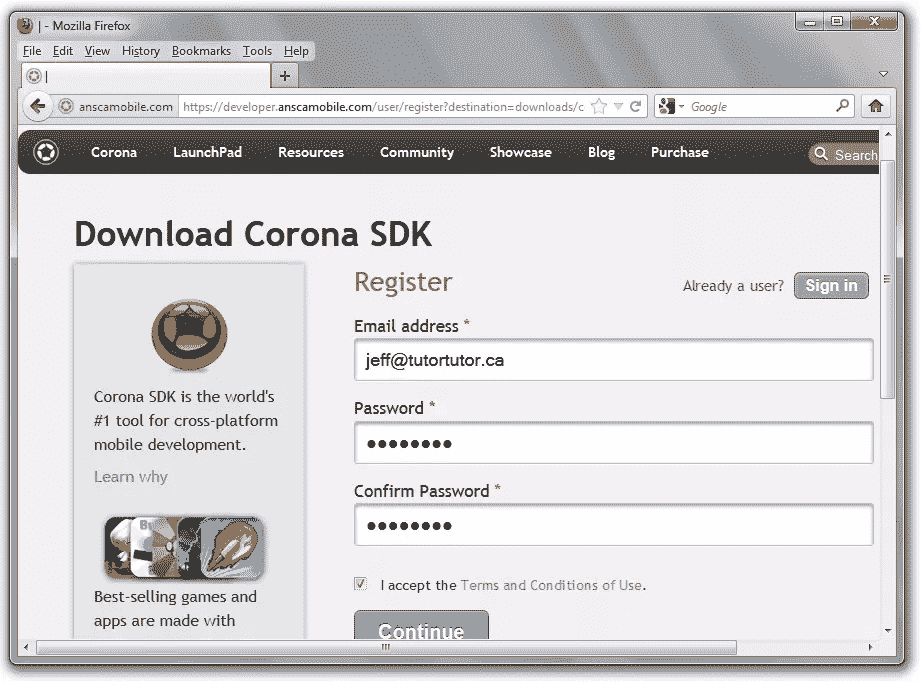

# 向工具箱添加 Web 控制台，第 1 部分

> 原文：<https://www.sitepoint.com/add-a-web-console-to-your-toolbox-part-1/>

一个*控制台*是一个软件工件，用于从键盘读取面向行的文本输入，并将面向行的文本输出写到屏幕上。控制台通常用于实现操作系统[命令行界面](http://en.wikipedia.org/wiki/Command-line_interface)，但在[基于文本的冒险游戏](http://en.wikipedia.org/wiki/Adventure_game#Text_adventure)和其他环境中也很方便。

尽管由于图形用户界面的激增，面向文本的控制台不再像以前那样受欢迎，但它们对于那些不被这种界面风格吓倒的超级用户来说还是很有用的。此外，控制台可以开辟一种新的网络应用，如嵌入式浏览器[外壳](http://en.wikipedia.org/wiki/Shell_(computing))。

本文开始了一个由两部分组成的系列，它展示了一个基于 JavaScript 的控制台库，供可能从这种用户界面风格中受益的 web 应用程序使用。第 1 部分向您介绍了该库的简单 API 以及作为该 API 的有用演示的浏览器外壳应用程序。第 2 部分向您展示了如何实现这个库，以便您可以修改它来满足其他需求。

## 浏览控制台库

控制台库由一个名为`Console`的全局对象组成，该对象具有几个属性。这种安排最大限度地减少了对全局名称空间的污染。此外，它反映了我避免支持多个控制台的愿望，因为我发现实现单一控制台更容易。
`Console`提供了以下功能:

*   基于所需行数和列数的简单初始化(`<canvas>`标签只需要一个`id`属性)

*   画布按 tab 键顺序放置，并在浏览器(如 Firefox)中立即获得键盘焦点

*   清除控制台功能

*   等宽字体的黑色文本上的绿色

*   标记当前输入位置的可见光标

*   文本回显功能

*   当文本流过右下角字符位置时，可垂直滚动

*   退格键方面的简化编辑

*   没有输入时自动调用函数

*   支持 FireFox、Internet Explorer、Chrome、Opera 和 Safari

虽然`Console`封装了多个可访问的属性，但我认为其中只有四个是“公共”API 的成员。不应访问其他属性；它们的存在是为了支持以下四个属性，并且可能会在该库的后续版本中发生变化:

*   `init(canvasName, numCols, numRows)`初始化控制台。传递给`canvasName`的字符串必须与现有的`<canvas>`元素的`id`属性的值匹配。传递给`numCols`的整数标识期望的列数(例如 80)，传递给`numRows`的整数标识期望的行数(例如 25)。控制台被清除，光标位置被设置(0，0)。生成的控制台在黑色背景上显示绿色文本。此函数不返回值。

*   `clear()`清除控制台并将光标位置设置为(0，0)。此函数不返回值。

*   返回一行输入，并将该输入回显到控制台。它首先通过注意输入中是否存在换行符(由用户按下标记为 Enter 或 Return 的键来指示)来检查是否输入了一行。如果是这样，则返回不带换行符的行。如果没有换行符，或者没有输入，这个函数返回 null。当一个函数被传递给`callback`时，该函数在没有输入任何内容的情况下被调用。

*   `echo(msg)`从光标位置开始将传递给`msg`的字符串回显到控制台，并更新。当消息流过右下角时，控制台会垂直滚动。这个函数识别`b`(退格)和`n`(换行符)特殊字符。此外，它不返回值。

在等待用户按回车键时，`getLine(callback)`功能不会阻塞当前线程。相反，它会立即返回。这是因为 JavaScript 代码运行在单线程上。(HTML5 的 web workers 是一个例外，超出了本文的范围。)阻塞该线程的时间超过浏览器认为可接受的时间，会导致浏览器显示一个对话框，报告无响应的脚本。

控制台库易于使用。在定义了一个`<canvas>`元素之后，在初始化并将任何初始文本回显到控制台之后，通过 JavaScript 的`setInterval()`函数重复执行一个函数。每次执行都应该调用`getLine(callback)`(使用可选的回调函数)，然后根据`getLine()`的返回值采取适当的行动。清单 1 给出了这个库的简单演示的 HTML。

```
<html>
   <head>
      <title>
         Console Demo
      </title>

      <meta http-equiv="X-UA-Compatible" content="IE=Edge"/>

      <script src="../Console/Console.js">
      </script>
   </head>

   <body style="text-align: center">
      <p>
      <h2>
        Console Demo
      </h2>

      <canvas id="mycanvas">
      HTML5 canvas element not supported by this browser.
      </canvas>

      <p>
      You might have to press the Tab key or click the canvas to give it keyboard focus.
      </p>

      <script>
         Console.init("mycanvas", 64, 16);
         Console.echo(">");
         function tick()
         {
            var line = Console.getLine();
            if (line != null)
            {
               if (line != "")
                  Console.echo(line+"n");
               Console.echo(">");
            }
         }
         setInterval("tick()", 50); // Invoke tick() every 50 milliseconds.
      </script>
   </body>
</html>
```

**清单 1:** 回显控制台上输入的文本

清单 1 描述了`ConsoleDemo.html`。这个清单相当简单，除了`<meta>`元素。该元素实施了一种[兼容模式](http://blogs.msdn.com/b/askie/archive/2009/03/23/understanding-compatibility-modes-in-internet-explorer-8.aspx)——使用最新标准的渲染模式——以便控制台可以在 Internet Explorer 9(以及可能更高版本的浏览器)下工作。否则，Explorer 会输出一条错误消息，指出画布 API 的`getContext()`函数未被定义。

清单 1 继续使用一个包含名为`Console.js`的 JavaScript 源文件内容的`<script>`元素。这个文件定义了控制台库，位于相对于`ConsoleDemo.html`访问的`Console`目录中。附在本文后面的代码文件在适当的相对目录中包含了`ConsoleDemo.html`和`Console.js`，所以您应该可以毫无问题地运行`ConsoleDemo`。

这个 HTML 文件的主体指定了一个`<canvas>`元素，它的`id`属性被赋予了`mycanvas`。不需要其他属性，因为控制台库会处理它们。主体还包含一个呈现控制台演示代码的`<script>`元素。

代码首先将画布初始化为 64 列乘 16 行的绘图区域——我选择这些值是因为它们是我的旧 TRS-80 型号 III 微型计算机上的文本屏幕的尺寸。然后，代码将一个`>`字符作为初始输入行的提示回显到控制台。

此时，定义了一个名为`tick()`的函数用于重复执行。通过调用`setInterval("tick()", 50)`函数，该函数将每 50 毫秒执行一次。每次调用都试图检索并向控制台回显一行输入。

`tick()`首先调用`getLine()`而不传递回调函数，因为本例中不需要回调函数。如果该函数因为没有输入任何内容或者用户正在键入一些输入内容(并且还没有按 Enter/Return 键)而返回 null，则不会发生任何事情。否则，如果返回的行不等于空字符串(只按了 Enter/Return)，则输入的文本后跟一个换行符将回显到控制台。此时，会回显一个`>`提示，通知用户需要另一行输入。

图 1 展示了 Firefox 环境中的控制台。


**图 1:** 在 Firefox 上开始使用控制台，不需要按 Tab。

## 遭遇浏览器外壳

一个 [*外壳*](http://en.wikipedia.org/wiki/Shell_(computing)) 提供了一个操作系统的用户界面，它的主要目的是运行程序。现代操作系统以图形外壳为特色，但是许多也以传统的面向命令行的外壳为特色(例如，Unix 的 Korn 和 Bourne 外壳)。类似的外壳可以通过控制台库嵌入到网页中，这个*浏览器外壳*可以用来执行面向浏览器的命令。我创建了一个浏览器外壳应用程序，作为控制台库的有用演示。图 2 展示了这个应用程序在 Internet Explorer 9 浏览器环境中的控制台。

[](https://www.sitepoint.com/wp-content/uploads/2012/05/figure2.jpg)

**图 2:** 浏览器外壳目前支持四个命令。

图 2 揭示了一个有趣的异常现象:地理位置信息不会立即显示出来。相反，纬度和经度数据通常在浏览器中多行显示。您将在研究清单 2 时了解原因。

```
<html>
   <head>
      <title>
         Browser Shell
      </title>

      <meta http-equiv="X-UA-Compatible" content="IE=Edge"/>

      <script src="../Console/Console.js">
      </script>
   </head>

   <body style="text-align: center">
      <p>
      <h2>
        Browser Shell
      </h2>

      <canvas id="mycanvas">
      HTML5 canvas element not supported by this browser.
      </canvas>

      <p>
      You might have to press the Tab key or click the canvas to give it keyboard focus.
      </p>

      <script>
         Console.init("mycanvas", 64, 22);
         Console.echo("Browser Shell 1.0nn");
         Console.echo("Type 'help' (without the quotes) to obtain helpnn");
         Console.echo(">");
         var geo = "";
         function callback()
         {
            if (geo == "")
               return;
            Console.echo(geo+"n");
            Console.echo(">");
            geo = "";
         }  
         function tick()
         {
            var line = Console.getLine(callback);
            if (line != null)
            {
               line = line.trim();
               if (line == "browser")
                  Console.echo(navigator.userAgent+"nn"); else if (line == "cls") Console.clear(); else if (line == "geo") { Console.echo("querying location info...may take a few momentsnn"); function report_error(error) { geo = error.message; if (geo == "") // geo is "" on Safari geo = "unknown error"; } function report_geolocation_query(position) { geo = "Lat: "+position.coords.latitude+", Lon: "+position.coords.latitude; } navigator.geolocation.getCurrentPosition(report_geolocation_query, report_error); } else if (line == "help") { Console.echo("Available commands...n"); Console.echo("browser -- display current browser infon"); Console.echo("cls -- clear screenn"); Console.echo("geo -- obtain geolocation informationn"); Console.echo("help -- display this help textnn"); } else if (line != "") Console.echo("bad commandn"); Console.echo(">"); } } setInterval("tick()", 50); // Invoke tick() every 50 milliseconds. </script> </body> </html>
```

**清单 2:** 解释和执行命令

清单 2 展示了`BrowserShell.html`。该清单的布局与清单 1 相似，应该很容易理解。在初始化并将初始文本回显到控制台后，重复执行`tick()`函数以获取下一行输入，修剪两端的空白，检查四个可能的命令之一，并执行该命令。如果输入了无效的命令，控制台会回显`bad command`。无论如何，用户都会被提示输入下一个命令。

`geo`命令是实现起来最复杂的。它通过[地理位置 API](https://www.w3.org/TR/geolocation-API/) 获取用户的地理位置信息，这是异步的，以避免阻塞 JavaScript 线程。`navigator.geolocation.<wbr>getCurrentPosition(report_<wbr>geolocation_query, report_error)`询问用户是否允许获取地理位置信息，当用户接受时继续获取该信息，然后调用两个回调函数之一:

*   通过一个`Position`参数调用`report_geolocation_query(<wbr>position)`，这个参数通过文档对象模型类型`Coordinates`的`coords`成员存储地理位置数据。这个 DOM 接口包括 DOM 类型`double`的`latitude`和`longitude`字段。

*   使用一个`PositionError`参数调用`report_error(error)`，该参数通过其 DOM 类型`DOMString`的`message`成员和 DOM 类型`unsigned short`的`code`成员存储失败的原因。

每个回调都从它传递的参数中提取信息，并构建一个字符串，将其分配给`geo`变量。在 Safari 上测试时，我发现这个浏览器不允许我获取地理位置信息。此外，它将空字符串分配给了`message`。为了解决这种情况，我编写了`report_error(error)`来将`"unknown error"`分配给`message`。(我本来可以基于值为 2 的`error.code`输出一条消息—该职位不可用。我把这个改变留给你作为一个练习。)

清单 2 声明了一个作为参数传递给`getLine(callback)`的`callback()`函数。每当`getLine(callback)`检测到没有输入时，该功能被调用。在确认已经给`geo`赋值后，`callback()`回显这个变量的值，然后给控制台一个`>`提示，然后给这个变量赋值一个空字符串(以避免重复输出`geo`的值)。

为什么我不在`report_geolocation_query(<wbr>position)`和`report_error(error)`中回显`geo`的值(这样我就不需要`geo`而是可以使用一个局部变量)而不是麻烦地传递一个回调函数给`getLine(callback)`？如果我这样做，导航数据可能会在输入命令的过程中输出，导致混乱。例如，当输入`help`时，我可能会得到以下混合输出:

```
>helLat: 49.88, Lon: 49.88
>p
```

## 结论

控制台是将简单控制台嵌入网页的有用工具。前面的浏览器外壳应用程序让您了解了什么是可能的。您可能想用额外的命令来扩展这个应用程序，比如用一个`dir`命令来获得一个 [web 存储器](https://www.w3.org/TR/webstorage/)的目录列表。然而，您首先需要了解这个库是如何工作的，这是第 2 部分的主题。

| 注 |
| 与本文相关的所有文件都位于 [code.zip](https://www.sitepoint.com/wp-content/uploads/2012/05/code.zip) 中。 |

## 分享这篇文章