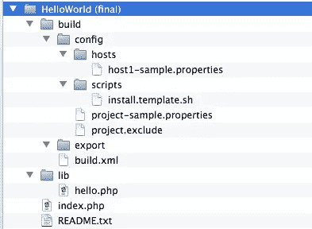

# 使用 Phing 部署和发布您的应用程序

> 原文：<https://www.sitepoint.com/deploy-and-release-your-applications-with-phing/>

假设您有一个安装在许多主机上的 web 应用程序。每个安装都可能有一个自定义配置，应用程序仍在积极开发中。您需要一种简单的方法来将新功能和错误修复部署到所有主机上。

在他之前的文章[使用 Phing，PHP 构建工具](https://www.sitepoint.com/using-phing/)中，Shameer 让你对 Phing 有了一个基本的了解。您学习了如何读写构建文件，以及它的基本组件是什么:`project`、`targets`、`tasks`和`properties`。

在本文中，我将向您展示如何使用这些知识来编写样板构建文件，一个可以在您的实际应用程序中定制和重用的文件。我们将使用 Phing 的 Subversion 任务来管理存储库，使用 FileSync 扩展来同步本地安装和远程服务器。

## 准备环境

为了使用 Subversion 相关的任务，您需要两个 PEAR 包`VersionControl_SVN`和`NET_FTP`。两者都可以通过以下命令轻松安装:

```
$ sudo pear install VersionControl_SVN
$ sudo pear install NET_FTP
```

FileSyncTask 扩展是`rsync`命令的友好包装器。它由 Federico Cargnelutti 维护，可以从他的网站下载。下载完成后，将文件`FileSyncTask.php`复制到 Phing 的 extensions 目录下(在类 unix 系统上的默认路径是`/opt/phing/tasks/ext`，但是您的配置可能会有所不同)。

我已经创建了一个名为“helloworld”的空 Subversion 存储库，并给了它一个基本的目录结构，包含`trunk`、`branches`和`tags`目录。我在本地签出了主干，并使用以下目录结构导入了我的应用程序文件:



如您所见，有一个名为 build 的目录，其中包含与 Phing 相关的文件。

基本的`build.xml`文件如下所示:

```
<?xml version="1.0" encoding="UTF-8"?>
<project name="HelloWorld" default="hello" basedir="../">
 <!-- Load project settings from external file -->
 <property file="build/config/project.properties" />

 <!-- Default empty target -->
 <target name="hello" description="Displays basic project information">
  <echo message="Hello, welcome to ${phing.project.name}!" />
  <echo message="Current environment is: ${project.env}" />
 </target>
</project>
```

有一个名为“hello”的默认目标，它显示基本数据，比如项目名称和当前环境(生产、开发、登台等。).

然而，Phing 没有在构建文件中声明属性列表，而是被告知从外部文件加载项目的设置。这个文件的路径相对于在`property`标签中定义的`basedir`属性。通过这样做，我们可以在多个项目中重用同一个文件。

`project.properties`文件只是一个文本文件，使用键值语法存储设置，例如:

```
ftp.host=host.example.com
ftp.port=21
ftp.username=example
ftp.password=123456
app.home=${ftp.host}/myapp
```

您可以使用相同的“${varname}”语法来引用以前声明的属性的值。

属性文件存储在`build/config`目录中。这个目录中还有一个包含特定客户端主机设置的`hosts`子目录，以及一个存储安装脚本模板的`scripts`子目录。以“-sample.properties”结尾的文件在存储库中进行版本控制并用作模板，而特定于项目和特定于主机的文件被标记为忽略。`build/export`目录将包含我们的目标生成的文件。

为了运行任何目标，我们必须从`build`目录中调用 Phing。常见的语法是:

```
$ phing <targetname> [-D*PropertyName*=*PropertyValue*]</targetname>
```

`-D`选项允许您重新定义其覆盖属性设置为“true”的属性的值。

## “部署”目标

目标是我们的持续集成工具。它使用存储在`build/config/hosts`中的特定配置(例如`servername.properties`)将当前工作副本与远程主机同步并部署。目标必须能够找到所需主机的`.properties`文件，然后使用这些设置连接到远程主机并执行`sync`任务。

使用以下命令运行目标:

```
$ phing deploy -Dhostname=myhostname
```

目标的代码是:

```
<target name="deploy" description="Deploys the current working copy to a remote host using FileSync">
 <!-- Default hostname is empty, must be passed from the command line -->
 <property name="hostname" value="false" override="true" />

 <!-- Set default LISTONLY to false -->
 <property name="listonly" value="false" override="true" />
 <property name="hostfile" value="build/config/hosts/${hostname}.properties" />

 <!-- Check for specific host/env file, if not fail! -->
 <available file="${hostfile}" property="hostfilefound" value="true"/>

 <fail unless="hostfilefound" message="Missing host configuration file (${hostfile})!" />

 <!-- Host file exists so loading... -->
 <property file="${hostfile}" />

 <!-- Get timestamp -->
 <tstamp />

 <!-- Set default VERBOSE flag to TRUE -->
 <if>
  <not>
   <isset property="sync.verbose" />
  </not>
  <then>
   <property name="sync.verbose" value="true" override="true" />
   <echo message="The value of sync.verbose has been set to true" />
  </then>
 </if>

 <!-- Set default DELETE flag to FALSE -->
 <if>
  <not>
   <isset property="sync.delete" />
  </not>
  <then>
   <property name="sync.delete" value="false" override="true" />
   <echo message="The value of sync.delete has been set to false" />
  </then>
 </if>

 <!-- Get auth info, password will be always required -->
 <property name="sync.remote.auth" value="${sync.remote.user}@${sync.remote.host}" />

 <!-- Perform Sync -->
 <!-- See: http://fedecarg.com/wiki/filesynctask -->
 <taskdef name="sync" classname="phing.tasks.ext.FileSyncTask" />
 <sync
  sourcedir="${sync.source.projectdir}" 
  destinationdir="${sync.remote.auth}:${sync.destination.projectdir}" 
  listonly="${listonly}" 
  excludefile="${sync.exclude.file}" 
  delete="${sync.delete}" 
  verbose="${sync.verbose}" />
</target>
```

首先，`hostname`属性被定义为可重写的，并被赋予一个任意的默认值(我选择了“true”)。然后用默认值定义`listonly`属性。这个属性由`sync`任务使用，如果它被设置为 true，那么任务将只显示应该被处理的文件列表，而不会执行实际的同步。

接下来的三个语句定义了主机设置文件的路径，并使用`available`任务来设置`hostfilefound`属性(如果文件存在的话)。如果不是，这个属性将不会被设置，并且`fail`任务将会中止这个脚本并给出错误信息。如果主机属性文件存在，则加载该文件；该文件包含使用前缀“sync”分组的任务的一组设置。它们都是不言自明的，但有一个值得特别注意的是`sync.delete`:如果设置为 true，所有不在本地副本中的远程文件都将被删除。我建议总是设置它为假，除非你有一个有效的理由让它为真。

接下来，我们可以看到 Phing 有多强大的另外两个例子:我们使用`if` / `then`语法来定义`sync.delete`和`sync.verbose`属性的值。

最后一部分是实际的`deploy`任务。`taskdef`语句告诉 Phing】是一个定制任务，并提供要加载的 PHP 文件的路径，该任务的参数从宿主文件中加载。使用`rsync`的语法，`excludefile`属性指向一个文本文件，该文件包含要从同步中排除的模式列表，每行一个模式。

**注意:**如果您的远程服务器使用 SSH 身份文件，您必须用您的密钥文件的完整路径设置`identityfile`属性。

## “准备”目标

目标的工作是创建当前主干的快照，并标记它以便释放。当前的主干被复制到存储库的`tags/*nameoftag*`目录下(例如`tags/1.0.1`)。

`prepare`的代码看起来像:

```
<target name="prepare" description="Prepares a tag in the remote repository">

 <!-- Ask for a tag label to copy the current trunk -->
 <property name="tagLabel" value="false" override="true" />

 <!-- The tag name cannot be empty! -->
 <if>
  <isfalse value="${tagLabel}"/>
  <then>
   <fail message="Invalid tag name!" />
  </then>
 </if>

 <echo>Preparing tag ${tagLabel}...</echo>

 <!-- Copy trunk to the new tag under tags/tagLabel -->
 <svncopy
  force="true"
  nocache="true"
  repositoryurl="${svn.repository.url}/trunk"
  todir="${svn.repository.url}/tags/${tagLabel}"
  username="${svn.repository.username}"
  password="${svn.repository.password}"
  message="Tag release ${tagLabel}" />

 <!-- Switch the working copy repo to the newly created tag -->
 <svnswitch
  repositoryurl="${svn.repository.url}/tags/${tagLabel}"
  username="${svn.repository.username}"
  password="${svn.repository.password}"
  todir="." />

 <!-- Here you can perform any kind of editing: generate documentation, export SQL files, ecc -->
  <touch file="README.txt" />

 <!-- Commit changes -->
 <svncommit
  workingcopy="."
  message="Finish editing tag ${tagLabel}" />
 <echo message="Committed revision: ${svn.committedrevision}"/>

 <!-- Reset working copy repo to trunk -->
 <svnswitch
  repositoryurl="${svn.repository.url}/trunk" />

 <echo msg="Tag ${tagLabel} completed!" />
</target>
```

在前几行中，我们为标签 label 设置了一个默认值，因为我们希望它从命令行传递，然后我们使用`if` / `isFalse`语句确保这个值不为空。

然后，我们使用`svncopy`任务将我们的主干复制到期望的标签目录，并使用`svnswitch`任务告诉 Subversion 我们现在正在处理新创建的标签。从现在开始，我们可以对我们的文件进行任何修改，比如更新一个`README`文件或者用合适的默认值编辑配置文件。在所有的编辑完成后，我们使用`svncommit`来保存修改，使用另一个`svnswitch`来将我们的工作副本重置回之前的状态。

## “发布”目标

目标是我们的包装工具。它首先从存储库中获取主干或选定的标签，并对其执行以下操作:

*   将标记文件导出到某个地方(默认为构建/导出)
*   从导出的文件创建 TAR.GZ 包
*   计算压缩文件的 SHA1 摘要
*   使用`install.template.sh`文件生成安装脚本
*   将文件上传到发布服务器

`release`的代码是:

```
<target name="release" description="Exports the trunk or the given tag along with install scripts and FTP uploads">

 <property name="release" value="trunk" override="true" />

 <echo message="Creating package for '${release}'" />

 <!-- Process repository path for trunk or tag -->
 <if>
  <equals arg1="${release}" arg2="trunk" />
  <then>
   <property name="repo-path" value="${release}" override="true" />  
  </then>
  <else>
   <property name="repo-path" value="tags/${release}" override="true" /> 
  </else>
 </if>

 <!-- Export selected branch/tag from remote repository -->
 <svnexport 
  repositoryurl="${svn.repository.url}/${repo-path}"
  force="true"
  username="${svn.repository.username}"
  password="${svn.repository.password}"
  nocache="true"
  todir="${svn.export.basedir}/${release}" />

 <!-- Do other custom editing here... -->

 <!-- Create TAR archive -->
 <tar
  destfile="${svn.export.basedir}/${phing.project.name}-${release}.tar.gz"
  compression="gzip">
  <fileset dir="${svn.export.basedir}/${release}">
   <include name="*" />
  </fileset>
 </tar>

 <!-- Delete Temporary Export directory -->
 <delete
  dir="${svn.export.basedir}/${release}"
  includeemptydirs="true"
  verbose="false"
  failonerror="true" />

 <!-- Compute SHA1 digest -->
 <property name="hash" value="empty" />
 <filehash
  file="${svn.export.basedir}/${phing.project.name}-${release}.tar.gz"
  hashtype="1"
  propertyname="hash" />
 <echo msg="SHA1 Digest = ${hash}" />

 <echo msg="Files copied and compressed in build directory OK!" />

 <!-- Prepare install.sh, backup.sh and update.sh scripts -->
 <copy todir="${svn.export.basedir}" overwrite="true">
  <mapper type="glob" from="*.template.sh" to="*.sh"/>
  <fileset dir="./build/config/scripts">
   <include name="*.sh" />
  </fileset>
  <filterchain>
   <replacetokens begintoken="##" endtoken="##">
    <token key="SRCURL" value="${http.srcurl}/${release}/" />
    <token key="FILENAME" value="${phing.project.name}-${release}" />
    <token key="FILEXT" value="tar.gz" />
    <token key="HASH" value="${hash}" />
    <token key="APPNAME" value="${phing.project.name}" />
    <token key="APPVERSION" value="${release}" />
   </replacetokens>
  </filterchain>
 </copy>

 <!-- Upload the generated file(s) to FTP -->
 <property name="upload" value="false" override="true" />
 <if>
  <equals arg1="${upload}" arg2="true" />
  <then>
   <echo msg="Uploading to FTP server for release..." />
   <ftpdeploy 
    host="${ftp.host}" 
    port="${ftp.port}" 
    username="${ftp.username}" 
    password="${ftp.password}"
    dir="${ftp.dir}/${release}" 
    passive="${ftp.passive}"
    mode="${ftp.mode}">
    <fileset dir="${svn.export.basedir}">
     <include name="${phing.project.name}-${release}.tar.gz" />
     <include name="install.sh" />
    </fileset>
   </ftpdeploy>

   <echo>Now you can run: wget ${http.srcurl}/${release}/install.sh &amp;&amp; sh install.sh [stage|local|prod] 2>&amp;1 > ./install.log</echo>
  </then>
 </if>

 <echo msg="Done!" /> 
</target>
```

前几行处理输入参数，我们用它为要导出的发布指定默认值“trunk ”,并使用`if`语句计算源存储库路径。

`svnexport`任务将给定的文件直接从存储库(不是工作副本)导出到我们的目标目录中。将创建一个名为“AppName-ReleaseName”的临时目录。

`tar`任务使用内部`fileset`作为源文件，从临时导出目录生成包文件。可选的`delete`任务删除临时文件。

然后，我们使用`filehash`任务为打包的文件生成一个 SHA1 摘要(另一个选项是 MD5 ),并将其存储在`hash`属性中。

调用`copy`任务将模板安装程序脚本复制到我们的导出目录中，并使用一些非常强大的 Phing 资源。`mapper`是应用于`filenames`的滤镜选择和变换工具。使用给定的`fileset`选择的文件在复制前由映射器处理。在这种情况下，与“*.template.sh”匹配的文件被重命名为扩展名“”。sh "放在目标目录中。

这里使用的另一个强大功能是`filterchain`。Phing 过滤器用于在另一个任务运行期间转换文件的内容。在这种情况下，“父”任务是`copy`。这里使用的过滤器是`replacetokens`，它在每个文件中用一个动态生成的值替换一组已定义的模板变量。它在这里用于插入具体的发布细节(名称、版本、散列、url 等。)到安装脚本中。

最后一步是由`upload`属性触发的`ftpdeploy`任务。该任务将我们的包文件和安装脚本上传到远程服务器，并显示用于安装的 URL。如果没有错误，您可以运行以下命令:

```
$ wget http://www.yoursite.com/helloworld/releases/trunk/install.sh && sh install.sh
```

这些命令下载并验证程序包文件，然后执行您指定的安装任务。

## 摘要

我们已经在这里看到了许多有用的 Phing 特性，但是还有更多需要发现。您可以“按原样”使用构建文件来部署您当前和未来的项目，或者通过添加更多的特性来扩展它，比如支持单元测试、Git、数据库处理，甚至自定义扩展。和往常一样，官方文档将是您最好的起点。

<small>图片 via[1971 yes](http://www.shutterstock.com/gallery-222367p1.html)/[Shutterstock](http://shutterstock.com)</small>

## 分享这篇文章