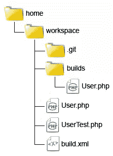
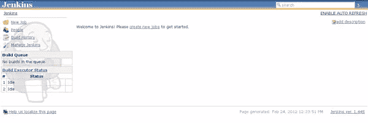
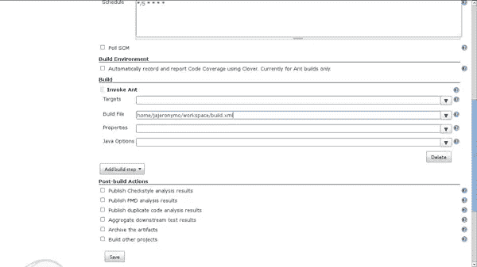
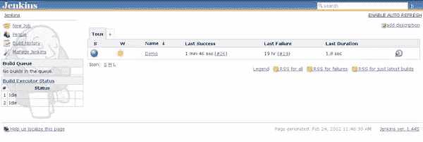
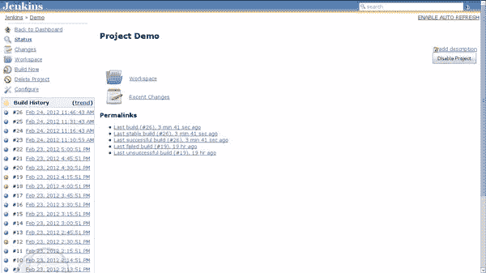

# 与 Jenkins 的持续集成，第 2 部分

> 原文：<https://www.sitepoint.com/continuous-integration-with-jenkins-2/>

在本文的第一部分中，我展示了持续集成的案例。现在我们将安装并设置 Jenkins 来监控一个简单的演示 PHP 应用程序的自动构建。我们将从演示项目开始，然后处理 Jenkins 的安装，最后设置它并观看它的运行。

## 示范项目

这个演示项目基于 Michelle Sanver 在她的文章[PHPUnit](https://www.sitepoint.com/getting-started-with-phpunit)中使用的用户类及其测试脚本。为了保持有序，我在自己的主目录中创建了一个名为`workspace`的目录，并将其设置为:



`workspace`有两个子目录:`.git`是 Git 自动创建并使用的，还有`builds`，稳定版文件夹。

开发文件是在`workspace`下的`User.php`，而稳定文件有相同的名字，但是在`workspace/builds`中。目标是能够对`workspace/User.php`进行更改，测试这些更改，如果它们通过，那么将文件复制到`workspace/builds`。

下面几行创建目录 workspace 和`workspace/builds`,并初始化 Git 存储库:

```
jajeronymo@desktop:~$ mkdir -p workspace/builds
jajeronymo@desktop:~$ cd workspace
jajeronymo@desktop:~/workspace$ git init
Initialized empty Git repository in /home/jajeronymo/workspace/.git/
```

为了方便起见，我在这里复制 Michelle 的类，分别保存为`workspace/User.php`和`workspace/UserTest.php`:

```
<?php
class User {
    protected $name;
    public function getName() {
        return $this->name;
    }
    public function setName($name) {
        $this->name = $name;
    }
    public function talk() {
        return "Hello world!";
    }
}
```

```
<?php
require_once "User.php";
class UserTest extends PHPUnit_Framework_TestCase
{
    public function testTalk() {
        $user = new User();
        $expected = "Hello world!";
        $actual = $user->talk();
        $this->assertEquals($expected, $actual);
    }
}
```

要启动 PHPUnit 测试:

```
jajeronymo@desktop:~/workspace$ phpunit UnitTest UserTest.php
PHPUnit 3.6.10 by Sebastian Bergmann. 
. 
Time: 0 seconds, Memory: 3.25Mb 
OK (1 test, 1 assertion) 
```

如您所知，输出第二行中的点表示`User.php`通过了测试。

这一行将`User.php`添加到 Git 存储库中:

```
jajeronymo@desktop:~/workspace$ git add User.php
```

添加一个文件只是告诉 Git 它存在。要将其记录为最新版本，我们必须提交它:

```
jajeronymo@desktop:~/workspace$ git commit -m "First Version." User.php
```

由于最初版本的`User.php`通过了测试，它目前是稳定版本，所以我们必须将它复制到`builds`文件夹中。这可以手动完成，可以使用窗口文件管理器，也可以像这样在命令行上完成，但如果能通过一些自动化的方式来完成就更好了，特别是对于复制文件可能很繁琐且容易出错的大型项目。

Apache Ant 在项目主文件夹中查找名为`build.xml`的文件，并运行一系列以 XML 格式描述的操作，就像这个将最新的`User.php`复制到 builds 文件夹的示例:

```
<project name="user">
 <copy file="User.php" tofile="builds/User.php"/>
</project>
```

将上述内容保存到`workspace/build.xml`并运行:

```
jajeronymo@desktop:~/workspace$ ant -v 
```

Ant 应该返回一个类似于以下内容的输出:

```
[copy] Copying 1 file to /home/prospero/workspace/builds 
[copy] Copying /home/jajeronymo/workspace/User.php to /home/jajeronymo/workspace/builds/User.php 
```

在这个阶段，`User.php`的验证副本在稳定版本文件夹中，准备发送到生产服务器。为了进一步自动化这个过程，我们可以将测试添加到 Ant 脚本中:

```
<project name="user">
 <exec executable="phpunit" failonerror="true">
  <arg line=" UnitTest UserTest.php" />
 </exec>
 <copy file="User.php" tofile="builds/User.php"/>
</project>
```

再次保存上述内容并运行 Ant:

```
jajeronymo@desktop:~/workspace$ ant -v 
```

现在，我们已经为简化的持续集成完成了两个简单的任务:提交版本到 Git 和运行 Ant 来测试代码，如果代码被批准，将被复制到当前的稳定构建文件夹。那么，我们到底为什么需要詹金斯呢？

## 自动化和监控的需求

为了回答这个问题，我将使用 IDE 或文本编辑器对`User.php`做一点小小的修改，比如说，在“Hello World！”中添加几个额外的感叹号。一旦完成，我会将新版本提交到 Git 存储库:

```
jajeronymo@desktop:~/workspace$ git commit -m "Added a few bangs." User.php
[master d2c96bb] Added a few bangs. 
 1 files changed, 1 insertions(+), 1 deletions(-) 
jajeronymo@desktop:~/workspace$ ant -v 
```

但是等一下！我不是应该在提交变更之前测试变更吗？我当然是！在有人抓住一个未测试的提交之前，让我们现在就做吧！

因为测试期望`User.php`输出字符串完全是“Hello World！”，它将返回一个错误:

```
     [exec] 
     [exec] There was 1 failure: 
     [exec] 
     [exec] 1) UserTest::testTalk 
     [exec] Failed asserting that two strings are equal. 
     [exec] --- Expected 
     [exec] +++ Actual 
     [exec] @@ @@ 
     [exec] -'Hello world!' 
     [exec] +'Hello world!!!' 
     [exec] 
     [exec] /home/prospero/workspace/UserTest.php:15 
     [exec] /usr/bin/phpunit:46 
     [exec] 
     [exec] FAILURES! 
     [exec] Tests: 1, Assertions: 1, Failures: 1\. 

BUILD FAILED 
/home/prospero/workspace/build.xml:4: exec returned: 1 
```

不太好…我最好还是回去去掉那些多余的刘海！一旦完成，我将在提交之前再次运行 Ant。但就在这时，电话响了，一件紧急的事情需要我注意，而`User.php`却从我的脑海中溜走了。这就是为什么我们需要詹金斯！人们会分心；电脑不会。

詹金斯的主要工作与其说是自动化任务，不如说是监控它们。事实上，构建的自动化只不过是任何像样的操作系统都可以处理的 cron 工作。当然，詹金斯让设置这种被称为“触发器”的工作变得很容易。但是它有几个其他的特性，涉及到识别谁对导致测试失败的变更负责，提醒项目经理，显示关于可能的问题的报告等等。这就是它的用处所在。

## 陷害詹金斯

Jenkins 的网站上提供了一个 Java web 应用程序存档文件(.war)或者作为几个流行操作系统的预编译包。使用 WAR，只需将它放到一个合适的文件夹中，说`~/jenkins`并运行:

```
jajeronymo@server:~/jenkins$ java -jar jenkins.war
```

这就启动了 Winstone，一个非常轻量级的 servlet 容器(一种 Java 应用程序服务器，它与 Java 的工作方式与 web 服务器与 HTML 和 PHP 的工作方式大致相同)。终端列出了几个动作，直到以下列内容结束:

```
INFO: Jenkins is fully up and running
```

Jenkins 有一个监听端口 8080 的 web 界面。将您的浏览器指向`http://localhost:8080`，您应该会看到这样一个屏幕:



要创建我们的演示项目，请单击“New Job”。将出现一个表单。输入作业的名称(我将输入“Demo”)并选择“构建一个自由风格的软件项目”。


然后点击 OK，一个长长的选项列表出现在同一个表单的下面。

寻找构建触发器并定期检查构建。一个名为“时间表”的文本框将会出现。在里面写“*/5 * * * *”。这告诉 Jenkins 每 5 分钟运行一次构建过程(这里使用的语法与 cron 使用的语法相同)。

转到“构建”并单击“添加构建步骤”。出现一个选项列表。选择“调用 Ant”并单击将出现的“高级”按钮。该按钮显示四个文本框。在第二个“构建文件”中，将绝对路径写到 Ant 使用的`build.xml`文件。在我这里，这是`/home/jajeronymo/workspace/build.xml`。



导航到选项列表的末尾，然后单击“保存”。就是这样！从现在开始，Jenkins 将每 5 分钟运行一次 Ant 脚本，依次测试对`User.php`的任何更改，如果没有发现错误，就将它复制到构建文件夹中。



从现在出现在 Jenkin 初始页面上的工作列表中，选择我们的测试工作。在窗口的左侧，您可以看到构建列表。(如果它仍然是空的，您可以单击它上面的菜单上的“立即构建”来强制进行第一次构建)。

如果你已经改正了`User.php`中的问题，它应该会通过测试。构建一结束，Jenkins 就在列表中添加一个带有编号和执行时间的链接，在链接旁边你可以看到一个球——蓝色代表成功，红色代表失败。

单击链接会显示一个菜单，您可以在其中选择查看所做的更改以及请求构建的用户。点击球打印 Ant 的控制台输出。久而久之，建立积累。你可以玩`User.php`，有目的地破坏和修复，看看它如何反映在构建列表和控制台的输出上。



只要它还在运行，Jenkins 就会坚持不懈地运行测试，如果没有发现问题，就用最新的稳定版本的`User.php`覆盖 build 中的文件。

## 摘要

如第一部分所述，本文的目标是让 Jenkins 理解开发团队可以解决的运营 CI 问题。我们的例子过于简单，但是通过这篇文章和其他提到的文章，感兴趣的读者可以使用工具创建更加复杂和有用的 Ant 脚本。关于这一点，请查看[http://jenkins-php.org/](http://jenkins-php.org/)，在那里可以找到 PHP 开发相关的多项任务的综合模板。

<small>图片 via [查尔斯·泰勒](http://www.shutterstock.com/gallery-6748p1.html)/[Shutterstock](http://www.shutterstock.com)</small>

## 分享这篇文章