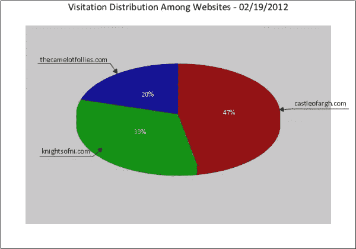
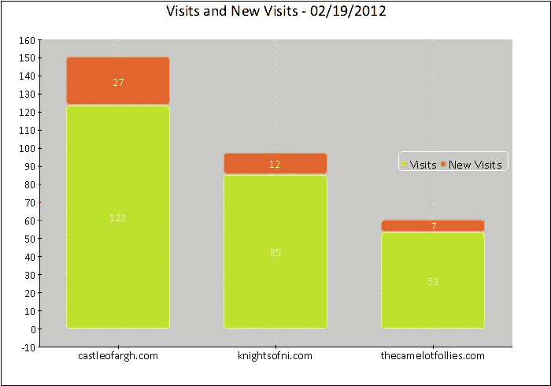

# 使用 Google Analytics 重访 pChart

> 原文：<https://www.sitepoint.com/pchart-revisited-with-google-analytics/>

回到 12 月，SitePoint 发表了一篇我在 pChart 上写的介绍性文章，这是一个 PHP 库，可以创建引人注目的抗锯齿图表。一位读者建议，其他文章可能会有更多的例子，所以我决定用一种方便的设备来写这篇文章，以便在[谷歌分析](https://www.google.com/analytics)的帮助下直观地检查网站统计数据。

## 谷歌分析的 API

正如大多数人所知，分析是谷歌的跟踪工具，它为你的网站收集诸如访客数量、独立访客、每次访问页面和访客国家等数据。添加分析只需要创建一个帐户，每个网站的配置文件，并在您想要跟踪的页面中添加一些 JavaScript 代码。如果您对这一切都不熟悉，请访问 [Google Analytics 的帮助中心](http://support.google.com/googleanalytics/?hl=en)了解更多关于设置您的帐户和获取跟踪代码的信息。一旦跟踪部署了一段时间，您就可以访问分析网站并查看您站点的当前统计数据。

此外，Google Analytics 有一个 API，您的脚本可以从 GET 请求中调用该 API，并接收 JSON 字符串作为响应。这个字符串一旦被解码，就会提供可以被服务器端语言(如 PHP)操作的数据。例如，如果您想经常定期检查几个站点的流量统计，您可以在 PHP 中构建一个个人仪表板，通过分析 API 捕获所需的数据并显示出来。

虽然跟踪代码的设置和使用非常简单，但是 API 有点复杂。幸运的是，谷歌和其他开发者提供了大量的客户端库，比如 GAPI 的[谷歌分析 PHP5 界面](http://code.google.com/p/gapi-google-analytics-php-interface/)很容易使用:

```
<?php
$ga = new gapi(USERNAME, PASSWORD);
$ga->requestReportData(REPORT_ID, DIMENSIONS, METRICS);
```

上面的第一行创建了一个`gapi`对象，并用它连接到 API。所需的电子邮件和密码与您用于登录和创建您的 Analytics 帐户的相同。第二行调用获取数据的方法。它有三个必需的参数:概要文件 ID、维度和度量。配置文件 ID 可以从 Analytics 的控制面板获得，与您创建帐户时使用的控制面板相同。单击菜单栏右侧的设置图标，选择配置文件，然后单击“配置文件设置”。配置文件 ID 在一般信息标题下。


维度指定了您想要的报告类型。例如，维度“日期”将按日期细分所有结果。指标是您需要的信息，在本例中是“访问者”和“新访问者”，后者是首次访问者占总访问量的百分比。有关维度和指标的完整列表，请参见 API 文档。

## 图表访问

假设我想跟踪三个网站:castleofargh.com、knightsofni.com 和 thecamelotfollies.com。假设已经为每个站点设置了跟踪，我们开始创建仪表板应用程序，从它们的下载页面获取 GAPI 的最新版本，并将压缩文件的内容提取到将托管仪表板的服务器上。一旦完成，我就可以写脚本了，多亏了 pChart，这变得更简单了。

让我们开始包括必要的第三方代码:

```
<?php
session_start();
define("PCHART_PATH", "/srv/www/lib/pChart");
define("GAPI_PATH", "/srv/www/lib/gapi");

set_include_path(get_include_path() . PATH_SEPARATOR . PCHART_PATH);
set_include_path(get_include_path() . PATH_SEPARATOR . GAPI_PATH);
require_once "class/pData.class.php";
require_once "class/pDraw.class.php";
require_once "class/pImage.class.php";
require_once "class/pPie.class.php";
require_once "gapi.class.php";
```

请注意，必须在会话打开之后和任何内容发送到浏览器之前包含 pChart，否则将出现“标题已由…发送”错误。

之后，我们需要设置一些配置数据并初始化一些有用的数组。我从一个数组开始，该数组保存我们将显示信息的三个网站的名称和配置文件 id，然后初始化数组以存储域名、访问量和新访问者的数量。

```
<?php
$trackedDomains = array(
    "castleofargh.com" => "56400824",
    "knightsofni.com" => "56418404",
    "thecamelotfollies.com" => "56417539");
$domainNames = array_keys($trackedDomains);
$domainVisits = array();
$domainNewVisits = array();
```

由于我们关注三个站点，我们最好将数据收集逻辑封装在一个循环中:

```
<?php
$ga = new gapi(USERNAME, PASSWORD);
$startDate = $endDate = strftime("%Y-%m-%d");
foreach ($trackedDomains as $domainName => $profileID) {
    $ga->requestReportData($profileID, array("date"),
        array("visits", "newvisits"), null, null,
        $startDate, $endDate);
    foreach($ga->getResults() as $result) {
      $domainVisits[] = $result->getVisits();
      $domainNewVisits[] = $result->getNewVisits();
    }
}
```

上面的行查询今天所有访问和新访客的数据。这两个空参数用于过滤和排序格式，之所以需要，是因为它们在函数定义语句中的日期限制之前。

reportRequestData()为报告的每一天返回一个带有一个数组的对象。因为我们只对单个日期感兴趣(值`$startDate`和`$endDate`相同)，所以内部循环将只运行一次。

此时，我们已经用相关数据填充了所有三个数组。我们将看到使用 pChart 创建一个饼状图来显示三个网站在一天总访问量中所占的百分比的有趣部分。

随后的线条定义了图表的“点”——对于饼图来说，表示为圆形的每个扇形的角度——以及每个网站的名称，它们将显示为标签。请注意，尽管这些数字是以绝对值的形式呈现的，但 pChart 稍后将被指示以百分比的形式显示它们。

```
<?php
$myPieData = new pData();
$myPieData->addPoints($domainVisits, "Visits");
$myPieData->addPoints($domainNames, "Names");
$myPieData->setAbscissa("Names");
```

最后一条指令是使用域名作为标签所必需的。

图表对象可以被认为是一个透明的画布，我们可以在上面书写和绘制数据，它是这样创建的，并被赋予一个可见的边界:

```
<?php
$myPiePicture = new pImage(700,490, $myPieData);
$myPiePicture->drawRectangle(1,1, 699,489,
    array("R" => 0, "G" => 0, "B" => 0));
$myPiePicture->setGraphArea(50,50, 650,440);
```

画布被指定为 700 像素宽，490 像素高，数据集$myPieData 中的数据将被绘制到画布上。边界位于画布内部一个像素处。相对于图像对象 canvas，图形区域本身定义了 50px 的边距。

接下来，创建一个字符串来保存图片的标题并生成相应的文本:

```
<?php
$title = "Visitation Distribution Among Websites - " . 
    strftime("%m/%d/%Y", strtotime($today));
$myPiePicture->drawText(350,3, $title, array(
    "R" => 0, "G" => 0, "B" => 0,
    "FontName" => PCHART_PATH . "/fonts/calibri.ttf",
    "FontSize" => 15,
    "Align" => TEXT_ALIGN_TOPMIDDLE));
$myPiePicture->drawFilledRectangle(50,50, 650,440, 
    array("R" => 200, "G" => 200,"B" => 200));
```

drawText()方法将一个矩形框“固定”在画布上，距离图表对象区域左侧 x 像素和顶部 y 像素。它在盒子上的固定位置由 align 属性给出。上图中，带有绘图描述符($title)的文本区域的上边界中点位于距离画布左侧 350 px 和上边界 3px 处。我还添加了一个灰色的背景矩形，边框距离画布的边界 50px。

现在让我们定义一个漂亮的字体并创建饼图对象。稍后，它将被渲染为 PNG 图像:

```
<?php
$myPiePicture->setFontProperties(array(
    "FontName" => PCHART_PATH . "/fonts/calibri.ttf",
    "FontSize" => 11));
$myPieChart = new pPie($myPiePicture, $myPieData);
```

pChart 允许我们定义饼图切片的颜色。让我们把它们变成红色、绿色和蓝色:

```
<?php
$myPieChart->setSliceColor(0, array("R" => 128, "G" => 0, "B" => 0));
$myPieChart->setSliceColor(1, array("R" => 0, "G" => 128, "B" => 0));
$myPieChart->setSliceColor(2,array("R" => 0, "G" => 0,"B" => 128));
```

draw3DPie 方法将使$myPieChart 呈现为 3d 倾斜饼图。这里我使用了 200 像素的半径，这将创建一个相当大的图形:

```
<?php
$myPieChart->draw3DPie(350,245, array("Radius"=>200,
    "DrawLabels" => true,"Border" => true,
    "WriteValues" => PIE_VALUE_PERCENTAGE));
```

我们现在要做的就是用饼状图渲染图片:

```
<?php
$myPiePicture->Render("myPieChart.png");
```



除了饼图，我想一个堆积条形图直观地显示新访客的总访问量。下面几行应该很容易理解，但请注意，现在我们有两个数据系列，一个是访问数据系列(如饼图所示)，另一个是新访客数据系列:

```
<?php
$myBarData = new pData();
$myBarData->addPoints($domainVisits, "Visits");
$myBarData->addPoints($domainNewVisits, "New Visits");
$myBarData->addPoints($domainNames, "Names");
$myBarData->setAbscissa("Names");
$myBarPicture = new pImage(700,490, $myBarData);
$myBarPicture->drawRectangle(1,1, 699,489,
    array("R" => 0,"G" => 0, "B" => 0));
$myBarPicture->setGraphArea(50,50, 650,440);
$title = "Visits and New Visits - " . 
    strftime("%m/%d/%Y", strtotime($today));
$myBarPicture->drawText(350,3, $title, 
    array("R" => 0, "G" => 0, "B" => 0, 
    "FontName" => PCHART_PATH . "/fonts/calibri.ttf",
    "FontSize" => 15,
    "Align" => TEXT_ALIGN_TOPMIDDLE));
$myBarPicture->drawFilledRectangle(50,50, 650,440,
    array("R" => 200,"G" => 200, "B"=>200));
$myBarPicture->setFontProperties(array(
    "FontName" => PCHART_PATH . "/fonts/calibri.ttf",
    "FontSize" => 11));
$myBarPicture->drawScale(array("DrawSubTicks" => false,
    "Mode" => SCALE_MODE_ADDALL));
```

在这里，我们创建了堆积条形图及其图例，这些图例将取自带有 addPoints()的系列的定义:

```
<?php
$myBarPicture->drawStackedBarChart(array("DisplayValues" => true,
    "DisplayColor" => DISPLAY_AUTO, "Rounded" => true,
    "Surrounding" => 60));
$myBarPicture->drawLegend(510,205, array("FontSize" => 12,
    "Mode" => LEGEND_HORIZONTAL));
```

同样，我们现在要做的就是渲染条形图和…

```
<?php
$myBarPicture->Render("myBarChart.png");
```



## 摘要

[这篇文章的演示代码](https://github.com/phpmasterdotcom/PChartRevisitedWithGoogleAnalytics)可以在 GitHub 上找到，供您使用和试验。pChart 可用于创建如此简单的应用程序，但也是一个成熟的仪表板，用于控制可通过 API 测量和呈现的任何类型的过程。使用任何类型的刷新机制(比如 JavaScript reload 或 meta refresh ),您生成的脚本可以连续显示更新的统计数据。

<small>图片通过[阿拉里斯](https://www.shutterstock.com/g/alaris) / [快门](https://www.shutterstock.com)</small>

## 分享这篇文章