# 使用混合笔刷将肖像转换为数字绘画

> 原文：<https://www.sitepoint.com/turn-a-portrait-into-a-digital-painting-using-the-mixer-brush/>

Photoshop 一直有笔刷工具，主要用于混合效果和遮罩。任何软件程序都很难模仿绘画的逼真效果。然而，混合画笔是一个很棒的工具，你可以用它把现有的照片变成数字绘画。这是相对容易的，但有一些细节会影响你的画看起来有多逼真。

我有一个旧型号的 Wacom 绘图板，它可以很好地与 Photoshop 和混合画笔工具配合使用，因为 Wacom 绘图板具有压力敏感性，可以检测您在平板上按下的力度。你越用力，你的笔触就会越有力。反之，你刷得越轻，你的笔触就会越轻越柔和。这使得绘画比用典型的鼠标更容易、更自然。你有更多的控制，你的工作看起来更自然。

混音器笔刷工具是笔刷工具中的一个子工具。当你点击画笔工具时，你会在顶部菜单栏看到一组新的选项。这些选项控制模拟不同笔划和笔刷技术的不同笔刷设置。

除了使用不同的笔刷工具，您还可以使用不同的笔刷预设。这些模拟不同类型的普通画笔，传统画家使用它们来创建不同的对象和纹理。

## 第一步:选择主题

你的主题是你在这个过程中将要做出的最重要的选择之一。你选择的主题将决定你使用哪种笔刷来模拟肖像效果。另一件要考虑的事情是你想要达到的效果类型。观察不同的绘画风格可以帮助你确定哪一种适合你想要的最终结果。如果你想包含很多细节，那么你会想要使用小笔刷，并且某些笔刷类型要优于其他类型。如果你选择松散或抽象的风格，那么较大的“湿”笔刷将是你的选择。本教程的主题是一位老年绅士的肖像。

[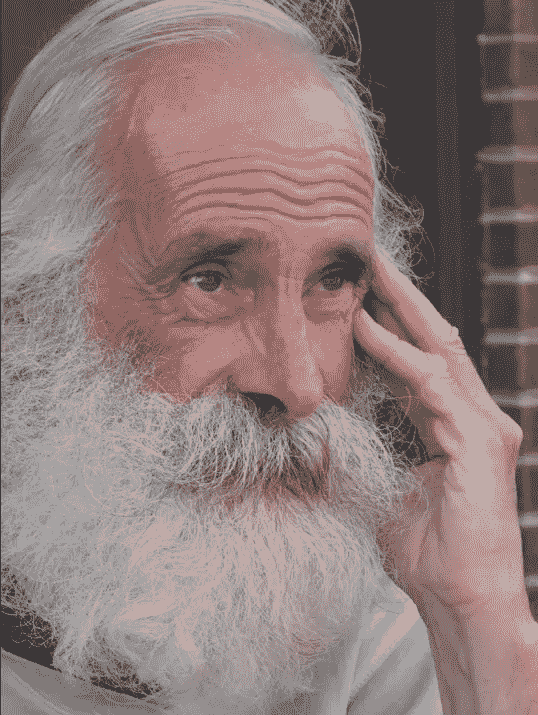](https://www.sitepoint.com/wp-content/uploads/2012/03/starting-photo.jpg)

## 第二步:开始

这个人物有很多头发，他的胡子让他很有个性。因为我们不想失去他的胡子的很多细节，我们需要使用一个更小的刷子。我将从混合器笔刷预设中选择风扇笔刷。当你在处理头发时，尤其是有很多纹理的头发，最好使用小的或薄的刷子。

[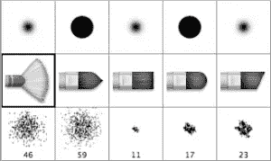](https://www.sitepoint.com/wp-content/uploads/2012/03/Screen-shot-2012-03-13-at-7.21.41-PM.png)

## 步骤 3:设置画布

当使用混合笔刷时，确保选中“采样所有图层”。在常规基础上，您可以在以前的层上添加新层，就像在真正的画布上真正的绘画一样。定期添加图层也给你一些出错的空间，因为如果你偏离太远，或者你的图像没有朝着你想要的方向发展，你可以废弃最新的图层，重新开始一个部分，而不会丢失很多工作。

## 第四步:选择正确的笔刷设置

模拟油画的一个好方法是使用湿设置的混合笔刷。有许多不同的设置，但湿的，重的混合会给你一个很好的颜色组合。当您在颜色区域使用湿笔刷时，它会将您确定的颜色与周围像素的颜色混合，这是肖像绘画的一种现实技术。

[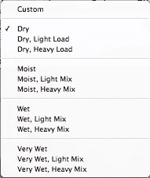](https://www.sitepoint.com/wp-content/uploads/2012/03/Screen-shot-2012-03-13-at-7.27.30-PM.png)

## 第五步:在大面积的底色上绘画

在这个例子中，最好从主体的胡须开始。我们想创建一个柔和的底色，然后添加一些细节。要添加一个有变化的平滑颜色区域，选择扇形笔刷，按 alt/option 键点击他的胡须的一个浅色区域。轻轻刷上底色；现在还不要担心细节。顺着他胡须的整体流向。确保在高光和暗区工作，但是不要让这个区域的底色超过最外面的胡须。

[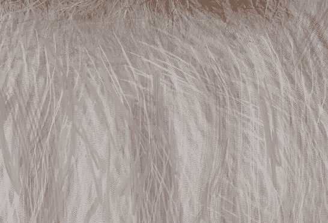](https://www.sitepoint.com/wp-content/uploads/2012/03/Screen-shot-2012-03-14-at-6.34.51-PM.png)

## 第六步:胡须细节

一个适合硬胡须的刷子是一个非常小的圆尖硬刷子。创建一个新的空白层以上的背景层，并确保"样本所有层"仍然选中顶部菜单栏。按住 Option/alt 键点击胡须区域，对他胡须的浅银色区域进行采样，并开始沿着他胡须的相同轮廓刷。顺着他胡须卷曲的方向走，胡须细节会慢慢和基础层融合在一起。

[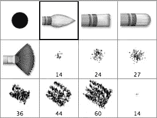](https://www.sitepoint.com/wp-content/uploads/2012/03/Screen-shot-2012-03-13-at-7.22.00-PM.png)

## 第七步:绘制阴影的定义

确保对他胡须的浅色和深色部分进行取样，以保持真实的颜色。受试者嘴周围也有一片棕色的胡须。用短笔画刷这些区域，从他胡子的棕色部分的不同区域取样，得到不同的颜色。

[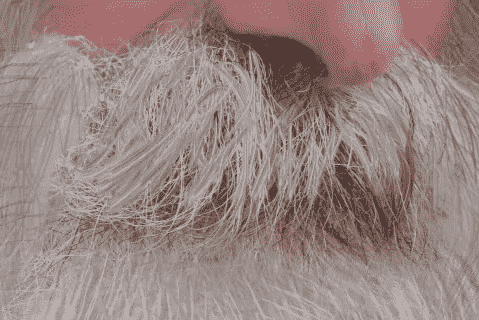](https://www.sitepoint.com/wp-content/uploads/2012/03/Screen-shot-2012-03-14-at-6.31.34-PM.png)

如果你走得太远，或者如果你对你的最新图层不满意，你可以随时返回并重新绘制周围的区域。使用这种渐进的，一层一层的过程，你真的很难犯一个不能快速纠正的错误。

## 第八步:混合皮肤

创建一个新的层，并采样对象的脸颊或前额周围的皮肤。使用风扇刷轻刷该区域。扇形笔刷在具有逼真的笔刷笔划效果的同时，在颜色上有很好的封闭性。小心不要刷掉他所有的皱纹；这就是赋予他个性的东西。在他脸部的皮肤区域周围工作，alt/option 点按以采样皮肤颜色的细微变化。

## 第九步:用柔软的刷子刷头发

使用小尺寸的平头中等硬度刷子，将我们在胡须上使用的相同技术应用到主体的其余头发上。刷他头部左侧的头发区域，对他的头发进行不同深浅的采样，为每一笔添加一些变化。

[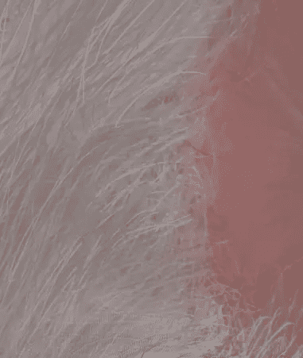](https://www.sitepoint.com/wp-content/uploads/2012/03/Screen-shot-2012-03-14-at-6.43.35-PM.png)

## 第十步:单缕头发

将笔刷的大小降低到非常小——大约 5px——并对主体的头发进行中等色度的采样，以在他头顶的稀疏头发中进行绘制。对较亮和较暗的区域进行采样，并绘制一些明暗色调，在绘制过程中相互重叠。

[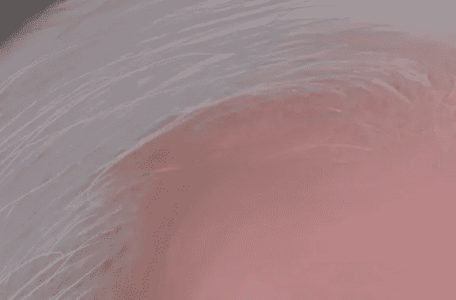](https://www.sitepoint.com/wp-content/uploads/2012/03/Screen-shot-2012-03-14-at-6.45.36-PM.png)

## 步骤 11:混合瞳孔颜色

继续看眼睛。你会想放大更小的区域，比如瞳孔。降低你的笔刷大小到大约 1-3 个像素，并确保它设置为湿的，重混合，这样颜色会很容易混合。用小而有控制的笔画来融入眼睛的颜色。这样做的目的是保持颜色的混合，但在保持眼睛整体外观的同时，会损失一些摄影细节。

[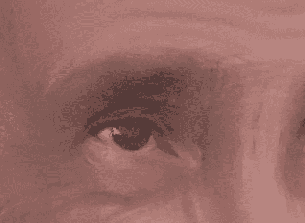](https://www.sitepoint.com/wp-content/uploads/2012/03/Screen-shot-2012-03-14-at-6.47.05-PM.png)

## 第十二步:注意细节

分别涂抹眼睛的各个颜色部分，轻轻混合并在每个不同的区域添加笔触。混合虹膜的颜色，但不要让它渗进眼睛的白色区域或眼睑本身。

[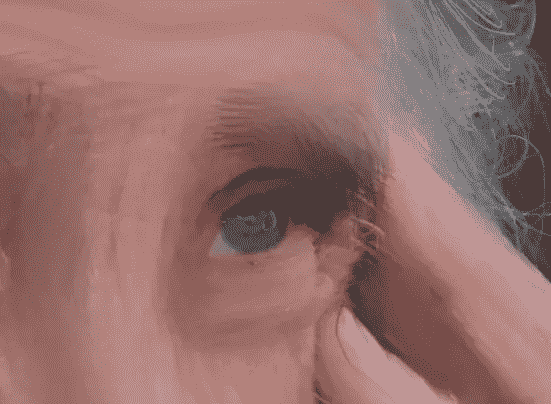](https://www.sitepoint.com/wp-content/uploads/2012/03/Screen-shot-2012-03-14-at-6.48.46-PM.png)

## 第十三步:画圆眼睛

混合并在眼睑周围工作，保留使眼睛看起来圆的细节的黑暗区域，同时给该区域一个笔触的外观。

[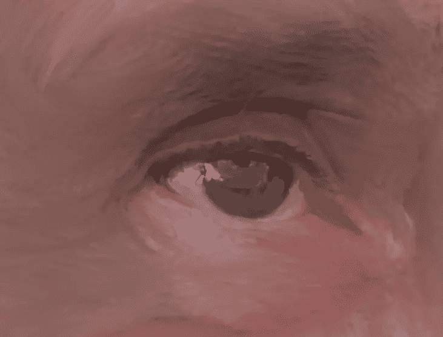](https://www.sitepoint.com/wp-content/uploads/2012/03/Screen-shot-2012-03-14-at-6.52.41-PM.png)

## 第 14 步:在没有过度混合的地方松松地刷

你可以使任何区域看起来粗糙或被重刷，这将有助于制造一幅数字绘画的幻觉。请注意，手周围的区域具有艺术外观，而不影响手的整体形状。自然的笔触使它看起来像一幅写实的油画。

[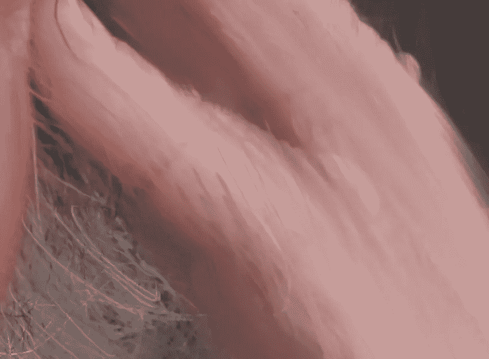](https://www.sitepoint.com/wp-content/uploads/2012/03/Screen-shot-2012-03-14-at-7.02.21-PM.png)

您可以在 Photoshop 中的画布上移动，同时保持放大状态，方法是按住空格键，并在您想要的方向上单击和拖动鼠标。在 Photoshop CS5 中，如果你点击并拉动鼠标，它会模拟一个翻转动作，让你在画布上弹得更远。

## 第十五步:重要的阴影和皱纹

如果你注意到他的脸颊，皮肤上有阴影和皱纹。这些细节保存起来很重要，但不一定要完美。事实上，他们不应该。(如果我们想要极端的真实感，我们可以简单地使用照片。)采样一些深色肤色，进行几笔粗糙的笔触。

[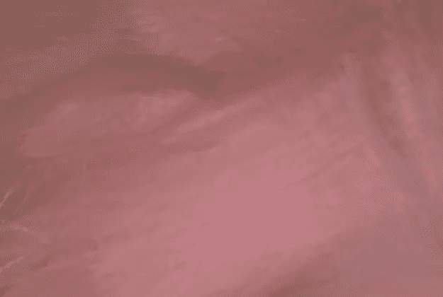](https://www.sitepoint.com/wp-content/uploads/2012/03/Screen-shot-2012-03-14-at-7.04.48-PM.png)

## 第 16 步:松散刷背景的缺陷

使用砖块纹理移动到背景区域，使用小刷子在每个砖块周围工作，当你沿着墙壁移动时刷并添加纹理。尽量保持一切都在一条线上，但是失去一些照片的线性完美会让你的画看起来更真实。眼睛下面的阴影很重要，因为它们有助于使眼睛看起来更圆，给眼睛更多的维度。

[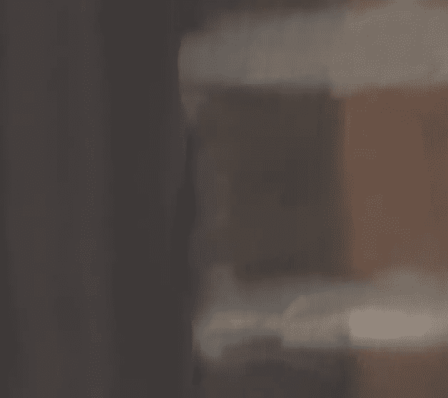](https://www.sitepoint.com/wp-content/uploads/2012/03/Screen-shot-2012-03-14-at-7.06.43-PM.png)

## 第十七步:混合掉一些织物纹理

将相同的技术应用于主体的衬衫纹理。使用较小尺寸的扇形笔刷来混合他衬衫的颜色，同时保留一些边缘和衬衫的纹理。一定不要混入他的胡须。如果需要，降低你的刷子的尺寸，以便在他的胡须周围工作。

[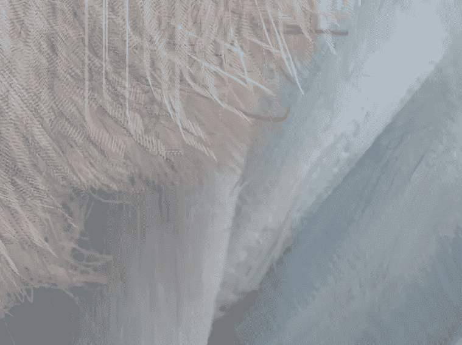](https://www.sitepoint.com/wp-content/uploads/2012/03/Screen-shot-2012-03-14-at-7.08.56-PM.png)

## 第十八步:重要的皮肤阴影

前额的左边区域有一个阴影，增加了男人头部的立体感。用一个宽的，扫的动作，当你顺着他太阳穴的角度时，保持动作紧密。这创造了一个很好的笔刷效果，看起来很像油画。

[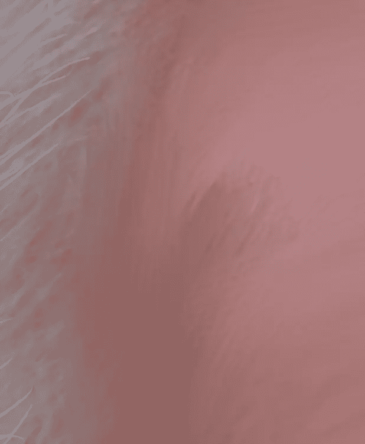](https://www.sitepoint.com/wp-content/uploads/2012/03/Screen-shot-2012-03-14-at-7.11.48-PM.png)

## 结论

在 Photoshop 中，用湿的混合笔刷绘画会给你非常逼真的效果。使用图层来构建你的绘画可以保持工作的快速和高效，特别是与使用真正的油画颜料、画布和画笔相比。这种方法比滤镜能给你更真实的效果，而且这种技术能让你的图像更具个人风格。最终结果应该与下图非常相似。

[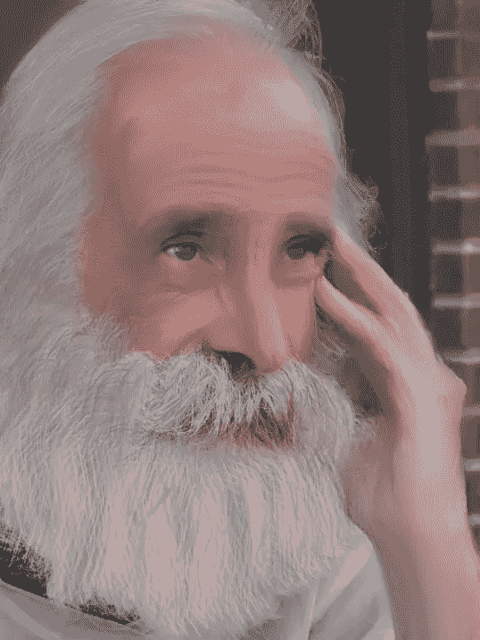](https://www.sitepoint.com/wp-content/uploads/2012/03/finished-portrait.jpg)

## 分享这篇文章