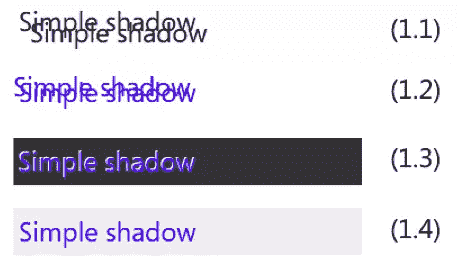
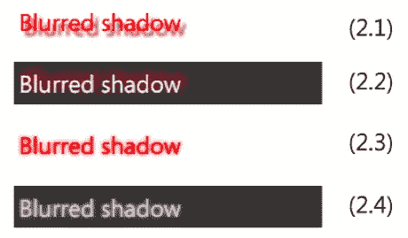
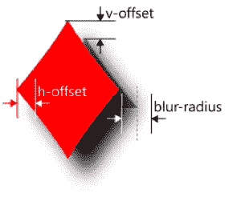
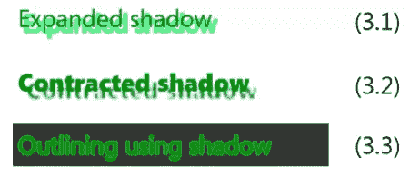
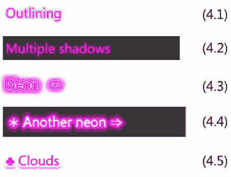
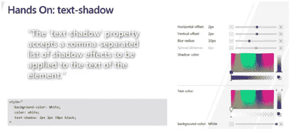

# 掌握 CSS3 文本阴影

> 原文：<https://www.sitepoint.com/mastering-css3-text-shadows/>

我们的阴影世界之旅仍在继续。如果你[错过了文章](https://www.sitepoint.com/mastering-box-shadows/)，我们探索了使用[框影](https://www.w3.org/TR/css3-background/#box-shadow)属性的基础。今天我们来关注一下[的文字阴影](https://www.w3.org/TR/css3-text/#text-shadow)。

提醒您一下:这两个属性虽然在不同的模块中定义，但实际上以相似的方式工作。所以如果你已经熟悉了盒子阴影，你会很容易理解文字阴影艺术的基础。在我们开始实践之前，让我们稍微钻研一下理论，找出它们之间的区别。

[](https://www.sitepoint.com/wp-content/uploads/2012/02/Screen-Shot-2012-02-28-at-3.03.26-PM.png)

## 浏览器支持

包括 [IE10](http://msdn.microsoft.com/en-us/ie/default) 在内的许多现代浏览器都支持文本阴影规则。你也可以在 Windows 8 的 [metro 风格应用中使用它。](http://msdn.microsoft.com/en-us/windows)

## 文本阴影与方框阴影

你需要知道的第一件事是，这两个规范(CSS3 背景和边框以及 CSS3 文本)目前都处于工作草案状态，因此它们仍然可能发生变化。我也将讨论规格，而谈论传播距离。

如果您还记得的话，`box-shadow`属性的语法是这样的:

```
box-shadow: none | <shadow> [ , <shadow> ]*;

<shadow> = inset? && [ <length>{2,4} && <color>? ]
```

完整模式中的第二条规则可以扩展为:

```
shadow = inset? h-offset v-offset blur-radius spread-distance color;
```

CSS3 文本的规范以类似的方式描述了`text-shadow`属性:

```
text-shadow: none | [ <length>{2,3} && <color>? ]#
```

其中:
值被解释为用于方框阴影。

因此，您可能会认为一种文本阴影效果的完整语法如下:

```
shadow = h-offset v-offset blur-radius color;
```

这里有两个区别:第一——你不能为文本创建内部阴影，第二 CSS3 文本中没有`text-shadow`的扩散距离。类似于`box-shadow`你可以创建多个阴影，显示在彼此之上。现在我们来练习一下。

## 文本阴影

### 偏移和颜色

我们将从最开始的步骤开始——要定义一些水平和垂直偏移，您只需写两个长度值(1.1–1.4):



正偏移将阴影向右下方移动(1.1):

```
text-shadow: 10px 10px; width: 300px;
```

负值定义向左上方移动的偏移量(1.2):

```
text-shadow: -5px -5px; width: 300px; color: blue;
```

接下来是颜色。我们先来讨论省略颜色会发生什么。

根据规范的当前版本:

> 如果缺少颜色，则使用的颜色取自“颜色”属性。

如果你浏览不同的浏览器，你可能会注意到它们的行为是不同的。在这种情况下，基于 Webkit 的浏览器使用透明颜色——并不是因为它们不好或者它们做错了什么。这里的要点是，先前版本的 CSS3 背景和边框规范说:

> 省略的颜色是用户选择的颜色。

我相信在 Chrome、Safari 和其他 webkit 浏览器的未来版本中，这个问题会得到解决。

如果您想要创建一个模糊的文本效果(参见下面的示例 2.3 和 2.4)，省略文本阴影颜色，并对其应用与文本相同的颜色会很有用。

要明确设置阴影的颜色，只需在规则末尾添加您想要的颜色:

```
text-shadow: -1px -1px white; color: blue; background: #333; /* 1.3 */
```

```
text-shadow: 1px 1px rgba(255,255,255, 0.5); color: blue; background: #eee; /* 1.4 */
```

请注意，在处理阴影时，您可以使用 CSS3 颜色模块中定义的任何颜色格式，包括带有 alpha 通道的`rgba()`和`hsla()`函数。

### 模糊

第三个长度参数用于模糊半径(2.1–2.4):



根据`box-shadow`属性的模糊半径定义，您应该使用一个非负值(0 表示无模糊)。不同浏览器的精确模糊算法可能不同，但从数学意义上讲，它们都应该足够接近高斯模糊算法。



在前两个示例(2.1–2.2)中，我使用了不同的模糊半径值:

```
text-shadow: 5px 5px 3px darkred; color: red; /* 2.1 */
```

```
text-shadow: 4px -4px 10px red; color: azure; background: #333; /* 2.2 */
```

在第二对(2.3–2.4)中，我只改变了文本和背景颜色，两个阴影的效果都是使用 CSS 类模糊阴影应用的:

```
.blurred-shadow {

  text-shadow: 0px 0px 4px ; /* the color is absent */

}
```

```
color: red; /* 2.3 */
```

```
color: lightgray; background: #333; /* 2.4 */
```

### 伸缩率

现在是时候谈论更多关于 web 标准的内容了。我相信在你尝试在任何项目中使用文本阴影的扩散值之前，你应该了解它们。在处理 CSS3 文本模块时，CSS 工作组决定对该规范的[前一版本进行修改，以便更快地达到推荐状态。在之前的版本中,`text-shadow`属性包含了另一个(第四个)长度参数——spread-distance。](https://www.w3.org/TR/2011/WD-css3-text-20110901/)

类似于框阴影，文本阴影的扩散距离允许我们扩展或收缩阴影。文本阴影的定义被移到了 L4——今天你可以在 CSS 文本级别 4 的[编辑草案中找到它。](http://dev.w3.org/csswg/css4-text/)

现在我要讨论如何使用 spread。你可以在 IE10 的[最新版本中尝试一下(我知道目前 IE 是唯一支持文字阴影扩散的浏览器)。Spread 是一个非常强大的工具，允许我们创建一些令人惊叹的样本！但将来也可能改变。所以要小心！](http://ie.microsoft.com/testdrive/Info/Downloads/Default.html)



要增加阴影，请将扩散距离设置为正值(3.1):

```
text-shadow: 5px 5px 0px 3px lightgreen; color: green;
```

减少—负一(3.2):

```
text-shadow: 8px 8px 2px -3px darkgreen; color: green; font-weight: 900;
```

在零偏置的情况下，`spread-distance`可以用来勾画文本(3.3):

```
text-shadow: 0 0 0 3px rgba(128, 255, 0, 0.75); color: green; background: #333;
```

还有一个更重要的注意事项！如今，文本阴影规则中的第四个长度被不支持的浏览器视为不正确的文本阴影定义，这样的规则完全被忽略。因此，如果您想为它们提供某种程度的兼容性，您需要将文本阴影规则加倍，如下所示:


```
text-shadow: 0px 0px 10px lightgreen; /* 3.4 */
```

```
text-shadow: 0px 0px 10px 10px lightgreen; /* 3.5 */
```

可以使用在不同方向上具有偏移的多个阴影来模拟阴影的扩展(请参见下一节中的示例 4.6 和 4.7)。

#### 多重阴影

最后，完全类似于方框阴影，您可以对文本应用多个阴影(4.1–4.5):



简单概述(4.1):

```
text-shadow: 0 0 0 3px white, 0 0 0 4px gray; color: magenta;
```

具有各种偏移的各种模糊阴影(4.2):

```
text-shadow: 3px 3px 4px 2px rgba(255,255,255,0.35),

             6px -6px 4px 2px rgba(255,255,255,0.25),

             -3px -3px 4px 6px rgba(255,0,255,0.15);
```

霓虹灯效果(4.3):

```
text-shadow: 0 0 0 3px white,

             0 0 2px 6px magenta,

             0 0 1px 9px white,

             0 0 6px 12px magenta;
```

和另一种氖效果(4.4):

```
text-shadow: 0 0 2px #fff,

             0 0 4px 2px rgba(255,255,255,0.5),

             0 0 6px 6px #f0f,

             0 0 4px 7px #fff,

             0 0 3px 15px #222,

             -4px 0 2px 9px #f0f,

             4px 0 2px 9px #f0f,

             0 -4px 2px 9px #f0f,

             0 4px 2px 9px #f0f;
```

文本下划线(4.5):

```
text-shadow: 0 -3px 3px 15px white, 0 1px 2px 9px; color: magenta;
```

#### 模拟膨胀


正如我提到的，从技术上讲，你可以使用多个阴影来创建一些类似于真实的阴影扩展。因此，为了模拟扩展的阴影样本(4.6):

```
text-shadow: 0px 0px 0px 4px magenta;
```

您可以尝试在不同方向上定义具有不同偏移的多个阴影(4.7):

```
text-shadow: magenta 0px 2px,

             magenta 2px 0px,

             magenta -2px 0px,

             magenta 0px-2px,

             magenta -1.4px -1.4px,

             magenta 1.4px 1.4px,

             magenta 1.4px -1.4px,

             magenta -1.4px 1.4px;
```

实际上，这在视觉上有所不同，您应该理解这种技术的使用是有限的:它不太准确，并且会对页面呈现的性能产生负面影响。

#### 更多样本

现在，你已经知道了文字阴影艺术的所有基础知识，让我们试着做一些更复杂的东西。

经典彩虹(5.1):


```
text-shadow: 0 0 2px 3px yellow,

             0 0 2px 6px orange,

             0 0 2px 9px red,

             0 0 2px 12px lime,

             0 0 2px 15px blue,

             0 0 2px 18px violet;
```

双影(5.2):


```
text-shadow: 0 0 2px 2px white,

             2px 0 2px 5px #222,

             3px 0 3px 6px #933,

             5px 0 2px 14px #222,

             6px 0 5px 16px #533;
```

火焰阴影(5.3):


```
text-shadow: 0 0 2px #eee,

             0 0 4px 2px #fff,

             0 -2px 4px 2px #ff3,

             2px -4px 6px 4px #fd3,

             -2px -6px 11px 6px #f80,

             2px -8px 18px 8px #f20;
```

传统的“按字母”效果(5.4):


```
text-shadow: 0px 2px 3px #555;
```

此外，传统 3D 文本(5.5):


```
text-shadow: 0 0 1px #999,

             1px 1px 1px #888,

             2px 2px 1px #777,

             3px 3px 1px #666,

             4px 4px 1px #555,

             5px 5px 1px #444;
```

复古效果的双重阴影(5.6):


```
text-shadow: 2px 2px #fff,

             3px 3px #666;
```

带收缩阴影的透明文本(这种效果也取决于字体大小和字样)—示例(5.7):


```
text-shadow: 0 0 2px -3px rgba(196,255,0,0.3),

             0 0 6px -5px #9c6;

color: transparent;
```

在 CSS 伪类`::first-letter` (5.8)上使用`text-shadow`:


```
.text {

  text-shadow: 0 0 5px;

}

.text::first-letter {

  color: azure;

  text-shadow: 0 0 5px, 0 0px 6px 3px blue, 0 -2px 6px 6px cyan, 0 -4px 9px 9px lightblue;

}
```

#### 交互式示例



如果你想以互动的方式玩阴影，我的同事在去年九月的构建会议上制作了一个很酷的演示:[动手:文字-阴影](http://ie.microsoft.com/testdrive/Graphics/hands-on-css3/hands-on_text-shadow.htm)。

## 注意

本文中讨论的 CSS 属性是在 CSS3 文本模块中定义的，该模块目前处于工作草案状态。虽然它看起来相当稳定，但它仍然可以在细节上发生变化。

## 分享这篇文章