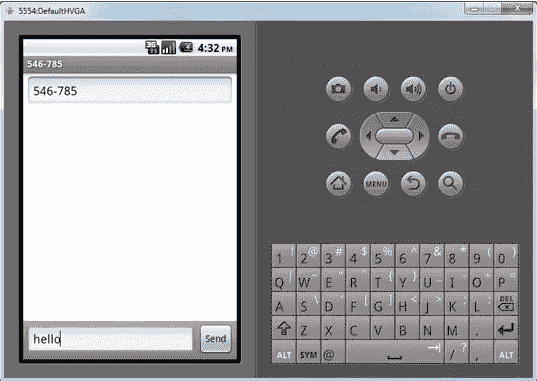
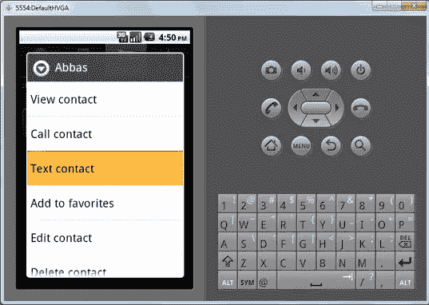
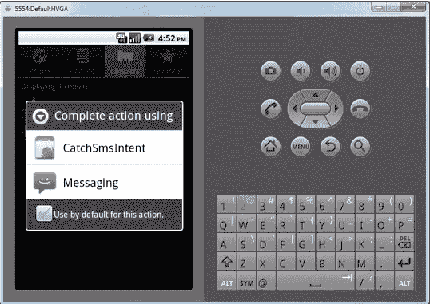
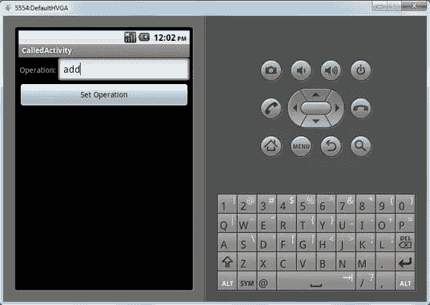
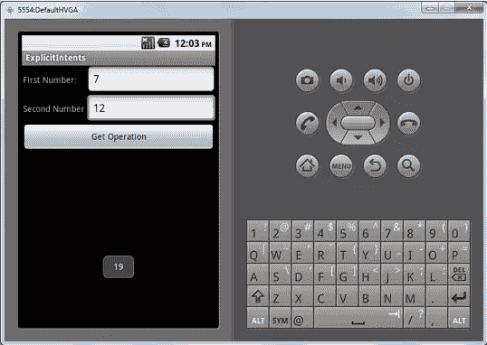

# Android 中的意图

> 原文：<https://www.sitepoint.com/intents-in-android/>

Android 作为一个系统，是为不同组件高效协同工作而设计的。因此，Android 为构建能够有效通信的松散耦合组件提供了许多服务。

意图基本上是 Android 提供的一种消息传递机制，本质上是异步的。一个组件可以向另一个组件发送请求特定功能或特性的意图。举个例子，电子邮件阅读器应用程序可能会向另一个活动发送一个意图，该活动可能会从执行用户验证的用户那里获取用户名和密码。

# Android 中的意图类型

## 明确的意图

在显式意图中，意图上的发送者显式地提到应该接收意图的组件。这可以使用 Java 类标识符来完成。

## 隐含意图

在隐式意图中，发送组件并不确切地指定接收组件，发送组件只是提到需要执行的动作。发送组件可以可选地发送附加的 URI 和数据。

不同的组件可以通过在它们的 AndroidManifest.xml 中给出一个 intent filter 标签来注册成为 intent 的接收者

## 如何使用 Intents 调用原生 Android 应用

原生 Android 应用也使用意图。你甚至可以从你的应用程序中传递启动和使用一些原生 Android 应用程序的意图，比如拨号器或网页浏览器。

现在，我们将查看一个应用程序，我们将在其中创建一个活动。在活动中，我们将从用户处获取短信文本和号码。

然后，我们将通过向 Android 系统传递一个意图来启动 sms 应用程序。我们将把号码和 sms 消息传递给 sms 应用程序。

## 第一步。创建布局和用户界面。

为此，我们首先创建一个名为 LaunchIntentActivity 的活动，然后创建一个布局，如下所示。

```
<?xml version="1.0" encoding="utf-8"?>
<LinearLayout xmlns:android="http://schemas.android.com/apk/res/android"
    android:orientation="vertical"
    android:layout_width="fill_parent"
    android:layout_height="fill_parent"
    >
<TableLayout
android:layout_width="fill_parent"
android:layout_height="wrap_content"
android:stretchColumns="1,2"
>
<TableRow>
<TextView
android:layout_width="wrap_content"
android:layout_height="wrap_content"
android:paddingLeft="2dip"
android:paddingRight="4dip"
android:text="Message Text:"
/>
<EditText android:id="@+id/messageText"
android:layout_width="fill_parent"
android:layout_height="wrap_content"
android:cursorVisible="true"
android:editable="true"
android:singleLine="true"
android:layout_weight="1"
/>
</TableRow>
<TableRow>
<TextView
android:layout_width="wrap_content"
android:layout_height="wrap_content"
android:paddingLeft="2dip"
android:paddingRight="4dip"
android:text="Recipient Number"
/>
<EditText android:id="@+id/messageNumber"
android:layout_width="fill_parent"
android:layout_height="wrap_content"
android:cursorVisible="true"
android:editable="true"
android:singleLine="true"
android:layout_weight="1"
/>
</TableRow>
</TableLayout>
<Button android:id="@+id/show"
android:layout_width="fill_parent"
android:layout_height="wrap_content"
android:text="Show Message!"
android:onClick="showMessage"
/>
</LinearLayout>
```

这里，我们首先创建了一个线性布局，添加了两个 TextView 和两个 EditText 来显示给用户，并从用户那里获取 sms 的号码和文本。我还创建了一个名为 showMessage 的按钮，单击它将调用 showMessage 函数。

以下是该活动的代码。

```
package launchIntent.com;

import android.app.Activity;
import android.content.Intent;
import android.net.Uri;
import android.os.Bundle;
import android.view.View;
import android.widget.EditText;

public class LaunchIntentActivity extends Activity {
	private EditText messageText;
	private EditText messageNumber;
	@Override
	public void onCreate(Bundle icicle) {
		super.onCreate(icicle);
		setContentView(R.layout.main);
		messageText=(EditText)findViewById(R.id.messageText);
		messageNumber=(EditText)findViewById(R.id.messageNumber);
	}
	public void showMessage(View v) {

		String _messageText=messageText.getText().toString();
		String _messageNumber=messageNumber.getText().toString();

		Intent sendIntent = new Intent(Intent.ACTION_VIEW);
		sendIntent.setData(Uri.parse("sms:"+_messageNumber));
            sendIntent.putExtra("sms_body", _messageText); 
            startActivity(sendIntent);
	}
}
```

## 第二步。活动的初始化

在 onCreate 函数中，我们将创建的主布局设置为内容视图。然后，我们为每个 EditText 拥有两个私有成员。

```
public void onCreate(Bundle icicle) {
		super.onCreate(icicle);
		setContentView(R.layout.main);
		messageText=(EditText)findViewById(R.id.messageText);
		messageNumber=(EditText)findViewById(R.id.messageNumber);
	}
```

活动的用户界面将如下所示:

[](https://www.sitepoint.com/wp-content/uploads/2012/02/Screen-Shot-2012-02-20-at-2.10.04-PM.png)

## 第三步。发送意图

单击显示消息按钮时，将调用 Show Message 函数。

```
public void showMessage(View v) {

		String _messageText=messageText.getText().toString();
		String _messageNumber=messageNumber.getText().toString();

		Intent sendIntent = new Intent(Intent.ACTION_VIEW);
		sendIntent.setData(Uri.parse("sms:"+_messageNumber));
            sendIntent.putExtra("sms_body", _messageText); 
            startActivity(sendIntent);
	}
```

在这里，我们获得用户输入的值，并将它们存储在字符串变量中。

然后，我们创建一个 ACTION_VIEW 意图，并将 URI 作为用户输入的 sms:Number 传递给它。

在 Intent 中，我们可以添加额外的数据，这些数据将被传递给 Intent 的接收者。这是通过 intent 上的 putExtra 方法完成的。我们添加名为 sms_body 的额外数据，并传递用户输入的数据。

然后，我们使用 startActivity 函数发送意图，并将意图对象传递给它。
这将启动 sms 应用程序，其中的号码和消息已经预先填入了我们发送的值，如下所示。

[](https://www.sitepoint.com/wp-content/uploads/2012/02/Screen-Shot-2012-02-20-at-2.12.31-PM.png)

# 如何使用意图捕捉一些原生 Android 动作

如上所述，Android 系统中发生的所有事件都是通过意图进行交流的。因此，您可以注册您的应用程序，以便在特定事件发生时启动。您可以通过在 AndroidManifest.xml 中的 activity 标记下添加 intent-filter 标记来注册您的活动以服务于某个意图。

我们现在要编写一个 activity，每当一个联系人被发送短信时，这个 activity 就会被调用。

## 一步。1 创建 CatchSmsIntent 活动

首先，我们需要创建一个简单的活动，我们将注册该活动，以便在联系人需要发送短信时启动。

```
package catchSmsIntent.com;

import android.app.Activity;
import android.os.Bundle;

public class CatchSmsIntent extends Activity {
    /** Called when the activity is first created. */
    @Override
    public void onCreate(Bundle savedInstanceState) {
        super.onCreate(savedInstanceState);
        setContentView(R.layout.main);
        //-----------------------------------
        //Code to handle the sms
        //-----------------------------------
    }
}
```

## 第二步。添加意图过滤器

打开 AndroidManifest.xml 文件，并在 activity 下添加标记来捕捉动作`android.intent.action.SENDTO`。

```
<manifest xmlns:android="http://schemas.android.com/apk/res/android"
      package="catchSmsIntent.com"
      android:versionCode="1"
      android:versionName="1.0">
    <application android:icon="@drawable/icon" android:label="@string/app_name">
        <activity android:name=".CatchSmsIntent"
                  android:label="@string/app_name">
           <intent-filter>
           <action android:name="android.intent.action.MAIN" />
           <category android:name="android.intent.category.LAUNCHER" />
           </intent-filter>
           <intent-filter>
		<action android:name="android.intent.action.SENDTO" />
		<category android:name="android.intent.category.DEFAULT" />
		<data android:scheme="sms" />
		<data android:scheme="smsto" />
		</intent-filter>
        </activity>

    </application>

</manifest>
```

当我们添加这个意图过滤器时，我们向 android 系统注册了我们的活动，我们的应用程序将在联系人应该发送文本消息时启动。

从联系人中，选择文本联系人。

[](https://www.sitepoint.com/wp-content/uploads/2012/02/Screen-Shot-2012-02-20-at-2.16.41-PM.png)

这将启动 android 应用程序选择器，CatchSmsIntent 也是选项之一，如下所示。

[](https://www.sitepoint.com/wp-content/uploads/2012/02/Screen-Shot-2012-02-20-at-2.17.43-PM.png)

# 使用意图在两个特定活动之间进行交流(显式意图)

如前所述，显式意图是指您指定意图的确切接收者的意图。因此，意图可以用来在两个活动之间传递消息和数据。

现在我们将在下面的程序中看到这一点。在这个程序中，我们将创建两个活动。第一个活动创建两个 EditText，从用户那里获取两个数字。然后，它将通过一个意图传递这些数字，这个意图将询问用户他想要执行哪个操作。支持的操作有 add 和 sub，它们分别将两个数相加或相减。

## 第一步。呼叫活动

调用活动的代码如下。

```
import android.app.Activity;
import android.content.Intent;
import android.os.Bundle;
import android.view.View;
import android.widget.EditText;
import android.widget.Toast;

public class CallingActivity extends Activity {
    /** Called when the activity is first created. */
	private EditText number1;
	private EditText number2;
	private static final int REQUEST_CODE = 10;
    @Override
    public void onCreate(Bundle savedInstanceState) {
        super.onCreate(savedInstanceState);
        setContentView(R.layout.main);
        number1=(EditText)findViewById(R.id.number1);
        number2=(EditText)findViewById(R.id.number2);
    }
    public void getOperation(View v) {
		String _number1=number1.getText().toString();
		String _number2=number2.getText().toString();
		Intent i = new Intent(this, CalledActivity.class);
		i.putExtra("number1", _number1);
		i.putExtra("number2", _number2);
		// Set the request code to any code you like, you can identify the
		// callback via this code
		startActivityForResult(i, REQUEST_CODE);
	}

    @Override
	protected void onActivityResult(int requestCode, int resultCode, Intent data) {
		if (resultCode == RESULT_OK && requestCode == REQUEST_CODE) {
			if (data.hasExtra("result")) {
				Toast.makeText(this, data.getExtras().getString("result"),
						Toast.LENGTH_SHORT).show();
			}
		}
	}
}
```

该活动创建了两个 EditText 来接受两个数字和一个按钮。

[](https://www.sitepoint.com/wp-content/uploads/2012/02/Screen-Shot-2012-02-20-at-2.19.48-PM.png)

按下按钮时，调用功能`getOperation`。

```
public void getOperation(View v) {
		String _number1=number1.getText().toString();
		String _number2=number2.getText().toString();
		Intent i = new Intent(this, CalledActivity.class);
		i.putExtra("number1", _number1);
		i.putExtra("number2", _number2);
		// Set the request code to any code you like, you can identify the
		// callback via this code
		startActivityForResult(i, REQUEST_CODE);
	}
```

在这个函数中，用户输入的值首先被放入变量中。然后我们必须创建 intent，第二个参数为`CalledActivity.class`，这是我们将创建的第二个活动的 Java 类标识符。这将是意图的接收者。
使用 putExtra 方法将这两个数字传递给 intent 中的 CalledActivity。

然后，我们使用意图和请求代码调用函数 startActivityForResult。当第二个活动完成对意图的服务后，它将使用相同的请求代码调用当前活动的 onActivityResult，以确定返回的结果是针对该意图的。

## 第二步。被叫活动

下面是被调用活动的代码。

```
package explicitIntents.com;

import android.app.Activity;
import android.content.Intent;
import android.os.Bundle;
import android.view.View;
import android.widget.EditText;

public class CalledActivity extends Activity {
    /** Called when the activity is first created. */
	private EditText operation;
	private String value1;
	private String value2;
	private String result;
    @Override
    public void onCreate(Bundle savedInstanceState) {
        super.onCreate(savedInstanceState);
        setContentView(R.layout.calledactivitylayout);
        operation=(EditText)findViewById(R.id.operation);

        Bundle extras = getIntent().getExtras();
		if (extras == null) {
			return;
		}
		value1 = extras.getString("number1");
		value2 = extras.getString("number2");

    }
    public void setOperation(View v) {

    	String _operation = operation.getText().toString();

    	if( _operation.equals("add") )
    	{
    		int answer  = Integer.parseInt(value1) + Integer.parseInt(value2);
    		result = "" + answer;
    	}
    	else if( _operation.equals("sub") )
    	{
    		int answer  = Integer.parseInt(value1) - Integer.parseInt(value2);
    		result = "" + answer;
    	}
    	// Other operations ........ can be added here

    	finish();
	}

    @Override
	public void finish() {
		Intent data = new Intent();
		data.putExtra("result", result);
		setResult(RESULT_OK, data);
		super.finish();
	}
}
```

[](https://www.sitepoint.com/wp-content/uploads/2012/02/Screen-Shot-2012-02-20-at-2.22.11-PM.png)

onCreate 中被调用的活动使用函数`getIntent().getExtras();`获得传递给它的值

它也用一个编辑文本和一个按钮来设置布局，单击它调用函数`setOperation`。在这种情况下，将采用用户输入的操作值，并将适当的结果存储在成员变量 result 中。

然后调用函数`finish`，通过调用`setResult`并将意图传递给它，创建一个新的意图将结果发送回 CallingActivity。

## 第三步。得到结果

当被调用的活动返回函数 onActivityResult 时，调用请求代码、结果代码和意图。

```
@Override
	protected void onActivityResult(int requestCode, int resultCode, Intent data) {
		if (resultCode == RESULT_OK && requestCode == REQUEST_CODE) {
			if (data.hasExtra("result")) {
				Toast.makeText(this, data.getExtras().getString("result"),
						Toast.LENGTH_SHORT).show();
			}
		}
	}
}
```

在这里，我们检查结果是否正常，请求代码是否是我们发送的目的代码。

然后，我们使用函数`data.getExtras().getString("result")`从意图中获取结果，并将其传递给 Toast 以向用户显示结果。

[](https://www.sitepoint.com/wp-content/uploads/2012/02/Screen-Shot-2012-02-20-at-2.25.16-PM.png)

这就是如何使用显式意图在活动之间传递数据和获得结果。

## 结论

Android 提供了许多服务来在它的系统上构建伟大的、灵活的应用程序。

意图为应用程序提供了一种简单而灵活的方式来在彼此之间传递消息，并提供了创建灵活应用程序的活动，这些应用程序可以:

*   通过向其他应用程序传递意图来使用它们的服务*   为其他应用程序提供服务*   覆盖原生 android 应用程序来执行任务*   在不同的活动之间传递数据

## 分享这篇文章