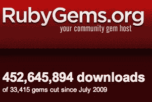
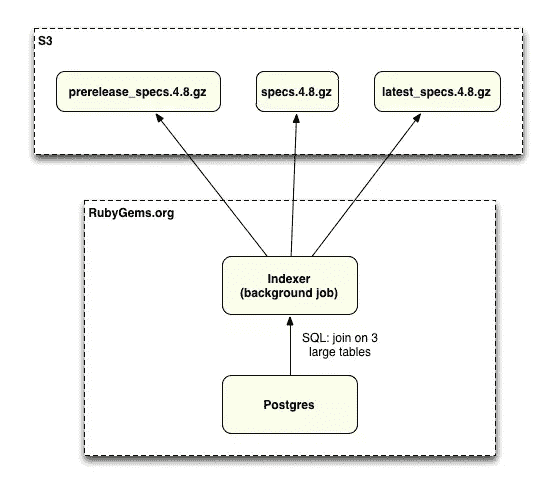
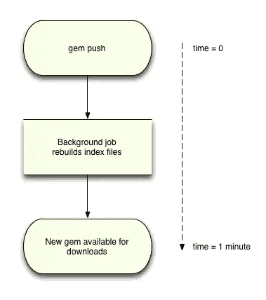
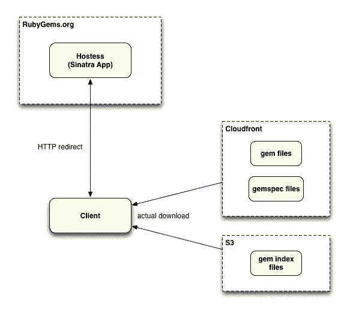

# 尼克·夸兰托关于 RubyGems.org 内部的谈话

> 原文：<https://www.sitepoint.com/a-chat-with-nick-quaranto-about-rubygems-org-internals/>

|  |
| RubyGems.org 让我们所有人贡献红宝石变得更加容易
 |

2009 年，Nick Quaranto (@qrush) 推出了一个名为 Gemcutter.org 的新的 gem 资源库，彻底改变了 gem 创作。突然间，有史以来第一次，任何 Ruby 开发者都可以简单地通过运行“gem push my_awesome_gem”来发布新的 gem。这个新过程的速度和简单性导致了 Ruby gem 开发和发布的爆炸式增长。Gemcutter.org 后来被转移到 RubyGems.org，成为 Ruby 社区默认的 gem 库。

几周前，我很喜欢听 Nick 与 RubyRogues 谈论 RubyGems.org，尤其是关于 Nick 如何开始开发 Gemcutter 及其早期历史的故事。上周，我有机会和尼克聊了聊 RubyGems.org 实际上是如何运作的。我很想知道当我推送一个新的 gem 文件时，服务器上会发生什么，它如何如此快速地为每个人提供 gem，以及它如何与新的 Bundler 1.1 依赖 API 一起工作。以下是我们谈话的几个亮点…

问:嗨，尼克，谢谢你的时间…我真的很感激！

嗨，没问题。

问:我在考虑写 RubyGems.org 内部是如何工作的，我决定…为什么不先问问你呢？所以今天我有一些技术问题要问你，还有一些图表。你可以纠正我的错误，纠正我的图表:)

当然可以！

## 向 RubyGems.org 推销新宝石

问:当有人运行“宝石推送”时，RubyGems.org 服务器上会发生什么？

这真是个好问题。我实际上已经考虑过就这个主题做一次演讲。首先，控制器接收请求，然后我们需要弄清楚客户端给了我们什么。我认为是推手类处理了大部分。使用四个步骤的过程，它计算出:

*   你给了我们什么？
*   我们以前见过吗？
*   你是被允许摆弄这块宝石的人吗？
*   然后我们实际上拯救了它。

假设所有这些事情都很酷:我们已经找到了宝石，它是有效的，你在所有者列表上，然后我们需要将宝石和宝石规格发送到 S3，并开始刷新宝石索引的工作。

## 创业板指数

问:你刚才提到了“gem 索引”——什么是 gem 索引文件，为什么 RubyGems 需要它们？

索引是 gem 获取、gem 安装和 gem 列表用来计算什么是可用的。刷新这个指数需要一段时间，因为现在有将近 200，000 颗宝石。

即使我们可以把每个宝石放在一个地方，每个人都可以立即下载，它仍然是重要的，我们经常更新索引。这是因为实际上 RubyGem 客户端不知道如何下载新的 Gem，直到它们出现在索引中。

问:如何创建索引文件？

我过去常常在你推送的时候立即重建索引，这大约需要一分钟，当它在服务器上搅动时，用户只能等待。所以，当我把它移到 Heroku 时，他们告诉我这是一个坏主意，因为 Heroku 会在 30 秒后取消请求。我必须想出一个更好的方法来做这件事。所以我就这样了解了 delayed_job。

问:现在有多少宝石？delayed_job 后台作业重建索引需要多长时间？

目前有 177，000 个索引宝石，生成整个索引大约需要一分钟左右的时间。这就是你要等多久才能安装好你的宝石。基本上整个过程就是这样。

我想大多数人只是认为，一旦你推了，就完成了——但事实并非如此。我不认为我们现在能很好地告诉他们:“嘿，你至少要等一分钟。”我想人们现在已经习惯了它的即时性。

## 上菜宝石

问:当开发人员运行“gem 安装”或“捆绑安装”时，RubyGems.org 如何提供实际的 gem 文件

该应用程序实际上是从两个小的 Sinatra 应用程序开始的。一个是重新实现 gem 服务器；每个人的 RubyGems 上都有，这就是你如何在自己的机器上提供 Gems。我不得不重新实现它，因为它必须由数据库支持，而且它必须在文件系统之外工作。另一个 Sinatra 应用是 UI。尽管最终我发现我需要 Rails，而不是 Sinatra 来做 UI。

我不能把 Sinatra 的应用程序称为“宝石服务器”,所以我想:最接近餐馆服务器的东西是什么……我说哦:“女招待！”“女主人”还在里面，那还是辛纳屈。我认为这对于 Sinatra 应用程序来说很好，因为路线真的很奇怪，因为你坐在一个提供实际文件的文件系统上，因为它最初就是这样构建的。我认为如果它们是铁路，它们肯定会是，它们会很奇怪和恶心。

这是 Nick 提到的 Hostess Sinatra 应用程序中的一个路径，它重定向客户从 S3 下载 gem 索引文件: