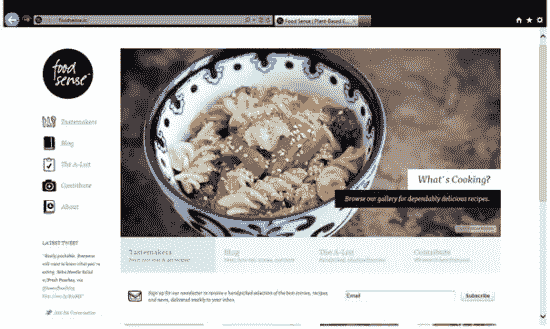
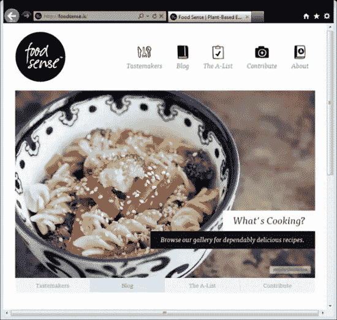
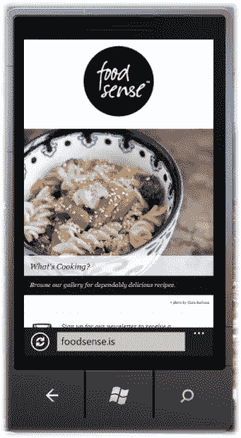
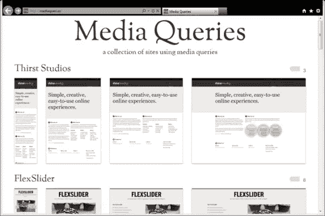
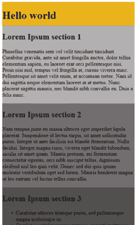
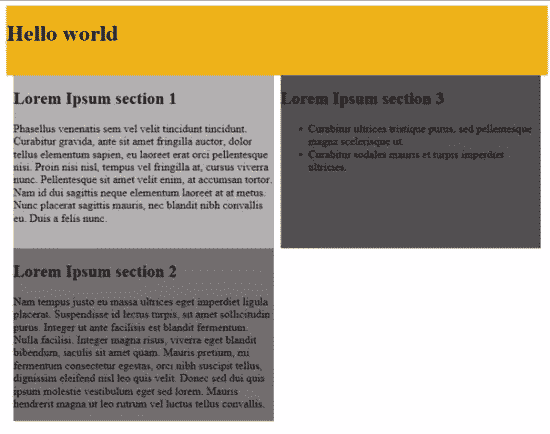
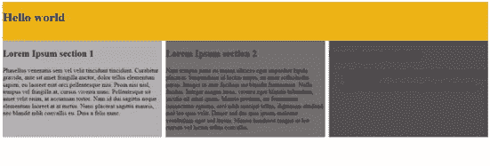

# 响应式网页设计

> 原文：<https://www.sitepoint.com/responsive-web-design/>

这一切都始于[响应式网页设计](http://www.alistapart.com/articles/responsive-web-design/)，Ethan Marcotte 的一篇文章。从本质上讲，这篇文章建议通过创建灵活、流畅和适应性强的网站来应对设备、浏览器、屏幕尺寸和方向的不断变化。这种想法不是回应今天对适应最常见屏幕分辨率的桌面 web 版本以及特定移动版本(通常针对单个移动设备)的需求，而是以相反的方式处理这个问题:使用适应几乎任何屏幕的灵活和流动的布局。

**核心概念**

响应式网页设计的核心有三个关键技术特征:

*   媒体查询和媒体查询监听器
*   使用相对大小调整的灵活的基于网格的布局
*   灵活的图像和媒体，通过动态调整大小或 CSS

真正的响应式 web 设计需要实现所有这三个特性。

关键点是适应用户的需求和设备的能力。假设一个移动用户将在一个小屏幕上浏览你的网站。考虑用户的需求不仅仅意味着让你的内容适应屏幕尺寸。这也意味着当移动用户访问你的网站时，首先要考虑他们需要什么，然后相应地安排内容。也许你会以不同的顺序呈现信息。不要认为用户不需要访问所有网站信息，因为她在移动设备上。您可能需要更改字体或交互区域，以更好地响应触摸环境。所有这些因素都会影响响应式网页设计。

虽然移动设备正在改变显示格局，随着越来越多小屏幕的出现，不要忘记在光谱的另一端正在发生什么。显示器也变得越来越大。不得不服务于这两个细分市场不应该阻止设计师在任何一个方面的创新。

### 媒体查询

从 CSS 2.1 开始，媒体类型被用来为屏幕和打印应用 CSS。您可能记得这些媒体类型:

```
<link rel="stylesheet" type="text/css" href="style.css" media="screen" />
<link rel="stylesheet" type="text/css" href="printfriendly.css" media="print" />
```

就是这样！幸运的是，W3C 在 CSS3 中改进了[媒体查询](https://www.w3.org/TR/css3-mediaqueries/)，使它们向前迈进了一大步。

今天，您可以使用媒体查询来确定特定功能的样式范围，根据与您的查询相匹配的功能应用不同的样式。您甚至可以通过使用语义操作符(如 AND 和 NOT)来组合测试几个特性的查询。功能包括宽度、高度、最大宽度、最大高度、设备高度、方向、纵横比、分辨率等。

有三种方法可以实现媒体查询:

1.  使用@import 规则从其他样式表导入样式规则:
2.  @导入 url(style600min.css)屏幕和(最小宽度:600 px)；
3.  将媒体查询直接放在样式表中，如下所示。

```
#nav
    {
        float: right;
    }
        #nav ul
        {
            list-style: none;
        }
    @media screen and (min-width: 400px) and (orientation: portrait)
        {
            #nav li
            {
                float: right;
                margin: 0 0 0 .5em;
                border:1px solid #000000;
            }
        }
    @media screen and (min-width: 800px)
        {
            #nav
            {
                width: 200px;
            }
                #nav li
                {
                    float: left;
                    margin: 0 0 0 .5em;
                    border: none;
                }
        }
```

在链接样式表的`media`属性中包含查询:

`<link rel="stylesheet" type="text/css" media="screen and (max-device-width: 800px)" href="style800.css" **/>**`

由于 CSS 的(层叠)性质，默认样式定义在顶部，下面是媒体查询匹配规则和样式。在顶部定义的样式将级联到规则中匹配的样式，甚至完全被覆盖。

下图展示了一个使用媒体查询的响应式 web 设计方法的示例。

**图 1** 和**图 2** 都以两种不同的分辨率展示了使用 Internet Explorer 9 的桌面。**图 3** 显示了 Windows Phone 上的同一个响应网站，同样使用了 Internet Explorer 9。


**图 1 导航出现在左侧**


**图 2 在一个 800×600 大小的窗口中，导航切换到顶部**


**图 3 Windows Phone 上的同一个网站**

如果你正在寻找一些充分利用媒体查询的响应式网页设计的伟大范例，那么[http://mediaqueri.es/](http://mediaqueri.es/)发烧友网站可能会让人上瘾，就像【t2t



**图 4 使用媒体查询的网站集合**

### 媒体查询监听器

W3C 的 CSS 对象模型(CSSOM)工作组将媒体查询向前推进了一步，还创建了媒体查询侦听器，它提供了一个 API 来响应媒体查询的变化。例如，您可以使用 API 在触发媒体查询匹配时仅下载特定大小的图像，而不必轮询更改或加载资源的多个版本。

今天， [Firefox](http://www.mozilla.org/en-US/firefox/) 和 [Internet Explorer 10 平台预览版](http://msdn.microsoft.com/ie/hh272903#_DOMMediaQuery)实现了媒体查询监听器；你可以在 IE 试驾上看到“ [CSS3 媒体查询&媒体查询监听器](http://ie.microsoft.com/testdrive/HTML5/CSS3MediaQueries/Default.html#MediaQueryListeners)的演示。

### 关于视窗的一句话

在移动浏览器上测试媒体查询时，您可能会注意到实际上并没有应用正确的媒体查询。当这种情况发生时，移动浏览器会为您做一些工作，以便在较小的屏幕上以最佳方式呈现页面。

所以你认为没有办法得到真正的解决方案吗？实际上是有的，在 viewport meta 标签中。viewport meta 标签控制移动浏览器(无铬)窗口的逻辑尺寸和缩放。将宽度设置为等于设备宽度可以解决这个问题:

`<meta name="viewport" content="width=device-width">`

其他视口设置包括`maximum-zoom`和`initial-scale`。

### 柔性网格

基于网格的灵活布局是响应式设计的基石之一。术语“网格”的使用相当自由，并不意味着需要实现任何可用的网格框架。这里的意思是使用 CSS 来定位、布局页边空白和空间，并以一种新的方式实现各种[网页布局类型](http://sixrevisions.com/web_design/a-guide-on-layout-types-in-web-design/)。布局和文本大小通常用像素表示。设计师热爱像素。Photoshop 爱像素。但是一个像素在一个设备上可以是一个点，在另一个设备上可以是八个点。那么，如果一切都是基于像素的，你如何实现响应式网页设计呢？你可能不喜欢这个答案:停止使用基于像素的布局，开始使用百分比或`em`来调整大小。

通过将文本大小、宽度和边距基于百分比或`em`(一种基于字体磅值的度量单位)，你可以将固定大小转换为相对大小。这意味着你需要做一些数学计算来实现一个灵活的网格和文本大小系统。但是计算`em`的公式非常简单:

`target ÷ context = result`

假设正文字体大小的正常上下文为 16 像素。如果设计者指定 H1 应为 24 像素，您可以计算如下:

`24 ÷ 16 = 1.5`

这导致了下面的 CSS 样式:

```
h1{
    font-size: 1.5em;
}
```

永远要考虑上下文。继续前面的例子，如果在`H1`中有一个需要 12 像素的元素，那么使用当前的`H1`作为上下文。上下文现在是 24 像素，因此“H1 a”的上下文计算是:

`12 ÷ 24 = 0.5`

CSS 样式是:

```
h1 a{
    font-size: 0.5em;
}
```

你也可以使用百分比。计算算法是一样的；你最后得到的只是百分比。

柔性电网使用这种方法。你可以找到几个框架来帮助你制作网格，例如[流体网格系统](http://fluid.newgoldleaf.com/)或[流体 960 网格系统](http://www.designinfluences.com/fluid960gs/)(960 网格系统的流体版本)。此外，W3C 内部的几个小组已经提交了更好的灵活网格的新规范，并取得了一些有用的结果。

### CSS3 网格布局

CSS3 网格布局(也称为网格对齐，或简称为网格)，为 CSS 带来了一个典型的网格系统，类似于 XAML 或 Silverlight 开发人员可能熟悉的系统。在撰写本文时，该规范还是一个“编辑草稿”它允许在布局中定义区域，包括列和行、跨度、间距、填充、网格模板等等，强制实现 HTML 元素和 CSS 之间的完全分离。与作为内容的 HTML 表格不同，网格允许将 HTML 原语放置在与实际内容分离的网格区域中。

将 CSS3 网格与媒体查询结合起来，为构建流畅、响应迅速的应用程序创建了一个强大的解决方案。

网格是如何工作的？首先将显示块设置为“网格”。(您需要使用 CSS 供应商前缀，因为这还不是 CSS3 推荐标准。目前，只有 Internet Explorer 10 平台预览版支持该规范，所以您将看到这里使用的 CSS 供应商前缀-ms。)让我们来看三个例子，看看如何根据屏幕大小设置不同的视图。媒体查询用于根据屏幕宽度应用不同的网格样式。

在第一个例子中，定义内容的 HTML 由一个标题和三个不同的文本块组成。

```
<div id="mygrid">

    <header id="myheader">

        <h1>Hello world</h1>

    </header>

    <div id="block1">

        <h2>Lorem Ipsum section 1</h2>

        <p>

            Phasellus venenatis sem vel velit tincidunt tincidunt.

              Curabitur gravida, ante sit amet [... ...]

        </p>

    </div>

    <div id="block2">

        <h2>Lorem Ipsum section 2</h2>

        <p>

        Nam tempus justo eu massa ultrices eget imperdiet ligula placerat.

        Suspendisse [... ...].

        </p>

    </div>

    <div id="block3">

        <h2>Lorem Ipsum section 3</h2>

        <ul>

            <li>Curabitur ultrices tristique purus, sed pellentesque

               magna scelerisque ut.</li>

            <li>[... ...] </li>

        </ul>

    </div>

</div>
```

你首先将内容块一个接一个地排列起来，这样内容就能适应智能手机。

```
@media only screen and (max-width : 480px) {

    #mygrid {

        display: -ms-grid;

        margin: 3px;

        -ms-grid-columns: 100%; /*one column taking full width */

        -ms-grid-rows: 70px auto auto auto; /*4 rows */

    }

    #myheader {

       -ms-grid-row: 1;

       -ms-grid-column: 1;

    }

    #block1 {

        -ms-grid-row: 2; /*place into row 2 / column 1*/

        -ms-grid-column: 1;

    }

    #block2 {

        -ms-grid-row: 3;

        -ms-grid-column: 1;

    }

    #block3 {

        -ms-grid-row: 4;

        -ms-grid-column: 1;

    }

}
```

你可以添加背景颜色，如图 5 所示，这样可以更清楚地表明你正在处理网格项目。



**图 5 带有背景颜色的内容块**

在第二个示例中，媒体查询应用为大于 481 像素的屏幕尺寸定义的样式，这比典型的智能手机还要宽。您可以使用网格来定义两列并将块移动到所需的位置，如下所示。结果如**图 6** 所示。

```
@media only screen and (min-width : 481px) {

/*make two columns and move block 3 next to 1 — just because we can*/

    #mygrid {

        display: -ms-grid;

        -ms-grid-columns: 10px 1fr 10px 1fr 10px; /*10px columns to spacing in between*/

        -ms-grid-rows: 100px 1fr 1fr; /*100px row and two rows each taking 1 fraction of available space*/

        margin: 5px;

    }

    #myheader {

        -ms-grid-row: 1;

        -ms-grid-column: 1;

        -ms-grid-column-span: 5;

        background-color: #EEB215;

    }

    #block1 {

        -ms-grid-row: 2;

        -ms-grid-column: 2;

        background-color: #B2B0B0;

    }

    #block2 {

        -ms-grid-row: 3;

        -ms-grid-column: 2;

        background-color: #726E6E;

    }

    #block3 {

        -ms-grid-row: 2; /*block 3 can go into row 2*/

        -ms-grid-column: 4;

         background-color: #515050;

    }

}
```


**图 6 带有两个相邻列的新布局**

第三个网格示例显示在大于 1220 像素的屏幕宽度上。您定义了一个具有跨越多列的宽标题的网格，然后定义了三列，每一列只占可用空间的一小部分，中间有几个 10 像素的列。结果如**图 7** 所示。

```
@media only screen and (min-width: 1220px) {

    #mygrid {

        display: -ms-grid;

        -ms-grid-columns: 1fr 10px 1fr 10px 1fr;

        -ms-grid-rows: 100px 1fr;

        margin: 5px;

    }

    #myheader {

        -ms-grid-row: 1;

        -ms-grid-column: 1;

        -ms-grid-column-span: 5;

        background-color: #EEB215;

    }

    #block1 {

        -ms-grid-row: 2;

        -ms-grid-column: 1;

        background-color: #B2B0B0;

    }

    #block2 {

        -ms-grid-row: 2;

        -ms-grid-column: 3;

        background-color: #726E6E;

    }

    #block3 {

        -ms-grid-row: 2;

        -ms-grid-column: 5;

        background-color: #515050;

    }

}
```



网格规范是实现响应式 web 设计的一个受欢迎的补充。

另外两个新的 CSS 规范也值得一提:[灵活框布局模块](https://www.w3.org/TR/2009/WD-css3-flexbox-20090723/) (Flexbox)和[多栏布局模块](https://www.w3.org/TR/css3-multicol/)。两者都显示了设计响应性网站的巨大潜力。

Flexbox 目前是 W3C 的工作草案，它增加了对四种新布局模式的支持:块、内嵌、表格和定位。它使您能够以相对位置和恒定大小来布局复杂页面，即使屏幕大小发生变化。

多列布局模块目前是 W3C 的候选推荐标准。这种解决方案适用于需要在列中布局并从一列流到下一列的内容。您可以在此[实验室](http://ie.microsoft.com/testdrive/Graphics/hands-on-css3/hands-on_multi-column.htm)中查看多栏布局的交互式示例。

### 灵活的图像和媒体

响应式网页设计的最后一个方面是灵活的图像和媒体。基本上，这个特性允许你通过缩放或者使用 CSS 溢出属性，使你的图片或者其他媒体根据不同的设备进行不同的加载。

CSS 中的缩放对于图像和视频来说都很容易实现。您可以将媒体元素的最大宽度设置为 100 %,浏览器将根据其容器缩小和扩大图像。您应该尽可能以最好的质量和大小提供图像，然后让 CSS 将图像调整到合适的大小。

```
img, object {

    max-width: 100%;

}
```

缩放图像的另一种方法是用 CSS 裁剪它们。例如，应用 overflow:hidden 允许您动态地裁剪图像，以便当容器调整大小以适应新的屏幕环境时，图像能够适合它们的容器。

在 CSS 中有几个缩放和裁剪图像的选项可能还不够。你真的需要占用一个访问者的所有移动带宽吗，因为你没有一个更小版本的图片？为了更好地为用户服务，灵活的图像可能意味着使用替代图像——甚至根本没有图像。网页设计社区的人们正在提出基于 JavaScript 和 cookies 的解决方案，随着响应式网页设计的发展和成为许多高质量网站的基础，你可以期待更多这样的解决方案。

### 传统浏览器

不支持媒体查询的老浏览器怎么办？8 版之前的 ie 浏览器怎么样，有缩放图片的问题？聚合填料形式的解决方案会有所帮助。这里有一些有用的例子。

*   CSS 3-mediaqueies . js by wouter van der graaf:[code . Google . com/p/CSS 3-mediaqueies-js/](http://msdn.microsoft.com/en-us/magazine/code.google.com/p/css3-mediaqueries-js/)
*   response . js:[github.com/scottjehl/Respond](http://msdn.microsoft.com/en-us/magazine/github.com/scottjehl/Respond)
*   流体图像:[unstoppablerobotninja.com/entry/fluid-images/](http://msdn.microsoft.com/en-us/magazine/unstoppablerobotninja.com/entry/fluid-images/)

### 最后

跳上响应式网页设计的马车不是一件轻而易举的事情。考虑你需要实现什么，并考虑是否迎合特定版本的桌面或移动设备最有意义。

响应式网页设计还处于早期阶段。网页设计师将继续提供不同的意见和建议方向，涉及是否首先为移动设备构建，如何将这些决策融入设计流程，是否将排版分割成所有不同的屏幕尺寸，等等。随着越来越多的屏幕尺寸和外形尺寸的到来，这一对话将会继续。

HTML 和 CSS 标准正在发展，以帮助网页设计者处理这些问题。很明显，某种形式的响应式 web 设计将被用来迎接挑战，同样明显的是，随着处理不断变化的设备和浏览器世界的更好方法的发现，标准将继续发展。

以下是一些附加资源:

*   [响应式网页设计](http://www.alistapart.com/articles/responsive-web-design/)
*   [响应式网页设计技术、工具和设计策略](http://www.smashingmagazine.com/2011/07/22/responsive-web-design-techniques-tools-and-design-strategies/)
*   [硬汉 CSS3 媒体查询](http://stuffandnonsense.co.uk/blog/about/hardboiled_css3_media_queries)
*   [黄金网格系统](http://goldengridsystem.com/)
*   [简单看看网页设计中基于网格的布局](http://sixrevisions.com/web_design/a-brief-look-at-grid-based-layouts-in-web-design/ "Permanent Link to A Brief Look at Grid-Based Layouts in Web Design")

## 分享这篇文章