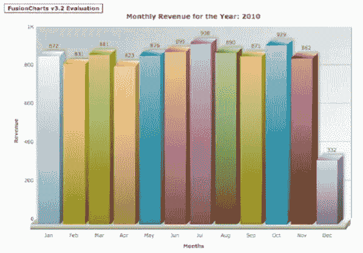
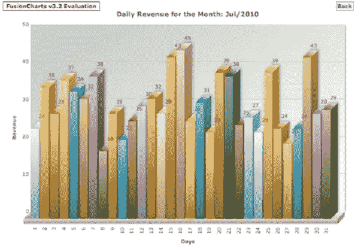

# 使用 FusionCharts、PHP、MySQL 和 JSON 创建深入分析

> 原文：<https://www.sitepoint.com/creating-drill-down-analytics-with-fusioncharts-php-mysql-and-json/>

如果你能衡量它，你就能管理它。如果你也能想象它，那就更好了。企业和个人正在数据中游泳——从社交网络到预算，再到资源规划，我们被生成数据的工具所包围，我们大多数人构建的应用程序为自己和客户生成更多的数据。如何提取和呈现由您(或您的客户)的业务生成的数据，让他们探索这些数据来回答有关其业务的问题并以明智的方式做出决策，这可能是一项挑战。

FusionCharts 是一个非常容易访问的应用程序，它允许您配置和部署多级、下钻式图表，以便在一个有吸引力的简单界面中呈现数据。在本文中，我们将使用 PHP、MySQL 和 JSON 完成 FusionCharts 的一个简单实现——您可以使用自己的数据立即启动并运行。

当您处理下钻数据时，您需要从自然聚合成有意义的组的数据开始。在本例中，我们将使用一段时间内的销售量。时间段将提供向下钻取—我们将从年开始，并从那里向下钻取，核心数据将是特定日期的销售计数。其他的例子可能是地理数据，或者通过类别向上(或向下)滚动的数据。

### 方法和假设

对于此解决方案，将有一个自定义开发的组合，集成了一个自包含的应用程序，即 FusionCharts 的 3D 柱形图。几乎有 36 种图表可供选择，包括散点图、折线图、2D 和 3D 选项等等。FusionCharts 提供。主权财富基金和。js 文件，您必须提供数据和请求/响应处理程序。

本教程假设您的 web 服务器上安装了 PHP5 和 mySQL 数据库。需要对 JSON 和 PHP 有一定的理解。对 HTML、CSS 和 JavaScript 的理解也是有帮助的，但对本教程来说不太重要。这个堆栈不是必需的——您真正需要的是一个数据源和一个能够接受 http 请求、访问数据和格式化响应的处理程序。

出于我们的目的，我们将非常简单地实现它，以便对我们的 php 文件的任何请求都将有一个包含我们需要的所有数据的 JSON 响应。

| 介绍会；展示会 | `Column3d.swf`嵌入在`chart-json.html`中 |
| 应用控制器和数据访问 | `linked-chart.php`用 JSON 响应 |
| 数据库ˌ资料库 |  |

因此，在我们的示例中，对`chart-json.html`的任何请求都会导致客户端请求几个资产，包括 javascript 文件和`swf`。当`swf`加载时，它将遵循传递给它的属性来加载数据，向 php 应用程序发出请求。该应用程序将访问数据库，检索数据，并格式化响应。`swf`将解析 JSON 文件中包含的数据并构建我们的图表。

准备好了吗？让我们开始吧。

### 实现链接的 FusionChart

首先，在这里下载核心 FusionChart JavaScript 和 Flash 文件[。遵循 zip 中包含的`index.html`文件中的安装说明。LinkedCharts 是 FusionCharts 的一项功能，它允许您拥有无限的向下钻取功能，用户可以单击数据绘图项目，然后会提供一个子图表来替换当前图表或生成到子窗口或框架。](http://www.fusioncharts.com/download/)

对于本教程，我们将重点关注这些文件:

*   `/chart-json.html` ( **点击此处获取代码** 包含的标记来显示图表。包括专有的 FusionChart JavaScript 和 Flash 文件。调用 linked-chart.php)
*   `/linked-chart.php` ( **点击这里查看代码** php 连接到 mySQL 数据库并将数据输出为 JSON)
*   在 zip 文件中找到的`/FusionCharts.js` ( **代码。**专有的 FusionChart 文件，接收 JSON 并将数据注入 Column3D.swf)
*   在 zip 文件中找到的`/Charts/Column3D.swf` ( **代码。**显示用户界面使数据变漂亮)

首先，我们需要我们的数据。由于我们的示例将处理整齐地聚合到一年的各个部分的数据，所以我们将只基于时间戳生成数据。稍后我们可以使用 SQL 将它分类成组。

创建数据库表的 SQL:

```
CREATE TABLE 'revenue'

(

  'ID' int(10) unsigned NOT NULL AUTO_INCREMENT,

  'Time' timestamp NOT NULL DEFAULT '0000-00-00 00:00:00',

  PRIMARY KEY ('ID'),

  KEY 'Time' ('Time')

)
```

通过另一个 php 脚本填写表格，该脚本将在两年内生成 10，000 行时间戳，可用作我们的销售数据:

`generate-random-data.php`

```
<?php

//Connect to database

$db_host     = 'database-url-goes-here';

$db_database = 'database-name-goes-here';

$db_username = 'database-username-goes-here';

$db_password = 'database-password-here';

if ( !mysql_connect($db_host, $db_username, $db_password))

    die ("Could not connect to the database server.");

if ( !mysql_select_db($db_database))

    die ("Could not select the database.");

//Set variables

$MinTime = strtotime('2010-01-01');

$MaxTime = strtotime('2010-12-12');

$RecordsToInsert = 10000;

//Generate random time and insert records

for($i = 0; $i < $RecordsToInsert; $i++)

{

      $RandomTime = rand($MinTime, $MaxTime);

      mysql_query("INSERT INTO 'revenue' (Time) VALUES
(FROM_UNIXTIME({$RandomTime}))") or die(mysql_error());

}

//Completed

echo "Inserted {$RecordsToInsert} records.";

?>
```

现在让我们构建逻辑层。这是应用程序的核心，因为它处理请求并管理数据的检索和响应的格式化。由于是 PHP，我们将在一个文件中做很多事情:建立数据库连接，使用 SQL 语句收集我们需要的对象，排序和过滤响应，然后将响应格式化为 JSON。

首先，我们将处理请求并定义我们将在 URI 中接受的参数:

```
<?php

//Sanitizing the input

$Type  = $_GET['type'];

$Year  = intval($_GET['year']);

$Month = intval($_GET['month']);
```

接下来，我们将设置数组来处理我们对月份名称进行分段的值。然后根据请求中的参数使用 case 语句来选择数据，并将其过滤到我们希望提供的聚合中，以便进行深入研究——在本例中是月和日。返回的数据填充数组，稍后将在发送给 FusionCharts.js 调用的 JSON 响应中使用。

```
//Months Names

$MonthsNames = array(null, 'Jan', 'Feb', 'Mar', 'Apr', 'May', 'Jun', 'Jul', 'Aug', 'Sep', 'Oct', 'Nov', 'Dec');

//Prepare variables according to type-of-chart

switch($Type)

{

       default:

       case 'monthly':

              $Query = "SELECT MONTH(Time) AS Value, COUNT(*) AS Total FROM 'revenue' WHERE YEAR(Time)={$Year} GROUP BY Value";

              $ResultArray = array_fill(1, 12, 0); // fill the Result array with 0 values for each month

              $ChartHeading = 'Monthly Revenue for the Year: '.$Year;

              $XaxisName = 'Months';

              break;

       case 'daily':

              $Query = "SELECT DAY(Time) AS Value, count(*) AS Total FROM 'revenue' WHERE YEAR(Time)={$Year} AND MONTH(Time)={$Month} GROUP BY Value";

              $ResultArray = array_fill(1, 31, 0);  // fill the Result array with 0 values for each day

              $ChartHeading = 'Daily Revenue for the Month: '.$MonthsNames[$Month].'/'.$Year;

              $XaxisName = 'Days';

              break;

}
```

构建数据库连接并检索数据

```
//Connect to database

$db_host     = 'database-url-goes-here';

$db_database = 'database-name-goes-here';

$db_username = 'database-username-goes-here';

$db_password = 'database-password-here';

if ( !mysql_connect($db_host, $db_username, $db_password))

    die ("Could not connect to the database server.");

if ( !mysql_select_db($db_database))

    die ("Could not select the database.");

//Query the database

$QueryResult = mysql_query($Query);

//Fetch results in the Result Array

while($Row = mysql_fetch_assoc($QueryResult))

       $ResultArray[$Row['Value']]=$Row['Total'];
```

现在数据已经被检索并存储在一个数组中，我们需要格式化我们的 JSON 响应。JSON 的第一部分将包含 FusionCharts 将用于标签的信息。根据级别，JSON 将包含或多或少的数据——12 行数据表示月份，可变数量的行表示每天。

向下钻取功能的关键在于“链接”属性——通过传递 URI `newchart-jsonurl-get-data.php?type=daily&year='.$Year.'&month='.$MonthNumber.'` FusionCharts 将使数据区域成为一个链接，当用户单击它时，将加载相应月份的向下钻取数据。

下面是 php 生成 JSON 的样子

```
//Generate json: parent node

$Output = '{"chart":{"caption":"'.$ChartHeading.'","xaxisname":"'.$XaxisName.'","yaxisname":"Revenue"}, "data":[';

//Generate JSON: inner nodes for monthly and daily view

switch($Type)

{

       default:

       case 'monthly':

              foreach($ResultArray as $MonthNumber => $value) {  // MonthNumber is month number (1-12)

                     $Output .= '{ "value" : "'.$value.'", "label":"'.$MonthsNames[$MonthNumber].'", "link":"newchart-jsonurl-get-data.php?type=daily&year='.$Year.'&month='.$MonthNumber.'" } ';

                     if ($MonthNumber < count($ResultArray)) {

                           $Output .= ',';

                     }

              }             

              break;

       case 'daily':

              foreach($ResultArray as $DayNumber => $value) { // DayNumber is day (1-31)

                     $Output .= '{ "value" : "'.$value.'", "label":"'.$DayNumber.'" } ';

                     if ($DayNumber < count($ResultArray)) {

                           $Output .= ',';

                     }

              }

              break;

}

$Output .= ']}';

//Send output

echo $Output;

?>
```

最后，我们需要表示层，我们将创建一个 HTML 页面，其中包含我们需要的请求和要传递给 LinkedChart 的参数。

`chart-json.html`的代码:

```
<!DOCTYPE html PUBLIC "-//W3C//DTD XHTML 1.0 Transitional//EN" "https://www.w3.org/TR/xhtml1/DTD/xhtml1-transitional.dtd"> 

<html> 

<!DOCTYPE html> 

<html> 

<head> 

<meta http-equiv="Content-Type" content="text/html; charset=utf-8" /> 

<title>Linked FusionChart using PHP, JSON and MySQL</title> 

<script type="text/javascript" src="Charts/FusionCharts.js"></script> 

</head> 

<body> 

<div id="chartContainer">FusionCharts will load here</div> 

<script type="text/javascript"> 

<!--

FusionCharts._fallbackJSChartWhenNoFlash();

var myChart = new FusionCharts("Charts/Column3D.swf", "myChartId", "700", "500", "0", "1");

myChart.setJSONUrl("linked-chart.php?year=2010");

myChart.render("chartContainer");

// -->

</script> 

</body> 

</html>
```

这是结果:



FusionCharts 希望链接是 URL 编码的，但是您可以通过为图表使用“unescapelinks”属性来覆盖它。当 FusionCharts 构建图表时，链接被嵌入到列中，允许用户单击一列并向下钻取到下一级数据，在本例中为每日。



您可以配置颜色和样式，并且下钻的级别实际上受到您正在处理的数据的限制。

这是一个非常简单的例子，但是你可以用很多方式来扩展它。例如，您可以通过 RESTful 接口访问数据，并向 URI 模式添加参数。你有什么想法？这个例子使用的是表格数据，那么向下钻取地理人口数据呢？让我们知道。

## 分享这篇文章