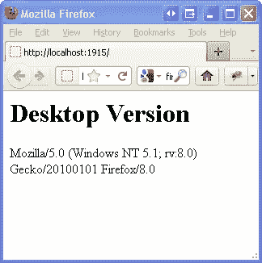
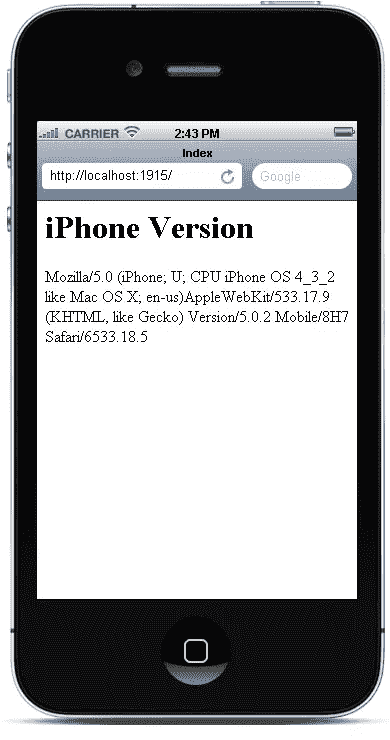
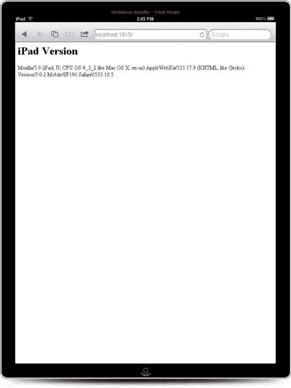

# ASP.NET MVC 4 开发者预览版:显示模式

> 原文：<https://www.sitepoint.com/asp-net-mvc-4-developer-preview-display-modes/>

这是第二篇关注 ASP.NET MVC 4 新特性的文章。今天的文章将重点介绍如何使用*显示模式*。这将根据发出请求的浏览器来选择视图，这意味着您可以针对特定设备，为用户提供真正丰富的体验。

在开始之前，您应该阅读本系列关于 ASP.NET MVC 4 开发者预览版的第一篇文章。

### 装置

在进行任何开发之前，您需要安装 MVC 4 版本。最简单的方法是通过 Web 平台安装程序。MVC 4 可用于 Visual Studio 2010 或 Visual Studio 2011 开发人员预览版。

我创作的所有 MVC 文章都是在 Visual Studio 2011 开发者预览版中开发的。以下是开始使用的链接。

*   [用于 Visual Studio 2010 的 ASP.NET MVC 4](http://www.microsoft.com/web/gallery/install.aspx?appid=MVC4VS2010&prerelease=true)
*   [ASP.NET MVC 4 for Visual Studio 2011 开发者预览版](http://www.microsoft.com/web/gallery/install.aspx?appid=MVC4VS11&prerelease=true)

**MVC 4 中的默认移动视图**

理解 MVC 4 中的一个新特性很重要。默认情况下，如果您向文件夹添加一个 *.mobile.cshtml* 视图，该视图将由移动和平板设备呈现。


这是一个很好的功能，但如果你想针对特定的设备，如 iPhone，iPad 或 Windows Phone，你可以使用*显示模式*。

为此，您需要注册一个新的 *DefaultDisplayMode* 实例来指定当请求满足条件时要搜索哪个名称。您在`Application_Start`事件中的`global.asax`文件中设置这个。以下是如何为 iPhone 指定显示模式。

```
protected void Application_Start()

{

DisplayModes.Modes.Insert(0, new DefaultDisplayMode("iPhone")

{

ContextCondition = (context =>context.Request.UserAgent.IndexOf

("iPhone", StringComparison.OrdinalIgnoreCase) >= 0)

});

}
```

为了使用满足这个条件的视图，您创建了一个视图，但是将扩展更改为`.iPhone.cshtml`。同样，如果您想以 iPad 为目标，创建一个 iPad 实例。

```
DisplayModes.Modes.Insert(0, new DefaultDisplayMode("iPad")

{

ContextCondition = (context =>context.Request.UserAgent.IndexOf

("iPad", StringComparison.OrdinalIgnoreCase) >= 0)

});
```

基本上，*显示模式*勾选 *[用户代理](http://bit.ly/tXrR1W)* 。如果找到匹配的后缀，它将显示找到的任何匹配后缀的视图。后缀是传递给 *DefaultDisplayMode* 方法的参数。为了看到这一点，我创建了一个 *Home* 控制器，并在 *Home* 文件夹中添加了三个视图。


观点的分歧在于 H1 的航向。他们会根据设备显示 *iPhone* 、 *iPad* 或*桌面*。我还显示了*用户代理*，这样您就可以看到它的变化。首先，我将通过桌面浏览器调试网站。您可以看到提供的桌面特定页面。



现在使用 iPhone 导航到该网站。您将看到提供的 iPhone 特定页面。



切换到 iPad，你会看到 iPad 的特定页面。



这是一种针对特定设备的简单方法，可以生成适合该设备的视图，因此也适合用户。

**用仿真器测试**

要测试这些新功能，你可以使用实际的 iPhone 或 iPad，也可以使用模拟器。我使用的模拟器来自 MobiOne。你可以在这里下载 15 天的免费试用版。

Windows Phone RC 模拟器是免费的，可以在这里下载[。](http://www.microsoft.com/download/en/details.aspx?displaylang=en&id=27570)

同样，另一个不错的选择是 Firefox 的用户代理切换器插件，它可以改变发送到浏览器的用户代理。可以在这里下载。

## 分享这篇文章