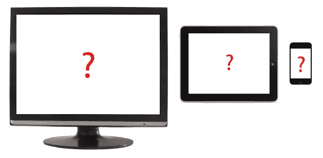
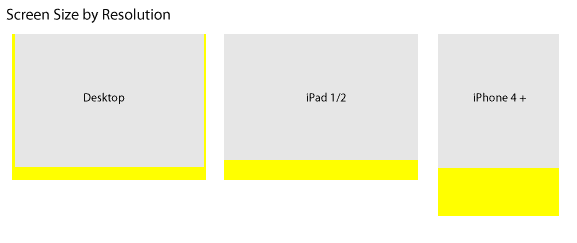
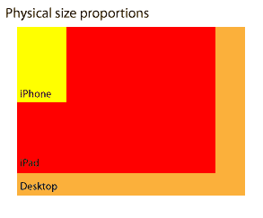

# 网页设计:分辨率和尺寸

> 原文：<https://www.sitepoint.com/designing-for-the-web-resolution-and-size/>

作为一名平面设计师，理解并遵循一套固定的标准是非常重要的。这确保了设计者制作的东西实际上可以作为印刷品使用，也可以打印！例如在印刷业，设计一张简单的名片有它自己的因素要注意——这也取决于你用谁来印刷你的工作。

一些需要注意的常见问题包括:作业是否为标准尺寸(如果打印机提供了自己的一套指南和尺寸)，如果您决定使用激光打印(这影响价格和颜色)，或者胶印，如果您使用固体或印刷，您应该留多少出血量，如果他们有负担得起的金属材料，该列表还可以继续列出！即使有这么多不同的印刷问题，我们仍然对我们的指导方针和熟悉的困难感到放心。

转向网络世界，设计的问题同样复杂多样。对于一个没有涉足网页设计的平面设计师来说，这可能是一个奇怪的地方，我们长期使用的印刷设计指南突然被扔出窗外！

在接下来的几周里，我将讲述网页设计的基础和复杂方面，但不会跨越编码的门槛。目的是用设计一个可靠的网站的知识和技能武装平面设计师。设计网站有很多方法，本指南是其中一种。

为网络设计给你一种你无法想象的自由。然而，你需要记住某些因素——当然这取决于你手头的工作！当你为你的第一个设计动笔时，或者打开 Photoshop 或 Illustrator 时，知道网站的大小是很重要的！

* * *

网站设计的一个重要因素是分辨率和屏幕的物理尺寸。重要的是要知道设计什么尺寸，以及我们为客户选择的给定尺寸会对访客的屏幕产生什么影响。

网络上流行的观点是设计大多数人使用的最普通的屏幕分辨率，在撰写本文时，1024 x 768 已经有好几年了。然而，设计师需要考虑一个相对较新且重要的因素，那就是手持设备的兴起和流行。Android 设备和 iOS(苹果公司生产的几乎所有产品的操作系统，以字母“I”开头)的流行以及 Windows 7 设备的缓慢崛起不容忽视，必须加以解释。这些设备可以是手机大小或平板电脑大小的设备，它们的设计尺寸需要包含在我们新的“指南”中。

**分辨率、可用空间和物理屏幕尺寸**

| 类型 | 桌面(平均) | 平板电脑尺寸(平均值) | 手机尺寸(平均) |
| 解决 | 1024 x 768 像素 | iPad: 1024×768 像素 | iPhone 4+ 640 x 960 px |
| 可用空间 | 999 x 700 像素(近似值) | iPad:1024×664 像素(大约)长 | iphone: 640 x 707 像素(大约)P |
| 屏幕大小 | 230 毫米 x 170mm 毫米* | iPad:200 毫米 x 148mm 毫米 | iPhone:50 毫米 x 76mm 毫米 |
|  |  |  |  |
| P =肖像=风景 |  |  | *在我的笔记本电脑上快速测量 |

在上表中，我已经包括了 14%的互联网用户仍在使用的台式电脑的平均分辨率，以及苹果的平板电脑和手机(不幸的是，在撰写本文时，我无法获得任何其他制造商的产品)。然而，这些分辨率是全屏尺寸，并且浏览器以状态栏、按钮栏、地址栏、滚动条等形式占据了屏幕的一部分。上表中的*“可用空间*”行是一个很好的网站设计指南。这有助于我们避免滚动——尤其是当我们设计一个不打算滚动的空间时。

如果你想阅读更多关于网络可用性方面的内容，去找雅各布·尼尔森的书。一些业内人士可能会认为他很极端，但他提出了强有力的论点，将他的一些理念融入到你的网页设计哲学中不会有什么坏处！

但是，如果按像素大小设计，我们可能会遇到一个问题。

上图以像素为单位说明了所有三种屏幕尺寸的大致尺寸，并通过按钮栏、状态栏等显示了已用空间。然而，你可能会注意到一些奇怪的事情——是的，iPhone 的分辨率似乎不成比例！我敢肯定，上次你看的时候，你的手机还没有你的显示器高呢！

回头参考该表，*“屏幕尺寸”*行显示了屏幕的实际尺寸与屏幕分辨率之间的关系。尽管如此，图形表示可能会更好一点。

上图让我们有了更好的理解，并将帮助我们为 iPhone 等手机设计更好的网站界面。虽然分辨率是设计的一个非常重要的方面，但它不能像台式电脑那样作为网站大小的标准度量。

**需要记住的要点**

*   对于桌面版本的设计，使用分辨率作为网站大小是很好的
*   对于手持设备，使用物理尺寸作为网站尺寸更好
*   很可能你会在网站设计上设计三种不同的风格，以适应不同的尺寸。

在这个系列的第二部分中，我们将在 Illustrator 中制作一个网站模板，我们将在其中说明上述问题。

## 分享这篇文章