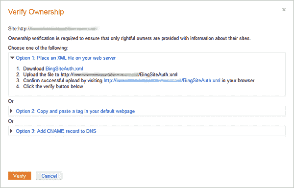

# 如何将你的雅虎网站地图转移到必应

> 原文：<https://www.sitepoint.com/transfer-yahoo-sitemap-to-bing/>

雅虎！Sitemaps 在 2011 年 11 月 21 日被废弃*(实际上，它被命名为[“Yahoo！站点探险家”](http://siteexplorer.search.yahoo.com/)但没人叫它)*。该系统允许网站所有者向搜索引擎提交他们的 XML 网站地图和提要，就像[谷歌的网站管理员工具](http://www.google.com/webmasters/tools/)一样。

继[去年与微软](https://www.sitepoint.com/microsoft-yahoo-partnership/)达成合作协议后，雅虎采用了必应的搜索引擎，所以你现在将被转到 [**必应网站管理员工具**](http://www.bing.com/toolbox/webmaster/) 页面。没什么好担心的，但不幸的是，你也不能自动转移你的旧雅虎网站地图配置。然而，只要做一点准备，你的每个网站都可以在几分钟内建立起来。

首先，确保你的网站有一个 XML 网站地图、RSS 提要或其他一些机器可读的网页索引。大多数内容管理系统会生成一个 feed 或者有一个[像样的网站地图插件](http://wordpress.org/extend/plugins/google-sitemap-generator/)。或者，你可以在 sitemaps.org 的[找到更多信息。](http://www.sitemaps.org/)

在大多数情况下，XML sitemap URLs 是 http://yourdomain.com/sitemap.xml.，您可以通过将它添加到域根目录下的 robots.txt 文件来帮助自动发现，例如

```
User-agent: *
Sitemap: http://yourdomain.com/sitemap.xml
```

现在前往 [Bing 网站管理员工具](http://www.bing.com/toolbox/webmaster/)并使用 Windows LiveID 登录。令人困惑的是，你不需要成为 Windows 用户，也不需要有 live.com 的邮箱。如果您已经有 Hotmail、Messenger 或 Xbox LIVE 帐户，您可以使用这些凭据登录，否则，请单击“注册”并按照说明进行操作。

首次登录时，系统会提示您设置首选项。完成后，点击**添加站点**按钮，输入您第一个站点的域名。然后，您需要通过上传文件、更改主页上的 meta 标签或修改域的 DNS 设置来验证所有权:



在大多数情况下，上传验证文件是最简单的选择，因为同一个文件可以用于所有的域。因此，下载 BingSiteAuth.xml，然后将其上传到您想要注册的每个域的根文件夹中。(可选步骤:你也可以删除旧的雅虎验证文件——它将被命名为 y_key_ *random-hex-code* 。html)。

现在，从主页标签，点击“添加网站”,依次输入所有网站的域名。假设你先上传了 BingSiteAuth.xml，就不会提示你再次验证每个站点。

如果你幸运的话，Bing 会自动定位和配置每一个站点地图。在我的经验中，它发现最多；我不确定它是在读取 robots.txt 文件、查找 sitemap.xml 还是检索旧的雅虎配置数据。然而，它并不总是能找到正确的网址，所以值得检查一下——而且它会给你一个添加其他订阅源的机会:

1.  单击任意站点进入其仪表板。
2.  点击**抓取**标签，然后点击**站点地图(XML，Atom，RSS)** 链接。
3.  检查您的订阅源是否已列出。如果不是，点击**添加订阅源**并输入网址。
4.  现在，通过单击“域”下拉列表并依次选择每个站点来检查您的所有其他站点。


除非你有数百个域名，否则整个过程不会超过几个小时。一旦你的网站被配置，分析，交通和索引数据通常在几天内可用。幸运的话，这也会提高你在必应中的地位。

## 分享这篇文章