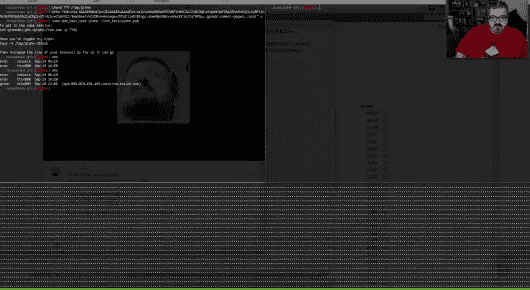

# 位置:成对编程

> 原文：<https://www.sitepoint.com/loccasions-pair-programming/>

像往常一样的一天，我浏览着我的 Twitter，寻找知识和灵感。虽然我当时并不知道，但这一天的推特钓鱼将会证明是富有成效的，并将永远改变事件的方向。(你应该在这里想象一些戏剧性的音乐，完成一个镜头切换到黑色的 Loccasions 屏幕截图。)

那条将改变一切的推文是关于 rubypair.com 的。RubyPair.com 是一个“寻找结对的开发者的可搜索目录，这些开发者通过个人资料对他们感兴趣的话题进行面对面或远程的交流。”换句话说，这是一种在你的(或他们的或一些开源的)Ruby 项目上找人配对程序的方法。我看了这条推特，它像晴天霹雳一样击中了我！我需要配对程序！我的意思是，我有一个(有争议的)程序员，我只需要找到另一个。我在哪里可以找到这样的灵魂？嗯，我想 RubyPair.com 的创造者一定会很感兴趣。我会在 RubySource.com 上提供免费宣传，这个地方可以阅读所有关于 Ruby 的东西。

在[关于](http://rubypair.com/about)的页面上看，看到了埃文莱特的名字。我在 twitter ( [@elight](http://twitter.com/elight) )上关注埃文已经有一段时间了，我知道他有的“办公时间”，寻求结对的程序员可以在那里注册。我抓住了这个机会，在 9 月 20 日抢走了埃文的办公时间。现在，我所拥有的就是等待那一天的疯狂期待，就像那是我自己的红宝石圣诞节一样。

## 让有(埃文)光

Evan Light 从事软件开发已经有很长时间了。你可以通过阅读他的内容丰富的博客和他的简历[来判断。Evan 并不总是做 Ruby，事实上他冒着](http://www.tripledogdare.net)[巨大的风险到达了他目前的人生位置](http://evan.tiggerpalace.com/articles/2011/08/28/getting-free/) Evan，在我看来，举例说明了为什么 Ruby 社区是，你怎么说？，超级神奇。他聪明、平易近人，热衷于帮助他人学习 Ruby。如果你需要一个很棒的 Ruby 资源，他可以在 [TripleDogDare](http://tripledogdare.net/) 上租用(拥有 Rubysource 的所有祝福)。他是一个喜欢猫的时尚弄潮儿人。

## 我配吗？

老实说，我有点担心。我以前从未真正配对过。尤其是和陌生人。尤其是和一个比你更有经验/更聪明/更擅长红宝石的陌生人。在我的脑海中，很有可能，这次会面会让他非常沮丧，我也很有可能会哭。(继续这篇文章戏剧性的主题……)然而，我立场坚定，知道为你的艺术牺牲是伟大的象征。

## 这一天到来了

晚上 9 点 50 分，我开始在办公桌前发呆，担心自己即将面临的尴尬。十分钟后，Skype 铃声将我拉回现实。是埃文。我回答，“嗨。”

“你好，格伦。你准备好了吗？”他问道。“嗯，算是吧。老实说，在这里，我从来没有这样做过。”
“什么？编程了？”他笑了。“没关系，我会让我们去。”

我之前告诉过 Evan 关于 Loccasions 的事情，他克隆了我的 github 库。他告诉我，他所需要的只是我的 SSH 公钥。我把密钥发给他，他告诉我 ssh 到他的机器上(他给我设置了一个用户，他有一个很酷的 DynDNS 类型的域名)，我照做了。我的下一个指令是输入`tmux -S /tmp/glenn attach`。我之前没听说过`tmux`，但我还是豁出去了，输入了命令。

## 启示

所以，tmux 非常棒。我输入的命令将我连接到 Evan 启动的 tmux 会话。终端窗口被分割成一个命令行和一个编辑器(vim)窗口，其中包含 Loccasions 源代码。踢球者？我们都可以实时控制/输入/等会话。



TMUX 会话窗口

没有来回传递控制。这是实时编辑和黑客攻击，就像你们坐在一起一样。实际上，比那更好，因为我们不用交换座位。您可以根据需要拆分窗口，这样我们可以在一个窗口中运行 spork，在另一个窗口中运行 vim，在另一个窗口中运行命令行。我无法形容这对于远程代码共享/配对来说有多酷。

更酷的是，Evan 将一个端口转发到他的机器上的开发 rails 服务器，这样当他运行`rails s`时，我可以打开一个本地浏览器，再次实时看到我们对站点的更改。我被吹走了。埃文肯定已经习惯了在 Skype 视频聊天窗口里看到像我这样的嘴张得大大的傻瓜，耸耸肩，好像这没什么大不了的。配对会议已经很值得了，我们没有碰任何代码。我告诉他，他需要把这种配对方法写在博客上。必须通知群众。

## 哦，是的，我们应该编程

经过相当大的努力，Evan 说服我放弃我的云，并让我们开始工作。正如我提到的，他已经克隆了存储库，但是还没有运行`bundle install`。这是我们遇到第一期的地方。我还没有将 Loccasions 升级到 Rails 3.1 final(它是从 rc5 开始的)，所以这是第一步。埃文打开宝石档案，称赞我使用了档案中的宝石。老实说，我一直都是这么做的，但是**真的不能**解释为什么，但是埃文可以: <evan>Twiddle-waka 通常是 Gemfiles 中的一个安全选择，因为微小的版本(X.Y.Z 中的 Z)应该是安全的更新，据我所知不会造成破坏。</evan>很明显，这是你的 Gemfile 应该做的事情，我对自己是个白痴的紧张感减轻了一些。也许这就是埃文提到它的原因，也许不是。不管怎样，我不再担心被人说我没有价值和软弱，并开始对这个疗程感到非常兴奋。

(我意识到用 Bundler 进行 gem 版本控制的方法有些争议。对于另一种方法，[读这个](http://yehudakatz.com/2011/05/30/gem-versioning-and-bundler-doing-it-right/)。)

Evan 将 gem 文件中的`gem rails`行改为`gem rails ~>'3.1.0'`，这导致 Bundler 抱怨`sass-rails`宝石。为了让 Bundler 再次高兴，Sass-rails 和 coffee-rails 也不得不指向各自的 3.1.0 版本。Rails 3.1.0 最终版本变更是从 1.4.2 迁移到 1.4.6。

Mongoid 最近发布了 2.2.0，所以我们也做了修改。最后一个变化带来了关于`bson_ext`需要成为 1.4.0 而不是 1.3.1 的消息。你必须热爱 Bundler(我也是)。bson_ext 版本和`bundle install`的快速更改成功完成。我们正处于 Rails 3.1.0 最终版，这是结对编程的进展。

Evan 的下一个建议是使用 [guard_rspec](https://github.com/guard/guard-rspec) (基于 [guard](https://github.com/guard/guard) ) gem 来让测试在文件被修改时自动运行。我曾经想过使用自动测试，所以这是一个很好的时机。我们都不确定斯波克和后卫是否会配合得很好，在我们的训练结束后，我去找了[后卫斯波克。](https://github.com/guard/guard-spork)长话短说，补充:

```
gem 'guard-rspec', '~> 0.4.5'
gem 'guard-spork', '~> 0.2.1'
```

你的 Gemfile 的开发组。最后，将 spork 更新到 0.9.0.rc9 ( `gem 'spork', '~> 0.9.0.rc9') or you'll get a C error when spork builds and` bundle install `)。[注意:我不会把 Mac OSX 特有的东西(f 事件和咆哮 _ 通知)宝石添加到 gem 文件中。请阅读 guard Github 资源库中的自述文件，并为您的系统安装文件系统事件。]安装了 guard 后，我们需要告诉它有关 spork 和 rspec 的信息，我们通过应用程序根目录中的 Guardfile 来完成:

```
guard 'spork', :cucumber_env => { 'RAILS_ENV' => 'test' }, :rspec_env => { 'RAILS_ENV' => 'test' } do
  watch('config/application.rb')
  watch('config/environment.rb')
  watch(%r{^config/environments/.+.rb$})
  watch(%r{^config/initializers/.+.rb$})
  watch('spec/spec_helper.rb')
end

guard 'rspec', :version => 2 do
  watch(%r{^spec/.+_spec.rb$})
  watch(%r{^lib/(.+).rb$})     { |m| "spec/lib/#{m[1]}_spec.rb" }
  watch('spec/spec_helper.rb')  { "spec" }

# Rails example
  watch(%r{^spec/.+_spec.rb$})
  watch(%r{^app/(.+).rb$})                           { |m| "spec/#{m[1]}_spec.rb" }
  watch(%r{^lib/(.+).rb$})                           { |m| "spec/lib/#{m[1]}_spec.rb" }
  watch(%r{^app/controllers/(.+)_(controller).rb$})  { |m| ["spec/routing/#{m[1]}_routing_spec.rb", "spec/#{m[2]}s/#{m[1]}_#{m[2]}_spec.rb", "spec/acceptance/#{m[1]}_spec.rb"] }
  watch(%r{^spec/support/(.+).rb$})                  { "spec" }
  watch('spec/spec_helper.rb')                   { "spec" }
  watch('config/routes.rb')                          { "spec/routing" }
  watch('app/controllers/application_controller.rb')  { "spec/controllers" }
  # Capybara request specs
  watch(%r{^app/views/(.+)/.*.(erb|haml)$})          { |m| "spec/requests/#{m[1]}_spec.rb" }
end
```

打开一个新的终端并键入`guard`应该会启动一个 guard(和 spork)会话。


站岗！

现在，当我们修改测试和应用程序文件时，规范应该会自动运行。我喜欢这个特性——结对编程的另一个特点。(在我们的会议之后，我注意到我的 Selenium 测试无法连接到 Firefox 7，所以我也在 Gemfile 中将 Capybara 更新到 1.1.1。也这样做。)

## 今日特色

当我们在 guard 下启动并运行环境后，Evan 问我想在我们的会议中添加什么功能。我对我们能做什么有非常雄心勃勃的想法，但我们会从创建页面来展示一个独特的事件开始。用 Rails 的术语来说，我想创建 events#show sequence(这里我使用“sequence”来指代控制器= >视图需要满足事件的**显示**)。于是，我转到了 **spec** 目录，创建了一个**acceptence/show _ event _ spec . Rb**。这是 Evan 第一次有机会看到我是如何完全依靠验收测试来运行应用程序的。他告诉我他是如何因为性能和语法的原因而放弃验收测试的。艾凡想要一些像黄瓜的东西，但不是黄瓜。他实际上写了一个 DSL，叫做 [Couda](http://coulda.tiggerpalace.com/) ，它强调了测试时给定的方法，但是不依赖于像 Cucumber 这样的正则表达式。看看这个。

Evan 告诉我他有过运行数百个规格的经历，他不得不使用类似于 [parallel_tests](https://github.com/grosser/parallel_tests) 的东西来让测试在 15 分钟内运行。事实上，我们谈论了各种各样的东西，这可能是这个会议最大的收获。当然，我们给 Loccasions 增加了一个特性，但是我觉得有趣的是关于我们正在做的事情和 Ruby/Rails 的讨论。

## 好吧，好吧，实际代码

我不打算介绍导致创建 Show Event 页面的事件的实际顺序。我将发布下面的代码，如果您一直在关注 Loccasions 系列，这些代码应该都在您的工作范围内。在高层次上，Evan 做了一些编码，我做了一些编码(他真的很擅长让我做一些工作，因为我很乐意坐下来看)，我们最终完成了一个基本的页面。以下是该页面的规格:

```
require 'spec_helper'

feature 'Show Event', %q{
  As a registered user
  I want to see an Event
  so I can see my Event Details
} do

background do
    @user = Factory(:user)
    @event = Factory(:event, :user => @user )
    login_user @user
  end

scenario "Show Event" do
    click_link "Show Details"
    page.current_path.should == event_path(@event)
    page.should have_content(@event.name)
    page.should have_content(@event.description)
  end
end
```

添加“显示详情”链接至* * app/views/events/index . haml . html * *(感谢提醒读者 rsludge！)下面是事件的新`ul`和循环。

```
%ul#events
  - for event in @events
    %li{:class => @event == event ? :selected : nil}
      %span.del_form
        =button_to "X", event, :confirm => "Are you sure?", :method => :delete
      %span.event_name
        = link_to event.name, edit_event_path(event)
      %span.event_details
        = link_to "Show Details", event_path(event)
      %span.event_description= event.description
      %div.clear
```

如果你读了最后一篇文章，你就知道接下来会发生什么。规范失败，因为没有 events_controller#show 方法:

```
def show
    @event = current_user.events.find(params[:id])
end
```

接下来，它会询问视图模板(**app/views/events/show . html . haml**):

```
%h2= @event.name
.description= @event.description
```

是的，我知道它不多，但它不会，直到我们添加场合(下一个帖子，我保证！).创建这个视图使规范通过，我们有了一个新的特性。

## 时光飞逝

在本规范结束时，我们刚刚达到一个小时。我提到增加场合，Evan(可以理解)说我们在一个好地方停下来。我同意了，他把代码发给了我。你可以在这里看到所有的变化这实际上包括一些来自以前帖子评论的小变化(感谢提醒读者！)

## 去配对

总的来说，我真的很喜欢与埃文的配对会议。我一个小时就学会了很多东西，而且临时抱佛脚更好。Evan 热衷于帮助 Ruby 社区，他已经找到了一种方式(tmux/Skype 非常棒)和一条消息( [RubyPair](http://rubypair.com) )。我鼓励你在 RubyPair 注册，再找一个程序员，做点工作。埃文总是在寻找配对者来开发 RubyPair，所以在他的[办公时间](http://goo.gl/0Txzn)注册并帮忙吧。最后，我无法表达我对 Evan 的感激之情，感谢他让我记录下这次经历，感谢他的亲切和理解。好，现在两人一组！

## 分享这篇文章