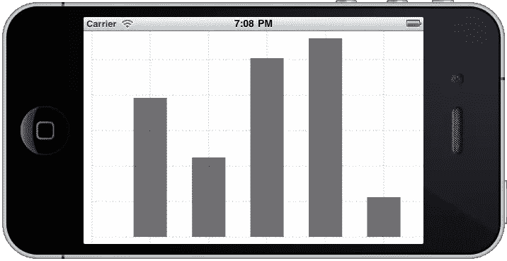
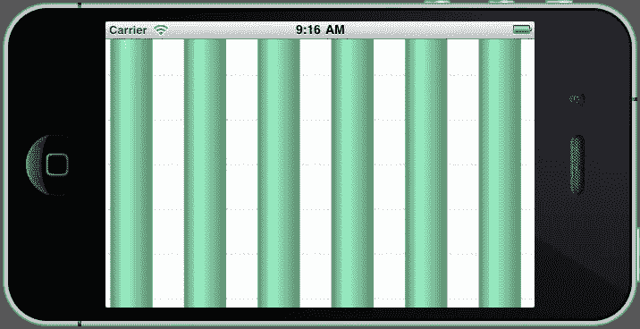
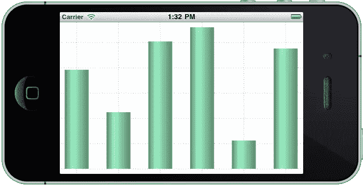

# 用石英 2D 制作图表:第 2 部分

> 原文：<https://www.sitepoint.com/creating-a-graph-with-quartz-2d-part-2/>

在我系列的第一部分[用石英 2D 制作图表](https://www.sitepoint.com/creating-a-graph-with-quartz-2d/)中，我解释了背景工作。条形图是一种流行的图表，所以让我们来学习如何绘制它们。

首先，我建议把画背景图的代码行注释掉。如果需要的话，我们知道如何去做，但是让我们在这里尽可能地保持简单。

第二，在我们的条形之间留一些空间可能是个好主意，所以让我们增加水平步长。在`GraphView.h`中，修改`kStepX`的定义:

```
#define kStepX 70 
```

### 绘图栏

让我们给 GraphView.m 添加一个每次绘制一个条的方法。确保该方法在`drawRect`之前定义:

```
- (void)drawBar:(CGRect)rect context:(CGContextRef)ctx 
{

} 
```

我们将一个矩形传入该方法，用条形填充它，并在其中绘制一个图形上下文。我发现一个简单的矩形填充一个漂亮的渐变最适合条形，所以让我们来学习如何画一个。如果你愿意，你可以修改下面的代码，画一个圆角矩形，但是，我还是希望事情简单一些。

我们将把矩形画成一条路径，因此所有的绘图代码都将被下面的两条线所包围:

```
CGContextBeginPath(ctx);
...
CGContextClosePath(ctx); 
```

定义渐变的代码可能有些冗长，所以首先，让我们用纯色填充矩形。下面是准备绘图环境的单行代码:

```
CGContextSetGrayFillColor(ctx, 0.2, 0.7); 
```

第二个参数指定我们希望填充有多暗，0 表示黑色，1 表示白色。在我们的例子中，它是深灰色的。最后一个参数定义填充的透明度，0 表示完全透明，1 表示完全不透明。在我们的例子中，它是 70%不透明的。

实际的绘图需要四行代码，我相信您可以从函数的名称中很容易地猜出这里发生了什么:

```
CGContextMoveToPoint(ctx, CGRectGetMinX(rect), CGRectGetMinY(rect));
CGContextAddLineToPoint(ctx, CGRectGetMaxX(rect), CGRectGetMinY(rect));
CGContextAddLineToPoint(ctx, CGRectGetMaxX(rect), CGRectGetMaxY(rect));
CGContextAddLineToPoint(ctx, CGRectGetMinX(rect), CGRectGetMaxY(rect)); 
```

最后，在步骤 3 中，我们需要提交绘制的内容:

```
CGContextFillPath(ctx); 
```

下面是绘制实心棒材的完整方法:

```
- (void)drawBar:(CGRect)rect context:(CGContextRef)ctx 
{
    CGContextBeginPath(ctx);
    CGContextSetGrayFillColor(ctx, 0.2, 0.7);
    CGContextMoveToPoint(ctx, CGRectGetMinX(rect), CGRectGetMinY(rect));
    CGContextAddLineToPoint(ctx, CGRectGetMaxX(rect), CGRectGetMinY(rect));
    CGContextAddLineToPoint(ctx, CGRectGetMaxX(rect), CGRectGetMaxY(rect));
    CGContextAddLineToPoint(ctx, CGRectGetMinX(rect), CGRectGetMaxY(rect));
    CGContextClosePath(ctx);
    CGContextFillPath(ctx);
} 
```

### 图形数据

接下来，我们需要处理图表显示的数据。通常，数据可以通过某种 web 服务来传递。这可能是，例如，你的网站每月的访客数量。然而，为了简单起见，我们将对数据进行硬编码，使用 0 到 1 之间的值，其中 1 表示一个条形占图形的整个高度，0 表示没有条形。将这一行代码放在`GraphView.m`中任何方法之外的某个地方(值是任意的，您可以使用任何其他方法):

```
float data[] = {0.7, 0.4, 0.9, 1.0, 0.2, 0.85, 0.11, 0.75, 0.53, 0.44, 0.88, 0.77}; 
```

让我们添加几个常量来帮助我们定位和调整条形:

```
#define kBarTop 10
#define kBarWidth 40 
```

最后，我们需要画出测试值对应的条。在`drawRect`的最后，放置以下代码:

```
// Draw the bars
float maxBarHeight = kGraphHeight - kBarTop - kOffsetY;

for (int i = 0; i < sizeof(data); i++)
{
    float barX = kOffsetX + kStepX + i * kStepX - kBarWidth / 2;
    float barY = kBarTop + maxBarHeight - maxBarHeight * data[i];
    float barHeight = maxBarHeight * data[i];

    CGRect barRect = CGRectMake(barX, barY, kBarWidth, barHeight);
    [self drawBar:barRect context:context];
} 
```

不需要额外的解释，你应该就能明白这里是怎么回事，只要记住 Y 坐标从上到下递增就行了。这是我们迄今为止取得的成果:

[](https://www.sitepoint.com/wp-content/uploads/2011/10/Graph13.png)

图 1

这个图看起来已经很不错了，而且对于某些应用程序来说也很有用。你可能想用其他颜色代替灰色，但这很容易做到。这里有一个到 [CGContext 引用](http://developer.apple.com/library/mac/#documentation/GraphicsImaging/Reference/CGContext/Reference/reference.html)的链接，在这里你可以找到你可能需要的所有方法。

然而，如果我们用渐变填充条形，图形会看起来更好。让我们看看如何做到这一点。

### 渐变填充

Quartz 中定义和使用渐变的方式有些冗长，但是它给了我们很大的力量。这就是我们需要知道的用渐变填充条形的全部内容。

首先，我们需要决定有多少种颜色将用于渐变。我们可以使用任何数量，但三种颜色应该足以满足我们的目的。让我们通过列出它们的红色、绿色、蓝色和 alpha 分量来定义它们:

```
CGFloat components[12] = {0.2314, 0.5686, 0.4, 1.0,  // Start color
    0.4727, 1.0, 0.8157, 1.0, // Second color
    0.2392, 0.5686, 0.4118, 1.0}; // End color 
```

接下来，我们需要决定这些颜色在渐变中的位置，0 表示图案的开始，1 表示图案的结束。这是我们三种颜色的一种可能分布:

```
CGFloat locations[3] = {0.0, 0.33, 1.0}; 
```

我们还需要明确定义位置的数量:

```
size_t num_locations = 3; 
```

最后，我们需要创建一个色彩空间，然后，使用所有准备好的信息，我们可以构建渐变:

```
CGColorSpaceRef colorspace = CGColorSpaceCreateDeviceRGB();
CGGradientRef gradient = CGGradientCreateWithColorComponents(colorspace, components, locations, num_locations); 
```

当您不再需要渐变时，您应该释放渐变和色彩空间:

```
CGColorSpaceRelease(colorspace);
CGGradientRelease(gradient); 
```

在使用渐变之前，我们需要根据图形空间指定模式的开始和结束位置。我们使用传递给该方法的`CGRect`来计算这两点:

```
CGPoint startPoint = rect.origin;
CGPoint endPoint = CGPointMake(rect.origin.x + rect.size.width, rect.origin.y); 
```

最后，这是实际绘图的线条:

```
// Draw the gradient
CGContextDrawLinearGradient(ctx, gradient, startPoint, endPoint, 0); 
```

以下是准备、绘制和释放渐变的所有代码:

```
// Prepare the resources
CGFloat components[12] = {0.2314, 0.5686, 0.4, 1.0,  // Start color
    0.4727, 1.0, 0.8157, 1.0, // Second color
    0.2392, 0.5686, 0.4118, 1.0}; // End color
CGFloat locations[3] = {0.0, 0.33, 1.0};
size_t num_locations = 3;

CGColorSpaceRef colorspace = CGColorSpaceCreateDeviceRGB();
CGGradientRef gradient = CGGradientCreateWithColorComponents(colorspace, components, locations, num_locations);

CGPoint startPoint = rect.origin;
CGPoint endPoint = CGPointMake(rect.origin.x + rect.size.width, rect.origin.y);

// Draw the gradient
CGContextDrawLinearGradient(ctx, gradient, startPoint, endPoint, 0);

// Release the resources
CGColorSpaceRelease(colorspace);
CGGradientRelease(gradient); 
```

在这一点上，我们可能会放弃之前用于绘制和填充条形图的代码，而只是简单地绘制渐变。然而，如果我们这样做，结果将与我们预期的不同:

[](https://www.sitepoint.com/wp-content/uploads/2011/10/Graph14.png)

图 2

看起来梯度并不真正理解它应该占据多少空间。我们需要以某种方式将绘图区域限制在条形的尺寸范围内。这就是剪辑路径有用的地方。

### 剪辑路径

这是我们将要做的。首先，我们将绘制一个填充的矩形条，就像我们之前所做的那样，但是我们不是提交绘图并使其可见，而是告诉图形上下文:我们刚刚绘制的条定义了从现在开始允许您绘制的唯一空间。这个长短语可以翻译成一行相当短的代码:

```
CGContextClip(ctx); 
```

我们应该能够在绘制完条形图后立即取消限制。为此，我们将告诉上下文记住它的无限制自由状态，就在应用剪辑路径之前:

```
CGContextSaveGState(ctx); 
```

在使用剪切路径绘制渐变之后，我们将恢复上下文的初始状态:

```
CGContextRestoreGState(ctx); 
```

这是一个完整的绘制渐变填充条的解决方案，按照正确的顺序完成了上面提到的所有步骤:

```
- (void)drawBar:(CGRect)rect context:(CGContextRef)ctx 
{
    // Prepare the resources
    CGFloat components[12] = {0.2314, 0.5686, 0.4, 1.0,  // Start color
        0.4727, 1.0, 0.8157, 1.0, // Second color
        0.2392, 0.5686, 0.4118, 1.0}; // End color
    CGFloat locations[3] = {0.0, 0.33, 1.0};
    size_t num_locations = 3;

    CGColorSpaceRef colorspace = CGColorSpaceCreateDeviceRGB();
    CGGradientRef gradient = CGGradientCreateWithColorComponents(colorspace, components, locations, num_locations);

    CGPoint startPoint = rect.origin;
    CGPoint endPoint = CGPointMake(rect.origin.x + rect.size.width, rect.origin.y);

    // Create and apply the clipping path
    CGContextBeginPath(ctx);
    CGContextSetGrayFillColor(ctx, 0.2, 0.7);
    CGContextMoveToPoint(ctx, CGRectGetMinX(rect), CGRectGetMinY(rect));
    CGContextAddLineToPoint(ctx, CGRectGetMaxX(rect), CGRectGetMinY(rect));
    CGContextAddLineToPoint(ctx, CGRectGetMaxX(rect), CGRectGetMaxY(rect));
    CGContextAddLineToPoint(ctx, CGRectGetMinX(rect), CGRectGetMaxY(rect));
    CGContextClosePath(ctx);

    CGContextSaveGState(ctx);
    CGContextClip(ctx);

    // Draw the gradient
    CGContextDrawLinearGradient(ctx, gradient, startPoint, endPoint, 0);
    CGContextRestoreGState(ctx);

    // Release the resources
    CGColorSpaceRelease(colorspace);
    CGGradientRelease(gradient);
} 
```

### 独立地

当然，还有改进的空间。因为我们一次又一次地使用同一个渐变，所以只创建一次，然后根据需要重复使用它来绘制多个条，比为每个条重新创建渐变更有效。然而，让我把这种重构留给你吧。下面是运行这段代码时我们应该看到的内容:

[](https://www.sitepoint.com/wp-content/uploads/2011/10/Graph15.png)

图 3

我们现在有一个接近完成的条形图。我们将需要一些标签，并且我们将需要对触摸做出反应，但是这些主题将在本系列的后面部分中讨论。另一种流行的图形是线图，在本系列的下一部分中，我们将学习如何绘制这些图形，包括渐变，以及一些其他漂亮的调整。

### 石英 2D 指数

亚历山大·科列斯尼科夫关于使用石英 2D 制作图表的系列文章分为 5 个部分。您可以使用[石英 2D 标签](https://www.sitepoint.com/creating-a-graph-with-quartz-2d/)参考该系列，并使用以下链接访问单篇文章。

*   [用石英 2D 制作图表:第一部分](https://www.sitepoint.com/creating-a-graph-with-quartz-2d/)
*   用石英 2D 制作图表:第 2 部分
*   [用石英 2D 制作图表:第三部分](https://www.sitepoint.com/creating-a-graph-with-quartz-2d-part-3/)
*   [用石英 2D 制作图表:第四部分](https://www.sitepoint.com/creating-a-graph-with-quartz-2d-part-4/)
*   [用石英 2D 制作图表:第五部分](https://www.sitepoint.com/creating-a-graph-with-quartz-2d-part-5/)

## 分享这篇文章