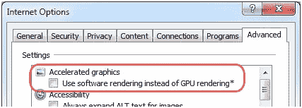
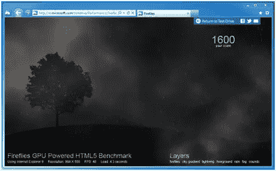
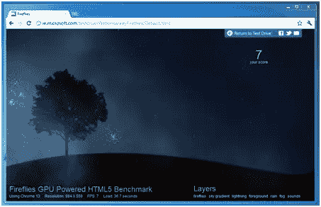

# 释放硬件加速 HTML5 画布的力量

> 原文：<https://www.sitepoint.com/unleash-the-power-of-hardware-accelerated-html5-canvas/>

是时候学习 [HTML5](http://phaseit.net/claird/comp.infosystems.www.authoring.html/HTML5.html) 了。除了其他好处之外，这是充分利用硬件的好方法。

这是个惊喜吗？我们通常认为 Web 应用程序在最好的情况下是“足够的”,并且常常慢得令人讨厌；标准的民间传说认为，本机应用程序主导性能比较。要求苛刻的游戏玩家或超级商业用户肯定不想在网上等待他们日常使用的程序。

虽然本地应用程序多年来一直在很大程度上领先于 T2，但创新如世界最大的 PacMan T4 证明了网络正在迎头赶上。现在，HTML5 给了广大的 Web 开发者一个机会，让他们在功能**和性能** 方面向前跃进，并且在重要的情况下，达到或超过原生应用的水平。关于 HTML5 `canvas`元素的硬件加速，你需要了解以下内容:

## 更快的媒体和游戏网络

带有 T2 硬件加速浏览器 T3 的 HTML5 比本地桌面应用的 T4 速度至少快一个数量级。在 HTML5 之前，HTML 的“图形用户界面”(GUI)中的“图形”实际上仅限于与表单的交互:填写字段、按按钮、进行选择和查看图像。新的进步使得像 [Tron](http://disneydigitalbooks.go.com/tron/) 和 [The Killers](http://www.thekillersmusic.com/HTML5) 这样的戏剧性和鼓舞人心的网站变得实用。关于`canvas`可以实现的更多功能，请参见:

*   [红牛](http://html5.redbull.com/)
*   [宝马](http://joydefinesthefuture.com/)
*   [粗导轨](http://makethemost.roughguides.com/)
*   [四方游乐场](http://www.foursquareplayground.com/)
*   [KEXP 音乐档案](http://kexparchive.org/)

为什么这些网站看起来和执行起来更像本机应用程序？它们都使用`canvas`作为受支持的本地“绘图区域”,并在其中构建用户交互性。任何 web 应用程序绘制的任何东西都可以在一个`canvas`上呈现。包括按钮按压、指针拖动和键盘输入在内的用户动作可以与图像和其他图形对象相关联地被接收和计算。

## 硬件加速如何提高 it 速度

大多数读者都有能够展示 HTML5 的`canvas`的*功能*的浏览器。拥有一个与操作系统和底层硬件协同工作的[浏览器是它表现出色的原因。这需要更多的解释:](http://blogs.msdn.com/b/ie/archive/2011/04/26/understanding-differences-in-hardware-acceleration-through-paintball.aspx)

假设是时候让[吃豆人生物](http://worldsbiggestpacman.com/)向右移动一步了。这是怎么做到的？浏览器渲染一个“*翻译”*:它协调组成生物的像素被移动到新的位置，生物被重画，旧的生物被擦除。更复杂的运动包括更深奥的加减乘除算法。随着屏幕上足够的移动和足够的计算复杂性，渲染一个`canvas`开始占用中央处理器(CPU)必须给出的所有周期。

大多数现代台式机不仅有一个 CPU，还有一个图形处理单元(GPU)。GPU 有效地从 CPU 接管了图形渲染中几乎所有的计算负担，并且速度惊人。结果:当浏览器检测到需要更复杂的计算时，它会从 CPU 切换到 CPU- **和** -GPU 操作。用户可以看到渲染速度的差异，这是通过[硬件加速压力测试](http://demos.hacks.mozilla.org/openweb/HWACCEL/)等技术测量的，可以轻松地从每秒 13 帧跳到每秒 180 帧。)帧每秒。您可以使用不同的浏览器在这些网站中尝试一下:

*   [萤火虫](http://ie.microsoft.com/testdrive/Performance/Fireflies/Default.html)
*   [彩弹](http://ie.microsoft.com/testdrive/Performance/Paintball/Default.html)
*   [鱼缸](http://ie.microsoft.com/testdrive/Performance/FishBowl/Default.html)

## 让您的 GPU 发挥作用

您和您的最终用户如何让您的画布充分利用硬件加速？您需要确保您的计算机硬件和浏览器都配置正确。坏消息是你的终端用户也需要这个。好消息是大多数现代设备将从中受益。以下是你需要考虑的:

**GPU 或集成 CPU/GPU**–大多数现代台式机都拥有专用 GPU，这将大幅提升画布体验。令人惊讶的是，笔记本电脑和移动设备也将通过一套新的[集成芯片](http://www.bit-tech.net/news/hardware/2009/02/10/intel-details-first-cpu-with-integrated-gpu/1)获得明显的好处。大多数服务器和老式台式机都没有这些功能，因此您需要准备好提供替代方案，或者“优雅地降低”这些用户的体验。

**最新设备驱动程序–**安装合适的设备驱动程序以充分利用您的配置至关重要。许多制造商最近更新了他们的产品，以便 GPU 可以正确地与硬件加速的浏览器一起工作。你的用户可能会收到自动更新，但你可以在这里阅读[硬件加速浏览器的最新驱动支持](http://blogs.msdn.com/b/ie/archive/2011/04/01/getting-the-most-from-ie9-and-your-gpu.aspx)。

由于是各种各样的设备和驱动程序，浏览器还提供了在硬件和软件呈现之间切换的方法。例如，对于 Firefox 4，它显示为编辑/首选项/高级/“使用硬件加速…”Internet Explorer 9 会自动[检测您的设备是否能够](http://blogs.msdn.com/b/ie/archive/2011/04/01/getting-the-most-from-ie9-and-your-gpu.aspx)进行硬件加速，但您可以手动更改它。



**硬件加速浏览器**——它必须足够现代，为`canvas`提供原生支持。在我们的测试中，我们发现所有最新的现代浏览器都有良好的二维硬件加速，包括:

*   铬合金 13
*   火狐 4
*   Internet Explorer 9
*   歌剧 11
*   Safari 5

然而，使用 2.7GHz 四核笔记本电脑和 512MB 专用 GPU 内存，一些浏览器的性能明显更快，我们试用了`canvas.`和 Internet Explorer 9 和 Chrome 13 以及[萤火虫](http://ie.microsoft.com/testdrive/Performance/Fireflies/Default.html)。以页面负载和每秒帧数衡量的结果差异很大:





浏览器制造商已经在努力让硬件加速更快，所以预计这些性能结果会迅速改变。 [Internet Explorer 10 平台预览版](http://ie.microsoft.com/testdrive/Info/Downloads/Default.html)明显比 Internet Explorer 9 中的[萤火虫](http://ie.microsoft.com/testdrive/Performance/Fireflies/Default.html)要快。最新的 Chromium 14 开发者版本还显示，谷歌正在[将硬件加速作为其即将发布的版本中的优先事项](https://sites.google.com/a/chromium.org/dev/developers/design-documents/gpu-accelerated-compositing-in-chrome)。

## 画布编码

HTML 和 JavaScript 编码的细节对硬件加速有影响吗？哪些`canvas`小部件或操作出现在您的源代码中有关系吗？对于一个 Web 开发者来说，有什么具体的方法来充分利用 GPU 吗？

答案是:是也不是。从试验你能在`canvas`标签中放什么开始。特定的编程结构确实会产生显著的差异，但不如最终用户体验它的浏览器和硬件那么重要。以下是创建 performant `canvas:`时要考虑的关键概念

**思考客户端，而不是服务器**–从服务器加载原始数据，但在客户端生成图形。这利用了浏览器和设备 CPU/GPU 组合的优势，这可能更有能力进行硬件加速。

该博客中有一个特别的编码技巧值得广为人知:为了以编程方式更新特定图像或项目的颜色，在 destination-in [mode](https://developer.mozilla.org/samples/canvas-tutorial/6_1_canvas_composite.html) 中从 sprite sheets 绘制帧。这里出现的例子是

```
//Draw splatter mask ctx.globalCompositeOperation = “destination-in”: ctx.drawImage(sheet, x, y, width, height, 0, 0, width * scale, height * scale);
```

客户端图形生成不仅将计算负载转移到 GPU，而 GPU 正是为此而设计的，而且还减少了通过过于缓慢的网络传输图像的需求。

**使用多个**`canvas`–在页面加载和动画制作过程中，首先将对象绘制到一个不可见的画布上。完成并缓存后，将整个场景从缓存视图快速绘制到第二个用户可见的画布上。这项技术使得[彩弹](http://ie.microsoft.com/testdrive/Performance/Paintball/Default.html)渲染如此之快。通过查看源代码或阅读[这篇博客](http://blogs.msdn.com/b/ie/archive/2011/04/26/understanding-differences-in-hardware-acceleration-through-paintball.aspx)来从中学习。

**在最终用户结果中测量性能**–通过浏览器工具(如 [F12 Developer Tools](http://msdn.microsoft.com/library/gg589507%28VS.85%29.aspx) )测试网络瓶颈和页面加载时间是一个良好的开端，但这里最好的“测量”涉及主动的人工参与:仅仅请求浏览器报告(例如，渲染场景的速度)是不够的。一个聪明的观察者需要确认更新实际上给出了想要的动画效果，而不仅仅是重新绘制一个不变的视图，并且浏览器保持适当的响应。

## 为您的站点绘制画布

有了`canvas`，几乎任何网站都有可能实现得更像一个网络应用。网站已经抛弃了“一切都是形式”的起源；现代的`canvas`程序员可以使用动态、生动的图形主题和效果在越来越多的设备上吸引终端用户的目光。当您将它作为站点的一部分时，请确保:

*   测量最终用户在各种硬件配置、设备驱动程序和浏览器上的性能。准备好让使用旧设备或传统浏览器的用户体验降级吧。
*   警惕`canvas`功能中的细微变化:字体定义受到尊重吗？对您来说重要的浏览器中的所有合成模式都正确实现了吗？
*   认识到硬件加速仍然是一个非常活跃的领域。每个新的浏览器版本似乎都包括新的 GPU 增强功能，因此结果会经常发生变化

**SitePoint Content Partner**

本教程是在微软的支持下完成的。我们与微软合作，由 SitePoint 独立编写，努力共同开发对您最有用、最相关的内容。

给网络应用带来的可能性是巨大的。更多地尝试这些开发资源:

*   [如何在 Canvas 和 SVG 之间选择创建网页图形](http://blogs.msdn.com/b/ie/archive/2011/04/22/thoughts-on-when-to-use-canvas-and-svg.aspx)
*   [深入研究 HTML5 画布](http://channel9.msdn.com/Events/MIX/MIX11/HTM03)
*   [html 5 MSDN 画布](http://msdn.microsoft.com/en-us/library/gg589510%28v=VS.85%29.aspx)
*   [HTML5 二维画布元素](http://msdn.microsoft.com/en-us/ie/ff468705#_HTML5_canvas)

## 分享这篇文章