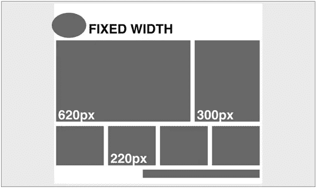
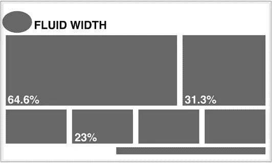

# 调整大小:固定、流动或响应布局

> 原文：<https://www.sitepoint.com/resizing-fixed-fluid-or-responsive-layouts/>

当我们在看用铅笔和纸做的[布局块时，我解释说我们设计的外部矩形是包含块。在印刷设计中，包含块是一个物理对象，如名片或广告牌。在网络上，我们的容器是浏览器窗口。设计应该填满浏览器窗口，还是应该有一个固定的宽度？这个决定已经困扰了网页设计者几百年，如果不是几千年的话——一直追溯到我们使用表格和`spacer.gif`文件来布局网页内容的时代。好吧，也许不是几千年前，但这仍然是一个长期的争论。](https://www.sitepoint.com/web-page-anatomy/)

## 定宽

如果你已经用我之前提到的 [960 网格系统](http://960.gs/)开始布局，那么你很有可能正在朝着*固定宽度*布局努力。这些设计用一个给定了基于像素的宽度(比如 960 像素)的`div`包装，并使用`margin: 0 auto;`在 body 标签内居中。如果浏览器窗口宽于 960 像素，你会在容器的左边和右边看到`body`元素的背景；如果再窄一点，你会看到一个水平滚动条。固定宽度的布局更易于设计和维护，因为您实际上是在构建您在 Photoshop 或您选择的设计程序中设计的内容。下图显示了在相同宽度的浏览器空间中，类似于固定布局和流动布局的布局结构:

## 流体宽度

一个*流体*或*液体*布局被设计成基于百分比的宽度，这样当你调整浏览器窗口大小时，容器会拉伸。这些需要更多的思考来计划，因为你必须预见到在每一个可能的宽度上可能发生的问题。有时，像素宽度的列与基于百分比的列混合在一个流畅的布局中，但这样做的目的是向用户显示尽可能多的水平内容，以适合他们的屏幕。通常，流体布局利用 <acronym title="Cascading Style Sheets">CSS</acronym> 的`min-width`和`max-width`属性，确保容器不会变得太窄或太宽。

一些设计师拒绝流体布局的一个原因是，他们认为这会妨碍他们使用网格来创建他们的设计。有几个资源可用于设计网格上的流体布局，包括[960 网格系统的流体适应](http://www.designinfluences.com/fluid960gs/)。然而，最终决定使用一种布局还是应该由目标受众和每个网站的可访问性目标来决定。每种布局类型的优缺点都有明确的定义，如下表所示:

<colgroup><col align="center" width="33%"> <col width="33%"> <col width="34%"></colgroup>
|   | 赞成的意见 | 骗局 |
| :-: | :-: | :-: |
| 定宽 | 

*   Let designers better control the appearance of images floating in the content

*   Allow planned white space

*   Use narrower text blocks to improve readability

 | 

*   will appear short in a large browser window

*   Take away the control right from the user

 |
| 液体宽度 | 

*   Adapt to most screen resolutions and devices

*   Reduce user scrolling

 | 

*   When the text spans a long distance, it is very difficult to read

*   It is even more difficult to successfully execute

*   to restrict or impose white space

 |

考虑到这些优点和缺点，我设计了比液体更多的固定宽度布局。我喜欢控制内容的显示方式，喜欢处理背景空间。另一方面，我有时喜欢液体布局给桌子带来的挑战。但是，不管个人喜好如何，把客户的需求放在第一位是很重要的。如果你决定一个固定宽度布局的宽度，你必须考虑你设计的受众，并创建一个满足这些用户需求的布局。

## 另一种选择:响应式布局

据说每条规则都有例外。在网络世界中通常是这样的，设计者已经提出了许多固定宽度和流动宽度布局结构的变体和混合。我最近看到一些文章列出了多达十种不同的布局类型。然而，就本章的目的而言，其中大部分可以归类为固定或流动。在*的一篇文章中，介绍了一种新颖的布局类型，我想我们会看到更多。这篇文章的标题是[“响应式网页设计”](http://www.alistapart.com/articles/responsive-web-design/)，作者是伊森·马科特。*

与其在这里重复整篇文章，我强烈建议您查看一下。如果让我自己给这种布局技术命名，我会称之为万能的水星变形方法论，但这可能是我没有想出它的原因。这个想法是，随着移动市场使得浏览器窗口宽度越来越不一致，我们的布局需要流畅，适应不同的宽度，这一点越来越重要。该技术利用一些奇特的流体缩放和 CSS3 媒体查询来完全改变布局，因为它达到了特定的宽度阈值。下图显示了 Ethan 的示例在三种不同浏览器宽度下的屏幕截图。

Ethan 的响应式网页设计(或者万能的 Mercury Morphing Methodology)是一个很好的解决方案，它解决了一个我们还没有讨论的问题:屏幕分辨率，我们接下来会讨论这个问题。

## 美丽网页设计的原则

这篇文章来自杰森·比厄德的 [*美丽网页设计的原则*一书](https://www.sitepoint.com/books/design2/ "SitePoint.com: The Principles of Beautiful Web Design, 2nd Edition")(第二版现已出版)。这是第一章的第十一部分。

如果你更喜欢色彩，请务必在设计节上查看现有的[色彩章节的数字化版本。](https://www.sitepoint.com/design-ux/color/ "DesignFestival.com: Everything on Color")

## 分享这篇文章